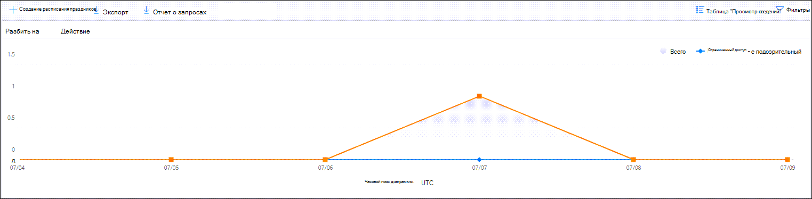

# Просмотр отчетов о безопасности почты в Центре безопасности и соответствия требованиям

[!INCLUDE [Microsoft 365 Defender rebranding](../includes/microsoft-defender-for-office.md)]

**Область применения**
- [Exchange Online Protection](exchange-online-protection-overview.md)
- [Microsoft Defender для Office 365 (план 1 и план 2)](defender-for-office-365.md)
- [Microsoft 365 Defender](../defender/microsoft-365-defender.md)

Различные отчеты доступны в  Центре & безопасности, чтобы узнать, как функции безопасности электронной почты, такие как средства защиты от нежелательной почты, защиты от вредоносных программ и шифрования в Microsoft 365, защищают вашу организацию. Если у вас есть [необходимые](#what-permissions-are-needed-to-view-these-reports)разрешения, вы можете просмотреть эти отчеты в Центре & безопасности, переехав на панель **мониторинга** \> **отчетов.** Чтобы перейти непосредственно к панели мониторинга Отчетов, откройте <https://protection.office.com/insightdashboard> .

## Отчет о скомпрометировании пользователей

> [!NOTE]
> Этот отчет доступен в организациях Microsoft 365 с почтовыми ящиками Exchange Online. Он не доступен в автономных организациях Exchange Online Protection (EOP).

В **отчете о** скомпрометировании пользователей  показано  количество учетных записей пользователей, отмеченных как подозрительные или ограниченные в течение последних 7 дней. Учетные записи в любом из этих штатов являются проблемными или даже скомпрометированными. При частом использовании вы можете использовать отчет для задания пиков и даже тенденций в подозрительных или ограниченных учетных записях. Дополнительные сведения о скомпрометированных пользователях см. в [сообщении Responding to a compromised email account.](responding-to-a-compromised-email-account.md)

В сводном представлении показаны данные за последние 90 дней, а в представлении подробно показаны данные за последние 30 дней.

Чтобы просмотреть отчет, откройте центр [&](https://protection.office.com)безопасности,  перейдите к панели мониторинга отчетов и выберите \>  **скомпрометированную пользователей**. Чтобы перейти непосредственно к отчету, откройте <https://protection.office.com/reportv2?id=CompromisedUsers> .

Вы можете фильтровать диаграмму и таблицу сведений, щелкнув **фильтры** и выбрав одно или несколько следующих значений:

- **Дата начала и** **дата окончания**

- **Подозрительный.** Учетная запись пользователя отправила подозрительные сообщения электронной почты и может быть ограничена отправкой электронной почты.

- **Ограничение.** Учетная запись пользователя была ограничена отправкой электронной почты из-за весьма подозрительных шаблонов.

Если **щелкнуть таблицу Просмотр** сведений, можно просмотреть следующие сведения:

- **Время создания**
- **Идентификатор пользователя**
- **Действие**

Чтобы вернуться к представлению отчета, нажмите **кнопку Просмотр отчета**.

## Отчет о шифровании

Отчет **шифрования** доступен в EOP (подписки с почтовыми ящиками в Exchange Online или автономные EOP без почтовых ящиков Exchange Online). Группа безопасности организации может использовать сведения в этом отчете для определения шаблонов и активно применять или корректировать политики для конфиденциальных сообщений электронной почты. Пример.

- Если вы видите большое количество зашифрованных пользователями сообщений электронной почты, может потребоваться добавить политику шифрования для автоматизации шифрования для определенных случаев использования. Дополнительные сведения см. в тексте Определение правил потока почты для шифрования сообщений электронной [почты в Microsoft 365.](../../compliance/define-mail-flow-rules-to-encrypt-email.md)

- Если у вас есть несколько шаблонов шифрования, но их никто не использует, можно узнать, нужна ли пользователям подготовка функций.

Совокупное представление позволяет фильтровать в течение последних 90 дней, в то время как представление детализации позволяет фильтровать в течение 10 дней.

Чтобы просмотреть отчет, откройте центр [&](https://protection.office.com)безопасности,  перейдите на панель мониторинга отчетов и \>  выберите **отчет шифрования.** Чтобы перейти непосредственно к отчету, откройте <https://protection.office.com/reportv2?id=EncryptionReport> .

Подробнее о шифровании см. в сообщении шифрования электронной [почты в Microsoft 365.](../../compliance/email-encryption.md)

### Представление отчета для отчета шифрования

На диаграмме можно использовать следующие фильтры:

- **Просмотр данных по: Отчет о шифровании сообщений** и **break down by: Метод** шифрования: Доступны следующие методы шифрования:

  - **Шифрование пользователем**
  - **Шифрование по политике**

  При **нажатии фильтров** можно изменить диаграмму с помощью следующих фильтров:

  - **Дата начала и** **дата окончания**
  - Метод шифрования.
  - Шаблон шифрования.

- **Просмотр данных по: Отчет о шифровании сообщений** и **break down by: Шаблон шифрования:** Доступны следующие методы шифрования:

  - **Не переад.**
  - **Только шифрование**
  - **Предыдущий OME**
  - **Custom**

  При **нажатии фильтров** можно изменить диаграмму с помощью следующих фильтров:

  - **Дата начала и** **дата окончания**
  - Метод шифрования
  - Шаблон шифрования

- **Просмотр данных по: Топ-5** доменов получателей. В этом представлении показана диаграмма пирога с количеством отправленных сообщений для топ-5 доменов получателей.

  Если **щелкнуть фильтры,** можно выбрать **дату** начала и **дату окончания.**

### Представление таблицы сведений для отчета шифрования

Если **щелкнуть таблицу Просмотр** сведений, показанные сведения зависят от диаграммы, на которую вы смотрите:

- **Break down by: Encryption method** or **Break down by: Encryption template:** Following information is shown:

  - **Дата**
  - **Адрес отправителя**
  - **Шаблон шифрования**
  - **Метод шифрования**
  - **Адрес получателя**
  - **Тема**

- **Просмотр данных по: Топ-5 доменов получателей:**

  - **Дата**
  - **домен получателя;**
  - **Количество сообщений**

Если **щелкнуть Фильтры** в представлении таблицы сведений, результаты можно изменить следующими фильтрами:

- **Дата начала и** **дата окончания**
- Метод шифрования
- Шаблон шифрования

Чтобы вернуться к представлению отчета, нажмите **кнопку Просмотр отчета**.

## Отчет о состоянии почтового потока

Отчет **о состоянии mailflow содержит** сведения о вредоносных программах, спаме, фишинге и заблокированных сообщениях. Дополнительные сведения см. [в отчете о состоянии mailflow.](view-mail-flow-reports.md#mailflow-status-report)

## Обнаружение вредоносных программ в отчете электронной почты

Обнаружение **вредоносных** программ в отчете электронной почты показывает сведения об обнаружении вредоносных программ в входящих и исходяющих сообщениях электронной почты (вредоносные программы, обнаруженные Exchange Online Protection или EOP). Дополнительные сведения о защите от вредоносных программ в EOP см. в программе Защита от вредоносных [программ в EOP.](anti-malware-protection.md)

 Совокупный фильтр представления позволяет в течение 90 дней, в то время как фильтр таблицы сведений разрешает только 10 дней.

Чтобы просмотреть отчет, откройте центр & безопасности,  перейдите [на панель](https://protection.office.com)мониторинга отчетов и выберите обнаружение вредоносных программ \>  **по электронной почте.** Чтобы перейти непосредственно к отчету, откройте <https://protection.office.com/reportv2?id=MalwareDetections> .

Вы можете фильтровать диаграмму и таблицу сведений, щелкнув **фильтры** и выбрав:

- **Дата начала и** **дата окончания**
- **Входящий**
- **Исходящие**

Если **щелкнуть таблицу Просмотр** сведений, можно просмотреть следующие сведения:

- **Дата**
- **Адрес отправителя**
- **Адрес получателя**
- **ID сообщения.** Доступно в **поле заглавной области Message-ID** в загонах сообщений и должно быть уникальным. Например, значение `<08f1e0f6806a47b4ac103961109ae6ef@server.domain>` (обратите внимание на угловые скобки).
- **Тема**
- **Filename**
- **Имя вредоносных программ**

Чтобы вернуться к представлению отчета, нажмите **кнопку Просмотр отчета**.

## Отчет о задержке почты

Отчет **о задержке почты** содержит сведения о задержке доставки почты и детонации в организации. Дополнительные сведения см. в [отчете о задержке почты.](view-reports-for-mdo.md#mail-latency-report)

## Отправленный и полученный отчет электронной почты

Отчет **о отправленной** и полученной электронной почте содержит сведения о вредоносных программах, спаме, правилах потока почты (также известных как правила транспорта) и расширенных обнаружениях вредоносных программ после ввода электронной почты в службу. Дополнительные сведения см. в [отчете по отправке и получению электронной почты.](view-mail-flow-reports.md#sent-and-received-email-report)

## Отчет об обнаружении нежелательной почты

В **отчете об обнаружении нежелательной** почты показаны сообщения электронной почты, заблокированные EOP. Сообщения подсчитываются по отдельности, а не по каждому получателю. Например, если одно и то же сообщение нежелательной почты было отправлено 100 получателям в организации, оно считается одним сообщением.

Совокупное представление позволяет фильтровать в течение 90 дней, а в таблице сведений - 10 дней.

Чтобы просмотреть отчет, откройте Центр [&](https://protection.office.com)безопасности,  перейдите на панель мониторинга отчетов и выберите \>  **обнаружение нежелательной почты.** Чтобы перейти непосредственно к отчету, откройте <https://protection.office.com/reportv2?id=SpamDetections> .

Дополнительные сведения о защите от нежелательной почты см. в сообщении [eOP.](anti-spam-protection.md)

### Представление отчета для отчета об обнаружении нежелательной почты

В представлении отчета доступны следующие диаграммы:

- **Break down by: Action:** Following event types are shown:

  - **Фильтрация контента нежелательной почты**
  - **Блокировка IP-адреса нежелательной почты**
  - **Блок конверта нежелательной почты**
  - **Фильтр DBEB нежелательной почты:** блокировка края на основе каталога (DBEB)

  При наведении в течение дня (точки данных) на диаграмме можно увидеть, сколько элементов было заблокировано в этот день, а также то, как эти элементы классифицируются.

  

- **Break down by: Direction:** Following directions are shown:

  - **Входящий**
  - **Исходящие**

  

Если **щелкнуть фильтры** в представлении отчета, результаты можно изменить с помощью следующих фильтров:

- **Дата начала и** **дата окончания**
- Значения направления
- Значения типа события

### Представление таблицы сведений для отчета об обнаружении нежелательной почты

Если вы **щелкните таблицу Просмотр** сведений в любом представлении отчета, показано следующее:

- **Дата**
- **Адрес отправителя**
- **Адрес получателя**
- **Тип события**
- **Действие**
- **Тема**

Если **щелкнуть фильтры** в таблице сведений, результаты можно изменить с помощью следующих фильтров:

- **Дата начала и** **дата окончания**
- Значения направления
- Значения типа события

Чтобы вернуться к представлению отчета, нажмите **кнопку Просмотр отчета**.

## Отчет об обнаружении подмены

В отчете о обнаружениях **Spoof** показано, сколько поддельных почтовых сообщений было обнаружено, а также тех, которые считались "хорошими" (подмена почты, сделанная по законным бизнес-причинам). Дополнительные сведения о подмене см. в этой информации в [EOP.](anti-spoofing-protection.md)

Совокупное представление отчета позволяет фильтровать в течение 90 дней, в то время как представление детализации позволяет фильтровать только 10 дней.

Чтобы просмотреть отчет, откройте центр [&](https://protection.office.com)безопасности,  перейдите на панель мониторинга отчетов и выберите \>  **обнаружение Spoof.** Чтобы перейти непосредственно к отчету, откройте <https://protection.office.com/reportv2?id=SpoofMailReport> .

При наведении в течение дня (точки данных) на диаграмме можно увидеть, сколько поддельных почтовых сообщений пришло.

Вы можете фильтровать диаграмму и таблицу сведений, щелкнув **фильтры** и выбрав одно или несколько следующих значений:

- **Дата начала и** **дата окончания**

- **Хорошая почта**

- **Пойман как спам**

Если **щелкнуть таблицу Просмотр** сведений, можно просмотреть следующие сведения:

- **Дата**
- **Spoofed sender**
- **True sender**
- **IP-адрес отправителя**
- **Действие**
- **Количество сообщений**

Чтобы вернуться к представлению отчета, нажмите **кнопку Просмотр отчета**.

## отчет о состоянии защиты от угроз;

Отчет **о состоянии защиты от** угроз доступен в EOP и Microsoft Defender для Office 365; однако отчеты содержат различные данные. Например, клиенты EOP могут просматривать сведения о вредоносных программах, обнаруженных в электронной почте, но не сведения о вредоносных файлах, обнаруженных безопасными вложениями [для SharePoint, OneDrive и Microsoft Teams.](mdo-for-spo-odb-and-teams.md)

В отчете приводится количество сообщений электронной почты со вредоносным контентом, например файлов или веб-адресов (URL-адресов), заблокированных с помощью двигателя защиты от вредоносных программ, автоматической очистки нулевого часа [(ZAP)](zero-hour-auto-purge.md)и функций Defender для Office 365, таких как "Безопасные ссылки", "Безопасные вложения" и "Защита от фишинга".  Эти сведения можно использовать для определения тенденций или определения необходимости корректировки политик организации.

**Примечание.** Важно понимать, что если сообщение отправляется пяти получателям, мы считаем его пятью разными сообщениями, а не одним сообщением.

Чтобы просмотреть отчет, откройте центр & безопасности,  перейдите [на](https://protection.office.com)панель мониторинга отчетов и выберите состояние \>  защиты **от угроз.** Чтобы перейти непосредственно к отчету, откройте один из следующих URL-адресов:

- Microsoft Defender для Office 365: <https://protection.office.com/reportv2?id=TPSAggregateReportATP>
- EOP: <https://protection.office.com/reportv2?id=TPSAggregateReport>

По умолчанию на диаграмме показаны данные за последние 7 дней. При **нажатии фильтров** можно выбрать диапазон дат в 90 дней (пробная подписка может быть ограничена 30 днями). Представление таблицы сведений позволяет фильтровать в течение 30 дней.

### Представление отчета для отчета о состоянии защиты от угроз

Доступны следующие представления:

- **Просмотр данных по: Обзор:** Показаны следующие сведения об обнаружении:

  - **Вредоносные программы электронной почты**
  - **Фишинг электронной почты**
  - **Вредоносные программы контента**

  

- **Просмотр данных по: Контент \> Вредоносные**программы 1.Следующие сведения показаны для организаций Microsoft Defender для Office 365:

  - **Антивирусный двигатель:** вредоносные файлы, обнаруженные в Sharepoint, OneDrive и Microsoft Teams встроенным обнаружением вирусов [в Microsoft 365](virus-detection-in-spo.md).
  - **Детонация файлов:** вредоносные файлы, обнаруженные в безопасных вложениях [для SharePoint, OneDrive и Microsoft Teams.](mdo-for-spo-odb-and-teams.md)

  

- **Просмотр данных по: Переопределения** сообщений: показана следующая информация о причинах переопределения:

  - **Локальное пропустить**
  - **РАЗРЕШЕНИЕ IP**
  - **Правило потока почты**
  - **Разрешить отправитель**
  - **Разрешить домен**
  - **ZAP не включен**
  - **Папка нежелательной почты не включена**
  - **Безопасный отправитель пользователя**
  - **Безопасный домен пользователя**

  

- **Break down by: Detection technology** and **View data by: Email \> Phish:** Following information is shown:

  - **Репутация URL-адреса,** созданная ATP, 1:вредоносная репутация URL-адреса, созданная в результате детонации Defender для Office 365 в других клиентах Microsoft 365.
  - **Расширенный фильтр фишинга:** фишинговые сигналы на основе машинного обучения.
  - **Отказ от подмены — Сбой DMARC:** сбой проверки подлинности DMARC в сообщениях.
  - **Anti-spoof - intra-org**: Sender is trying to spoof the recipient domain.
  - **Anti-spoof — внешний домен.** Отправитель пытается подменить другой домен.
  - **Вымысление** бренда: обезличение известных брендов на основе отправителей.
  - **Вымысление** домена 1.Вымысление доменов, которые клиент владеет или определяет.
  - **Репутация URL-адреса EOP.** Репутация вредоносного URL-адреса.
  - **Общий фильтр фишинга:** фишинговые сигналы, основанные на правилах аналитика.
  - **Другие**
  - **Phish ZAP**2.Автоматическая очистка фишинговых сообщений нулевого часа.
  - **Детонация URL-адреса**1
  - **Выдаваемая пользователем**1.Вымысление пользователей, определенных администратором или выучатся с помощью разведки почтовых ящиков.

  

- **Break down by: Detection technology** and **View data by: Email \> Malware**: Following information is shown:

  - **Репутация файлов, созданных ATP**1:вся репутация вредоносных файлов, созданная Defender для детонации Office 365.
  - **Антивирусный двигатель**1:Обнаружение с антивирусных двигателей.
  - Блок типа файлов политики по борьбе с вредоносными программами. Это сообщения электронной почты, отфильтрованные **из-за** типа вредоносного файла, выявленного в сообщении.
  - **Детонация файла**1.Обнаружение с помощью безопасных вложений.
  - **Репутация вредоносных файлов**
  - **Malware ZAP**2
  - **Другие**

  

- **Break down by: Policy type** and View data by: Email Phish or **View data by: Email \> Malware:** Following information is shown: **\>**

  - **Anti-malware**
  - **Безопасные вложения**1
  - **Anti-phish**
  - **Противодействие нежелательной почте**
  - **Правило потока почты** (также известное как правило транспорта)
  - **Другие**

  

- **Break down by: Delivery status** and View data by: Email Phish or **View data by: Email \> Malware:** Following information is shown: **\>**

  - **Сбой доставки**
  - **Сброс**
  - **Forwarded**
  - **Хост-почтовый ящик: настраиваемая папка**
  - **Хост-почтовый ящик: удаленные элементы**
  - **Хост-почтовый ящик: Почтовый ящик**
  - **Хост-почтовый ящик: нежелательной**
  - **Локального сервера: Доставлено**
  - **Карантин**

  

1 Защитник только для Office 365

Авточистка 2 zero-hour (ZAP) недоступна в автономных почтовых ящиках EOP (работает только в почтовых ящиках Exchange Online).

Если щелкнуть **фильтры,** доступные фильтры зависят от диаграммы, на которая вы смотрите:

- Для **просмотра данных по: Вредоносные программы \>** контента , вы можете изменить отчет к **дате** начала и даты **окончания,** и **значение обнаружения.**

- Для **просмотра данных по: Переопределения сообщений** можно изменить отчет с помощью следующих фильтров:

  - **Дата начала и** **дата окончания**
  - **Причина переопределения**
  - **Тег.** Фильтр результатов пользователями или группами с указанным тегом пользователя (включая учетные записи приоритета). Дополнительные сведения о тегах пользователей см. в [тегах пользователей.](user-tags.md)
  - **Домен**

- Для всех остальных представлений можно изменить отчет с помощью следующих фильтров:

  - **Дата начала и** **дата окончания**
  - **Обнаружение**
  - **Защищено**: **ATP** или **EOP**
  - **Тег.** Фильтр результатов пользователями или группами с указанным тегом пользователя (включая учетные записи приоритета). Дополнительные сведения о тегах пользователей см. в [тегах пользователей.](user-tags.md)
  - **Домен**

### Представление таблицы сведений для отчета о состоянии защиты от угроз

Если **щелкнуть таблицу Просмотр** сведений, показанные сведения зависят от диаграммы, на которую вы смотрите:

- **Просмотр данных по: Обзор.** **Кнопка "Сведения о представлении"** недоступна.

- **Просмотр данных по: Контент \> Вредоносные** программы:

  - **Дата**
  - **Location**
  - **Режиссер**
  - **Имя вредоносных программ**

  При  **нажатии фильтров** в этом представлении можно изменить отчет к дате начала и дате окончания **и** значению **Detection.**

- **Просмотр данных по: Переопределения сообщений:**

  - **Дата**
  - **Тема**
  - **Sender**
  - **Получатели**
  - **Обнаружено**
  - **Причина переопределения**
  - **Источник компромисса**
  - **Tags**

  При **нажатии фильтров** в этом представлении можно изменить отчет с помощью следующих фильтров:

  - **Дата начала и** **дата окончания**
  - **Причина переопределения**
  - **Тег.** Фильтр результатов пользователями или группами с указанным тегом пользователя (включая учетные записи приоритета). Дополнительные сведения о тегах пользователей см. в [тегах пользователей.](user-tags.md)
  - **Домен**
  - **Получатели** (Обратите внимание, что это фильтруемое свойство доступно только в представлении таблицы сведений)

- Все остальные диаграммы:

  - **Дата**
  - **Тема**
  - **Sender**
  - **Получатели**
  - **Обнаружено**
  - **Состояние доставки**
  - **Источник компромисса**
  - **Tags**

  При **нажатии фильтров** можно изменить отчет с помощью следующих фильтров:

  - **Дата начала и** **дата окончания**
  - **Обнаружение**
  - **Защищено**: **Defender для Office 365** или **EOP**
  - **Тег.** Фильтр результатов пользователями или группами с указанным тегом пользователя (включая учетные записи приоритета). Дополнительные сведения о тегах пользователей см. в [тегах пользователей.](user-tags.md)
  - **Домен**
  - **Получатели** (Обратите внимание, что это фильтруемое свойство доступно только в представлении таблицы сведений)

## Топ отчета о вредоносных программах

В **топовом отчете** о вредоносных программах показаны различные виды вредоносных программ, обнаруженных защитой от вредоносных программ [в EOP.](anti-malware-protection.md)

Чтобы просмотреть отчет, откройте центр [&](https://protection.office.com)безопасности,  перейдите на панель мониторинга отчетов и выберите \>  **топ вредоносных программ.** Чтобы перейти непосредственно к отчету, откройте <https://protection.office.com/reportv2?id=TopMalware> .

При наведении на клин в диаграмме пирога можно увидеть имя типа вредоносных программ и количество сообщений, обнаруженных как наличие этого вредоносного ПО.

Если **щелкнуть таблицу Просмотр** сведений, можно просмотреть следующие сведения:

- **Топ вредоносных программ**
- **Count**

Если щелкнуть **фильтры** в представлении отчета или представлении  таблицы сведений, можно указать диапазон дат с датой начала и **датой окончания.**

## Отчет об угрозе URL-адреса

Отчет **об угрозе** URL-адресов доступен в Microsoft Defender для Office 365. Дополнительные сведения см. в [отчете об угрозе URL-адреса.](view-reports-for-mdo.md#url-threat-protection-report)

## Отчет о сообщениях, сообщаемой пользователями

В **отчете** о сообщениях пользователей показаны сведения о сообщениях электронной почты, которые пользователи сообщали как нежелательные, фишинговые попытки или хорошая почта с помощью надстройки Report [Message](enable-the-report-message-add-in.md) или надстройки [Report Phishing.](enable-the-report-phish-add-in.md)

Сведения доступны для каждого сообщения, включая причину доставки, исключение политики нежелательной почты или правило потока почты, настроенное для вашей организации. Чтобы просмотреть сведения, выберите элемент в списке отчетов пользователей, а затем просмотреть сведения на вкладке **Сводка** **и** Сведения.

Чтобы просмотреть этот отчет в Центре [&](https://protection.office.com)безопасности, сделайте одно из следующих:

- Перейдите **на панель мониторинга** \> **управления** \> **угрозами, сообщаемую пользователями.**

- Перейдите **в управление** \> **угрозами Обзор** \> **сообщений пользователей.**

> [!IMPORTANT]
> Чтобы отчет о сообщениях пользователей работал **правильно,** необходимо ввести журнал аудита для среды Office 365. Обычно это делается тем, кто имеет роль журналов аудита, назначенную в Exchange Online. Дополнительные сведения см. в журнале "Включить или отключить" поиск журнала аудита [Microsoft 365.](../../compliance/turn-audit-log-search-on-or-off.md)

## Какие разрешения необходимы для просмотра этих отчетов?

Чтобы просмотреть и использовать отчеты, описанные в этой статье, необходимо быть членом одной из следующих групп ролей в Центре & безопасности:

- **Управление организацией**
- **Администратор безопасности**
- **Считыватель безопасности**
- **Глобальный читатель**

Дополнительные сведения см. в статье [Разрешения в Центре безопасности и соответствия требованиям](permissions-in-the-security-and-compliance-center.md).

**Примечание.** Добавление пользователей к соответствующей роли Azure Active Directory в центре администрирования Microsoft 365 предоставляет  пользователям необходимые разрешения в Центре соответствия требованиям & безопасности и разрешения для других функций в Microsoft 365. Дополнительные сведения см. в статье [О ролях администраторов](../../admin/add-users/about-admin-roles.md).

## Что делать, если отчеты не отображают данные?

Если в отчетах нет данных, убедитесь, что политики настроены правильно. Дополнительные новости см. в [см. в руберсе Защита от угроз.](protect-against-threats.md)

## Статьи по теме

[Защита от нежелательной почты и вредоносных программ в EOP](anti-spam-and-anti-malware-protection.md)

[Интеллектуальные отчеты и аналитика в Центре безопасности и соответствия требованиям](reports-and-insights-in-security-and-compliance.md)

[Просмотр отчетов о потоке почты в центре & безопасности](view-mail-flow-reports.md)

[Просмотр отчетов для Defender для Office 365](view-reports-for-mdo.md)
