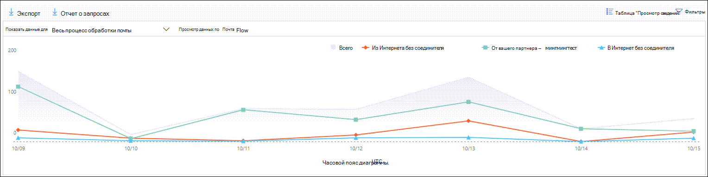
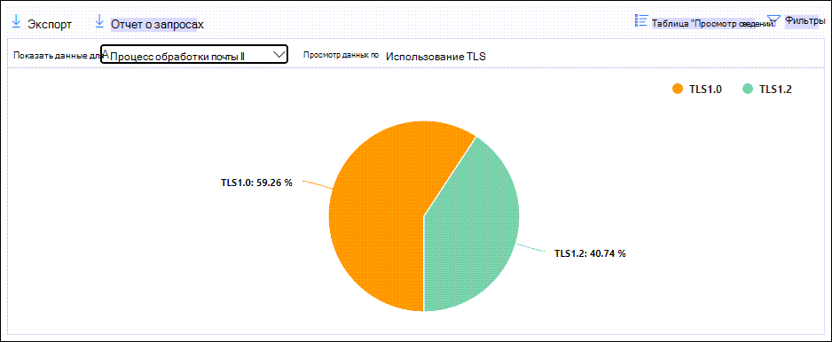
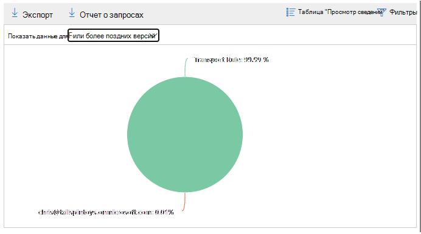

# Просмотр отчетов о потоке почты на панели мониторинга отчетов в центре & безопасностиView mail flow reports in the Reports dashboard in Security & Compliance Center

[!INCLUDE [Microsoft 365 Defender rebranding](../includes/microsoft-defender-for-office.md)]

**Область применения****Applies to**
- [Exchange Online ProtectionExchange Online Protection](exchange-online-protection-overview.md)
- [Microsoft Defender для Office 365 (план 1 и план 2)Microsoft Defender for Office 365 plan 1 and plan 2](defender-for-office-365.md)
- [Microsoft 365 DefenderMicrosoft 365 Defender](../defender/microsoft-365-defender.md)

Помимо отчетов о потоках почты,  доступных на панели мониторинга потока почты в Центре обеспечения безопасности & соответствия требованиям, в панели отчетов доступны дополнительные отчеты о потоках почты, которые помогут отслеживать организацию Microsoft 365.In addition to the mail flow reports that are available in the [Mail flow dashboard](mail-flow-insights-v2.md) in the Security & Compliance Center, a variety of additional mail flow reports are available in the Reports dashboard to help you monitor your Microsoft 365 organization.

Если у вас есть [необходимые](#what-permissions-are-needed-to-view-these-reports)разрешения, вы можете просмотреть эти отчеты в Центре & соответствия требованиям, переехав на панель мониторинга   \> **отчетов**.If you have the [necessary permissions](#what-permissions-are-needed-to-view-these-reports), you can view these reports in the [Security & Compliance Center](https://protection.office.com) by going to **Reports** \> **Dashboard**. Чтобы перейти непосредственно к панели мониторинга Отчетов, откройте <https://protection.office.com/insightdashboard> .To go directly to the Reports dashboard, open <https://protection.office.com/insightdashboard>.

## Отчет connectorConnector report

В **отчете Connector** показана активность потока почты на [входящие](/Exchange/mail-flow-best-practices/use-connectors-to-configure-mail-flow/use-connectors-to-configure-mail-flow) и исходящие соединители, настроенные для организации.The **Connector report** shows mail flow activity on the [inbound and outbound connectors](/Exchange/mail-flow-best-practices/use-connectors-to-configure-mail-flow/use-connectors-to-configure-mail-flow) that are configured for your organization.

Чтобы просмотреть отчет, откройте центр [&](https://protection.office.com)безопасности,  перейдите к панели мониторинга отчетов и \>  выберите **отчет Connector**.To view the report, open the [Security & Compliance Center](https://protection.office.com), go to **Reports** \> **Dashboard** and select **Connector report**. Чтобы перейти непосредственно к отчету, откройте <https://protection.office.com/reportv2?id=ConnectorReport> .To go directly to the report, open <https://protection.office.com/reportv2?id=ConnectorReport>.

### Представление отчета для отчета ConnectorReport view for the Connector report

В представлении отчета доступны следующие диаграммы:The following charts are available in report view:

- **Просмотр данных по: поток почты.** На этой диаграмме показано количество входящие и исходящие сообщения, организованные по:**View data by: Mail flow**: This chart shows the number of inbound and outbound messages organized by:

  - **Total****Total**
  - **Из Интернета без соединитетеля****From the internet without a connector**
  - **В Интернет без соединитетеля****To the internet without a connector**
  - Определенный соединитатель, который вы настроили.A specific connector that you've configured.

  Чтобы изолировать данные на диаграмме, используйте данные **Show** для управления, чтобы выбрать один из этих параметров или **весь поток почты.**To isolate the data in the chart, use the **Show data for** control to select one of these options or **All mail flow**.

  

- **Просмотр данных по: использование TLS.** На этой диаграмме показан процент использования версии TLS для потока почты.**View data by: TLS usage**: This chart shows the percentage of Transport Layer Security (TLS) version usage for mail flow.

  Чтобы изолировать данные на диаграмме, используйте данные **Show** для управления, чтобы выбрать один из следующих вариантов:To isolate the data in the chart, use the **Show data for** control to select one of the following options:

  - **Весь поток почты****All mail flow**
  - **Из Интернета без соединитетеля****From the internet without a connector**
  - **В Интернет без соединитетеля****To the internet without a connector**
  - Определенный соединитатель, который вы настроили.A specific connector that you've configured.

  

Если щелкнуть **фильтры** в представлении отчета, можно указать диапазон дат **с** датой начала и **датой окончания.**If you click **Filters** in a report view, you can specify a date range with **Start date** and **End date**.

### Представление таблицы сведений для отчета ConnectorDetails table view for the Connector report

Если **щелкнуть таблицу Просмотр** сведений в представлении отчета, показано следующее:If you click **View details table** in a report view, the following information is shown:

- **Дата****Date**
- **Направление и имя соединитетеля****Connector direction and name**
- **Тип соединителя****Connector type**
- **Forced TLS?**: Значение **True или** **False**.**Forced TLS?**: The value **True** or **False**.
- **Нет TLS** (процент)**No TLS** (percentage)
- **TLS 1.0** (процент)**TLS 1.0** (percentage)
- **TLS 1.1** (процент)**TLS 1.1** (percentage)
- **TLS 1.2** (процент)**TLS 1.2** (percentage)
- **Том.** Количество сообщений.**Volume**: The number of messages.

Если щелкнуть **Фильтры** в представлении таблицы сведений, можно указать диапазон дат с датой начала и  **датой окончания.**If you click **Filters** in a details table view, you can specify a date range with **Start date** and **End date**.

Чтобы вернуться к представлению отчета, нажмите **кнопку Просмотр отчета**.To go back to the report view, click **View report**.

## Отчет о правилах транспорта ExchangeExchange transport rule report

В **отчете о** правилах транспорта Exchange показано влияние правил потока почты (также известных как правила транспорта) на входящие и исходяющие сообщения в вашей организации.The **Exchange transport rule report** shows the effect of mail flow rules (also known as transport rules) on incoming and outgoing messages in your organization.

Чтобы просмотреть отчет, откройте центр & безопасности,  перейдите [к](https://protection.office.com)панели мониторинга отчетов и выберите \>  правило **транспорта Exchange.**To view the report, open the [Security & Compliance Center](https://protection.office.com), go to **Reports** \> **Dashboard** and select **Exchange Transport rule**. Чтобы перейти непосредственно к отчету, откройте <https://protection.office.com/reportv2?id=ETRRuleReport> .To go directly to the report, open <https://protection.office.com/reportv2?id=ETRRuleReport>.

### Представление отчета для отчета о правилах транспорта ExchangeReport view for the Exchange transport rule report

В представлении отчета доступны следующие диаграммы:The following charts are available in report view:

- **Просмотр данных по: Правила транспорта** \> Exchange **Break down by: Direction:** This chart shows the number of **Inbound** and **Outbound messages** that were affected by transport rules.**View data by: Exchange transport rules** \> **Break down by: Direction**: This chart shows the number of **Inbound** and **Outbound** messages that were affected by transport rules.

- **Просмотр данных по: Правила транспорта** \> Exchange **Break down by: Severity**: This chart shows the number of **High severity** and **Medium severity**, and **Low severity** messages.**View data by: Exchange transport rules** \> **Break down by: Severity**: This chart shows the number of **High severity** and **Medium severity**, and **Low severity** messages. Вы установите уровень серьезности в качестве действия в правиле **(Аудит** этого правила с уровнем серьезности или _SetAuditSeverity)._You set the severity level as an action in the rule (**Audit this rule with severity level** or _SetAuditSeverity_). Дополнительные сведения см. в сообщении о действиях правила [потока почты в Exchange Online.](//Exchange/security-and-compliance/mail-flow-rules/mail-flow-rule-actions)For more information, see [Mail flow rule actions in Exchange Online](//Exchange/security-and-compliance/mail-flow-rules/mail-flow-rule-actions).

- **Просмотр данных по: правила транспорта DLP Exchange** \> **Break down by: Direction:** This chart shows the number of **Inbound** and **Outbound** messages that were affected by data loss prevention (DLP) transport rules.**View data by: DLP Exchange transport rules** \> **Break down by: Direction**: This chart shows the number of **Inbound** and **Outbound** messages that were affected by data loss prevention (DLP) transport rules. Далее можно уточнить диаграмму, выбрав следующие параметры:You can further refine the chart by selecting on of the following options:

  - **Показать данные для: все правила транспорта DLP****Show data for: All DLP transport rules**
  - **Показать данные для: скомпрометированная пользователей****Show data for: Compromised users**
  - **Показать данные для: Низкий объем контента, обнаруженного Патриотический акт США****Show data for: Low volume of content detected U.S. Patriot Act**

- **Просмотр данных по: правила транспорта DLP Exchange** \> **Break down by: Direction:** This view shows the number of **High severity** and **Medium severity**, and **Low severity** messages that were affected by DLP transport rules.**View data by: DLP Exchange transport rules** \> **Break down by: Direction**: This view shows the number of **High severity** and **Medium severity**, and **Low severity** messages that were affected by DLP transport rules. Далее можно уточнить диаграмму, выбрав следующие параметры:You can further refine the chart by selecting on of the following options:

  - **Показать данные для: все правила транспорта DLP****Show data for: All DLP transport rules**
  - **Показать данные для: скомпрометированная пользователей****Show data for: Compromised users**
  - **Показать данные для: Низкий объем контента, обнаруженного Патриотический акт США****Show data for: Low volume of content detected U.S. Patriot Act**

Если **щелкнуть фильтры** в представлении отчета, результаты можно изменить с помощью следующих фильтров::If you click **Filters** in a report view, you can modify the results with the following filters::

- **Дата начала и** **дата окончания****Start date** and **End date**
- Значения направленияDirection values
- Значения серьезностиSeverity values

### Представление таблицы сведений для отчета о правилах транспорта ExchangeDetails table view for the Exchange transport rule report

Если **щелкнуть таблицу Просмотр** сведений, показанные сведения зависят от диаграммы, на которую вы смотрите:If you click **View details table**, the information that's shown depends on the chart you were looking at:

- **Просмотр данных по: Правила транспорта Exchange:****View data by: Exchange Transport rules**:

  - **Дата****Date**
  - **Правило транспорта****Transport rule**
  - **Тема****Subject**
  - **Адрес отправителя****Sender address**
  - **Адрес получателя****Recipient address**
  - **Серьезность****Severity**
  - **Направление****Direction**

- **Просмотр данных по: правила транспорта DLP Exchange:****View data by: DLP Exchange transport rules**:

  - **Дата****Date**
  - **Политика защиты от потери данных****DLP policy**
  - **Правило транспорта****Transport rule**
  - **Тема****Subject**
  - **Адрес отправителя****Sender address**
  - **Адрес получателя****Recipient address**
  - **Серьезность****Severity**
  - **Направление****Direction**

Если **щелкнуть Фильтры** в представлении таблицы сведений, результаты можно изменить следующими фильтрами:If you click **Filters** in a details table view, you can modify the results with the following filters:

- **Дата начала и** **дата окончания****Start date** and **End date**
- Значения направленияDirection values
- Значения серьезностиSeverity values

Чтобы вернуться к представлению отчета, нажмите **кнопку Просмотр отчета**.To go back to the report view, click **View report**.

## Отчет о переадпортеForwarding report

В **отчете о** пересылке показаны автоматически пересылаемые сообщения организации во внешние домены из почтовых ящиков Exchange Online.The **Forwarding report** shows your organization's automatically forwarded messages to external domains from Exchange Online mailboxes. Переадренные сообщения могут представлять угрозу безопасности или соответствия требованиям, а также указывать на скомпрометированную учетную запись.Forwarded messages can pose a security or compliance risk, and might indicate a compromised account.

Чтобы просмотреть отчет, откройте Центр [&](https://protection.office.com)безопасности,  перейдите на панель мониторинга отчетов и \>  выберите отчет **о переадпорте.**To view the report, open the [Security & Compliance Center](https://protection.office.com), go to **Reports** \> **Dashboard** and select **Forwarding report**. Чтобы перейти непосредственно к отчету, откройте <https://protection.office.com/reportv2?id=MailFlowForwarding> .To go directly to the report, open <https://protection.office.com/reportv2?id=MailFlowForwarding>.

### Представление отчета для отчета о переадпортеReport view for the Forwarding report

В представлении отчета доступны следующие диаграммы:The following charts are available in the report view:

- **Показать данные для: Методы переададки:** показаны следующие методы:**Show data for: Forwarding methods**: The following methods are shown:

  - **Правило транспорта:** Также известное как [правила потока почты.](/Exchange/security-and-compliance/mail-flow-rules/mail-flow-rules)**Transport rule**: Also known as [mail flow rules](/Exchange/security-and-compliance/mail-flow-rules/mail-flow-rules).
  - **Правило почтовых ящиков:** Также известное как [правила "Входящие".](https://support.microsoft.com/office/c24f5dea-9465-4df4-ad17-a50704d66c59)**Mailbox rule**: Also known as [Inbox rules](https://support.microsoft.com/office/c24f5dea-9465-4df4-ad17-a50704d66c59).

  

- **Показать данные для: Переадправление доменов.** В этом представлении показаны домены получателей, которые являются пунктами назначения для переадправления.**Show data for: Forwarding domains**: This view shows the recipient domains that are the destinations for forwarding.

  

- **Показать данные для: Переадверы**: Показаны следующие переад.**Show data for: Forwarders**: The following forwarders are shown:

  - **Правило транспорта****Transport rule**
  - Почтовый ящик, содержащий правило "Входящие" пересылания.The mailbox that contains the forwarding Inbox rule.

  

Если щелкнуть **фильтры** в представлении отчета, можно указать диапазон дат **с** датой начала и **датой окончания.**If you click **Filters** in a report view, you can specify a date range with **Start date** and **End date**.

### Представление таблицы сведений для отчета о переадпортеDetails table view for the Forwarding report

Если **щелкнуть таблицу Просмотр** сведений в представлении отчета, показано следующее:If you click **View details table** in a report view, the following information is shown:

- **Переадпортаторы.** **Правило** транспорта значения или почтовый ящик, содержащий правило почтовых ящиков пересылания.**Forwarders**: The value **Transport rule** or the mailbox that contains the forwarding Inbox rule.
- **Тип пересылания:** правило **почтовых ящиков значения** или **правило транспорта.****Forwarding type**: The value **Mailbox rule** or **Transport rule**.
- **Имя получателя****Recipient name**
- **домен получателя;****Recipient domain**
- **Сведения.** Это значение GUID правила потока почты или значение RuleIdentity правила "Входящие".**Details**: This is the GUID value of the mail flow rule, or the RuleIdentity value of the Inbox rule.
- **Count****Count**
- **Дата первой переададки****First forward date**

Если щелкнуть **Фильтры** в представлении таблицы сведений, можно указать диапазон дат с датой начала и  **датой окончания.**If you click **Filters** in a details table view, you can specify a date range with **Start date** and **End date**.

Чтобы вернуться к представлению отчетов, нажмите **кнопку Просмотр отчета**.To go back to the reports view, click **View report**.

## Отчет о состоянии почтового потокаMailflow status report

Отчет **о состоянии почтового потока** похож на отчет отправленной и полученной электронной почты, а дополнительные сведения о электронной почте разрешены или заблокированы на краю. The **Mailflow status report** is similar to the [Sent and received email report](#sent-and-received-email-report), with additional information about email allowed or blocked on the edge. Это единственный отчет, содержащий сведения о защите края, и показывает, сколько сообщений электронной почты блокируется до того, как они будут допущены в службу для оценки в Exchange Online Protection (EOP).This is the only report that contains edge protection information, and shows just how much email is blocked before being allowed into the service for evaluation by Exchange Online Protection (EOP). Важно понимать, что если сообщение отправляется пяти получателям, мы считаем его пятью разными сообщениями, а не одним сообщением.It's important to understand that if a message is sent to five recipients we count it as five different messages and not one message.
Чтобы просмотреть отчет, откройте Центр [&](https://protection.office.com)безопасности,  перейдите к панели мониторинга отчетов и выберите отчет о состоянии \>  **mailflow.**To view the report, open the [Security & Compliance Center](https://protection.office.com), go to **Reports** \> **Dashboard** and select **Mailflow status report**. Чтобы перейти непосредственно к отчету о состоянии **потока почты,** откройте <https://protection.office.com/mailflowStatusReport> .To go directly to the **Mail flow status report**, open <https://protection.office.com/mailflowStatusReport>.

### Введите представление отчета о состоянии mailflowType view for the Mailflow status report

При открывании отчета вкладка **Type** выбирается по умолчанию.When you open the report, the **Type** tab is selected by default. По умолчанию это представление содержит диаграмму и таблицу данных, настроенные с помощью следующих фильтров:By default, this view contains a chart and a data table that's configured with the following filters:

- **Дата.** Последние 7 дней.**Date**: The last 7 days.
- **Направление:****Direction**:

  - **Входящий****Inbound**
  - **Исходящие****Outbound**
  - **Intra-org:** это количество для сообщений в клиенте, то есть**Intra-org**: this count is for messages within a tenant i.e отправитель abc@domain.com получателям xyz@domain.com (засчитываются  отдельно от входящие и **исходящие)**sender abc@domain.com sends to recipient xyz@domain.com  (counted separately from **Inbound** and **Outbound**)

- **Тип:****Type**:

  - **Хорошая почта****Good mail**
  - **Вредоносная программа****Malware**
  - **Спам****Spam**
  - **Защита края****Edge protection**
  - **Сообщения правил****Rule messages**
  - **Фишинговое письмо****Phishing email**

Диаграмма организована **значениями Type.**The chart is organized by the **Type** values.

Эти фильтры можно изменить, щелкнув **Фильтр** или щелкнув значение в легенде диаграммы.You can change these filters by clicking **Filter** or by clicking a value in the chart legend.

В таблице данных содержатся следующие сведения:The data table contains the following information:

- **Направление****Direction**
- **Тип****Type**
- **24 часа****24 hours**
- **за 3 дня;****3 days**
- **7 дней****7 days**
- **15 дней****15 days**
- **30 дней****30 days**

Если вы **нажмете Выберите категорию для получения** дополнительных сведений, вы можете выбрать из следующих значений:If you click **Choose a category for more details**, you can select from the following values:

- **Фишинговое письмо.** Этот выбор принимает вас к отчету о [состоянии защиты от угроз.](view-email-security-reports.md#threat-protection-status-report)**Phishing email**: This selection takes you to the [Threat protection status report](view-email-security-reports.md#threat-protection-status-report).
- **Вредоносные программы в электронной** почте: этот выбор принимает вас к отчету о [состоянии защиты от угрозы](view-email-security-reports.md#threat-protection-status-report).**Malware in email**: This selection takes you to the [Threat protection status report](view-email-security-reports.md#threat-protection-status-report).
- **Обнаружение нежелательной почты.** Этот выбор принимает вас к [отчету обнаружения нежелательной почты](view-email-security-reports.md#spam-detections-report).**Spam detections**: This selection takes you to the [Spam Detections report](view-email-security-reports.md#spam-detections-report).
- **Edge заблокирован нежелательной почты:** этот выбор принимает вас к [отчету обнаружения нежелательной почты](view-email-security-reports.md#spam-detections-report).**Edge blocked spam**: This selection takes you to the [Spam Detections report](view-email-security-reports.md#spam-detections-report).

**Экспорт:****Export**:

Для представления подробной информации можно экспортировать данные только в течение одного дня.For the detail view, you can only export data for one day. Поэтому, если вы хотите экспортировать данные в течение 7 дней, необходимо сделать 7 различных действий по экспорту.So, if you want to export data for 7 days, you need to do 7 different export actions.

Каждый экспортируемый файл csv ограничен 150 000 строк.Each exported .csv file is limited to 150,000 rows. Если данные за этот день содержат более 150 000 строк, будет создано несколько файлов CSV.If the data for that day contains more than 150,000 rows, then multiple .csv files will be created.

### Представление направления для отчета о состоянии mailflowDirection view for the Mailflow status report

Если щелкнуть **вкладку Direction,** используются те же фильтры по умолчанию из представления **Type.**If you click the **Direction** tab, the same default filters from the **Type** view are used.

Диаграмма организована **значениями Direction.**The chart is organized by **Direction** values.

Эти фильтры можно изменить, щелкнув **Фильтр** или щелкнув значение в легенде диаграммы.You can change these filters by clicking **Filter** or by clicking a value in the chart legend. Используются те же фильтры из представления **Type.**The same filters from the **Type** view are used.

Таблица данных содержит те же сведения из представления **Type.**The data table contains same information from the **Type** view.

Выбор **категории для получения дополнительных** сведений о выборах и поведении такой же, как представление **Type.**The **Choose a category for more details** available selections and behavior are the same as the **Type** view.

**Экспорт:****Export**:

Для представления подробной информации можно экспортировать данные только в течение одного дня.For the detail view, you can only export data for one day. Поэтому, если вы хотите экспортировать данные в течение 7 дней, необходимо сделать 7 различных действий по экспорту.So, if you want to export data for 7 days, you need to do 7 different export actions.

Каждый экспортируемый файл csv ограничен 150 000 строк.Each exported .csv file is limited to 150,000 rows. Если данные за этот день содержат более 150 000 строк, будет создано несколько файлов CSV.If the data for that day contains more than 150,000 rows, then multiple .csv files will be created.

### Представление воронки для отчета о состоянии mailflowFunnel view for the Mailflow status report

В **представлении Воронка** показано, как функции защиты от угроз электронной почты Майкрософт фильтруют входящие и исходяющие сообщения электронной почты в вашей организации.The **Funnel** view shows you how Microsoft's email threat protection features filter incoming and outgoing email in your organization. В нем представлены сведения об общем числе сообщений электронной почты, а также о том, как настроенные функции защиты от угроз, включая защиту края, антивирусные программы, защиту от фишинга, защиту от нежелательной почты и защиту от спуфинга, влияют на этот счет.It provides details on the total email count, and how the configured threat protection features, including edge protection, anti-malware, anti-phishing, anti-spam, and anti-spoofing affect this count.

Если щелкнуть вкладку **Воронка,** это представление по умолчанию содержит диаграмму и таблицу данных, настроенные с помощью следующих фильтров:If you click the **Funnel** tab, by default, this view contains a chart and a data table that's configured with the following filters:

- **Дата.** Последние 7 дней.**Date**: The last 7 days.

- **Направление:****Direction**:

  - **Входящий****Inbound**
  - **Исходящие****Outbound**
  - **Intra-org.** Это количество для сообщений, отправленных в клиенте; то есть отправитель отправляет abc@domain.com получателям xyz@domain.com (засчитываются отдельно от входящие и исходящие).**Intra-org**: This count is for messages sent within a tenant; i.e, sender abc@domain.com sends to recipient xyz@domain.com (counted separately from Inbound and Outbound).

Совокупное представление и представление таблицы данных позволяют в течение 90 дней фильтрации.The aggregate view and data table view allow for 90 days of filtering.

При **нажатии фильтра** можно отфильтровать диаграмму и таблицу данных.If you click **Filter**, you can filter both the chart and the data table.

На этой диаграмме показана графа электронной почты, организованного по:This chart shows the email count organized by:

- **Всего сообщений электронной почты****Total email**
- **Электронная почта после защиты края****Email after edge protection**
- **Электронная почта после вредоносных программ, репутации файлов, блока типа файла****Email after anti-malware, file reputation, file type block**
- **Электронная почта после защиты от фишинга, репутации URL-адресов, обезличения бренда и подмены****Email after anti-phish, URL reputation, brand impersonation, anti-spoof**
- **Электронная почта после фильтрации массовой почты после нежелательной почты****Email after anti-spam, bulk mail filtering**
- **Электронная почта после обезличения пользователя** и домена 1**Email after user and domain impersonation**1
- **Электронная почта после детонации файла и URL-адреса**1**Email after file and URL detonation**1
- **Электронная почта, обнаруженная как доброкачественная после защиты после доставки (защита времени щелчка URL-адреса)****Email detected as benign after post-delivery protection (URL click time protection)**

1 Защитник только для Office 3651 Defender for Office 365 only

Чтобы просмотреть сообщение электронной почты, фильтруемой EOP или Defender для Office 365 отдельно, щелкните значение в легенде диаграммы.To view the email filtered by EOP or Defender for Office 365 separately, click on the value in the chart legend.

В таблице данных содержатся следующие сведения, показанные в порядке убывающих дат:The data table contains the following information, shown in descending date order:

- **Дата****Date**
- **Всего сообщений электронной почты****Total email**
- **Защита края****Edge protection**
- **Anti-malware, file reputation, file type block:****Anti-malware, file reputation, file type block**:
  - **Репутация файла:** сообщения фильтруются из-за идентификации присоединенного файла другими клиентами Майкрософт.**File reputation**: Messages filtered due to identification of an attached file by other Microsoft customers.
  - **Блок типа файла.** Сообщения фильтруются из-за типа вредоносного файла, идентифицированного в сообщении.**File type block**: Messages filtered due to the type of malicious file identified in the message.
- **Защита от фишинга, репутация URL-адреса, вымысление бренда, защита от подмены:****Anti-phish, URL reputation, Brand impersonation, anti-spoof**:
  - **Репутация URL-адреса.** Сообщения фильтруются из-за идентификации URL-адреса другими клиентами Майкрософт.**URL reputation**: Messages filtered due to the identification of the URL by other Microsoft customers.
  - **Вымысление** бренда: сообщения фильтруются из-за сообщения, исходящем от известных отправителей бренда, вымыкающих себя.**Brand impersonation**: Messages filtered due to the message coming from well-known brand impersonating senders.
  - **Anti-spoof**: Сообщения фильтруются из-за сообщения, пытающихся подменить домен, к который принадлежит получатель, или домена, который не принадлежит отправителю сообщения.**Anti-spoof**: Messages filtered due to the message attempting to spoof a domain that the recipient belongs to, or a domain that the message sender doesn't own.
- **Фильтрация массовой почты** для борьбы со спамом:**Anti-spam, bulk mail filtering**:
  - **Массовая фильтрация** почты: сообщения фильтруются из-за попытки доставки массовой почты ее получателям.**Bulk mail filtering**: Messages filtered due to an attempt to deliver bulk mail to its recipients.
- **Вымысление пользователя и домена (Defender for Office 365)**:**User and domain impersonation (Defender for Office 365)**:
  - Вымысление пользователя. Сообщения фильтруются из-за попытки выдать себя за пользователя (отправитель сообщений), определенного в параметрах защиты от фишинга.**User impersonation**: Messages filtered due to an attempt to impersonate a user (message sender) that's defined in the impersonation protection settings of an anti-phishing policy.
  - **Обезличение** домена. Сообщения фильтруются из-за попытки выдать себя за домен, определенный в параметрах защиты от фишинга.**Domain impersonation**: Messages filtered due to an attempt to impersonate a domain that's defined in the impersonation protection settings of an anti-phishing policy.
- **Детонация файлов и URL-адресов (Defender для Office 365)**:**File and URL detonation (Defender for Office 365)**:
  - **Детонация файлов:** сообщения, фильтруемые политикой безопасных вложений.**File detonation**: Messages filtered by a Safe Attachments policy.
  - **Детонация URL-адреса.** Сообщение фильтруется политикой безопасных ссылок.**URL detonation**: Message filtered by a Safe Links policy.
- **Защита после доставки и ZAP (ATP) или ZAP (EOP)**: ZAP указывает на авточистку нулевого часа.**Post-delivery protection and ZAP (ATP), or ZAP (EOP)**: ZAP indicates zero hour auto-purge.

Если вы выберите строку в таблице данных, в вылете будет показана дальнейшая разбивка учетных записей электронной почты.If you select a row in the data table, a further breakdown of the email counts are shown in the flyout.

**Экспорт:****Export**:

После нажатия **"Экспорт** в **параметрах"** можно выбрать одно из следующих значений:After you click **Export** under **Options**, you can select one of the following values:

- **Сводка (с данными за последние 90 дней не более)****Summary (with data for last 90 days at most)**
- **Сведения (с данными за последние 30 дней не более)****Details (with data for last 30 days at most)**

В **соответствии с датой** выберите диапазон, а затем нажмите **кнопку Применить**.Under **Date**, choose a range, and then click **Apply**. Данные для текущих фильтров будут экспортироваться в файл csv.Data for the current filters will be exported to a .csv file.

Каждый экспортируемый файл csv ограничен 150 000 строк.Each exported .csv file is limited to 150,000 rows. Если данные содержат более 150 000 строк, будет создано несколько файлов CSV.If the data contains more than 150,000 rows, then multiple .csv files will be created.

 

### Техническое представление отчета о состоянии mailflowTech view for the Mailflow status report

Представление **Tech аналогично** представлению **Воронка,** предоставляя более подробные сведения о настроенных средствах защиты от угроз.The **Tech view** is similar to the **Funnel** view, providing more granular details for the configured threat protections features. На диаграмме можно увидеть, как классифицируются сообщения на различных этапах защиты от угроз.From the chart, you can see how messages are categorized at the different stages of threat protection.

Если вы щелкните вкладку **Tech View,** по умолчанию это представление содержит диаграмму и таблицу данных, настроенные с помощью следующих фильтров:If you click the **Tech view** tab, by default, this view contains a chart and a data table that's configured with the following filters:

- **Дата.** Последние 7 дней.**Date**: The last 7 days.

- **Направление:****Direction**:

  - **Входящий****Inbound**
  - **Исходящие****Outbound**
  - **Intra-org:** это количество для сообщений в клиенте, то есть**Intra-org**: this count is for messages within a tenant i.e отправитель abc@domain.com отправляет получателю xyz@domain.com (рассчитывается отдельно от входящие и исходящие)sender abc@domain.com sends to recipient xyz@domain.com (counted separately from Inbound and Outbound)

Совокупное представление и представление таблицы данных позволяют в течение 90 дней фильтрации.The aggregate view and data table view allow for 90 days of filtering.

При **нажатии фильтра** можно отфильтровать диаграмму и таблицу данных.If you click **Filter**, you can filter both the chart and the data table.

На этой диаграмме показаны сообщения, организованные в следующие категории:This chart shows messages organized into the following categories:

- **Всего сообщений электронной почты****Total email**
- **Edge allow** and **Edge filtered****Edge allow** and **Edge filtered**
- **Не вредоносные** программы, обнаружение безопасных **вложений,** обнаружение вредоносных \* **программ** и **сообщения правил****Not malware**, **Safe Attachments detection**\*, **Anti-malware engine detection**, and **Rule messages**
- **Не фишинг,** **отказ DMARC,** **обнаружение** обезличения, **обнаружение Spoof** и **обнаружение фишинга****Not phish**, **DMARC failure**, **Impersonation detection**, **Spoof detection**, and **Phish detection**
- **Отсутствие обнаружения с детонацией URL-адреса** и **обнаружением детонации URL-адреса**\***No detection with URL detonation** and **URL detonation detection**\*
- **Не нежелательной почты** и  **нежелательной почты****Not spam** and  **Spam**
- **Не вредоносная электронная почта,** **обнаружение безопасных ссылок** \* и **ZAP****Non-malicious email**, **Safe Links detection**\*, and **ZAP**

\* Defender for Office 365\* Defender for Office 365

Когда вы наведите курсор над категорией на диаграмме, вы увидите количество сообщений в этой категории.When you hover over a category in the chart, you can see the number of messages in that category.

В таблице данных содержатся следующие сведения, показанные в порядке убывающих дат:The data table contains the following information, shown in descending date order:

- **Дата****Date**
- **Всего сообщений электронной почты****Total email**
- **Отфильтрованный край****Edge filtered**
- **Антивирусный двигатель, безопасные вложения, правило фильтруется:****Anti-malware engine, Safe Attachments, rule filtered**:
  - **Фильтруется** правило: Сообщения фильтруются из-за правил потока почты (также известных как правила транспорта).**Rule filtered**: Messages filtered due to  mail flow rules (also known as transport rules).
- **DMARC, impersonation, spoof, phish filtered:****DMARC, impersonation, spoof, phish filtered**:
  - **DMARC:** Сообщения фильтруются из-за отказа сообщения проверки подлинности DMARC.**DMARC**: Messages filtered due to the message failing its DMARC authentication check.
- **Обнаружение детонации URL-адреса****URL detonation detection**
- **Фильтрация от нежелательной почты****Anti-spam filtered**
- **ZaP удален****ZAP removed**
- **Обнаружение по безопасным ссылкам****Detection by Safe Links**

Если вы выберите строку в таблице данных, в вылете будет показана дальнейшая разбивка учетных записей электронной почты.If you select a row in the data table, a further breakdown of the email counts are shown in the flyout.

**Экспорт:****Export**:

При **нажатии на экспорт** **можно** выбрать одно из следующих значений:On clicking **Export**, under **Options** you can select one of the following values:

- **Сводка (с данными за последние 90 дней не более)****Summary (with data for last 90 days at most)**
- **Сведения (с данными за последние 30 дней не более)****Details (with data for last 30 days at most)**

В **соответствии с датой** выберите диапазон, а затем нажмите **кнопку Применить**.Under **Date**, choose a range, and then click **Apply**. Данные для текущих фильтров будут экспортироваться в файл csv.Data for the current filters will be exported to a .csv file.

Каждый экспортируемый файл csv ограничен 150 000 строк.Each exported .csv file is limited to 150,000 rows. Если данные содержат более 150 000 строк, будет создано несколько файлов CSV.If the data contains more than 150,000 rows, then multiple .csv files will be created.

 

## Отправленный и полученный отчет электронной почтыSent and received email report

Отправленный **и** полученный отчет электронной почты — это интеллектуальный отчет, в нем показаны сведения о входящих и исходяющих сообщениях электронной почты, включая обнаружение нежелательной почты, вредоносные программы и сообщения электронной почты, идентифицированные как "хорошие".The **Sent and received email** report is a smart report that shows information about incoming and outgoing email, including spam detections, malware, and email identified as "good." Разница между этим отчетом и отчетом о состоянии [mailflow](#mailflow-status-report) заключается в том, что в этом отчете не содержатся данные о сообщениях, заблокированных краевой защитой. Важно понимать, что если сообщение отправляется пяти получателям, мы считаем его одним сообщением.The difference between this report and the [Mailflow status report](#mailflow-status-report) is: this report doesn't include data about messages blocked by edge protection.It's important to understand that if a message is sent to five recipients we count it as one message.

Совокупное представление и представление деталей отчета позволяют в течение 90 дней фильтрации.The aggregate view and the detail view of the report allow for 90 days of filtering.

Чтобы просмотреть отчет, откройте Центр & безопасности,  перейдите [на](https://protection.office.com)панель мониторинга отчетов и выберите \>  **отправленную и полученную электронную почту.**To view the report, open the [Security & Compliance Center](https://protection.office.com), go to **Reports** \> **Dashboard** and select **Sent and received email**. Чтобы перейти непосредственно к отчету, откройте <https://protection.office.com/reportv2?id=SentAndReceivedMailATP> .To go directly to the report, open <https://protection.office.com/reportv2?id=SentAndReceivedMailATP>.

### Представление отчета для отправленного и полученного отчета электронной почтыReport view for the Sent and received email report

В представлении отчета доступны следующие диаграммы:The following charts are available in the report view:

- **Break down by: Type:** The chart shows all available categories:**Break down by: Type**: The chart shows all available categories:

  - **Total****Total**
  - **Хорошая почта****Good mail**
  - **Вредоносные программы (антивирусные программы)** (EOP)**Malware (anti-malware)** (EOP)
  - **Обнаружения нежелательной почты****Spam detections**
  - **Сообщения правил****Rule messages**
  - **Расширенные вредоносные** программы (Microsoft Defender для Office 365)**Advanced malware** (Microsoft Defender for Office 365)

  При наведении в течение дня (точки данных) на диаграмме можно увидеть сведения за этот день.When you hover over a day (data point) in the chart, you can see details for that day.

  

- **Break down by: Direction:** The chart shows **Total,** **Inbound**, and **Outbound** data.**Break down by: Direction**: The chart shows **Total**, **Inbound**, and **Outbound** data. При наведении в течение дня (точки данных) на диаграмме можно увидеть сведения за этот день.When you hover over a day (data point) in the chart, you can see details for that day.

  

- **Сверлить** \> **Malware (anti-malware)**: This selection takes you to the [Malware detections in email report.](view-email-security-reports.md#malware-detections-in-email-report)**Drill down by** \> **Malware (anti-malware)**: This selection takes you to the [Malware detections in email report](view-email-security-reports.md#malware-detections-in-email-report).

- **Сверлить** \> **Обнаружения нежелательной почты)**: Этот выбор принимает вас к [отчету обнаружения нежелательной почты](view-email-security-reports.md#spam-detections-report).**Drill down by** \> **Spam detections)**: This selection takes you to the [Spam Detections report](view-email-security-reports.md#spam-detections-report).

Если **щелкнуть фильтры** в представлении отчета, результаты можно изменить с помощью следующих фильтров:If you click **Filters** in a report view, you can modify the results with the following filters:

- **Дата начала и** **дата окончания****Start date** and **End date**
- Значения направленияDirection values
- Значения типаType values

Чтобы вернуться к представлению отчета, нажмите **кнопку Просмотр отчета**.To go back to the report view, click **View report**.

### Представление таблицы сведений для отправленного и полученного отчета электронной почтыDetails table view for the Sent and received email report

Если **щелкнуть** таблицу Просмотр сведений в таблице **Break down by: Direction** or Break down **by: Direction** view, показано следующее:If you click **View details table** in the **Break down by: Direction** or **Break down by: Direction** view, the following information is shown:

- **Дата (UTC)****Date (UTC)**
- **Тип****Type**
- **Направление****Direction**
- **Количество сообщений****Message count**

Если **щелкнуть Фильтры** в представлении таблицы сведений, результаты можно изменить следующими фильтрами:If you click **Filters** in a details table view, you can modify the results with the following filters:

- **Дата начала и** **дата окончания****Start date** and **End date**
- Значения направленияDirection values
- Значения типаType values

Чтобы вернуться к представлению отчета, нажмите **кнопку Просмотр отчета**.To go back to the report view, click **View report**.

## Отчет о главных отправителей и получателяхTop senders and recipients report

Верхний **отчет отправителей** и получателей — это диаграмма пирога, показывающая главных отправителей и получателей электронной почты.The **Top senders and recipients** report is a pie chart showing your top email senders and recipients.

Чтобы просмотреть отчет, откройте центр & безопасности,  [перейдите к панели](https://protection.office.com)мониторинга отчетов и выберите главных отправителей \>  **и получателей.**To view the report, open the [Security & Compliance Center](https://protection.office.com), go to **Reports** \> **Dashboard** and select **Top senders and recipients**. Чтобы перейти непосредственно к отчету, откройте <https://protection.office.com/reportv2?id=TopSenderRecipientsATP> .To go directly to the report, open <https://protection.office.com/reportv2?id=TopSenderRecipientsATP>.

### Представление отчета для главных отправителей и получателейReport view for the Top senders and recipient report

В представлении отчета доступны следующие диаграммы:The following charts are available in the report view:

- **Показать данные для \> отправителей верхней почты****Show data for \> Top mail senders**
- **Показать данные для \> получателей топ-почты****Show data for \> Top mail recipients**
- **Демонстрация данных для \> получателей нежелательной почты****Show data for \> Top spam recipients**
- **Показать данные для \> Лучшие получатели вредоносных программ** (EOP)**Show data for \> Top malware recipients** (EOP)
- **Показать данные для \> получателей топовых вредоносных программ (Defender для Office 365)****Show data for \> Top malware recipients (Defender for Office 365)**

Состав диаграммы пирога изменяется на основе этих выборов.The composition of the pie chart changes based on these selections.

При наведении на клин в диаграмме пирога можно увидеть количество отправленных или полученных сообщений.When you hover over a wedge in the pie chart, you can see a count of messages sent or received.

Если щелкнуть **фильтры** в представлении отчета, можно указать диапазон дат **с** датой начала и **датой окончания.**If you click **Filters** in a report view, you can specify a date range with **Start date** and **End date**.

### Представление таблицы сведений для отчета о главных отправителей и получателяхDetails table view for the Top senders and recipient report

Если **щелкнуть таблицу Просмотр** сведений, показанные сведения зависят от диаграммы, на которую вы смотрите:If you click **View details table**, the information that's shown depends on the chart you were looking at:

- **Показать данные для \> отправителей верхней почты****Show data for \> Top mail senders**

  - **Главные отправители почты****Top mail senders**
  - **Count****Count**

- **Показать данные для \> получателей топ-почты****Show data for \> Top mail recipients**

  - **Лучшие получатели почты****Top mail recipients**
  - **Count****Count**

- **Демонстрация данных для \> получателей нежелательной почты****Show data for \> Top spam recipients**

  - **Лучшие получатели нежелательной почты****Top spam recipients**
  - **Count****Count**

- **Показать данные для \> Лучшие получатели вредоносных программ** (EOP)**Show data for \> Top malware recipients** (EOP)

  - **Лучшие получатели вредоносных программ****Top malware recipients**
  - **Count****Count**

- **Показать данные для \> получателей топовых вредоносных программ (Defender для Office 365)****Show data for \> Top malware recipients (Defender for Office 365)**

  - **Лучшие получатели вредоносных программ (Defender для Office 365)****Top malware recipients (Defender for Office 365)**
  - **Count****Count**

Если щелкнуть **Фильтры** в представлении таблицы сведений, можно указать диапазон дат с датой начала и  **датой окончания.**If you click **Filters** in a details table view, you can specify a date range with **Start date** and **End date**.

Чтобы вернуться к представлению отчета, нажмите **кнопку Просмотр отчета**.To go back to the report view, click **View report**.

## Какие разрешения необходимы для просмотра этих отчетов?What permissions are needed to view these reports?

Чтобы просмотреть и использовать отчеты, описанные в этой статье, необходимо быть членом одной из следующих групп ролей в Центре & безопасности:In order to view and use the reports described in this article, you need to be a member of one of the following role groups in the Security & Compliance Center:

- **Управление организацией****Organization Management**
- **Администратор безопасности****Security Administrator**
- **Считыватель безопасности****Security Reader**
- **Глобальный читатель****Global Reader**

Дополнительные сведения см. в статье [Разрешения в Центре безопасности и соответствия требованиям](permissions-in-the-security-and-compliance-center.md).For more information, see [Permissions in the Security & Compliance Center](permissions-in-the-security-and-compliance-center.md).

> [!NOTE]
> Добавление пользователей в соответствующую роль Azure Active Directory в Центре безопасности Microsoft 365 предоставляет пользователям необходимые разрешения в Центре безопасности и соответствия требованиям _и_ разрешения для других функций в Microsoft 365.Adding users to the corresponding Azure Active Directory role in the Microsoft 365 admin center gives users the required permissions in the Security & Compliance Center _and_ permissions for other features in Microsoft 365. Дополнительные сведения см. в статье [О ролях администраторов](../../admin/add-users/about-admin-roles.md).For more information, see [About admin roles](../../admin/add-users/about-admin-roles.md).

## Статьи по темеRelated topics

[Интеллектуальные отчеты и аналитика в Центре безопасности и соответствия требованиямSmart reports and insights in the Security & Compliance Center](reports-and-insights-in-security-and-compliance.md)

[Аналитика потока обработки почты в Центре безопасности и соответствия требованиямMail flow insights in the Security & Compliance Center](mail-flow-insights-v2.md)

[Просмотр отчетов о безопасности почты в Центре безопасности и соответствия требованиямView email security reports in the Security & Compliance Center](view-email-security-reports.md)

[Просмотр отчетов для Microsoft Defender для Office 365View reports for Microsoft Defender for Office 365](view-reports-for-mdo.md)
