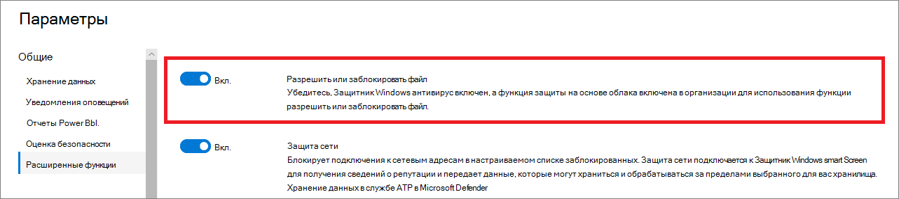

# Настройка расширенных функций в Defender для конечной точки

**Область применения:**
- [Microsoft Defender для конечной точки](https://go.microsoft.com/fwlink/p/?linkid=2154037)
- [Microsoft 365 Defender](https://go.microsoft.com/fwlink/?linkid=2118804)

[!INCLUDE [Microsoft 365 Defender rebranding](../../includes/microsoft-defender.md)]

> Хотите испытать Defender для конечной точки? [Зарегистрився для бесплатной пробной.](https://www.microsoft.com/microsoft-365/windows/microsoft-defender-atp?ocid=docs-wdatp-advancedfeats-abovefoldlink)

В зависимости от продуктов безопасности Майкрософт, которые вы используете, для интеграции Defender для конечной точки могут быть доступны некоторые расширенные функции.

## Включить расширенные функции

1. В области навигации выберите **Параметры настройки**  >  **Расширенные функции**.
2. Выберите расширенный элемент, который необходимо настроить и переключить параметр между **"Включи"** и **"Выключен".**
3. Нажмите **кнопку Сохранить предпочтения**.

Используйте следующие расширенные функции, чтобы лучше защититься от потенциально вредоносных файлов и получить более глубокое представление во время расследований по безопасности.

## Автоматическое расследование

Включи эту функцию, чтобы воспользоваться функциями автоматического расследования и восстановления службы. Дополнительные сведения см. в [автоматическом расследовании.](automated-investigations.md)

## Живой ответ

Включите эту функцию, чтобы пользователи с соответствующими разрешениями могли начать сеанс живого ответа на устройствах.

Дополнительные сведения о назначениях ролей см. в дополнительных [сведениях о создании и управлении ролями.](user-roles.md)

## Live response for servers
Включите эту функцию, чтобы пользователи с соответствующими разрешениями могли начать сеанс живого ответа на серверах.

Дополнительные сведения о назначениях ролей см. в дополнительных [сведениях о создании и управлении ролями.](user-roles.md)

## Live response unsigned script execution

Включение этой функции позволяет запускать неподписаные скрипты в сеансе живого ответа.

## Всегда исправление PUA
Потенциально нежелательные приложения (PUA) — это категория программного обеспечения, которое может привести к медленному запуску компьютера, показу неожиданных объявлений или в худшем случае установке другого программного обеспечения, которое может быть неожиданным или нежелательным. 

Включите эту функцию, чтобы потенциально нежелательные приложения (PUA) были исправлены на всех устройствах в клиенте, даже если защита PUA не настроена на устройствах. Это поможет защитить пользователей от случайной установки нежелательных приложений на своем устройстве. При отключении исправление зависит от конфигурации устройства. 

## Ограничение корреляции для групп устройств с масштабами
При включении этого параметра оповещения сопоставляются с отдельными инцидентами в зависимости от их группы устройств с охватом. По умолчанию корреляция инцидентов происходит во всей области клиента.

>[!NOTE]
>Изменение этого параметра влияет только на будущие корреляции оповещений.

## Включить EDR в режиме блокировки
Обнаружение и ответ конечной точки (EDR) в режиме блокировки обеспечивают защиту от вредоносных артефактов, даже если антивирус Microsoft Defender работает в пассивном режиме. При включении EDR в режиме блокировки блокирует вредоносные артефакты или поведение, обнаруженные на устройстве. EDR в режиме блокировки работает за кулисами для устранения вредоносных артефактов, которые обнаруживаются после нарушения.

## Автоматическое исправление оповещений

Для клиентов, созданных в Windows 10 версии 1809 или после нее, возможность автоматического расследования и устранения настроена по умолчанию для устранения оповещений, в которых состояние результатов автоматического анализа является "Угрозы не найдены" или "Исправлено".  Если не требуется автоматическое решение оповещений, необходимо вручную отключить функцию.

> [!TIP]
> Для клиентов, созданных до этой версии, необходимо вручную включить эту функцию со страницы [Расширенные функции.](https://securitycenter.windows.com/preferences2/integration)

> [!NOTE]
>
> - Результат действия автоматического решения может повлиять на вычисление уровня риска устройства, основанное на активных оповещениях, найденных на устройстве.
> - Если аналитик операций безопасности вручную задает состояние оповещений "В процессе" или "Разрешено", возможность автоматического разрешения не будет перезаписывать его.

## Разрешить или заблокировать файл

Блокировка доступна только в том случае, если ваша организация выполнит эти требования:

- Использует антивирус Microsoft Defender в качестве активного решения для борьбы с вирусами и,
- Включена функция защиты на облачной основе

Эта функция позволяет блокировать потенциально вредоносные файлы в сети. Блокировка файла не позволит ему читать, писать или выполнять его на устройствах в организации.

Чтобы включить **разрешить или заблокировать** файлы, включив:

1. В области навигации выберите **Параметры**  >  **Расширенные функции**  >  **Разрешить или заблокировать файл.**

1. Переключить параметр между **включаемой** и **отключенной**.

    

1. Выберите **Сохранить предпочтения** в нижней части страницы.

После включения этой функции можно заблокировать файлы с [помощью](respond-file-alerts.md#allow-or-block-file) вкладки **Add Indicator** на странице профиля файла.

## Настраиваемые сетевые индикаторы

Включение этой функции позволяет создавать индикаторы для IP-адресов, доменов или URL-адресов, которые определяют, будут ли они разрешены или заблокированы на основе настраиваемой списка индикаторов.

Чтобы использовать эту функцию, устройства должны запускать Windows 10 версии 1709 или более поздней версии. Они также должны иметь защиту сети в режиме блокировки и версии 4.18.1906.3 или более поздней версии платформы антивирусных программ см. [в KB 4052623](https://go.microsoft.com/fwlink/?linkid=2099834).

Дополнительные сведения см. в [руб. Управление индикаторами.](manage-indicators.md)

> [!NOTE]
> Защита сети использует службы репутации, которые обрабатывает запросы в местах, которые могут быть за пределами выбранного вами расположения для данных Defender для конечных точек.

## Защита от взлома
Во время некоторых видов кибератак злоумышленники пытаются отключить функции безопасности, такие как антивирусная защита, на компьютерах. Злоумышленникам нравится отключать функции безопасности, чтобы упростить доступ к данным, установить вредоносные программы или иным образом использовать данные, удостоверения и устройства.

Защита от взлома блокирует антивирус Microsoft Defender и предотвращает изменения параметров безопасности с помощью приложений и методов.

Сохраняйте включенную защиту от взлома, чтобы предотвратить нежелательные изменения в решении безопасности и его основных функций.

## Демонстрация сведений о пользователях

Включи эту функцию, чтобы вы могли видеть сведения пользователей, хранимые в Azure Active Directory. При расследовании сущностями учетных записей пользователей сведения включают сведения о пользователе, его имени, названии и сведениях о отделах. Сведения о учетной записи пользователей можно найти в следующих представлениях:

- Панель мониторинга операций безопасности
- Очередь оповещений
- Страница сведения об устройстве

Дополнительные сведения см. в [дополнительных сведениях о расследовании учетной записи пользователя.](investigate-user.md)

## Интеграция Skype для бизнеса

Включение интеграции Skype для бизнеса позволяет общаться с пользователями с помощью Skype для бизнеса, электронной почты или телефона. Это может быть удобно при общении с пользователем и смягчении рисков.

> [!NOTE]
> Когда устройство изолировано от сети, есть всплывающее сообщение, в котором можно включить связь Outlook и Skype, которая позволяет использовать связь с пользователем при отключении от сети. Этот параметр применяется к связи Skype и Outlook, когда устройства находятся в изолированном режиме.

## Microsoft Defender для интеграции удостоверений

Интеграция с Azure Advanced Threat Protection позволяет напрямую перейти в другой продукт безопасности Microsoft Identity. Расширенная защита от угроз Azure дополняет расследование дополнительными сведениями о предполагаемой скомпрометированной учетной записи и связанных с ней ресурсах. Включив эту функцию, вы обогатите возможности исследования на основе устройств, выключив по сети с точки зрения идентификации.

> [!NOTE]
> Чтобы включить эту функцию, вам потребуется соответствующая лицензия.

## Подключение к office 365 Threat Intelligence

Эта функция доступна только при наличии активной надстройки Office 365 E5 или надстройки Threat Intelligence. Дополнительные сведения см. на странице продукта Office 365 Enterprise E5.

При включив эту функцию, вы сможете включить данные из Office 365 Advanced Threat Protection в Центр безопасности Microsoft Defender для проведения комплексного расследования безопасности на почтовых ящиках Office 365 и устройствах Windows.

> [!NOTE]
> Чтобы включить эту функцию, вам потребуется соответствующая лицензия.

Чтобы получить контекстную интеграцию устройств в Office 365 Threat Intelligence, необходимо включить параметры Defender для конечной точки в панели мониторинга & соответствия требованиям. Дополнительные сведения см. в [дополнительных сведениях о расследовании угрозы и ответах.](https://docs.microsoft.com/microsoft-365/security/office-365-security/office-365-ti)

## Эксперты по угрозам Майкрософт — целевые уведомления об атаках

Из двух компонентов Microsoft Threat Expert целевое уведомление об атаке в общем доступе. Возможности экспертов по запросу по-прежнему находятся в предварительном просмотре. Вы можете использовать возможности экспертов по запросу только в том случае, если вы подали заявку на предварительное просмотр и ваше приложение было утверждено. При настройке можно получать целевые уведомления об атаке от экспертов Microsoft Threat с помощью панели оповещений портала Защитник для конечных точек и по электронной почте.

> [!NOTE]
> Возможность экспертов по угрозам Майкрософт в Defender for Endpoint доступна с лицензией E5 для корпоративной [мобильности и безопасности.](https://www.microsoft.com/cloud-platform/enterprise-mobility-security)
## Microsoft Cloud App Security

Включение этого параметра передает сигналы Defender for Endpoint в Microsoft Cloud App Security, чтобы обеспечить более глубокую видимость использования облачных приложений. Переададные данные хранятся и обрабатываются в том же месте, что и данные безопасности облачных приложений.

> [!NOTE]
> Эта функция будет доступна с лицензией E5 для корпоративной мобильности [и](https://www.microsoft.com/cloud-platform/enterprise-mobility-security) безопасности на устройствах под управлением Windows 10, версии 1709 (СБОРКА ОС 16299.1085 с [KB4493441),](https://support.microsoft.com/help/4493441)Windows 10, версия 1803 (сборка ОС 17134.704 с [KB4493464),](https://support.microsoft.com/help/4493464)Windows 10, версия 1809 (OS Build 17763.379 с [KB4489899),](https://support.microsoft.com/help/4489899)или более поздние версии Windows 10.

## Оценка безопасности (Майкрософт)

Передает сигналы Microsoft Defender для конечных точек в Центр безопасности Microsoft 365. Включение этой функции обеспечивает видимость Microsoft Secure Score в области безопасности устройства. Переададные данные хранятся и обрабатываются в том же месте, что и данные Microsoft Secure Score.

### Включение интеграции Microsoft Defender для конечной точки с портала Microsoft Defender для удостоверений

Чтобы получить контекстную интеграцию устройств в Microsoft Defender for Identity, необходимо также включить эту функцию на портале Microsoft Defender for Identity.

1. Войдите на портал [Microsoft Defender for Identity](https://portal.atp.azure.com/) с ролью глобального администратора или администратора безопасности.

2. Нажмите **кнопку Создать экземпляр**.

3. Настройка интеграции для **параметра On** и нажмите **кнопку Сохранить**.

После завершения этапов интеграции на обоих порталах вы сможете увидеть соответствующие оповещения на странице сведения об устройстве или сведения о пользователе.

## Фильтрация веб-содержимого
Блокировка доступа к веб-сайтам, содержащим нежелательный контент, и отслеживание веб-активности во всех доменах. Чтобы указать категории веб-контента, которые необходимо заблокировать, создайте политику [фильтрации веб-контента.](https://security.microsoft.com/preferences2/web_content_filtering_policy) Убедитесь, что у вас есть защита сети в режиме блокировки при развертывании базовой базы безопасности [Microsoft Defender для конечной точки.](https://devicemanagement.microsoft.com/#blade/Microsoft_Intune_Workflows/SecurityBaselineSummaryMenu/overview/templateType/2)

## Share endpoint alerts with Microsoft Compliance Center
Перенаправление оповещений о безопасности конечной точки и их состояния в Центр соответствия требованиям Майкрософт, что позволяет повысить внутреннюю политику управления рисками с помощью оповещений и устранять внутренние риски, прежде чем они причинят вред. Переададные данные обрабатываются и хранятся в том же месте, что и данные Office 365.

После настройки  индикаторов нарушений политики безопасности в параметрах управления рисками, оповещения Defender for Endpoint будут совместно использовать для управления рисками для соответствующих пользователей.

## Подключение Microsoft Intune

Defender for Endpoint можно интегрировать с [Microsoft Intune,](https://docs.microsoft.com/intune/what-is-intune) чтобы включить условный доступ к устройству на основе [риска.](https://docs.microsoft.com/intune/advanced-threat-protection#enable-windows-defender-atp-in-intune) [Включив эту](configure-conditional-access.md)функцию, вы сможете обмениваться сведениями о устройствах Defender для конечных точек с Помощью Intune, что повышает правоприменение политики.

> [!IMPORTANT]
> Вам потребуется включить интеграцию в Intune и Defender для конечной точки, чтобы использовать эту функцию. Дополнительные сведения о конкретных действиях см. в дополнительных сведениях [о настройке условного доступа в Defender для конечной точки.](configure-conditional-access.md)

Эта функция доступна только в том случае, если у вас есть следующие функции:

- Лицензированный клиент для корпоративной мобильности и безопасности E3 и Windows E5 (или Microsoft 365 Корпоративный E5)
- Активная среда Microsoft Intune с управляемыми Intune устройствами Windows 10 [Azure AD-joined.](https://docs.microsoft.com/azure/active-directory/devices/concept-azure-ad-join/)

### Политика условного доступа

Если включить интеграцию Intune, Intune автоматически создаст классическую политику условного доступа (CA). Эта классическая политика ЦС является обязательным условием для настройки отчетов о состоянии в Intune. Его не следует удалять.

> [!NOTE]
> Классическая политика ЦС, созданная Intune, отличается от современных политик условного [доступа,](https://docs.microsoft.com/azure/active-directory/conditional-access/overview/)которые используются для настройки конечных точек.

## Обнаружение устройства
Помогает находить неустановленные устройства, подключенные к корпоративной сети без необходимости дополнительных устройств или громоздких изменений процесса. С помощью бортовых устройств можно найти неугодные устройства в сети и оценить уязвимости и риски. Дополнительные сведения см. в [дополнительных сведениях об обнаружении устройства.](device-discovery.md)

## Предварительные функции

Узнайте о новых функциях в выпуске предварительного просмотра Defender для конечной точки и одними из первых попробуйте новые функции, включив функцию предварительного просмотра.

Вы будете иметь доступ к предстоящим функциям, которые можно предоставить отзывы, чтобы помочь улучшить общий опыт, прежде чем функции будут доступны в целом.

## Статьи по теме

- [Обновление параметров хранения данных](data-retention-settings.md)
- [Настройка уведомлений оповещений](configure-email-notifications.md)
