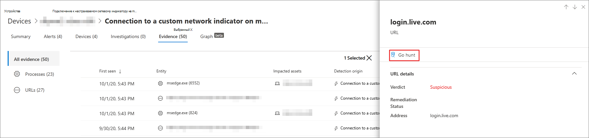

# <a name="quickly-hunt-for-entity-or-event-information-with-go-hunt"></a><span data-ttu-id="4942f-104">Быстрая охота за сведениями о сущности или событиях с помощью go hunt</span><span class="sxs-lookup"><span data-stu-id="4942f-104">Quickly hunt for entity or event information with go hunt</span></span>

[!INCLUDE [Microsoft 365 Defender rebranding](../../includes/microsoft-defender.md)]

<span data-ttu-id="4942f-105">**Область применения:**</span><span class="sxs-lookup"><span data-stu-id="4942f-105">**Applies to:**</span></span>
- [<span data-ttu-id="4942f-106">Defender для конечной точки</span><span class="sxs-lookup"><span data-stu-id="4942f-106">Defender for Endpoint</span></span>](https://go.microsoft.com/fwlink/?linkid=2154037)

><span data-ttu-id="4942f-107">Хотите испытать Defender для конечной точки?</span><span class="sxs-lookup"><span data-stu-id="4942f-107">Want to experience Defender for Endpoint?</span></span> [<span data-ttu-id="4942f-108">Зарегистрився для бесплатной пробной.</span><span class="sxs-lookup"><span data-stu-id="4942f-108">Sign up for a free trial.</span></span>](https://www.microsoft.com/microsoft-365/windows/microsoft-defender-atp?ocid=docs-wdatp-advancedhuntingref-abovefoldlink)


<span data-ttu-id="4942f-109">С помощью *действия go hunt* можно быстро исследовать события и различные типы сущности с помощью мощных расширенных возможностей охоты на основе запросов. [](advanced-hunting-overview.md)</span><span class="sxs-lookup"><span data-stu-id="4942f-109">With the *go hunt* action, you can quickly investigate events and various entity types using powerful query-based [advanced hunting](advanced-hunting-overview.md) capabilities.</span></span> <span data-ttu-id="4942f-110">Это действие автоматически запускает расширенный запрос на поиск соответствующих сведений о выбранном событии или объекте.</span><span class="sxs-lookup"><span data-stu-id="4942f-110">This action automatically runs an advanced hunting query to find relevant information about the selected event or entity.</span></span>

<span data-ttu-id="4942f-111">Действие *охоты на перейти* доступно в различных разделах центра безопасности всякий раз, когда отображаются сведения о событии или объекте.</span><span class="sxs-lookup"><span data-stu-id="4942f-111">The *go hunt* action is available in various sections of the security center whenever event or entity details are displayed.</span></span> <span data-ttu-id="4942f-112">Например, можно использовать go *hunt* из следующих разделов:</span><span class="sxs-lookup"><span data-stu-id="4942f-112">For example, you can use *go hunt* from the following sections:</span></span>

- <span data-ttu-id="4942f-113">На странице [инцидента](investigate-incidents.md)можно просмотреть сведения о пользователях, устройствах и многих других сущностях, связанных с инцидентом.</span><span class="sxs-lookup"><span data-stu-id="4942f-113">In the [incident page](investigate-incidents.md), you can review details about users, devices, and many other entities associated with an incident.</span></span> <span data-ttu-id="4942f-114">При выборе объекта вы получаете дополнительные сведения, а также различные действия, которые можно принять для этого объекта.</span><span class="sxs-lookup"><span data-stu-id="4942f-114">When you select an entity, you get additional information as well as various actions you could take on that entity.</span></span> <span data-ttu-id="4942f-115">В приведенной ниже примере выбрано устройство, в котором показаны сведения о устройстве, а также возможность охоты за дополнительными сведениями об устройстве.</span><span class="sxs-lookup"><span data-stu-id="4942f-115">In the example below, a device is selected, showing details about the device as well the option to hunt for more information about the device.</span></span>

    

- <span data-ttu-id="4942f-117">На странице инцидента можно также получить доступ к списку сущностям в вкладке доказательства. Выбор одного из этих сущностей позволяет быстро искать сведения об этом объекте.</span><span class="sxs-lookup"><span data-stu-id="4942f-117">In the incident page, you can also access a list of entities under the evidence tab. Selecting one of those entities provides an option to quickly hunt for information about that entity.</span></span>

    

- <span data-ttu-id="4942f-119">При просмотре временной шкалы устройства можно выбрать событие в временной шкале, чтобы просмотреть дополнительные сведения об этом событии.</span><span class="sxs-lookup"><span data-stu-id="4942f-119">When viewing the timeline for a device, you can select an event in the timeline to view additional information about that event.</span></span> <span data-ttu-id="4942f-120">После выбора события вы получите возможность охотиться за другими соответствующими событиями в продвинутой охоте.</span><span class="sxs-lookup"><span data-stu-id="4942f-120">Once an event is selected, you get the option to hunt for other relevant events in advanced hunting.</span></span>

    

<span data-ttu-id="4942f-122">Выбор **перейти на охоту** или **охоту для** связанных событий передает различные запросы в зависимости от того, выбрали ли вы объект или событие.</span><span class="sxs-lookup"><span data-stu-id="4942f-122">Selecting **Go hunt** or **Hunt for related events** passes different queries, depending on whether you've selected an entity or an event.</span></span>

## <a name="query-for-entity-information"></a><span data-ttu-id="4942f-123">Запрос сведений об объектах</span><span class="sxs-lookup"><span data-stu-id="4942f-123">Query for entity information</span></span>

<span data-ttu-id="4942f-124">При использовании *go hunt* для запроса сведений о пользователе, устройстве или любом другом типе сущности запрос проверяет все соответствующие таблицы схемы на наличие событий, связанных с этим объектом.</span><span class="sxs-lookup"><span data-stu-id="4942f-124">When using *go hunt* to query for information about a user, device, or any other type of entity, the query checks all relevant schema tables for any events involving that entity.</span></span> <span data-ttu-id="4942f-125">Чтобы сохранить управляемые результаты, запрос охватывает примерно тот же период времени, что и самое раннее действие за последние 30 дней, связанное с объектом и связанное с инцидентом.</span><span class="sxs-lookup"><span data-stu-id="4942f-125">To keep the results manageable, the query is scoped to around the same time period as the earliest activity in the past 30 days that involves the entity and is associated with the incident.</span></span>

<span data-ttu-id="4942f-126">Вот пример запроса на поиск для устройства:</span><span class="sxs-lookup"><span data-stu-id="4942f-126">Here is an example of the go hunt query for a device:</span></span>

```kusto
let selectedTimestamp = datetime(2020-06-02T02:06:47.1167157Z);
let deviceName = "fv-az770.example.com";
let deviceId = "device-guid";
search in (DeviceLogonEvents, DeviceProcessEvents, DeviceNetworkEvents, DeviceFileEvents, DeviceRegistryEvents, DeviceImageLoadEvents, DeviceEvents, DeviceImageLoadEvents, IdentityLogonEvents, IdentityQueryEvents)
Timestamp between ((selectedTimestamp - 1h) .. (selectedTimestamp + 1h))
and DeviceName == deviceName
// or RemoteDeviceName == deviceName
// or DeviceId == deviceId
| take 100
```

### <a name="supported-entity-types"></a><span data-ttu-id="4942f-127">Поддерживаемые типы сущности</span><span class="sxs-lookup"><span data-stu-id="4942f-127">Supported entity types</span></span>

<span data-ttu-id="4942f-128">Вы можете использовать *go hunt* после выбора любого из этих типов сущности:</span><span class="sxs-lookup"><span data-stu-id="4942f-128">You can use *go hunt* after selecting any of these entity types:</span></span>

- <span data-ttu-id="4942f-129">Files</span><span class="sxs-lookup"><span data-stu-id="4942f-129">Files</span></span>
- <span data-ttu-id="4942f-130">Пользователи</span><span class="sxs-lookup"><span data-stu-id="4942f-130">Users</span></span>
- <span data-ttu-id="4942f-131">Устройства</span><span class="sxs-lookup"><span data-stu-id="4942f-131">Devices</span></span>
- <span data-ttu-id="4942f-132">IP-адреса</span><span class="sxs-lookup"><span data-stu-id="4942f-132">IP addresses</span></span>
- <span data-ttu-id="4942f-133">URL-адреса</span><span class="sxs-lookup"><span data-stu-id="4942f-133">URLs</span></span>

## <a name="query-for-event-information"></a><span data-ttu-id="4942f-134">Запрос сведений о событиях</span><span class="sxs-lookup"><span data-stu-id="4942f-134">Query for event information</span></span>

<span data-ttu-id="4942f-135">При использовании *go hunt* для запроса сведений о событии временной шкалы запрос проверяет все соответствующие таблицы схемы для других событий во время выбранного события.</span><span class="sxs-lookup"><span data-stu-id="4942f-135">When using *go hunt* to query for information about a timeline event, the query checks all relevant schema tables for other events around the time of the selected event.</span></span> <span data-ttu-id="4942f-136">Например, в следующих запросах перечислены события в различных таблицах схем, которые происходили примерно в один и тот же период времени на одном устройстве:</span><span class="sxs-lookup"><span data-stu-id="4942f-136">For example, the following query lists events in various schema tables that occurred around the same time period on the same device:</span></span>

```kusto
// List relevant events 30 minutes before and after selected RegistryValueSet event
let selectedEventTimestamp = datetime(2020-10-06T21:40:25.3466868Z);
search in (DeviceFileEvents, DeviceProcessEvents, DeviceEvents, DeviceRegistryEvents, DeviceNetworkEvents, DeviceImageLoadEvents, DeviceLogonEvents)
    Timestamp between ((selectedEventTimestamp - 30m) .. (selectedEventTimestamp + 30m))
    and DeviceId == "a305b52049c4658ec63ae8b55becfe5954c654a4"
| sort by Timestamp desc
| extend Relevance = iff(Timestamp == selectedEventTimestamp, "Selected event", iff(Timestamp < selectedEventTimestamp, "Earlier event", "Later event"))
| project-reorder Relevance
```

## <a name="adjust-the-query"></a><span data-ttu-id="4942f-137">Настройка запроса</span><span class="sxs-lookup"><span data-stu-id="4942f-137">Adjust the query</span></span>

<span data-ttu-id="4942f-138">С некоторым знанием языка [запроса](advanced-hunting-query-language.md)можно настроить запрос на свои предпочтения.</span><span class="sxs-lookup"><span data-stu-id="4942f-138">With some knowledge of the [query language](advanced-hunting-query-language.md), you can adjust the query to your preference.</span></span> <span data-ttu-id="4942f-139">Например, можно настроить эту строку, которая определяет размер окна времени:</span><span class="sxs-lookup"><span data-stu-id="4942f-139">For example, you can adjust this line, which determines the size of the time window:</span></span>

```kusto
Timestamp between ((selectedTimestamp - 1h) .. (selectedTimestamp + 1h))
```

<span data-ttu-id="4942f-140">Помимо изменения запроса, чтобы получить более релевантные результаты, вы также можете:</span><span class="sxs-lookup"><span data-stu-id="4942f-140">In addition to modifying the query to get more relevant results, you can also:</span></span>

- [<span data-ttu-id="4942f-141">Просмотр результатов в качестве диаграмм</span><span class="sxs-lookup"><span data-stu-id="4942f-141">View the results as charts</span></span>](advanced-hunting-query-results.md#view-query-results-as-a-table-or-chart)
- [<span data-ttu-id="4942f-142">Создание настраиваемой нормы обнаружения</span><span class="sxs-lookup"><span data-stu-id="4942f-142">Create a custom detection rule</span></span>](custom-detection-rules.md)

## <a name="related-topics"></a><span data-ttu-id="4942f-143">Статьи по теме</span><span class="sxs-lookup"><span data-stu-id="4942f-143">Related topics</span></span>

- [<span data-ttu-id="4942f-144">Обзор расширенной охоты на угрозы</span><span class="sxs-lookup"><span data-stu-id="4942f-144">Advanced hunting overview</span></span>](advanced-hunting-overview.md)
- [<span data-ttu-id="4942f-145">Изучение языка запросов</span><span class="sxs-lookup"><span data-stu-id="4942f-145">Learn the query language</span></span>](advanced-hunting-query-language.md)
- [<span data-ttu-id="4942f-146">Работа с результатами запросов</span><span class="sxs-lookup"><span data-stu-id="4942f-146">Work with query results</span></span>](advanced-hunting-query-results.md)
- [<span data-ttu-id="4942f-147">Правила настраиваемого обнаружения</span><span class="sxs-lookup"><span data-stu-id="4942f-147">Custom detection rules</span></span>](custom-detection-rules.md)
