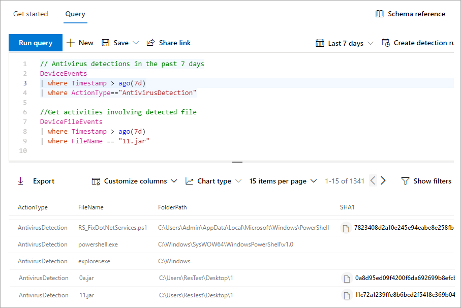

# <a name="learn-the-advanced-hunting-query-language"></a><span data-ttu-id="e2bdb-104">Познакомьтесь с языком запросов расширенной охоты</span><span class="sxs-lookup"><span data-stu-id="e2bdb-104">Learn the advanced hunting query language</span></span>

[!INCLUDE [Microsoft 365 Defender rebranding](../../includes/microsoft-defender.md)]

<span data-ttu-id="e2bdb-105">**Область применения:**</span><span class="sxs-lookup"><span data-stu-id="e2bdb-105">**Applies to:**</span></span>
- [<span data-ttu-id="e2bdb-106">Defender для конечной точки</span><span class="sxs-lookup"><span data-stu-id="e2bdb-106">Defender for Endpoint</span></span>](https://go.microsoft.com/fwlink/?linkid=2154037)

> <span data-ttu-id="e2bdb-107">Хотите испытать Defender для конечной точки?</span><span class="sxs-lookup"><span data-stu-id="e2bdb-107">Want to experience Defender for Endpoint?</span></span> [<span data-ttu-id="e2bdb-108">Зарегистрився для бесплатной пробной.</span><span class="sxs-lookup"><span data-stu-id="e2bdb-108">Sign up for a free trial.</span></span>](https://www.microsoft.com/microsoft-365/windows/microsoft-defender-atp?ocid=docs-wdatp-advancedhunting-abovefoldlink)

<span data-ttu-id="e2bdb-109">Расширенный поиск основывается на [языке запросов Kusto](https://docs.microsoft.com/azure/kusto/query/).</span><span class="sxs-lookup"><span data-stu-id="e2bdb-109">Advanced hunting is based on the [Kusto query language](https://docs.microsoft.com/azure/kusto/query/).</span></span> <span data-ttu-id="e2bdb-110">Вы можете использовать операторы Kusto и операторы для создания запросов, которые размещают сведения в специализированной [схеме.](advanced-hunting-schema-reference.md)</span><span class="sxs-lookup"><span data-stu-id="e2bdb-110">You can use Kusto operators and statements to construct queries that locate information in a specialized [schema](advanced-hunting-schema-reference.md).</span></span> <span data-ttu-id="e2bdb-111">Чтобы лучше понять эти концепции, запустите ваш первый запрос.</span><span class="sxs-lookup"><span data-stu-id="e2bdb-111">To understand these concepts better, run your first query.</span></span>

## <a name="try-your-first-query"></a><span data-ttu-id="e2bdb-112">Попробуйте выполнить первый запрос</span><span class="sxs-lookup"><span data-stu-id="e2bdb-112">Try your first query</span></span>

<span data-ttu-id="e2bdb-113">В Центре безопасности Защитника Майкрософт перейдите в **Службу предварительной охоты** для выполнения первого запроса.</span><span class="sxs-lookup"><span data-stu-id="e2bdb-113">In Microsoft Defender Security Center, go to **Advanced hunting** to run your first query.</span></span> <span data-ttu-id="e2bdb-114">Используйте следующий пример:</span><span class="sxs-lookup"><span data-stu-id="e2bdb-114">Use the following example:</span></span>

```kusto
// Finds PowerShell execution events that could involve a download
union DeviceProcessEvents, DeviceNetworkEvents
| where Timestamp > ago(7d)
// Pivoting on PowerShell processes
| where FileName in~ ("powershell.exe", "powershell_ise.exe")
// Suspicious commands
| where ProcessCommandLine has_any("WebClient",
    "DownloadFile",
    "DownloadData",
    "DownloadString",
    "WebRequest",
    "Shellcode",
    "http",
    "https")
| project Timestamp, DeviceName, InitiatingProcessFileName, InitiatingProcessCommandLine, 
FileName, ProcessCommandLine, RemoteIP, RemoteUrl, RemotePort, RemoteIPType
| top 100 by Timestamp
```
<span data-ttu-id="e2bdb-115">**[Запуск этого запроса в продвинутой охоте](https://securitycenter.windows.com/hunting?query=H4sIAAAAAAAEAI2TT0vDQBDF5yz4HUJPFcTqyZsXqyCIBFvxKNGWtpo_NVlbC8XP7m8mado0K5Zls8nkzdu3b2Z70pNAbmUmqYyk4D2UTJYyllwGMmWNGQHrN_NNvsSBzUBrbMFMiWieAx3xDEBl4GL4AuNd8B0bNgARENcdUmIZ3yM5liPwac3bN-YZPGPU5ET1rWDc7Ox4uod8YDp4MzI-GkjlX4Ne2nly0zEkKzFWh4ZE5sSuTN8Ehq5couvEMnvmUAhez-HsRBMipVa_W_OG6vEfGtT12JRHpqV064e1Kx04NsxFzXxW1aFjp_djXmDRPbfY3XMMcLogTz2bWZ2KqmIJI6q6wKe2WYnrRsa9KVeU9kCBBo2v7BzPxF_Bx2DKiqh63SGoRoc6Njti48z_yL71XHQAcgAur6rXRpcqH3l-4knZF23Utsbq2MircEqmw-G__xR1TdZ1r7zb7XLezmx3etkvGr-ze6NdGdW92azUfpcdluWvr-aqbh_nofnqcWI3aYyOsBV7giduRUO7187LMKTT5rxvHHX80_t8IeeMgLquvL7-Ak3q-kz8BAAA&runQuery=true&timeRangeId=week)**</span><span class="sxs-lookup"><span data-stu-id="e2bdb-115">**[Run this query in advanced hunting](https://securitycenter.windows.com/hunting?query=H4sIAAAAAAAEAI2TT0vDQBDF5yz4HUJPFcTqyZsXqyCIBFvxKNGWtpo_NVlbC8XP7m8mado0K5Zls8nkzdu3b2Z70pNAbmUmqYyk4D2UTJYyllwGMmWNGQHrN_NNvsSBzUBrbMFMiWieAx3xDEBl4GL4AuNd8B0bNgARENcdUmIZ3yM5liPwac3bN-YZPGPU5ET1rWDc7Ox4uod8YDp4MzI-GkjlX4Ne2nly0zEkKzFWh4ZE5sSuTN8Ehq5couvEMnvmUAhez-HsRBMipVa_W_OG6vEfGtT12JRHpqV064e1Kx04NsxFzXxW1aFjp_djXmDRPbfY3XMMcLogTz2bWZ2KqmIJI6q6wKe2WYnrRsa9KVeU9kCBBo2v7BzPxF_Bx2DKiqh63SGoRoc6Njti48z_yL71XHQAcgAur6rXRpcqH3l-4knZF23Utsbq2MircEqmw-G__xR1TdZ1r7zb7XLezmx3etkvGr-ze6NdGdW92azUfpcdluWvr-aqbh_nofnqcWI3aYyOsBV7giduRUO7187LMKTT5rxvHHX80_t8IeeMgLquvL7-Ak3q-kz8BAAA&runQuery=true&timeRangeId=week)**</span></span>

### <a name="describe-the-query-and-specify-the-tables-to-search"></a><span data-ttu-id="e2bdb-116">Описание запроса и указание таблиц для поиска</span><span class="sxs-lookup"><span data-stu-id="e2bdb-116">Describe the query and specify the tables to search</span></span>
<span data-ttu-id="e2bdb-117">В начале запроса добавлен краткий комментарий, чтобы описать его.</span><span class="sxs-lookup"><span data-stu-id="e2bdb-117">A short comment has been added to the beginning of the query to describe what it is for.</span></span> <span data-ttu-id="e2bdb-118">Этот комментарий поможет, если позже вы решите сохранить запрос и поделиться им с другими в организации.</span><span class="sxs-lookup"><span data-stu-id="e2bdb-118">This comment helps if you later decide to save the query and share it with others in your organization.</span></span>

```kusto
// Finds PowerShell execution events that could involve a download
```
<span data-ttu-id="e2bdb-119">Сам запрос обычно начинается с имени таблицы с несколькими элементами, которые начинаются с трубки ( `|` ).</span><span class="sxs-lookup"><span data-stu-id="e2bdb-119">The query itself will typically start with a table name followed by several elements that start with a pipe (`|`).</span></span> <span data-ttu-id="e2bdb-120">В этом примере мы начинаем с создания объединения из двух таблиц и добавления элементов по мере  `DeviceProcessEvents` `DeviceNetworkEvents` необходимости.</span><span class="sxs-lookup"><span data-stu-id="e2bdb-120">In this example, we start by creating a union of two tables,  `DeviceProcessEvents` and `DeviceNetworkEvents`, and add piped elements as needed.</span></span>

```kusto
union DeviceProcessEvents, DeviceNetworkEvents
```
### <a name="set-the-time-range"></a><span data-ttu-id="e2bdb-121">Установите диапазон времени</span><span class="sxs-lookup"><span data-stu-id="e2bdb-121">Set the time range</span></span>
<span data-ttu-id="e2bdb-122">Первый элемент с конвейером — это фильтр времени, который был в течение предыдущих семи дней.</span><span class="sxs-lookup"><span data-stu-id="e2bdb-122">The first piped element is a time filter scoped to the previous seven days.</span></span> <span data-ttu-id="e2bdb-123">Ограничение диапазона времени позволяет убедиться, что запросы выполняются хорошо, возвращают управляемые результаты и не отжимаются.</span><span class="sxs-lookup"><span data-stu-id="e2bdb-123">Limiting the time range helps ensure that queries perform well, return manageable results, and don't time out.</span></span>

```kusto
| where Timestamp > ago(7d)
```

### <a name="check-specific-processes"></a><span data-ttu-id="e2bdb-124">Проверка определенных процессов</span><span class="sxs-lookup"><span data-stu-id="e2bdb-124">Check specific processes</span></span>
<span data-ttu-id="e2bdb-125">За диапазоном времени сразу последует поиск имен файлов процессов, представляющих приложение PowerShell.</span><span class="sxs-lookup"><span data-stu-id="e2bdb-125">The time range is immediately followed by a search for process file names representing the PowerShell application.</span></span>

```kusto
// Pivoting on PowerShell processes
| where FileName in~ ("powershell.exe", "powershell_ise.exe")
```

### <a name="search-for-specific-command-strings"></a><span data-ttu-id="e2bdb-126">Поиск определенных строк команд</span><span class="sxs-lookup"><span data-stu-id="e2bdb-126">Search for specific command strings</span></span>
<span data-ttu-id="e2bdb-127">После этого запрос ищет строки в строках команд, которые обычно используются для скачивания файлов с помощью PowerShell.</span><span class="sxs-lookup"><span data-stu-id="e2bdb-127">Afterwards, the query looks for strings in command lines that are typically used to download files using PowerShell.</span></span>

```kusto
// Suspicious commands
| where ProcessCommandLine has_any("WebClient",
    "DownloadFile",
    "DownloadData",
    "DownloadString",
    "WebRequest",
    "Shellcode",
    "http",
    "https")
```

### <a name="customize-result-columns-and-length"></a><span data-ttu-id="e2bdb-128">Настройка столбцов результатов и длины</span><span class="sxs-lookup"><span data-stu-id="e2bdb-128">Customize result columns and length</span></span> 
<span data-ttu-id="e2bdb-129">Теперь, когда запрос четко определяет данные, которые необходимо найти, можно определить, как выглядят результаты.</span><span class="sxs-lookup"><span data-stu-id="e2bdb-129">Now that your query clearly identifies the data you want to locate, you can define what the results look like.</span></span> <span data-ttu-id="e2bdb-130">`project` возвращает определенные столбцы и `top` ограничивает количество результатов.</span><span class="sxs-lookup"><span data-stu-id="e2bdb-130">`project` returns specific columns, and `top` limits the number of results.</span></span> <span data-ttu-id="e2bdb-131">Эти операторы помогают обеспечить, чтобы результаты были хорошо отформатированы и достаточно большие и просты в обработке.</span><span class="sxs-lookup"><span data-stu-id="e2bdb-131">These operators help ensure the results are well-formatted and reasonably large and easy to process.</span></span>

```kusto
| project Timestamp, DeviceName, InitiatingProcessFileName, InitiatingProcessCommandLine, 
FileName, ProcessCommandLine, RemoteIP, RemoteUrl, RemotePort, RemoteIPType
| top 100 by Timestamp
```

<span data-ttu-id="e2bdb-132">Выберите **запрос Run,** чтобы увидеть результаты.</span><span class="sxs-lookup"><span data-stu-id="e2bdb-132">Select **Run query** to see the results.</span></span> <span data-ttu-id="e2bdb-133">Используйте значок расширения в правом верхнем справа от редактора запроса, чтобы сосредоточиться на запросе и результатах поиска.</span><span class="sxs-lookup"><span data-stu-id="e2bdb-133">Use the expand icon at the top right of the query editor to focus on your hunting query and the results.</span></span> 


>[!TIP]
><span data-ttu-id="e2bdb-135">Результаты запроса можно просматривать как диаграммы и быстро настраивать фильтры.</span><span class="sxs-lookup"><span data-stu-id="e2bdb-135">You can view query results as charts and quickly adjust filters.</span></span> <span data-ttu-id="e2bdb-136">Инструкции по [работе с результатами запросов](advanced-hunting-query-results.md)</span><span class="sxs-lookup"><span data-stu-id="e2bdb-136">For guidance, [read about working with query results](advanced-hunting-query-results.md)</span></span>

## <a name="learn-common-query-operators-for-advanced-hunting"></a><span data-ttu-id="e2bdb-137">Познакомьтесь с обычными операторами запросов для расширенной охоты</span><span class="sxs-lookup"><span data-stu-id="e2bdb-137">Learn common query operators for advanced hunting</span></span>

<span data-ttu-id="e2bdb-138">Вы только что запустите первый запрос и имеете общее представление о его компонентах.</span><span class="sxs-lookup"><span data-stu-id="e2bdb-138">You've just run your first query and have a general idea of its components.</span></span> <span data-ttu-id="e2bdb-139">Пришло время немного отойтки и изучить некоторые основы.</span><span class="sxs-lookup"><span data-stu-id="e2bdb-139">It's time to backtrack slightly and learn some basics.</span></span> <span data-ttu-id="e2bdb-140">Язык запросов Kusto, используемый в расширенной охоте, поддерживает ряд операторов, включая обычные, описанные ниже.</span><span class="sxs-lookup"><span data-stu-id="e2bdb-140">The Kusto query language used by advanced hunting supports a range of operators, including the following common ones.</span></span>

| <span data-ttu-id="e2bdb-141">Оператор</span><span class="sxs-lookup"><span data-stu-id="e2bdb-141">Operator</span></span> | <span data-ttu-id="e2bdb-142">Описание и использование</span><span class="sxs-lookup"><span data-stu-id="e2bdb-142">Description and usage</span></span> |
|--|--|
| `where` | <span data-ttu-id="e2bdb-143">Фильтрация таблицы по подмножеству строк, удовлетворяющих предикату.</span><span class="sxs-lookup"><span data-stu-id="e2bdb-143">Filter a table to the subset of rows that satisfy a predicate.</span></span> |
| `summarize` | <span data-ttu-id="e2bdb-144">Создание таблицы, в которой объединяется содержимое исходной таблицы.</span><span class="sxs-lookup"><span data-stu-id="e2bdb-144">Produce a table that aggregates the content of the input table.</span></span> |
| `join` | <span data-ttu-id="e2bdb-145">Объединение строк двух таблиц, чтобы сформировать новую таблицу, сопоставляя значения заданных столбцов из каждой таблицы.</span><span class="sxs-lookup"><span data-stu-id="e2bdb-145">Merge the rows of two tables to form a new table by matching values of the specified column(s) from each table.</span></span> |
| `count` | <span data-ttu-id="e2bdb-146">Возврат количества записей в исходный набор записей.</span><span class="sxs-lookup"><span data-stu-id="e2bdb-146">Return the number of records in the input record set.</span></span> |
| `top` | <span data-ttu-id="e2bdb-147">Возврат первых N записей, отсортированных по заданным столбцам.</span><span class="sxs-lookup"><span data-stu-id="e2bdb-147">Return the first N records sorted by the specified columns.</span></span> |
| `limit` | <span data-ttu-id="e2bdb-148">Возврат до заданного количества строк.</span><span class="sxs-lookup"><span data-stu-id="e2bdb-148">Return up to the specified number of rows.</span></span> |
| `project` | <span data-ttu-id="e2bdb-149">Выбор столбцов, которые нужно включить, переименовать или перетащить, и вставка новых вычисляемых столбцов.</span><span class="sxs-lookup"><span data-stu-id="e2bdb-149">Select the columns to include, rename or drop, and insert new computed columns.</span></span> |
| `extend` | <span data-ttu-id="e2bdb-150">Создание вычисляемых столбцов и их добавление в результирующий набор.</span><span class="sxs-lookup"><span data-stu-id="e2bdb-150">Create calculated columns and append them to the result set.</span></span> |
| `makeset` |  <span data-ttu-id="e2bdb-151">Возврат динамического массива (JSON) множества различных значений, которые выражение (Expr) принимает в группе.</span><span class="sxs-lookup"><span data-stu-id="e2bdb-151">Return a dynamic (JSON) array of the set of distinct values that Expr takes in the group.</span></span> |
| `find` | <span data-ttu-id="e2bdb-152">Поиск строк, соответствующих предикату, по набору таблиц.</span><span class="sxs-lookup"><span data-stu-id="e2bdb-152">Find rows that match a predicate across a set of tables.</span></span> |

<span data-ttu-id="e2bdb-153">Чтобы увидеть живой пример этих операторов, запустите их в разделе **Начало** работы на продвинутой странице охоты.</span><span class="sxs-lookup"><span data-stu-id="e2bdb-153">To see a live example of these operators, run them from the **Get started** section of the advanced hunting page.</span></span>

## <a name="understand-data-types"></a><span data-ttu-id="e2bdb-154">Понимание типов данных</span><span class="sxs-lookup"><span data-stu-id="e2bdb-154">Understand data types</span></span>

<span data-ttu-id="e2bdb-155">Расширенный поиск поддерживает типы данных Kusto, включая следующие распространенные типы:</span><span class="sxs-lookup"><span data-stu-id="e2bdb-155">Advanced hunting supports Kusto data types, including the following common types:</span></span>

| <span data-ttu-id="e2bdb-156">Тип данных</span><span class="sxs-lookup"><span data-stu-id="e2bdb-156">Data type</span></span> | <span data-ttu-id="e2bdb-157">Описание и влияния запроса</span><span class="sxs-lookup"><span data-stu-id="e2bdb-157">Description and query implications</span></span> |
|--|--|
| `datetime` | <span data-ttu-id="e2bdb-158">Данные и сведения о времени, как правило, представляющие время событий.</span><span class="sxs-lookup"><span data-stu-id="e2bdb-158">Data and time information typically representing event timestamps.</span></span> [<span data-ttu-id="e2bdb-159">См. поддерживаемые форматы дат</span><span class="sxs-lookup"><span data-stu-id="e2bdb-159">See supported datetime formats</span></span>](https://docs.microsoft.com/azure/data-explorer/kusto/query/scalar-data-types/datetime) |
| `string` | <span data-ttu-id="e2bdb-160">Строка символов в UTF-8, заключенная в одиночные кавычка () или `'` двойные кавычка ( `"` ).</span><span class="sxs-lookup"><span data-stu-id="e2bdb-160">Character string in UTF-8 enclosed in single quotes (`'`) or double quotes (`"`).</span></span> [<span data-ttu-id="e2bdb-161">Подробнее о строках</span><span class="sxs-lookup"><span data-stu-id="e2bdb-161">Read more about strings</span></span>](https://docs.microsoft.com/azure/data-explorer/kusto/query/scalar-data-types/string) |
| `bool` | <span data-ttu-id="e2bdb-162">Этот тип данных поддерживает `true` или `false` заявляет.</span><span class="sxs-lookup"><span data-stu-id="e2bdb-162">This data type supports `true` or `false` states.</span></span> [<span data-ttu-id="e2bdb-163">См. поддерживаемые литералы и операторы</span><span class="sxs-lookup"><span data-stu-id="e2bdb-163">See supported literals and operators</span></span>](https://docs.microsoft.com/azure/data-explorer/kusto/query/scalar-data-types/bool) |
| `int` | <span data-ttu-id="e2bdb-164">32-bit integer</span><span class="sxs-lookup"><span data-stu-id="e2bdb-164">32-bit integer</span></span>  |
| `long` | <span data-ttu-id="e2bdb-165">64-bit integer</span><span class="sxs-lookup"><span data-stu-id="e2bdb-165">64-bit integer</span></span> |

<span data-ttu-id="e2bdb-166">Дополнительные сведения об этих типах данных читайте в [материале о типах данных Kusto scalar.](https://docs.microsoft.com/azure/data-explorer/kusto/query/scalar-data-types/)</span><span class="sxs-lookup"><span data-stu-id="e2bdb-166">To learn more about these data types, [read about Kusto scalar data types](https://docs.microsoft.com/azure/data-explorer/kusto/query/scalar-data-types/).</span></span>

## <a name="get-help-as-you-write-queries"></a><span data-ttu-id="e2bdb-167">Помощь при написании запросов</span><span class="sxs-lookup"><span data-stu-id="e2bdb-167">Get help as you write queries</span></span>
<span data-ttu-id="e2bdb-168">Ниже перечислены функции, благодаря которым запросы можно создавать быстрее.</span><span class="sxs-lookup"><span data-stu-id="e2bdb-168">Take advantage of the following functionality to write queries faster:</span></span>

- <span data-ttu-id="e2bdb-169">**Autosuggest**— при записи запросов расширенный поиск предоставляет предложения из IntelliSense.</span><span class="sxs-lookup"><span data-stu-id="e2bdb-169">**Autosuggest**—as you write queries, advanced hunting provides suggestions from IntelliSense.</span></span>
- <span data-ttu-id="e2bdb-170">**Дерево схемы**— представление схемы, которое включает список таблиц и их столбцов, предоставляется рядом с рабочей областью.</span><span class="sxs-lookup"><span data-stu-id="e2bdb-170">**Schema tree**—a schema representation that includes the list of tables and their columns is provided next to your working area.</span></span> <span data-ttu-id="e2bdb-171">Чтобы получить об элементе дополнительные сведения, нужно навести на него указатель мыши.</span><span class="sxs-lookup"><span data-stu-id="e2bdb-171">For more information, hover over an item.</span></span> <span data-ttu-id="e2bdb-172">Чтобы вставить элемент в редактор запросов, нужно дважды щелкнуть по нему.</span><span class="sxs-lookup"><span data-stu-id="e2bdb-172">Double-click an item to insert it to the query editor.</span></span>
- <span data-ttu-id="e2bdb-173">**[Ссылка схемы](advanced-hunting-schema-reference.md#get-schema-information-in-the-security-center)**— ссылка на портал с описаниями таблиц и столбцов, а также поддерживаемые типы событий `ActionType` (значения) и примеры запросов</span><span class="sxs-lookup"><span data-stu-id="e2bdb-173">**[Schema reference](advanced-hunting-schema-reference.md#get-schema-information-in-the-security-center)**—in-portal reference with table and column descriptions as well as supported event types (`ActionType` values) and sample queries</span></span>

## <a name="work-with-multiple-queries-in-the-editor"></a><span data-ttu-id="e2bdb-174">Работа с несколькими запросами в редакторе</span><span class="sxs-lookup"><span data-stu-id="e2bdb-174">Work with multiple queries in the editor</span></span>
<span data-ttu-id="e2bdb-175">Редактор запроса можно использовать для экспериментов с несколькими запросами.</span><span class="sxs-lookup"><span data-stu-id="e2bdb-175">You can use the query editor to experiment with multiple queries.</span></span> <span data-ttu-id="e2bdb-176">Использование нескольких запросов:</span><span class="sxs-lookup"><span data-stu-id="e2bdb-176">To use multiple queries:</span></span>

- <span data-ttu-id="e2bdb-177">Отделяйте каждый запрос пустой строкой.</span><span class="sxs-lookup"><span data-stu-id="e2bdb-177">Separate each query with an empty line.</span></span>
- <span data-ttu-id="e2bdb-178">Поместите курсор в любую часть запроса, чтобы выбрать этот запрос перед его запуском.</span><span class="sxs-lookup"><span data-stu-id="e2bdb-178">Place the cursor on any part of a query to select that query before running it.</span></span> <span data-ttu-id="e2bdb-179">При этом будет работать только выбранный запрос.</span><span class="sxs-lookup"><span data-stu-id="e2bdb-179">This will run only the selected query.</span></span> <span data-ttu-id="e2bdb-180">Чтобы запустить другой запрос, переместим курсор соответствующим образом и выберите **запрос Run.**</span><span class="sxs-lookup"><span data-stu-id="e2bdb-180">To run another query, move the cursor accordingly and select **Run query**.</span></span>

<span data-ttu-id="e2bdb-181">
 _Редактор запроса с несколькими запросами_</span><span class="sxs-lookup"><span data-stu-id="e2bdb-181">
_Query editor with multiple queries_</span></span>

## <a name="use-sample-queries"></a><span data-ttu-id="e2bdb-182">Использование примеров запросов</span><span class="sxs-lookup"><span data-stu-id="e2bdb-182">Use sample queries</span></span>

<span data-ttu-id="e2bdb-183">Раздел **Начало работы** содержит несколько простых запросов, использующих часто используемые операторы.</span><span class="sxs-lookup"><span data-stu-id="e2bdb-183">The **Get started** section provides a few simple queries using commonly used operators.</span></span> <span data-ttu-id="e2bdb-184">Попробуйте выполнить эти запросы и внести в них небольшие изменения.</span><span class="sxs-lookup"><span data-stu-id="e2bdb-184">Try running these queries and making small modifications to them.</span></span>


> [!NOTE]
> <span data-ttu-id="e2bdb-186">Кроме примеров базовых запросов, вы можете получить доступ к [общим запросам](advanced-hunting-shared-queries.md) для определенных сценариев охоты на угрозы.</span><span class="sxs-lookup"><span data-stu-id="e2bdb-186">Apart from the basic query samples, you can also access [shared queries](advanced-hunting-shared-queries.md) for specific threat hunting scenarios.</span></span> <span data-ttu-id="e2bdb-187">Ознакомьтесь с общими запросами на левой стороне страницы или репозиторием [запросов GitHub.](https://aka.ms/hunting-queries)</span><span class="sxs-lookup"><span data-stu-id="e2bdb-187">Explore the shared queries on the left side of the page or the [GitHub query repository](https://aka.ms/hunting-queries).</span></span>

## <a name="access-comprehensive-query-language-reference"></a><span data-ttu-id="e2bdb-188">Доступ к комплексной языковой ссылке запроса</span><span class="sxs-lookup"><span data-stu-id="e2bdb-188">Access comprehensive query language reference</span></span>

<span data-ttu-id="e2bdb-189">Подробные сведения о языке запросов см. в документации [по языку запросов Kusto.](https://docs.microsoft.com/azure/kusto/query/)</span><span class="sxs-lookup"><span data-stu-id="e2bdb-189">For detailed information about the query language, see [Kusto query language documentation](https://docs.microsoft.com/azure/kusto/query/).</span></span>

## <a name="related-topics"></a><span data-ttu-id="e2bdb-190">Статьи по теме</span><span class="sxs-lookup"><span data-stu-id="e2bdb-190">Related topics</span></span>
- [<span data-ttu-id="e2bdb-191">Обзор расширенной охоты</span><span class="sxs-lookup"><span data-stu-id="e2bdb-191">Advanced hunting overview</span></span>](advanced-hunting-overview.md)
- [<span data-ttu-id="e2bdb-192">Работа с результатами запросов</span><span class="sxs-lookup"><span data-stu-id="e2bdb-192">Work with query results</span></span>](advanced-hunting-query-results.md)
- [<span data-ttu-id="e2bdb-193">Использование общих запросов</span><span class="sxs-lookup"><span data-stu-id="e2bdb-193">Use shared queries</span></span>](advanced-hunting-shared-queries.md)
- [<span data-ttu-id="e2bdb-194">Сведения о схеме</span><span class="sxs-lookup"><span data-stu-id="e2bdb-194">Understand the schema</span></span>](advanced-hunting-schema-reference.md)
- [<span data-ttu-id="e2bdb-195">Применение рекомендаций по использованию запросов</span><span class="sxs-lookup"><span data-stu-id="e2bdb-195">Apply query best practices</span></span>](advanced-hunting-best-practices.md)
