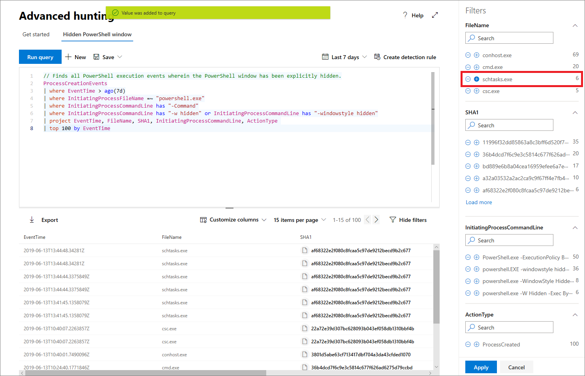

# <a name="work-with-advanced-hunting-query-results"></a>Работа с расширенными результатами запроса на охоту

[!INCLUDE [Microsoft 365 Defender rebranding](../../includes/microsoft-defender.md)]

**Область применения:**
- [Microsoft Defender для конечной точки](https://go.microsoft.com/fwlink/?linkid=2154037)

>Хотите испытать Defender для конечной точки? [Зарегистрився для бесплатной пробной.](https://www.microsoft.com/microsoft-365/windows/microsoft-defender-atp?ocid=docs-wdatp-advancedhunting-abovefoldlink)

В то время [](advanced-hunting-overview.md) как вы можете создавать расширенные запросы для получения очень точных сведений, вы также можете работать с результатами запроса, чтобы получить дополнительные сведения и изучить конкретные действия и индикаторы. В результатах запроса можно принять следующие действия:

- Просмотр результатов в таблице или диаграмме
- Экспорт таблиц и диаграмм
- Детализация подробных сведений об объектах
- Настройка запросов непосредственно из результатов или применение фильтров

## <a name="view-query-results-as-a-table-or-chart"></a>Просмотр результатов запроса в таблице или диаграмме
По умолчанию расширенный режим охоты отображает результаты запроса в качестве табулярных данных. Вы также можете отобразить те же данные, что и диаграмма. Расширенный поиск поддерживает следующие представления:

| Тип представления | Описание |
| -- | -- |
| **Table** | Отображает результаты запроса в табулярном формате |
| **Диаграмма столбца** | Отрисовка ряда уникальных элементов на оси x-axis в качестве вертикальных баров, высоты которых представляют числимые значения из другого поля |
| **Сложенная диаграмма столбцов** | Отрисовка ряда уникальных элементов на x-axis в качестве сложенных вертикальных баров, высоты которых представляют числовые значения из одного или более других полей. |
| **Диаграмма пирога** | Отрисовка раздельных пирогов, представляющих уникальные элементы. Размер каждого пирога представляет численное значение из другого поля. |
| **Пончиная диаграмма** | Отрисовка раздельных дуг, представляющих уникальные элементы. Длина каждой дуги представляет численное значение из другого поля. |
| **График** | Графики числимые значения для ряда уникальных элементов и соединяет замещенные значения |
| **Диаграмма scatter** | Графики числимые значения для ряда уникальных элементов |
| **Диаграмма области** | Графики числимых значений для ряда уникальных элементов и заполняют разделы ниже замещенных значений |

### <a name="construct-queries-for-effective-charts"></a>Создание запросов для эффективных диаграмм
При отрисовывии диаграмм передовая охота автоматически определяет столбцы, интересующие, и числимые значения для совокупного значения. Чтобы получить значимые диаграммы, состройте запросы для возврата определенных значений, которые необходимо увидеть визуализированными. Вот некоторые примеры запросов и итоговая диаграмма.

#### <a name="alerts-by-severity"></a>Оповещений по строгости
С помощью `summarize` оператора можно получить числовую цифру значений, которые необходимо наметить. В приведенной ниже области запрос использует оператора для получения количества предупреждений `summarize` по строгости.

```kusto
DeviceAlertEvents
| summarize Total = count() by Severity
```
При отрисовывии результатов диаграмма столбца отображает каждое значение серьезности в качестве отдельного столбца:


 *в качестве диаграммы столбца*

#### <a name="alert-severity-by-operating-system"></a>Серьезность оповещений с помощью операционной системы
Можно также использовать оператора для подготовки `summarize` результатов для наметки значений из нескольких полей. Например, вам может потребоваться понять, как распределяются степени серьезности оповещения по операционным системам (ОС). 

В приведенной ниже области запрос использует оператора для получения сведений об ОС из таблицы, а затем для подсчета значений как в столбцах, так `join` `DeviceInfo` и в `summarize` `OSPlatform` `Severity` столбцах:

```kusto
DeviceAlertEvents
| join DeviceInfo on DeviceId
| summarize Count = count() by OSPlatform, Severity
```
Эти результаты лучше всего визуализировать с помощью диаграммы сложенных столбцов:


 *сложенной диаграммы*

#### <a name="top-ten-device-groups-with-alerts"></a>Десять групп устройств с оповещениями
Если вы имеете дело со списком значений, который не является конечным, оператор может использовать для диаграммы только значения с `Top` большинством экземпляров. Например, чтобы получить десятку групп устройств с наибольшей частью оповещений, используйте запрос ниже:

```kusto
DeviceAlertEvents
| join DeviceInfo on DeviceId
| summarize Count = count() by MachineGroup
| top 10 by Count
```
Используйте представление диаграммы пирога, чтобы эффективно показывать распределение по верхним группам:


 *по группам устройств*

#### <a name="malware-detections-over-time"></a>Обнаружение вредоносных программ со временем
С помощью оператора с функцией можно проверить события, связанные с определенным `summarize` `bin()` индикатором с течением времени. В нижеупромянутом запросе учитывается обнаружение тестового файла EICAR с интервалом в 30 минут, чтобы показать всплески обнаружения этого файла:

```kusto
DeviceEvents
| where ActionType == "AntivirusDetection"
| where SHA1 == "3395856ce81f2b7382dee72602f798b642f14140"
| summarize Detections = count() by bin(Timestamp, 30m)
```
На приведенной ниже строке четко выделены периоды времени с дополнительными обнаружениями тестовой вредоносной программы: 


 *со временем*


## <a name="export-tables-and-charts"></a>Экспорт таблиц и диаграмм
После выполнения запроса выберите **Экспорт,** чтобы сохранить результаты в локальном файле. Выбранное представление определяет, как экспортируются результаты:

- **Представление таблицы** — результаты запроса экспортируются в табулярной форме в виде книги Microsoft Excel
- **Любая диаграмма** — результаты запроса экспортируются как изображение JPEG отрисовки диаграммы

## <a name="drill-down-from-query-results"></a>Сверлить из результатов запроса
Чтобы просмотреть дополнительные сведения об объектах, таких как устройства, файлы, пользователи, IP-адреса и URL-адреса, в результатах запроса просто щелкните идентификатор сущности. Это открывает страницу подробного профиля для выбранного объекта.

Чтобы быстро проверить запись в результатах запроса, выберите соответствующую строку, чтобы открыть панель записей Inspect. Панель предоставляет следующую информацию на основе выбранной записи:

- **Assets** — краткое представление основных активов (почтовых ящиков, устройств и пользователей), найденных в записи, обогащенных доступной информацией, например уровнями риска и экспозиции.
- **Дерево процесса** — диаграмма, созданная для записей с данными о процессе и обогащенная с помощью доступной контекстной информации; как правило, запросы, возвращая больше столбцов, могут привести к более богатым деревьям процесса.
- **Все сведения** — списки всех значений из столбцов в записи

## <a name="tweak-your-queries-from-the-results"></a>Регулирование запросов на основе результатов
Чтобы оперативно улучшить свой запрос, нужно щелкнуть правой кнопкой мыши одно из значений в полученном наборе результатов. Предлагаемые варианты можно использовать для

- открытого поиска избранного значения (`==`)
- исключения избранного значения из запроса (`!=`)
- Чтобы добавить к своему запросу определенное значение, можно использовать дополнительные операторы, например, `contains`, `starts with` и`ends with` 


## <a name="filter-the-query-results"></a>Фильтрация результатов запроса
Фильтры, отображаемые в правой области, предоставляют сводку набора результатов. Каждый столбец имеет свой раздел в области, в каждом из которых перечислены значения, найденные в этом столбце, и количество экземпляров.

Уточнение запроса путем выбора кнопок или значений, которые необходимо `+` `-` включить или исключить. Затем выберите **запрос Run**.



Использование фильтра с целью изменения запроса и отправка этого запроса позволяют получить новые соответствующие результаты.

## <a name="related-topics"></a>См. также
- [Обзор расширенной охоты на угрозы](advanced-hunting-overview.md)
- [Изучение языка запросов](advanced-hunting-query-language.md)
- [Использование общих запросов](advanced-hunting-shared-queries.md)
- [Сведения о схеме](advanced-hunting-schema-reference.md)
- [Рекомендации по применению запросов](advanced-hunting-best-practices.md)
- [Обзор настраиваемых обнаружений](overview-custom-detections.md)
