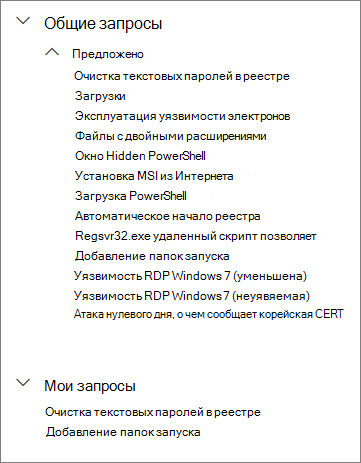
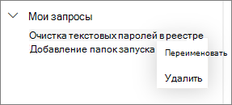

# Использование общих запросов в расширенной охоте

[!INCLUDE [Microsoft 365 Defender rebranding](../../includes/microsoft-defender.md)]

**Область применения:**
- [Microsoft Defender для конечной точки](https://go.microsoft.com/fwlink/p/?linkid=2154037)

>Хотите испытать Defender для конечной точки? [Зарегистрився для бесплатной пробной.](https://www.microsoft.com/microsoft-365/windows/microsoft-defender-atp?ocid=docs-wdatp-advancedhunting-abovefoldlink)

Запросами [расширенной охоты](advanced-hunting-overview.md) можно делиться с пользователями одной организации. Вы также можете найти общедоступные запросы в GitHub. Эти запросы позволяют быстро реализовывать сценарии охоты на угрозы, не создавая запросы с нуля.

## Сохранение и изменение запроса и предоставление к нему общего доступа
Вы можете сохранить новый или существующий запрос, чтобы он был доступен только вам, или поделиться им с пользователями своей организации.

1. Введите новый запрос или загрузим существующий из **разделов Общие запросы** или **Мои запросы.**

2. Выберите **сохранить** **или сохранить как** из параметров сохранения. Чтобы не переписать существующий запрос, выберите **Сохранить как**.

3. Введите имя запроса.

   

4. Выберите папку, в которую нужно сохранить запрос.
    - **Общие запросы** — общие для всех пользователей в вашей организации
    - **Мои запросы** — доступны только для вас
    
5. Нажмите кнопку **Сохранить**.

## Удаление или переименование запроса
1. Щелкните правой кнопкой мыши запрос, который нужно переименовать или удалить.

    

2. Нажмите кнопку **Удалить** и подтвердите удаление. Или нажмите кнопку **Переименовать** и введите новое имя запроса.

## Создание прямой ссылки на запрос
Чтобы создать ссылку, открываемую запрос непосредственно в редакторе предварительного запроса охоты, завершите запрос и выберите **ссылку Share.**

## Доступ к запросам в репозитории GitHub  
Исследователи безопасности Майкрософт часто делятся запросами расширенной охоты в [специальном общедоступном репозитории в GitHub](https://github.com/Microsoft/WindowsDefenderATP-Hunting-Queries). Этот репозиторий открыт для участия. Чтобы внести свой вклад, [бесплатно присоединяйтесь к GitHub](https://github.com/). 

>[!TIP]
>Исследователи безопасности Майкрософт также предоставляют запросы расширенной охоты, которые можно использовать для обнаружения действий и индикаторов, связанных с возникающими угрозами. Эти запросы предоставляются в рамках отчетов [аналитики угроз](threat-analytics.md) в Центре безопасности в Microsoft Defender.

## См. также
- [Обзор расширенной охоты](advanced-hunting-overview.md)
- [Изучение языка запросов](advanced-hunting-query-language.md)
- [Работа с результатами запросов](advanced-hunting-query-results.md)
- [Сведения о схеме](advanced-hunting-schema-reference.md)
- [Применение рекомендаций по использованию запросов](advanced-hunting-best-practices.md)
- [Обзор настраиваемых обнаружений](overview-custom-detections.md)
