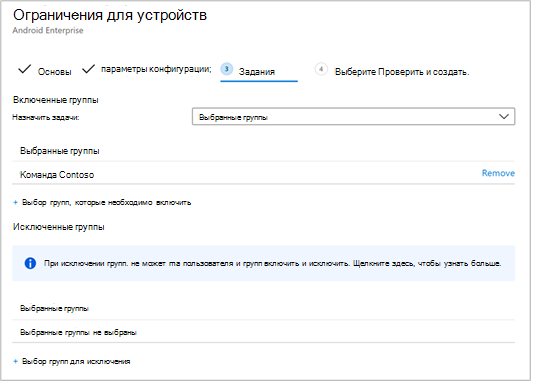

# Развертывание Microsoft Defender для конечной точки для Android с помощью Microsoft Intune 

[!INCLUDE [Microsoft 365 Defender rebranding](../../includes/microsoft-defender.md)]

**Область применения:**
- [Microsoft Defender для конечной точки](https://go.microsoft.com/fwlink/p/?linkid=2154037)
- [Microsoft 365 Defender](https://go.microsoft.com/fwlink/?linkid=2118804)

> Хотите испытать Microsoft Defender для конечной точки? [Зарегистрився для бесплатной пробной.](https://www.microsoft.com/microsoft-365/windows/microsoft-defender-atp?ocid=docs-wdatp-exposedapis-abovefoldlink) 

Узнайте, как развернуть устройства Для Конечной точки Defender для Android на зарегистрированных устройствах портала компаний Intune. Дополнительные сведения о регистрации устройств Intune см. в [записи устройства.](https://docs.microsoft.com/mem/intune/user-help/enroll-device-android-company-portal)

> [!NOTE]
> **Защитник для конечной точки для Android теперь доступен в [Google Play](https://play.google.com/store/apps/details?id=com.microsoft.scmx)**  
> Вы можете подключиться к Google Play из Intune, чтобы развернуть приложение Defender for Endpoint в режимах entrollment администратора устройств и Android Enterprise.
Обновления приложения автоматически обновляются с помощью Google Play.

## Развертывание на зарегистрированных устройствах администратора устройств

**Развертывание Defender для конечной точки для Android на портале компании Intune — устройства администратора устройств**

Узнайте, как развернуть устройства Defender для конечной точки для Android на портале компании Intune — устройства администратора устройств. 

### Добавление приложения в магазине Android

1. В [центре администрирования Microsoft Endpoint Manager](https://go.microsoft.com/fwlink/?linkid=2109431) перейдите в приложения **Android** \> **Apps** Add Android Store \> **\> app** и выберите **Выберите .**

   

2. На странице **Добавление приложения** и в разделе Сведения *о приложении* введите: 

   - **Name** 
   - **Описание**
   - **Издатель** в качестве Microsoft.
   - **URL-адрес магазина приложений** как (URL-адрес магазина https://play.google.com/store/apps/details?id=com.microsoft.scmx Приложений Для конечной точки в Google Play Store) 

   Другие поля необязательны. Нажмите кнопку **Далее**.

   

3. В разделе *Назначения* перейдите в **необходимый** раздел и выберите **группу Добавить.** Затем вы можете выбрать группу пользователей, которую вы хотите использовать для приложения Defender для конечной точки для Android. Выберите **Выберите и** затем **далее**.

    >[!NOTE]
    >Выбранная группа пользователей должна состоять из зарегистрированных пользователей Intune.

    > [!div class="mx-imgBorder"]

    > 

4. В разделе **Обзор+Создание** убедитесь, что вся введенная информация является правильной, а затем выберите **Создать**.

    Через несколько минут приложение Defender for Endpoint будет создано успешно, и уведомление будет показываться в правом верхнем углу страницы.

    

5. На странице информации о приложении, отображаемой  в разделе **Monitor,** выберите состояние установки устройства, чтобы убедиться, что установка устройства успешно завершена.

    > [!div class="mx-imgBorder"]
    > 

### Полное состояние onboarding и проверки

1. После установки защитника для конечной точки для Android на устройстве вы увидите значок приложения.

    

2. Нажмите значок приложения ATP Защитника Майкрософт и выполните инструкции на экране для завершения работы над приложением. Подробные сведения включают принятие конечным пользователем разрешений на Android, необходимых Defender для конечной точки для Android.

3. После успешного взбора устройство начнет появляться в списке Устройств в Центре безопасности Microsoft Defender.

    

## Развертывание на устройствах, зарегистрированных на Android Enterprise

Defender for Endpoint для Android поддерживает зарегистрированные устройства Android Enterprise.

Дополнительные сведения о вариантах регистрации, поддерживаемых Intune, см. в дополнительных [сведениях о параметрах регистрации.](https://docs.microsoft.com/mem/intune/enrollment/android-enroll)

**В настоящее время для развертывания поддерживаются лично управляемые устройства с профилем работы и полностью управляемыми пользовательскими устройствами.**

## Добавление Microsoft Defender для конечной точки для Android в качестве управляемого приложения Google Play

Выполните ниже шаги, чтобы добавить приложение Microsoft Defender для конечной точки в управляемое приложение Google Play.

1. В [центре администрирования Microsoft Endpoint Manager](https://go.microsoft.com/fwlink/?linkid=2109431) перейдите в приложения **Android** \> **Apps** \> **Add** и выберите **управляемое приложение Google Play.**

    > [!div class="mx-imgBorder"]
    > 

2. На управляемой странице Google Play, загружаемой впоследствии, перейдите в поле поиска и посмотрите **microsoft Defender.** В вашем поиске должно отображаться приложение Microsoft Defender для конечной точки в управляемом Google Play. Щелкните приложение Microsoft Defender для конечной точки из результата поиска Приложений.

    

3. На следующей странице описания приложения можно увидеть сведения о приложении в Защитнике для конечной точки. Просмотрите сведения на странице и выберите **Утверждение**.

    > [!div class="mx-imgBorder"]
    > 

4. Вам будут представлены разрешения, которые защитник для конечной точки получает для работы. Просмотрите их и выберите **Утверждение**.

    

5. Вам будет представлена страница Параметры утверждения. Страница подтверждает ваше предпочтение обработки разрешений на новые приложения, которые может спросить Defender for Endpoint для Android. Просмотрите выбор и выберите предпочтительный вариант. Нажмите кнопку **Готово**.

    По умолчанию управляемый Google Play выбирает *Keep approved, когда приложение запрашивает новые разрешения.*

    > [!div class="mx-imgBorder"]
    > 

6. После выбора обработки разрешений выберите **Синхронизация,** чтобы синхронизировать Microsoft Defender для конечной точки в списке приложений.

    > [!div class="mx-imgBorder"]
    > 

7. Синхронизация завершится через несколько минут.

    

8. Выберите **кнопку Обновить** на экране приложений Android, а в списке приложений должна быть видна atP Microsoft Defender.

    > [!div class="mx-imgBorder"]
    > 

9. Defender for Endpoint поддерживает политики конфигурации приложений для управляемых устройств с помощью Intune. Эту возможность можно использовать для автоматического использования применимых разрешений на Android(ы), поэтому конечный пользователь не должен принимать эти разрешения(ы).

    1. На странице **Apps** перейдите к политикам > политики конфигурации приложений > **добавить > управляемые устройства.**

       

    1. На странице **Создание политики конфигурации приложений** введите следующие сведения:
    
        - Имя: ATP Защитника Майкрософт.
        - Выберите **Android Enterprise в** качестве платформы.
        - Выберите **профиль работы только** в виде типа профиля.
        - Щелкните **Выберите приложение,** выберите **ATP Защитника Microsoft,** выберите **ОК** и **далее**.
    
        > [!div class="mx-imgBorder"]
        > 

    1. На странице **Параметры** перейдите в раздел Разрешения нажмите кнопку Добавить, чтобы просмотреть список поддерживаемых разрешений. В разделе Добавить разрешения выберите следующие разрешения:

       - Внешнее хранилище (чтение)
       - Внешнее хранилище (записи)

       После этого нажмите кнопку **ОК**.

       > [!div class="mx-imgBorder"]
      > 

    1. Теперь вы должны видеть как перечисленные разрешения, так и теперь вы можете  автоматически отобрать автозаявку в выпадаемом состоянии разрешения, а затем выбрать **Далее**.

       > [!div class="mx-imgBorder"]
       > 

    1. На странице **Назначения** выберите группу пользователей, которой будет назначена эта политика конфигурировать приложения. Щелкните **Выберите группы, чтобы включить** и выбрать применимую группу, а затем выбрать **Далее.**  Выбранная здесь группа обычно является той же группой, к которой можно назначить Microsoft Defender для android-приложения Endpoint. 

       > [!div class="mx-imgBorder"]
       > 
    

     1. На странице **Обзор + Создание** следующей страницы просмотрите всю информацию и выберите **Создать**.  
    
        Политика конфигурации приложения для автозадания разрешения на хранение Defender для конечной точки теперь назначена выбранной группе пользователей.

        > [!div class="mx-imgBorder"]
        > 

10. Выберите **приложение ATP Защитника Майкрософт** в списке Назначения \>  \> **свойств** \> **Изменить**.

    

11. Назначьте приложение в качестве *обязательного* приложения группе пользователей. Он автоматически устанавливается в профиле *работы* во время следующей синхронизации устройства с помощью приложения портала компании. Это назначение можно сделать, перейдите в группу "Требуется добавить", выбрав группу пользователей и нажмите  \>  **кнопку Выберите**.

    > [!div class="mx-imgBorder"]
    > 

12. На странице **Редактирование приложения** просмотрите все сведения, которые были введены выше. Затем выберите **Обзор + Сохранить,** а затем **сохранить** снова, чтобы приступить к назначению.

### Автоматическая настройка VPN с помощью always-on 
Defender for Endpoint поддерживает политики конфигурации устройств для управляемых устройств с помощью Intune. Эту возможность можно использовать для автоматической установки VPN на зарегистрированных устройствах Android Enterprise, поэтому конечному пользователю не нужно настроить **VPN-службу** во время работы на борту.
1.  На **устройствах** выберите **профили** конфигурации Создание ограничений для корпоративного устройства платформы Android в соответствии с одним из следующих ограничений, основанных на типе  >    >    >   регистрации устройства.  
- **Полностью управляемый, выделенный и Corporate-Owned профиль**
- **Личный профиль работы**

Нажмите **Создать**.
 
   > 
    
2. **Параметры конфигурации** Предоставление **имени** и **описания для** уникальной идентификации профиля конфигурации. 

   > 
   
 3. Выберите **подключение и** настройте VPN:
- Включай установку **VPN-клиента always-on** в профиле работы для автоматического подключения и подключения к VPN по мере возможности. Только один VPN-клиент может быть настроен для всегда на VPN на заданных устройствах, поэтому не забудьте иметь не более одной политики VPN, развернутой на одном устройстве. 
- Выберите **Настраиваемый** в списке выпаданий vpn-клиентов Настраиваемый VPN, в данном случае это VPN Defender for Endpoint, который используется для предоставления функции веб-защиты. 
    > [!NOTE]
    > Приложение ATP Защитника Майкрософт должно быть установлено на устройстве пользователя для функционирования автоматической установки этого VPN.

- Введите **ID пакета** приложения ATP Microsoft Defender в магазине Google Play. Для URL-адреса приложения Defender ID пакета https://play.google.com/store/apps/details?id=com.microsoft.scmx **— com.microsoft.scmx**  
- **Режим блокировки** Не настроен (по умолчанию) 

     
   
4. **Назначение** На странице  **Назначения** выберите группу пользователей, которой будет назначена эта политика конфигурировать   приложения. Щелкните **Выберите группы,** чтобы включить и выбрать применимую группу, а затем нажмите **кнопку Далее**. Выбранная здесь группа обычно является той же группой, к которой можно назначить Microsoft Defender для android-приложения Endpoint. 

     

5. На странице **Обзор + Создание** следующей страницы просмотрите всю информацию и выберите **Создать**. Теперь профиль конфигурации устройства назначен выбранной группе пользователей.    

    

## Полное состояние onboarding и проверки

1. Подтвердить состояние установки Microsoft Defender для конечной точки для Android, нажав на состояние **установки устройства.** Убедитесь, что устройство отображается здесь.

    > [!div class="mx-imgBorder"]
    > 

2. На устройстве можно проверить состояние бортового устройства, переехав в рабочий **профиль.** Подтверди, что Defender для конечной точки доступен и вы зарегистрированы на устройствах, которые принадлежат лично, **с профилем работы.**  Если вы зарегистрированы на корпоративном устройстве **с** полностью управляемым пользователем, у вас будет один профиль на устройстве, где вы можете подтвердить, что Defender для конечной точки доступен.

    

3. Когда приложение установлено, откройте приложение и примите разрешения, после чего ваша вечная система должна быть успешной.

    

4. На данном этапе устройство успешно вошел в Defender для конечной точки для Android. Это можно проверить в [Центре безопасности Защитника Майкрософт,](https://securitycenter.microsoft.com) перенаходив на страницу **Устройства.**

    

## Статьи по теме
- [Обзор Microsoft Defender для конечной точки для Android](microsoft-defender-endpoint-android.md)
- [Настройка функций Microsoft Defender для конечной точки для Android](android-configure.md)
