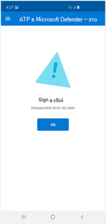
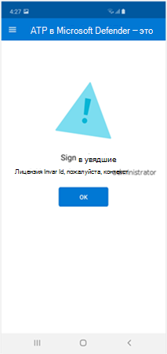
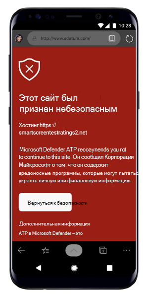
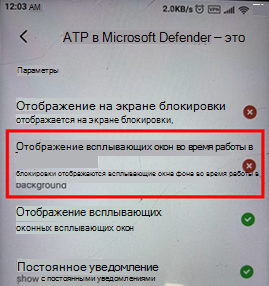

# Устранение неполадок в Microsoft Defender для конечной точки на AndroidTroubleshooting issues on Microsoft Defender for Endpoint on Android

[!INCLUDE [Microsoft 365 Defender rebranding](../../includes/microsoft-defender.md)]

**Область применения:****Applies to:**
- [Microsoft Defender для конечной точкиMicrosoft Defender for Endpoint](https://go.microsoft.com/fwlink/p/?linkid=2154037)
- [Microsoft 365 DefenderMicrosoft 365 Defender](https://go.microsoft.com/fwlink/?linkid=2118804)

> Хотите испытать Microsoft Defender для конечной точки?Want to experience Microsoft Defender for Endpoint? [Зарегистрився для бесплатной пробной.Sign up for a free trial.](https://www.microsoft.com/microsoft-365/windows/microsoft-defender-atp?ocid=docs-wdatp-exposedapis-abovefoldlink) 

При входе на устройство после установки приложения могут возникнуть проблемы с входом.When onboarding a device, you might see sign in issues after the app is installed.

Во время входной платы после установки приложения на вашем устройстве могут возникнуть проблемы с входом.During onboarding, you might encounter sign in issues after the app is installed on your device.

В этой статье данная статья предоставляет решения, которые помогут решить проблемы с входом.This article provides solutions to help address the sign-on issues.  

## Вход не удалось - неожиданная ошибкаSign in failed - unexpected error
**Вход не удалось:** *непредвиденное ошибка, попробуйте позже***Sign in failed:** *Unexpected error, try later*

**Сообщение:****Message:**

Неожиданная ошибка, попробуйте позжеUnexpected error, try later

**Причина:****Cause:**

На вашем устройстве установлена более старая версия приложения Microsoft Authenticator "Microsoft Authenticator".You have an older version of "Microsoft Authenticator" app installed on your device.

**Решение:****Solution:**

Установите последнюю версию и [Microsoft Authenticator](https://play.google.com/store/apps/details?androidid=com.azure.authenticator) в Магазине Google Play и попробуйте еще разInstall latest version and of [Microsoft Authenticator](https://play.google.com/store/apps/details?androidid=com.azure.authenticator) from Google Play Store and try again

## Вход в сбой - недействительные лицензииSign in failed - invalid license

**Вход сбой:** *недействительные лицензии, обратитесь к администратору***Sign in failed:** *Invalid license, please contact administrator*

**Сообщение.** *Недействительные лицензии, обратитесь к администратору***Message:** *Invalid license, please contact administrator*

**Причина:****Cause:**

У вас нет Microsoft 365 лицензии или у организации нет лицензии на Microsoft 365 корпоративный подписки.You do not have Microsoft 365 license assigned, or your organization does not have a license for Microsoft 365 Enterprise subscription.

**Решение:****Solution:**

Обратитесь к системному администратору.Contact your administrator for help.

## Сообщить о небезопасном сайтеReport unsafe site

Фишинговые веб-сайты выдают себя за надежные веб-сайты с целью получения личной или финансовой информации.Phishing websites impersonate trustworthy websites for the purpose of obtaining your personal or financial information. Если вы хотите сообщить о веб-сайте, который может быть фишинг-сайтом, посетите страницу Provide feedback about [network](https://www.microsoft.com/wdsi/filesubmission/exploitguard/networkprotection) protection page.Visit the [Provide feedback about network protection](https://www.microsoft.com/wdsi/filesubmission/exploitguard/networkprotection) page if you want to report a website that could be a phishing site.

## Фишинговые страницы не заблокированы на некоторых устройствах OEMPhishing pages aren't blocked on some OEM devices

**Применяется к:** Только конкретные OEMs**Applies to:** Specific OEMs only

-   **Xiaomi****Xiaomi**

Фишинговые и вредоносные веб-угрозы, обнаруженные Defender для конечной точки для Android, не блокируются на некоторых устройствах Xiaomi.Phishing and harmful web threats that are detected by Defender for Endpoint for Android are not blocked on some Xiaomi devices. Следующие функции не работают на этих устройствах.The following functionality doesn't work on these devices.

**Причина:****Cause:**

Устройства Xiaomi включают новую модель разрешений.Xiaomi devices include a new permission model. Это не позволяет Защитнику для конечной точки для Android отобразить всплывающее окно во время его работы в фоновом режиме.This prevents Defender for Endpoint for Android from displaying pop-up windows while it runs in the background.

Разрешение устройств Xiaomi: "Отображение всплывающих окон во время работы в фоновом режиме".Xiaomi devices permission: "Display pop-up windows while running in the background."

**Решение:****Solution:**

Включить необходимое разрешение на устройствах Xiaomi.Enable the required permission on Xiaomi devices.

- Отображение всплывающих окон во время работы в фоновом режиме.Display pop-up windows while running in the background.
