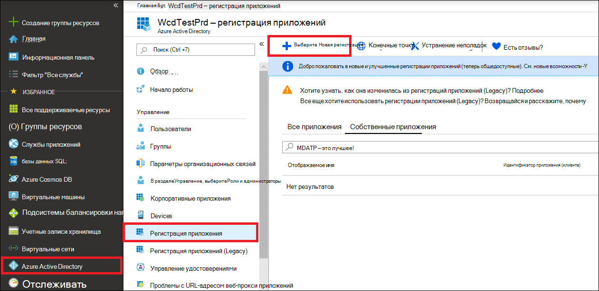
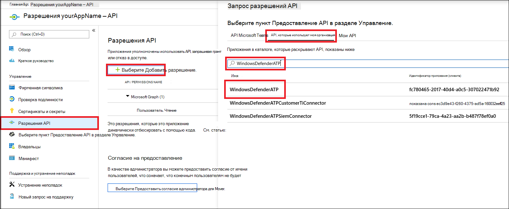
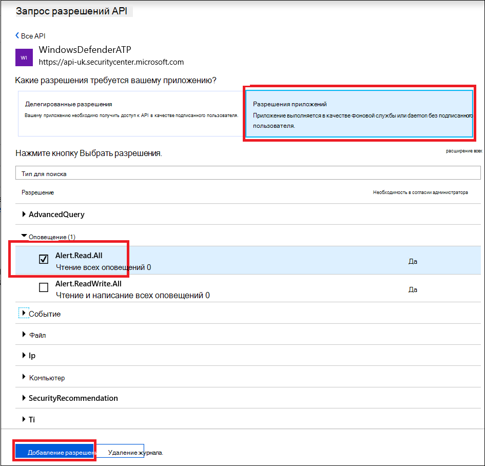
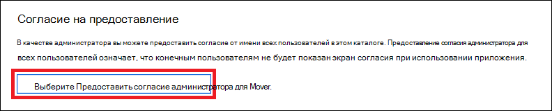
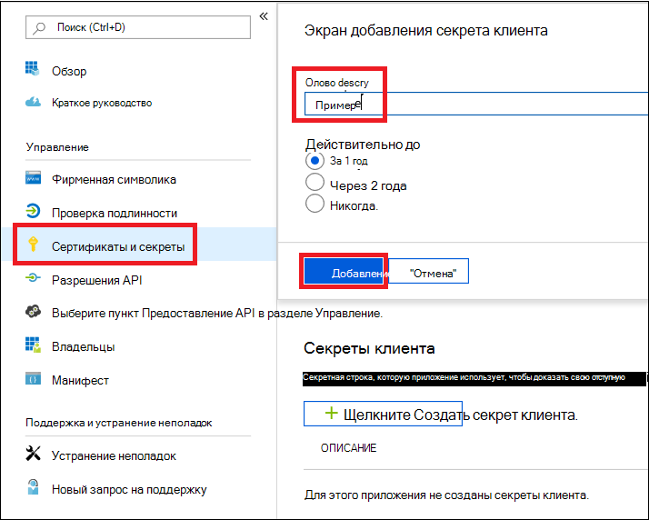

# <a name="microsoft-defender-for-endpoint-api---hello-world"></a>Microsoft Defender для API конечной точки — Hello World 

[!INCLUDE [Microsoft 365 Defender rebranding](../../includes/microsoft-defender.md)]


**Область применения:** 
- [Microsoft Defender для конечной точки](https://go.microsoft.com/fwlink/?linkid=2154037)


- Хотите испытать Microsoft Defender для конечной точки? [Зарегистрився для бесплатной пробной.](https://www.microsoft.com/microsoft-365/windows/microsoft-defender-atp?ocid=docs-wdatp-exposedapis-abovefoldlink) 

[!include[Microsoft Defender for Endpoint API URIs for US Government](../../includes/microsoft-defender-api-usgov.md)]

[!include[Improve request performance](../../includes/improve-request-performance.md)]


## <a name="get-alerts-using-a-simple-powershell-script"></a>Получения оповещений с помощью простого сценария PowerShell

### <a name="how-long-it-takes-to-go-through-this-example"></a>Сколько времени требуется для этого примера?
Это занимает всего 5 минут в два шага:
- Регистрация приложения
- Примеры использования: требуется только копирование и вклейка короткого сценария PowerShell

### <a name="do-i-need-a-permission-to-connect"></a>Требуется ли разрешение для подключения?
На этапе регистрации приложений  в клиенте Azure Active Directory (Azure AD) должна быть роль глобального администратора.

### <a name="step-1---create-an-app-in-azure-active-directory"></a>Шаг 1 . Создание приложения в Azure Active Directory

1. Войдите в [Azure с](https://portal.azure.com) **пользователем Глобального администратора.**

2. Перейдите к **регистрации приложений Azure Active**  >  **Directory**  >  **.** 

   

3. В форме регистрации выберите имя приложения и нажмите кнопку **Регистрация**.

4. Разрешить приложению доступ к Defender для конечной точки и назначить ему **разрешение "Чтение всех оповещений":**

   - На странице приложения щелкните **API Permissions**  >  **Add Permissions Add permission** API my organization  >  **uses** > **WindowsDefenderATP** и нажмите **кнопку WindowsDefenderATP**.

   - **Примечание.** WindowsDefenderATP не появляется в исходном списке. Чтобы увидеть его, необходимо приступить к написанию его имени в текстовом окне.

   

   - Выберите **разрешения приложения**  >  **Alert.Read.All** > нажмите **кнопку Добавить разрешения**

   

   **Важное** примечание. Необходимо выбрать соответствующие разрешения. "Чтение всех оповещений" — это только пример!

     Например,

     - Чтобы [запускать расширенные запросы,](run-advanced-query-api.md)выберите разрешение "Запуск расширенных запросов"
     - Чтобы [изолировать машину,](isolate-machine.md)выберите разрешение "Изолировать машину"
     - Чтобы определить, какое разрешение вам нужно, обратите внимание на раздел **Разрешения** в API, который вы хотите вызвать.

5. Щелкните **согласие гранта**

    - **Примечание.** Каждый раз, когда вы добавляете разрешение, необходимо нажать **на** согласие гранта, чтобы новое разрешение вступает в силу.

    

6. Добавьте секрет в приложение.

    - Щелкните **сертификаты &,** добавьте описание в секрет и нажмите **кнопку Добавить**.

    **Важно.** После щелчка Добавить **скопируйте сгенерированную секретную ценность.** Вы не сможете получить после того, как уйдете!

    

7. Запишите свой ИД приложения и его клиента:

   - На странице приложения перейдите в **Обзор и** скопируйте следующее:

   


Договорились! Вы успешно зарегистрировали приложение!

### <a name="step-2---get-a-token-using-the-app-and-use-this-token-to-access-the-api"></a>Шаг 2 . Получить маркер с помощью Приложения и использовать этот маркер для доступа к API.

-   Скопируйте сценарий ниже в IsE PowerShell или в текстовый редактор и сохраните его как **"Get-Token.ps1"**
-   Запуск этого скрипта создает маркер и сохраняет его в рабочей папке под именем **"Latest-token.txt".**

```
# That code gets the App Context Token and save it to a file named "Latest-token.txt" under the current directory
# Paste below your Tenant ID, App ID and App Secret (App key).

$tenantId = '' ### Paste your tenant ID here
$appId = '' ### Paste your Application ID here
$appSecret = '' ### Paste your Application secret here

$resourceAppIdUri = 'https://api.securitycenter.microsoft.com'
$oAuthUri = "https://login.microsoftonline.com/$TenantId/oauth2/token"
$authBody = [Ordered] @{
    resource = "$resourceAppIdUri"
    client_id = "$appId"
    client_secret = "$appSecret"
    grant_type = 'client_credentials'
}
$authResponse = Invoke-RestMethod -Method Post -Uri $oAuthUri -Body $authBody -ErrorAction Stop
$token = $authResponse.access_token
Out-File -FilePath "./Latest-token.txt" -InputObject $token
return $token
```

-   Проверка санитарии:<br>
Запустите сценарий.<br>
В браузере перейдите к: https://jwt.ms/ <br>
Скопируйте маркер (содержимое Latest-token.txt файла).<br>
Вклейка в верхнем окне.<br>
И посмотрите раздел "Роли". Найдите роль Alert.Read.All.


### <a name="lets-get-the-alerts"></a>Позволяет получать оповещений!

-   Сценарий ниже будет **использоватьGet-Token.ps1** для доступа к API и будет получать последние 48 часов оповещений.
-   Сохраните этот скрипт в той же папке, что и **предыдущий сценарийGet-Token.ps1.** 
-   Скрипт создает два файла (json и csv) с данными в той же папке, что и сценарии.

```
# Returns Alerts created in the past 48 hours.

$token = ./Get-Token.ps1       #run the script Get-Token.ps1  - make sure you are running this script from the same folder of Get-Token.ps1

# Get Alert from the last 48 hours. Make sure you have alerts in that time frame.
$dateTime = (Get-Date).ToUniversalTime().AddHours(-48).ToString("o")       

# The URL contains the type of query and the time filter we create above
# Read more about other query options and filters at   Https://TBD- add the documentation link
$url = "https://api.securitycenter.microsoft.com/api/alerts?`$filter=alertCreationTime ge $dateTime"

# Set the WebRequest headers
$headers = @{ 
    'Content-Type' = 'application/json'
    Accept = 'application/json'
    Authorization = "Bearer $token" 
}

# Send the webrequest and get the results. 
$response = Invoke-WebRequest -Method Get -Uri $url -Headers $headers -ErrorAction Stop

# Extract the alerts from the results. 
$alerts =  ($response | ConvertFrom-Json).value | ConvertTo-Json

# Get string with the execution time. We concatenate that string to the output file to avoid overwrite the file
$dateTimeForFileName = Get-Date -Format o | foreach {$_ -replace ":", "."}    

# Save the result as json and as csv
$outputJsonPath = "./Latest Alerts $dateTimeForFileName.json"     
$outputCsvPath = "./Latest Alerts $dateTimeForFileName.csv"

Out-File -FilePath $outputJsonPath -InputObject $alerts
($alerts | ConvertFrom-Json) | Export-CSV $outputCsvPath -NoTypeInformation 
```

Все готово! Вы только что успешно:
-   Создано, зарегистрировано и приложение
-   Предоставлено разрешение для этого приложения на чтение оповещений
-   Подключение API
-   Сценарий PowerShell используется для возврата оповещений, созданных за последние 48 часов


## <a name="related-topic"></a>Связанная тема
- [Microsoft Defender для API конечных точек](exposed-apis-list.md)
- [Доступ к Microsoft Defender для конечной точки с контекстом приложений](exposed-apis-create-app-webapp.md)
- [Доступ к Microsoft Defender для конечной точки с пользовательским контекстом](exposed-apis-create-app-nativeapp.md)
