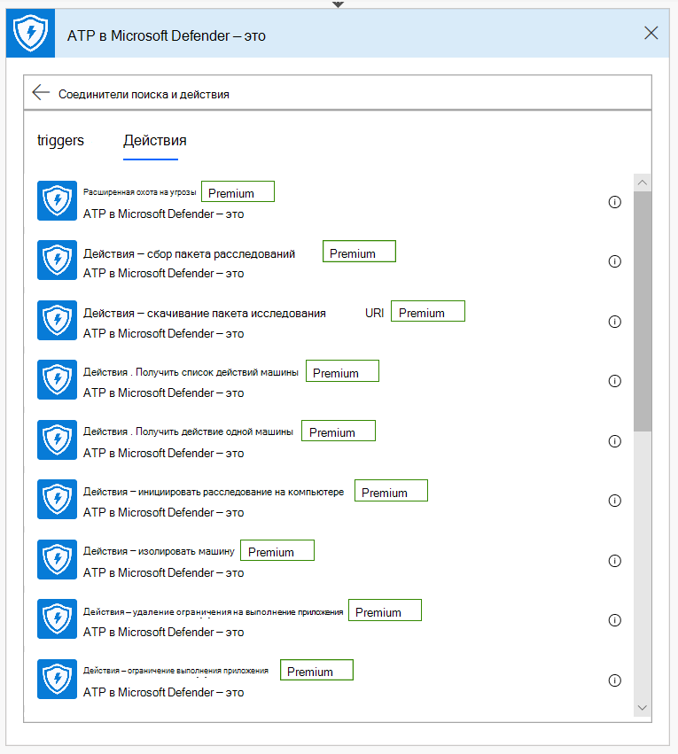

# Microsoft Power Automate (ранее Microsoft Flow) и Azure Functions

[!INCLUDE [Microsoft 365 Defender rebranding](../../includes/microsoft-defender.md)]

**Область применения:**
- [Microsoft Defender для конечной точки](https://go.microsoft.com/fwlink/p/?linkid=2154037)
- [Microsoft 365 Defender](https://go.microsoft.com/fwlink/?linkid=2118804)

- Хотите испытать Microsoft Defender для конечной точки? [Зарегистрився для бесплатной пробной.](https://www.microsoft.com/microsoft-365/windows/microsoft-defender-atp?ocid=docs-wdatp-exposedapis-abovefoldlink) 

Автоматизация процедур безопасности является стандартным требованием для каждого современного центра операций безопасности. Отсутствие профессиональных киберзащит заставляет SOC работать наиболее эффективно, а автоматизация является обязательным. Microsoft Power Automate поддерживает различные соединители, которые были построены именно для этого. Вы можете создать автоматизацию процедуры в течение нескольких минут.

API Защитника Майкрософт имеет официальный Flow со многими возможностями.

> [!NOTE]
> Дополнительные сведения о предварительных условия лицензирования соединителов премиум-класса см. в материале [Licensing for premium connectors.](https://docs.microsoft.com/power-automate/triggers-introduction#licensing-for-premium-connectors)

## Пример использования

В следующем примере показано, как создать Flow, который запускается в любое время, когда на клиенте возникает новое оповещение.

1. Войдите в [Microsoft Power Automate.](https://flow.microsoft.com)

2. Перейдите к **потоку**  >  **My New**  >  **Automated-from blank**.

    

3. Выберите имя для Flow, найди в качестве триггера ATP в Защитнике Microsoft триггер, а затем выберите новый триггер оповещения.

    

Теперь у вас есть Flow, который запускается каждый раз при новом оповещении.

Все, что вам нужно сделать, это выбрать следующие действия.
Например, вы можете изолировать устройство, если уровень серьезности оповещений является высоким, и отправить сообщение об этом.
Спусковой крючок Alert предоставляет только оповещение и машинный ID. Этот соединитатель можно использовать для расширения этих сущностями.

### Получить объект Alert с помощью соединиттеля

1. Выберите **ATP в Защитнике Microsoft** для нового шага.

2. Выбор **оповещений . Получить API единого оповещения**.

3. Установите **ID оповещения на** последнем шаге в качестве **ввода.**

    

### Изолировать устройство, если степень серьезности оповещений высока

1. Добавьте **Условие** в качестве нового шага.

2. Проверьте, равна ли серьезность оповещения **высокой.**

   Если да, добавьте **ATP в Защитнике Microsoft — изолировать** действие машины с машинным ИД и комментарием.

    

3. Добавьте новый шаг для отправки сообщений по электронной почте об оповещении и изоляции. Существует несколько соединителов электронной почты, которые очень просты в использовании, например Outlook или Gmail.

4. Сохраните поток.

Вы также можете создать **запланированный** поток, который запускает расширенные запросы на охоту и многое другое!

## Связанная тема
- [Microsoft Defender для API конечных точек](apis-intro.md)
