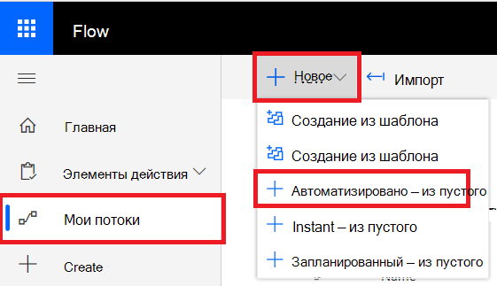

# Microsoft Power Automate (ранее Microsoft Flow) и Azure FunctionsMicrosoft Power Automate (formerly Microsoft Flow), and Azure Functions

[!INCLUDE [Microsoft 365 Defender rebranding](../../includes/microsoft-defender.md)]

**Область применения:****Applies to:**
- [Microsoft Defender для конечной точкиMicrosoft Defender for Endpoint](https://go.microsoft.com/fwlink/p/?linkid=2154037)
- [Microsoft 365 DefenderMicrosoft 365 Defender](https://go.microsoft.com/fwlink/?linkid=2118804)

- Хотите испытать Microsoft Defender для конечной точки?Want to experience Microsoft Defender for Endpoint? [Зарегистрився для бесплатной пробной.Sign up for a free trial.](https://www.microsoft.com/microsoft-365/windows/microsoft-defender-atp?ocid=docs-wdatp-exposedapis-abovefoldlink) 

Автоматизация процедур безопасности является стандартным требованием для каждого современного центра операций безопасности.Automating security procedures is a standard requirement for every modern Security Operations Center. Отсутствие профессиональных киберзащит заставляет SOC работать наиболее эффективно, а автоматизация является обязательным.The lack of professional cyber defenders forces SOC to work in the most efficient way and automation is a must. Microsoft Power Automate поддерживает различные соединители, которые были построены именно для этого.Microsoft Power Automate supports different connectors that were built exactly for that. Вы можете создать автоматизацию процедуры в течение нескольких минут.You can build an end-to-end procedure automation within a few minutes.

API Защитника Майкрософт имеет официальный соединителет потока с большим количеством возможностей.Microsoft Defender API has an official Flow Connector with many capabilities.

> [!NOTE]
> Дополнительные сведения о предварительных условия лицензирования соединителов премиум-класса см. в материале [Licensing for premium connectors.](https://docs.microsoft.com/power-automate/triggers-introduction#licensing-for-premium-connectors)For more details about premium connectors licensing prerequisites, see [Licensing for premium connectors](https://docs.microsoft.com/power-automate/triggers-introduction#licensing-for-premium-connectors).

## Пример использованияUsage example

В следующем примере показано, как создать поток, который запускается в любое время, когда на клиенте возникает новое оповещение.The following example demonstrates how to create a Flow that is triggered any time a new Alert occurs on your tenant.

1. Войдите в [Microsoft Power Automate](https://flow.microsoft.com).Log in to [Microsoft Power Automate](https://flow.microsoft.com).

2. Перейдите к **потоку**  >  **My New**  >  **Automated-from blank**.Go to **My flows** > **New** > **Automated-from blank**.

    

3. Выберите имя потока, в качестве триггера выберите триггер "Триггеры ATP Защитника Майкрософт", а затем выберите новый триггер оповещения.Choose a name for your Flow, search for "Microsoft Defender ATP Triggers" as the trigger, and then select the new Alerts trigger.

    

Теперь у вас есть поток, который запускается каждый раз, когда происходит новое оповещение.Now you have a Flow that is triggered every time a new Alert occurs.

Все, что вам нужно сделать, это выбрать следующие действия.All you need to do now is choose your next steps.
Например, вы можете изолировать устройство, если уровень серьезности оповещений является высоким, и отправить сообщение об этом.For example, you can isolate the device if the Severity of the Alert is High and send an email about it.
Спусковой крючок Alert предоставляет только оповещение и машинный ID.The Alert trigger provides only the Alert ID and the Machine ID. Этот соединитатель можно использовать для расширения этих сущностями.You can use the connector to expand these entities.

### Получить объект Alert с помощью соединиттеляGet the Alert entity using the connector

1. Выберите **ATP Защитника Майкрософт** для нового шага.Choose **Microsoft Defender ATP** for the new step.

2. Выбор **оповещений . Получить API единого оповещения**.Choose **Alerts - Get single alert API**.

3. Установите **ID оповещения на** последнем шаге в качестве **ввода.**Set the **Alert ID** from the last step as **Input**.

    

### Изолировать устройство, если степень серьезности оповещений высокаIsolate the device if the Alert's severity is High

1. Добавьте **Условие** в качестве нового шага.Add **Condition** as a new step.

2. Проверьте, равна ли серьезность оповещения **высокой.**Check if the Alert severity **is equal to** High.

   Если да, добавьте **atP Защитника Microsoft — изолировать** действие машины с машинным ИД и комментарием.If yes, add the **Microsoft Defender ATP - Isolate machine** action with the Machine ID and a comment.

    

3. Добавьте новый шаг для отправки сообщений по электронной почте об оповещении и изоляции.Add a new step for emailing about the Alert and the Isolation. Существует несколько соединителов электронной почты, которые очень просты в использовании, например Outlook или Gmail.There are multiple email connectors that are very easy to use, such as Outlook or Gmail.

4. Сохраните поток.Save your flow.

Вы также можете создать **запланированный** поток, который запускает расширенные запросы на охоту и многое другое!You can also create a **scheduled** flow that runs Advanced Hunting queries and much more!

## Связанная темаRelated topic
- [Microsoft Defender для API конечных точекMicrosoft Defender for Endpoint APIs](apis-intro.md)
