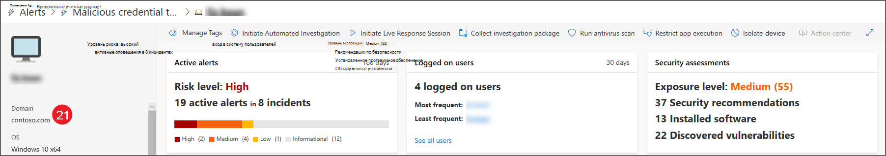

# Поля API для обнаружения конечных точек Microsoft Defender

[!INCLUDE [Microsoft 365 Defender rebranding](../../includes/microsoft-defender.md)]

**Область применения:**
- [Microsoft Defender для конечной точки](https://go.microsoft.com/fwlink/p/?linkid=2154037)
- [Microsoft 365 Defender](https://go.microsoft.com/fwlink/?linkid=2118804)

>Хотите испытать Defender для конечной точки? [Зарегистрився для бесплатной пробной.](https://www.microsoft.com/microsoft-365/windows/microsoft-defender-atp?ocid=docs-wdatp-apiportalmapping-abovefoldlink)

Сведения о полях данных, открытых в рамках API обнаружения, и о том, как они соотносят с Центром безопасности Microsoft Defender.

>[!Note]
>- [Defender for Endpoint Alert](alerts.md) состоит из одного или нескольких обнаружений.
>- **Обнаружение ATP Защитника Майкрософт** состоит из подозрительного события, произошедшего на устройстве, и связанных с ним сведений **оповещения.**
>- API оповещений Microsoft Defender для конечных точек — это последний API для потребления оповещений и содержит подробный список связанных данных для каждого оповещения. Дополнительные сведения см. в [дополнительных сведениях о](alerts.md) методах и свойствах alert и [list alerts.](get-alerts.md)

## Обнаружение полей API и сопоставления портала
В следующей таблице перечислены доступные поля, выставленные в полезной нагрузке API обнаружения. В нем показаны примеры населенных значений и ссылка на то, как данные отражаются на портале.

Столбец поля ArcSight содержит сопоставление по умолчанию между полями Defender для конечных точек и встроенными полями в ArcSight. Вы можете скачать файл сопоставления с портала, когда вы включаете функцию интеграции SIEM, и вы можете изменить его в соответствие с потребностями вашей организации. Дополнительные сведения см. в [дополнительных сведениях: Включение интеграции SIEM в Defender для конечной точки.](enable-siem-integration.md)

Номера полей совпадают с цифрами на изображениях ниже.

> [!div class="mx-tableFixed"]
> 
> | Метка портала   | Имя поля SIEM           | Поле ArcSight      | Пример значения                                                                      | Описание                                                                                                                                                                    |
> |------------------|---------------------------|---------------------|------------------------------------------------------------------------------------|--------------------------------------------------------------------------------------------------------------------------------------------------------------------------------|
> | 1                | AlertTitle                | name                | Microsoft Defender AV обнаружил вредоносные программы с высокой степенью серьезности "Mikatz" | Значение, доступное для каждого обнаружения.                                                                                                                                               |
> | 2                | Severity                  | deviceSeverity      | Высокая                                                                             | Значение, доступное для каждого обнаружения.                                                                                                                                               |
> | 3                | Category                  | deviceEventCategory | Вредоносные программы                                                               | Значение, доступное для каждого обнаружения.                                                                                                                                               |
> | 4                 | Источник обнаружения                    | sourceServiceName   | Защита от вирусов                                                                 | Антивирус Microsoft Defender или Defender для конечной точки. Значение, доступное для каждого обнаружения.                                                                                         |
> | 5                 | MachineName               | sourceHostName      | desktop-4a5ngd6                                                                           | Значение, доступное для каждого обнаружения.                                                                                                                                               |
> | 6                 | FileName                  | fileName            | Robocopy.exe                                                                       | Доступно для обнаружения, связанного с файлом или процессом.                                                                                                                      |
> | 7                 | FilePath                  | filePath            | C:\Windows\System32\Robocopy.exe                                                   | Доступно для обнаружения, связанного с файлом или процессом.                                                                                                                     |
> | 8                 | UserDomain                | sourceNtDomain      | CONTOSO                                                                            | Домен пользовательского контекста, в котором работает действие, доступен для обнаружения поведенческих данных Defender для конечной точки.                                                           |
> | 9                 | UserName                  | sourceUserName      | liz.bean                                                                           | Пользовательский контекст действия, доступный для обнаружения поведенческих данных Defender для конечной точки.                                                                           |
> | 10                | Sha1                      | fileHash            | 3da065e07b990034e9db7842167f70b63aa5329                                           | Доступно для обнаружения, связанного с файлом или процессом.                                                                                                                      |
> | 11               | Sha256                    | deviceCustomString6 | ebf54f745dc81e1958f75e4ca91dd0ab989fc9787bb6b0bf993e2f5                   | Доступно для обнаружения av Microsoft Defender.                                                                                                                                    |
> | 12                | Md5                       | deviceCustomString5 | db979c04a99b96d370988325bb5a8b21                                                   | Доступно для обнаружения av Microsoft Defender.                                                                                                                                    |
> | 13               | ThreatName                | deviceCustomString1  | HackTool:Win32/Mikatz!dha                                                         | Доступно для обнаружения av Microsoft Defender.                                                                                                                                    |
> | 14                | IpAddress                 | sourceAddress       | 218.90.204.141                                                                     | Доступно для обнаружения, связанного с сетевыми событиями. Например, "Связь с вредоносным сетевым назначением".                                                        |
> | 15                | Url                       | requestUrl          | down.esales360.cn                                                                  | Доступно для обнаружения, связанного с сетевыми событиями. Например, "Связь с вредоносным сетевым назначением".                                                         |
> | 16                | RemediationIsSuccess      | deviceCustomNumber2 | TRUE                                                                               | Доступно для обнаружения av Microsoft Defender. Значение ArcSight — 1 при TRUE и 0 при FALSE.                                                                                    |
> | 17                | WasExecutingWhileDetected | deviceCustomNumber1 | FALSE                                                                              | Доступно для обнаружения av Microsoft Defender. Значение ArcSight — 1 при TRUE и 0 при FALSE.                                                                                    |
> | 18                | AlertId                   | externalId          | 636210704265059241_673569822                                                       | Значение, доступное для каждого обнаружения.                                                                                                                                               |
> | 19               | LinkToWDATP               | flexString1         | `https://securitycenter.windows.com/alert/636210704265059241_673569822`            | Значение, доступное для каждого обнаружения.                                                                                                                                               |
> | 20               | AlertTime                 | deviceReceiptTime   | 2017-05-07T01:56:59.3191352Z                                                       | Время события. Значение, доступное для каждого обнаружения.                                                                                       |
> | 21               | MachineDomain             | sourceDnsDomain     | contoso.com                                                                        | Доменное имя не относится к устройствам, присоединимым к AAD. Значение, доступное для каждого обнаружения.                                                                                           |
> | 22               | Actor                     | deviceCustomString4 | BORON                                                                                   | Доступно для оповещений, связанных с известной группой субъектов.                                                                                                                         |
> | 21+5             | ComputerDnsName           | Нет сопоставления          | liz-bean.contoso.com                                                               | Полное доменное имя устройства. Значение, доступное для каждого обнаружения.                                                                                                    |
> |                  | LogOnUsers                | sourceUserId        | contoso\liz-bean;   contoso\jay-hardee                                             | Домен и пользователь интерактивного пользователя логотипа/s во время события. Примечание. Для устройств в Windows 10 версии 1607 информация о домене будет недоступна. |
> |                  | InternalIPv4List          | Нет сопоставления          | 192.168.1.7, 10.1.14.1                                                             | Список внутренних IPV4-интерфейсов для активных сетевых интерфейсов.                                                                                                                                                                               |
> |                  | InternalIPv6List          | Нет сопоставления          | fd30:0000:0000:0001:ff4e:003e:0009:000e, FE80:CD00:000:0CDE:1257:0000:211E:729C | Список внутренних ИП IPV6 для активных сетевых интерфейсов.                                                                                                                                                                               |
| | LinkToMTP | Нет сопоставления | `https://security.microsoft.com/alert/da637370718981685665_16349121` | Значение, доступное для каждого обнаружения.
| | IncidentLinkToMTP | Нет сопоставления | `"https://security.microsoft.com/incidents/byalert?alertId=da637370718981685665_16349121&source=SIEM` | Значение, доступное для каждого обнаружения.
| | IncidentLinkToWDATP | Нет сопоставления | `https://securitycenter.windows.com/incidents/byalert?alertId=da637370718981685665_16349121&source=SIEM` | Значение, доступное для каждого обнаружения.
> | Внутреннее поле | LastProcessedTimeUtc      | Нет сопоставления          | 2017-05-07T01:56:58.9936648Z                                                       | Время, когда событие прибыло в задней части. Это поле можно использовать при настройке параметра запроса для диапазона времени получения обнаружения.                         |
> |                  | Не входит в схему    | deviceVendor        |                                                                                    | Статическое значение в сопоставлении ArcSight — "Microsoft".                                                                                                                          |
> |                  | Не входит в схему    | deviceProduct       |                                                                                    | Статическое значение в сопоставлении ArcSight — "Microsoft Defender ATP".                                                                                                               |
> |                  | Не входит в схему    | deviceVersion       |                                                                                    | Статическое значение в сопоставлении ArcSight — "2.0", используемом для определения версий сопоставления.                                                                                         

## Похожие темы
- [Включение интеграции SIEM в Microsoft Defender для конечной точки](enable-siem-integration.md)
- [Настройте ArcSight, чтобы вытащить Microsoft Defender для обнаружения конечных точек](configure-arcsight.md)
- [Pull Microsoft Defender для обнаружения конечных точек с помощью API REST](pull-alerts-using-rest-api.md)
- [Устранение неполадок с интеграцией средства SIEM](troubleshoot-siem.md)
