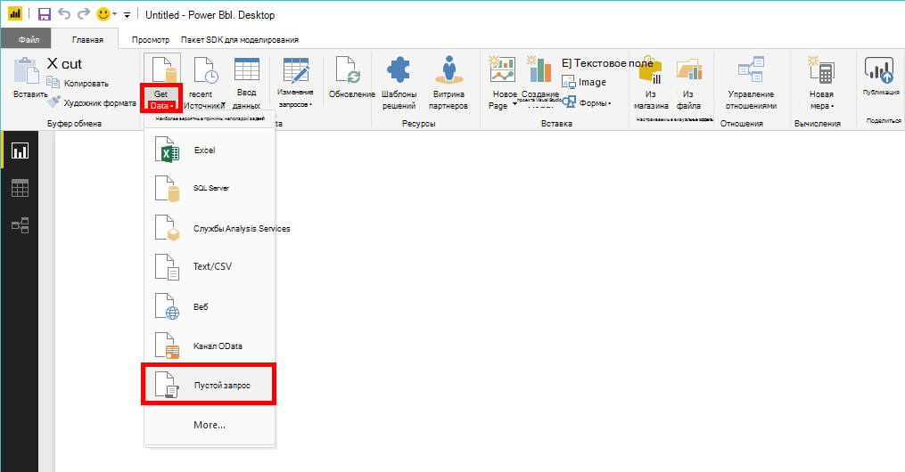
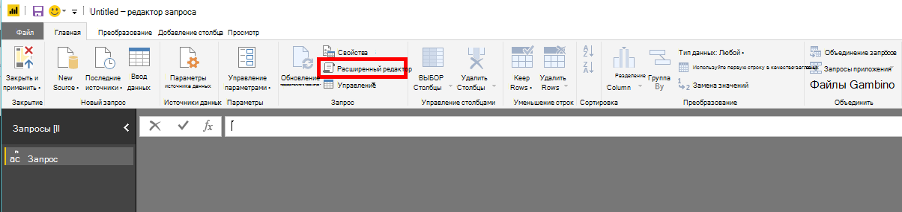
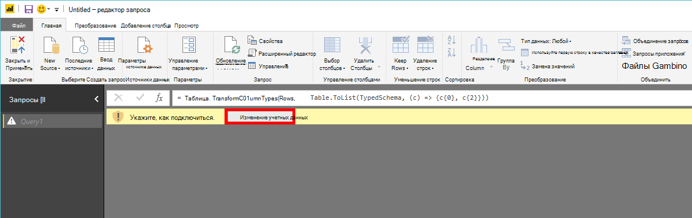
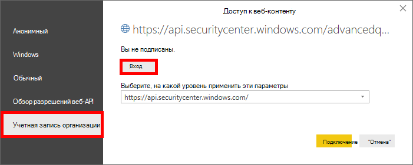
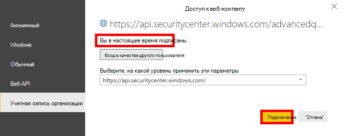

# <a name="create-custom-reports-using-power-bi"></a><span data-ttu-id="60f04-104">Создание настраиваемой отчетности с Power BI</span><span class="sxs-lookup"><span data-stu-id="60f04-104">Create custom reports using Power BI</span></span>

[!INCLUDE [Microsoft 365 Defender rebranding](../../includes/microsoft-defender.md)]

<span data-ttu-id="60f04-105">**Область применения:**</span><span class="sxs-lookup"><span data-stu-id="60f04-105">**Applies to:**</span></span>
- [<span data-ttu-id="60f04-106">Microsoft Defender для конечной точки</span><span class="sxs-lookup"><span data-stu-id="60f04-106">Microsoft Defender for Endpoint</span></span>](https://go.microsoft.com/fwlink/p/?linkid=2154037)
- [<span data-ttu-id="60f04-107">Microsoft 365 Defender</span><span class="sxs-lookup"><span data-stu-id="60f04-107">Microsoft 365 Defender</span></span>](https://go.microsoft.com/fwlink/?linkid=2118804)


- <span data-ttu-id="60f04-108">Хотите испытать Microsoft Defender для конечной точки?</span><span class="sxs-lookup"><span data-stu-id="60f04-108">Want to experience Microsoft Defender for Endpoint?</span></span> [<span data-ttu-id="60f04-109">Зарегистрився для бесплатной пробной.</span><span class="sxs-lookup"><span data-stu-id="60f04-109">Sign up for a free trial.</span></span>](https://www.microsoft.com/microsoft-365/windows/microsoft-defender-atp?ocid=docs-wdatp-exposedapis-abovefoldlink)

[!include[Microsoft Defender for Endpoint API URIs for US Government](../../includes/microsoft-defender-api-usgov.md)]

[!include[Improve request performance](../../includes/improve-request-performance.md)]

<span data-ttu-id="60f04-110">В этом разделе вы узнаете, как создать отчет Power BI в верхней части API Defender для конечных точек.</span><span class="sxs-lookup"><span data-stu-id="60f04-110">In this section you will learn create a Power BI report on top of Defender for Endpoint APIs.</span></span>

<span data-ttu-id="60f04-111">В первом примере показано, как подключить Power BI к API advanced Hunting, а во втором примере — подключение к API OData, таким как действия машины или оповещения.</span><span class="sxs-lookup"><span data-stu-id="60f04-111">The first example demonstrates how to connect Power BI to Advanced Hunting API and the second example demonstrates a connection to our OData APIs, such as Machine Actions or Alerts.</span></span>

## <a name="connect-power-bi-to-advanced-hunting-api"></a><span data-ttu-id="60f04-112">Подключение Power BI расширенный API охоты</span><span class="sxs-lookup"><span data-stu-id="60f04-112">Connect Power BI to Advanced Hunting API</span></span>

- <span data-ttu-id="60f04-113">Откройте microsoft Power BI</span><span class="sxs-lookup"><span data-stu-id="60f04-113">Open Microsoft Power BI</span></span>

- <span data-ttu-id="60f04-114">Нажмите **кнопку Получить пустой** запрос  >  **данных**</span><span class="sxs-lookup"><span data-stu-id="60f04-114">Click **Get Data** > **Blank Query**</span></span>

  

- <span data-ttu-id="60f04-116">Нажмите **кнопку Расширенный редактор**</span><span class="sxs-lookup"><span data-stu-id="60f04-116">Click **Advanced Editor**</span></span>

  

- <span data-ttu-id="60f04-118">Скопируйте ниже и вклеите его в редактор:</span><span class="sxs-lookup"><span data-stu-id="60f04-118">Copy the below and paste it in the editor:</span></span>

```
    let
        AdvancedHuntingQuery = "DeviceEvents | where ActionType contains 'Anti' | limit 20",

        HuntingUrl = "https://api.securitycenter.microsoft.com/api/advancedqueries",

        Response = Json.Document(Web.Contents(HuntingUrl, [Query=[key=AdvancedHuntingQuery]])),

        TypeMap = #table(
            { "Type", "PowerBiType" },
            {
                { "Double",   Double.Type },
                { "Int64",    Int64.Type },
                { "Int32",    Int32.Type },
                { "Int16",    Int16.Type },
                { "UInt64",   Number.Type },
                { "UInt32",   Number.Type },
                { "UInt16",   Number.Type },
                { "Byte",     Byte.Type },
                { "Single",   Single.Type },
                { "Decimal",  Decimal.Type },
                { "TimeSpan", Duration.Type },
                { "DateTime", DateTimeZone.Type },
                { "String",   Text.Type },
                { "Boolean",  Logical.Type },
                { "SByte",    Logical.Type },
                { "Guid",     Text.Type }
            }),

        Schema = Table.FromRecords(Response[Schema]),
        TypedSchema = Table.Join(Table.SelectColumns(Schema, {"Name", "Type"}), {"Type"}, TypeMap , {"Type"}),
        Results = Response[Results],
        Rows = Table.FromRecords(Results, Schema[Name]),
        Table = Table.TransformColumnTypes(Rows, Table.ToList(TypedSchema, (c) => {c{0}, c{2}}))

    in Table
```

- <span data-ttu-id="60f04-119">Нажмите **кнопку Готово**</span><span class="sxs-lookup"><span data-stu-id="60f04-119">Click **Done**</span></span>

- <span data-ttu-id="60f04-120">Нажмите **кнопку Изменить учетные данные**</span><span class="sxs-lookup"><span data-stu-id="60f04-120">Click **Edit Credentials**</span></span>

    

- <span data-ttu-id="60f04-122">Выбор **входной**  >  **записи организации**</span><span class="sxs-lookup"><span data-stu-id="60f04-122">Select **Organizational account** > **Sign in**</span></span>

    

- <span data-ttu-id="60f04-124">Ввод учетных данных и ожидание входа в</span><span class="sxs-lookup"><span data-stu-id="60f04-124">Enter your credentials and wait to be signed in</span></span>

- <span data-ttu-id="60f04-125">Щелкните **Подключение**</span><span class="sxs-lookup"><span data-stu-id="60f04-125">Click **Connect**</span></span>

    

- <span data-ttu-id="60f04-127">Теперь результаты запроса будут отображаться в таблице, и вы можете начать создавать визуализации поверх него!</span><span class="sxs-lookup"><span data-stu-id="60f04-127">Now the results of your query will appear as table and you can start build visualizations on top of it!</span></span>

- <span data-ttu-id="60f04-128">Вы можете повторить эту таблицу, переименовать ее и изменить запрос Advanced Hunting внутри, чтобы получить любые данные, которые вы хотите.</span><span class="sxs-lookup"><span data-stu-id="60f04-128">You can duplicate this table, rename it and edit the Advanced Hunting query inside to get any data you would like.</span></span>

## <a name="connect-power-bi-to-odata-apis"></a><span data-ttu-id="60f04-129">Подключение Power BI API OData</span><span class="sxs-lookup"><span data-stu-id="60f04-129">Connect Power BI to OData APIs</span></span>

- <span data-ttu-id="60f04-130">Единственное отличие от вышеуказанного примера — запрос внутри редактора.</span><span class="sxs-lookup"><span data-stu-id="60f04-130">The only difference from the above example is the query inside the editor.</span></span>

- <span data-ttu-id="60f04-131">Скопируйте ниже и вклейте его в редактор, чтобы вытащить все **действия машины** из организации:</span><span class="sxs-lookup"><span data-stu-id="60f04-131">Copy the below and paste it in the editor to pull all **Machine Actions** from your organization:</span></span>

```
    let

        Query = "MachineActions",

        Source = OData.Feed("https://api.securitycenter.microsoft.com/api/" & Query, null, [Implementation="2.0", MoreColumns=true])
    in
        Source
```

- <span data-ttu-id="60f04-132">Вы можете сделать то же самое для **оповещений** и **машин.**</span><span class="sxs-lookup"><span data-stu-id="60f04-132">You can do the same for **Alerts** and **Machines**.</span></span>
- <span data-ttu-id="60f04-133">Запросы OData также можно использовать для фильтрации запросов, см. в [рублях Using OData Queries](exposed-apis-odata-samples.md)</span><span class="sxs-lookup"><span data-stu-id="60f04-133">You also can use OData queries for queries filters, see [Using OData Queries](exposed-apis-odata-samples.md)</span></span>

## <a name="power-bi-dashboard-samples-in-github"></a><span data-ttu-id="60f04-134">Power BI панели мониторинга в GitHub</span><span class="sxs-lookup"><span data-stu-id="60f04-134">Power BI dashboard samples in GitHub</span></span>

<span data-ttu-id="60f04-135">Дополнительные сведения см. [в Power BI отчетов.](https://github.com/microsoft/MicrosoftDefenderATP-PowerBI)</span><span class="sxs-lookup"><span data-stu-id="60f04-135">For more information see the [Power BI report templates](https://github.com/microsoft/MicrosoftDefenderATP-PowerBI).</span></span>

## <a name="sample-reports"></a><span data-ttu-id="60f04-136">Примеры отчетов</span><span class="sxs-lookup"><span data-stu-id="60f04-136">Sample reports</span></span>

<span data-ttu-id="60f04-137">Просмотр примеров отчетов microsoft Defender для Power BI конечных точек.</span><span class="sxs-lookup"><span data-stu-id="60f04-137">View the Microsoft Defender for Endpoint Power BI report samples.</span></span> <span data-ttu-id="60f04-138">Дополнительные сведения см. в [обзоре примеров кода.](/samples/browse/?products=mdatp)</span><span class="sxs-lookup"><span data-stu-id="60f04-138">For more information, see [Browse code samples](/samples/browse/?products=mdatp).</span></span>

## <a name="related-topics"></a><span data-ttu-id="60f04-139">Статьи по теме</span><span class="sxs-lookup"><span data-stu-id="60f04-139">Related topics</span></span>

- [<span data-ttu-id="60f04-140">Defender for Endpoint API</span><span class="sxs-lookup"><span data-stu-id="60f04-140">Defender for Endpoint APIs</span></span>](apis-intro.md)
- [<span data-ttu-id="60f04-141">API расширенной охоты</span><span class="sxs-lookup"><span data-stu-id="60f04-141">Advanced Hunting API</span></span>](run-advanced-query-api.md)
- [<span data-ttu-id="60f04-142">Использование запросов OData</span><span class="sxs-lookup"><span data-stu-id="60f04-142">Using OData Queries</span></span>](exposed-apis-odata-samples.md)
