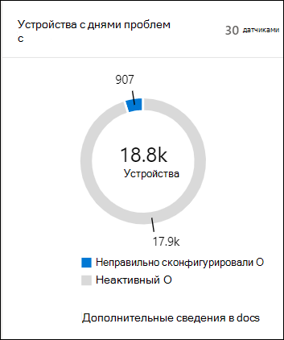
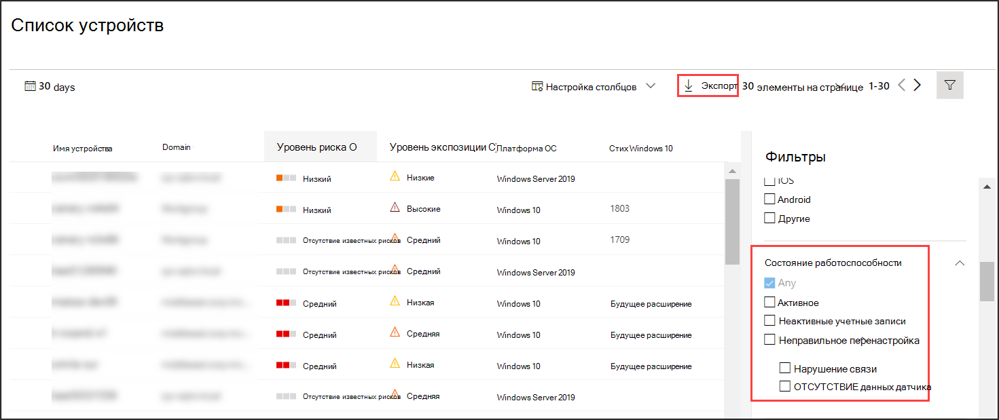

# Проверка состояния состояния датчика в Microsoft Defender для конечной точки

[!INCLUDE [Microsoft 365 Defender rebranding](../../includes/microsoft-defender.md)]

**Область применения:**
- [Microsoft Defender для конечной точки](https://go.microsoft.com/fwlink/p/?linkid=2154037)
- [Microsoft 365 Defender](https://go.microsoft.com/fwlink/?linkid=2118804)

>Хотите испытать Defender для конечной точки? [Зарегистрився для бесплатной пробной.](https://www.microsoft.com/microsoft-365/windows/microsoft-defender-atp?ocid=docs-wdatp-checksensor-abovefoldlink)

Плитка **Устройств с проблемными датчиками** находится на панели мониторинга операций безопасности. Эта плитка содержит сведения о способности отдельного устройства предоставлять данные датчиков и общаться со службой Defender для конечной точки. В нем сообщается, сколько устройств требует внимания, и помогает выявлять проблемные устройства и принимать меры для устранения известных проблем.

На плитке есть два индикатора состояния, которые предоставляют сведения о количестве устройств, которые не сообщают службе должным образом:
- **Неправильно сконфигурация** . Эти устройства могут частично сообщать данные датчика службе Defender для конечной точки и могут иметь ошибки конфигурации, которые необходимо исправить.
- **Неактивные** устройства, которые перестали сообщать в службу Защитник для конечных точек более семи дней в прошлом месяце.

Щелкнув любую из групп, вы направите в **список Устройств,** фильтрующийся по вашему выбору.

В **списке Устройств** можно фильтровать список состояния здоровья по следующему состоянию:
- **Active** — устройства, активно отчитываватся в службе Defender для конечной точки.
- **Неправильно сконфигурация** . Эти устройства могут частично сообщать данные датчиков службе Defender для конечной точки, но имеют ошибки конфигурации, которые необходимо исправить. Неправильно сконфигурированное устройство может иметь как одну, так и комбинацию следующих проблем:
  - **Нет данных датчика** . Устройства перестали отправлять данные датчиков. С устройства можно запускать ограниченные оповещения.
  - **Нарушение связи** . Способность к общению с устройством нарушается. Отправка файлов для глубокого анализа, блокировка файлов, изолирование устройства от сети и другие действия, которые требуют связи с устройством, могут не работать.
- **Неактивные** устройства, которые перестали сообщать об этом службе Defender для конечной точки.

Вы также можете скачать весь список в формате CSV с помощью **функции Экспорт.** Дополнительные сведения о фильтрах см. в [обзоре и организации списка Устройств.](machines-view-overview.md)

>[!NOTE]
>Экспорт списка в формате CSV для отображения неотобраченных данных. CSV-файл будет включать все устройства в организации, независимо от любой фильтрации, применяемой в самом представлении, и может занять значительное время для скачивания в зависимости от размера организации.

Сведения об устройстве можно просматривать при нажатии на неправильное или неактивное устройство.

## Связанная тема
- [Исправление нездоровых датчиков в Defender для конечной точки](fix-unhealthy-sensors.md)
