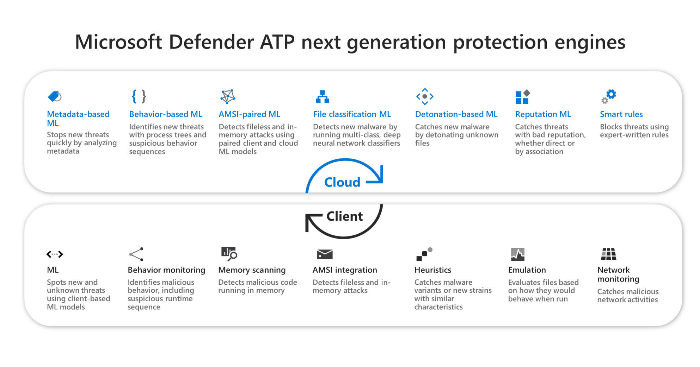

# Использование технологий следующего поколения в антивирусная программа в Microsoft Defender с помощью облачной защиты

[!INCLUDE [Microsoft 365 Defender rebranding](../../includes/microsoft-defender.md)]

**Область применения:**

- [Microsoft Defender для конечной точки](/microsoft-365/security/defender-endpoint/)
- Антивирусная программа в Microsoft Defender

Технологии нового поколения Майкрософт в антивирусная программа в Microsoft Defender обеспечивают практически мгновенную автоматизированную защиту от новых и возникающих угроз. Для динамического определения новых угроз эти технологии обрабатывают большие наборы взаимосвязанных данных в Microsoft Intelligent Security Graph и мощных системах искусственного интеллекта (ИИ), основанных на расширенных моделях машинного обучения.  

антивирусная программа в Microsoft Defender использует несколько технологий обнаружения и предотвращения для обеспечения точной и интеллектуальной защиты в режиме реального времени. [Узнать о передовых технологиях в центре защиты Microsoft Defender для endpoint следующего поколения.](https://www.microsoft.com/security/blog/2019/06/24/inside-out-get-to-know-the-advanced-technologies-at-the-core-of-microsoft-defender-atp-next-generation-protection/)
  

Чтобы воспользоваться мощью и скоростью этих технологий следующего поколения, антивирусная программа в Microsoft Defender с облачными службами Майкрософт. Эти службы облачной защиты, также именуемой Службой расширенной защиты Майкрософт (MAPS), повышают стандартную защиту в режиме реального времени, обеспечивая, возможно, лучшую антивирусную защиту. 

>[!NOTE]
>Облачная антивирусная программа в Microsoft Defender — это механизм доставки обновленной защиты в сеть и конечные точки. Несмотря на то, что она называется облачной службой, она не просто обеспечивает защиту файлов, хранимых в облаке, а использует распределенные ресурсы и машинное обучение для обеспечения защиты конечных точек со скоростью, значительно более быстрой, чем традиционные обновления аналитики безопасности.

С помощью облачной защиты технологии следующего поколения обеспечивают быструю идентификацию новых угроз, иногда даже до заражения одной машины. Просмотрите следующее видео об ИИ и антивирусная программа в Microsoft Defender в действии: 
 
<iframe 
src="https://www.microsoft.com/videoplayer/embed/RE1Yu4B" width="768" height="432" allowFullScreen="true" frameBorder="0" scrolling="no"></iframe>

Чтобы понять, как технологии следующего поколения сокращают время доставки защиты через облако, просмотрите следующее видео: 
 
<iframe 
src="https://videoplayercdn.osi.office.net/embed/c2f20f59-ca56-4a7b-ba23-44c60bc62c59" width="768" height="432" allowFullScreen="true" frameBorder="0" scrolling="no"></iframe>

Ознакомьтесь со следующими публикациями в блогах для подробных историй защиты, связанных с облачной защитой и microsoft AI: 

- [Почему антивирусная программа в Microsoft Defender является наиболее развернутой на предприятии](https://www.microsoft.com/security/blog/2018/03/22/why-windows-defender-antivirus-is-the-most-deployed-in-the-enterprise) 
- [Мониторинг поведения в сочетании с машинным обучением портит масштабную кампанию разработки монет Dofoil](https://www.microsoft.com/security/blog/2018/03/07/behavior-monitoring-combined-with-machine-learning-spoils-a-massive-dofoil-coin-mining-campaign)
- [Как искусственный интеллект остановил вспышку Emotet](https://www.microsoft.com/security/blog/2018/02/14/how-artificial-intelligence-stopped-an-emotet-outbreak)
- [Детонация плохой кролик: антивирусная программа в Microsoft Defender и многоуровневые защиты машинного обучения](https://www.microsoft.com/security/blog/2017/12/11/detonating-a-bad-rabbit-windows-defender-antivirus-and-layered-machine-learning-defenses)
- [антивирусная программа в Microsoft Defender облачной защиты: расширенные средства защиты в режиме реального времени от неимуторного вредоносного ПО](https://www.microsoft.com/security/blog/2017/07/18/windows-defender-antivirus-cloud-protection-service-advanced-real-time-defense-against-never-before-seen-malware) 
 
## Защита от облачных технологий 

Защита с облачной доставкой включена по умолчанию. Однако, возможно, потребуется повторно включить его, если он был отключен в рамках предыдущих организационных политик.

Организации, Windows 10 E5, также могут воспользоваться обновлениями динамической разведки в чрезвычайных ситуациях, которые обеспечивают почти в режиме реального времени защиту от возникающих угроз. При включив облачную защиту, исправления проблем с вредоносными программами можно доставить через облако в течение нескольких минут, а не ждать следующего обновления.

>[!TIP]
>Вы также можете посетить веб Защитник Windows  тестовом сайте demo.wd.microsoft.com, чтобы подтвердить, что функция работает, и посмотреть, как она работает.

В следующей таблице описываются различия в облачной защите между последними версиями Windows и Configuration Manager.

|ВЕРСИЯ ОС или приложение-служба |Метка службы облачной защиты  |Уровень отчетов (уровень членства в MAPS)  |Период ожидания облачного блока  |
|---------|---------|---------|---------|
|Windows 8.1 (групповой политики)     |Служба защиты microsoft Advanced   |Basic, Advanced   |Нет         |
|Windows 10 версии 1607 (групповой политики)  |Служба защиты microsoft Advanced      |Дополнительно         |Нет         |
|Windows 10 версии 1703 или больше (групповой политики)      |Защита на основе облака      |Дополнительно         |Настраиваемый         |
|Диспетчер конфигураций System Center 2012  |      Н/Д         |Зависит от Windows версии         |Не настраивается |
|Microsoft Endpoint Manager (Текущая ветвь)         |Служба облачной защиты         |Зависит от Windows версии          |Настраиваемый         |
|Microsoft Intune     |Служба защиты microsoft Advanced         |Зависит от Windows версии         |Настраиваемый         |

Вы также можете настроить антивирусная программа в Microsoft Defender, чтобы автоматически получать новые обновления защиты на основе отчетов [из нашей облачной службы.](manage-event-based-updates-microsoft-defender-antivirus.md#cloud-report-updates)

## Задачи

- [Включить облачную защиту.](enable-cloud-protection-microsoft-defender-antivirus.md) Вы можете включить облачную защиту с помощью Microsoft Endpoint Configuration Manager, групповой политики, Microsoft Intune и PowerShell.

- [Укажите уровень облачной защиты.](specify-cloud-protection-level-microsoft-defender-antivirus.md) Вы можете указать уровень защиты, предлагаемый облаком с помощью групповой политики и Microsoft Endpoint Configuration Manager. Уровень защиты влияет на объем сведений, общих с облаком, и на агрессивность блокировки новых файлов.

- [Настройка и проверка сетевых подключений для антивирусная программа в Microsoft Defender](configure-network-connections-microsoft-defender-antivirus.md). Существуют определенные URL-адреса Майкрософт, к которые должна быть подключена сеть и конечные точки для эффективной работы облачной защиты. В этой статье перечислены URL-адреса, разрешенные с помощью брандмауэра или правил фильтрации сети, а инструкции по подтверждению правильной регистрации сети в облачной защите.

- [Настройка блока с первого взгляда.](configure-block-at-first-sight-microsoft-defender-antivirus.md) Функция "блокировка на первый взгляд" может блокировать новые вредоносные программы в течение нескольких секунд, не дожидаясь часов для традиционной разведки безопасности. Вы можете включить и настроить его с помощью Microsoft Endpoint Manager и групповой политики.

- [Настройка периода ожидания облачного блока](configure-cloud-block-timeout-period-microsoft-defender-antivirus.md). антивирусная программа в Microsoft Defender может блокировать запуск подозрительных файлов во время запроса службы защиты облачных служб. Вы можете настроить время, когда файл будет не работать с помощью Microsoft Endpoint Manager групповой политики.