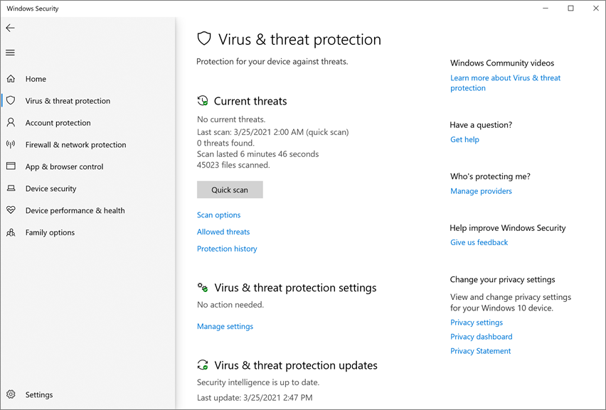

# Включить блокировку при первом подозрении

**Область применения:**

- [Microsoft Defender для конечной точки](/microsoft-365/security/defender-endpoint/)

В этой статье описывается функция для борьбы с вирусами и вредоносными программами, известная как "блокировка при первом подозрении". В статье описано включение блокировки при первом подозрении в инфраструктуре вашей организации. 

> [!TIP]
> Эта статья предназначена для администраторов предприятий и сотрудников ИТ, управляющих настройками безопасности для организаций. Если вы не администратор и не сотрудник ИТ, но у вас есть вопросы о блокировке при первом появлении, см. раздел [Не администратор предприятия и не сотрудник ИТ?](#not-an-enterprise-admin-or-it-pro)

## Что такое блокировка при первом подозрении?

Блокировка при первом подозрении — это функция нового поколения для защиты от угроз, которая обнаруживает новые вредоносные программы и блокирует их за считанные секунды. Блокировку при первом взгляда подозрении можно активировать, включив определенные параметры безопасности. К этим параметрам относятся:

- облачная защита; 
- ограничение по времени для ожидания отправки примера (например, 50 секунд); 
- значение "высокий" для уровня блокировки файлов. 

В большинстве корпоративных организаций параметры, необходимые для блокировки при первом подозрении, настраиваются при развертывании антивирусной программы в Microsoft Defender. 

## Принципы действия

Обнаружив подозрительный, но не обнаруженный ранее файл, антивирусная программа в Microsoft Defender отправляет запрос в нашу тыловую облачную защиту. Тыловая облачная защита применяет эвристические алгоритмы, машинное обучение и автоматический анализ файла, чтобы определить, является ли он вредоносным.

Антивирусная программа в Microsoft Defender использует несколько технологий обнаружения и предотвращения для обеспечения безошибочной интеллектуальной защиты в режиме реального времени. 

  

> [!TIP]
> Подробности см. в блоге [Узнайте о передовых технологиях, лежащих в основе защиты нового поколения Microsoft Defender для конечной точки](https://www.microsoft.com/security/blog/2019/06/24/inside-out-get-to-know-the-advanced-technologies-at-the-core-of-microsoft-defender-atp-next-generation-protection/).

## Вот несколько важных фактов о блокировке при первом подозрении

- В Windows 10 начиная с версии 1803 блокировка при первом подозрении может срабатывать в отношении непереносимых исполняемых файлов (например, JS, VBS или макросов) и других исполняемых файлов.

- Блокировка при первом подозрении использует только тыловую облачную защиту для исполняемых файлов и непереносимых исполняемых файлов, скачанных из Интернета или происходящих из зоны Интернета. Хэш-значение exe-файла проверяется тыловой облачной защитой, чтобы определить, действительно ли такой файл не обнаруживался ранее.

- Если тыловой облачной защите не удается определить, вредоносный этот файл или нет, антивирусная программа в Microsoft Defender заблокирует файл и загрузит его копию в облако. В облаке выполняется дальнейший анализ для определения вредоносности файла, прежде чем разрешить его запуск либо блокировать его при обнаружении в будущем — в зависимости от того, определен ли файл как вредоносный или не представляющий угрозы.

- Во многих случаях этот процесс позволяет сократить время реакции на новые вредоносные программы с часов до секунд.

- Вы можете [указать, как долго файл следует удерживать от запуска](configure-cloud-block-timeout-period-microsoft-defender-antivirus.md), пока облачная служба защиты анализирует его Вы также можете [настроить сообщения, которые будут отправляться на компьютеры пользователей ](/windows/security/threat-protection//windows-defender-security-center/wdsc-customize-contact-information.md) при блокировке файлов. Вы можете изменить название компании, контактные данные и URL-адрес сообщения.

## Включение блокировки при первом подозрении с помощью Microsoft Intune

> [!TIP]
> Microsoft Intune теперь интегрирован с Microsoft Endpoint Manager. 

1. В Центре администрирования Microsoft Endpoint Manager ([https://endpoint.microsoft.com](https://endpoint.microsoft.com)) перейдите в раздел **Приложения** > **Профили конфигурации**.

2. Выберите или создайте профиль на основе типа профиля **Ограничения для устройств**.

3. В разделе **Параметры конфигурации** для профиля ограничений устройств в разделе **Антивирусная программа в Microsoft Defender** установите или подтвердите следующие параметры.

   - **Уровень облачной защиты**: включено
   - **Уровень блокировки файлов**: высокий
   - **Дополнительное время для сканирования файла в облаке**: 50
   - **Запрашивать пользователей перед отправкой образца**: отправлять все данные без запроса

   

4. Сохраните заданные параметры.

> [!TIP]
> - При установке уровня блокировки файлов **Высокий** применяется высокий уровень обнаружения. В маловероятном случае, когда блокировка вызвана ложно-положительным срабатыванием для безобидных файлов, ваши сотрудники отдела безопасности смогут [восстановить файлы из карантина](./restore-quarantined-files-microsoft-defender-antivirus.md).
> - Дополнительные сведения о настройке параметров ограничения устройств антивирусной программы в Microsoft Defender для Intune см. в статье [Параметры ограничений устройств в Microsoft Intune](/intune/device-restrictions-configure).
> - Список ограничений для антивирусных устройств в Microsoft Defender в Intune см. в статье [Ограничения для устройств в Windows 10 (и более новых версиях) в Intune](/intune/device-restrictions-windows-10#microsoft-defender-antivirus).

## Включение блокировки при первом подозрении с помощью Microsoft Endpoint Manager

> [!TIP]
> Если вы ищете Microsoft Endpoint Configuration Manager, он теперь входит в состав Microsoft Endpoint Manager.

1. В Microsoft Endpoint Manager ([https://endpoint.microsoft.com](https://endpoint.microsoft.com)) перейдите в раздел **Защита конечной точки** > **Антивирусная программа**.

2. Выберите существующую политику или создайте новую на основе типа профиля **Антивирусная программа в Microsoft Defender**.

3. Установите или подтвердите следующие параметры конфигурации:

   - **Включить облачную защиту**: да
   - **Уровень облачной защиты**: высокий
   - **Дополнительное время (в секундах) обработки файла в облачном Защитнике**: 50

   :::image type="content" source="images/endpointmgr-antivirus-cloudprotection.png" alt-text="Настройка блокировки в Endpoint Manager при первом подозрении":::

4. Примените профиль антивирусной программы в Microsoft Defender к группе, например **Все пользователи**, **Все устройства** или **Все пользователи и устройства**.

## Включение блокировки при первом подозрении с помощью групповой политики

> [!NOTE]
> Мы рекомендуем включить блокировку при первом подозрении через Intune или Microsoft Endpoint Manager. 

1. Для этого на компьютере, управляющем групповыми политиками, откройте [Консоль управления групповой политикой](/previous-versions/windows/it-pro/windows-server-2008-R2-and-2008/cc731212(v=ws.11)), щелкните правой кнопкой мыши нужный объект групповой политики и выберите **Изменить**. 

2. С помощью **Редактора управления групповыми политиками** перейдите в **Конфигурация компьютера** > **Административные шаблоны** > **Компоненты Windows** > **Антивирусная программа в Microsoft Defender** > **MAPS**. 

3. В разделе MAPS дважды щелкните **Настроить блокировку при первом подозрении** и установите для этого параметра значение **Включено**, а затем нажмите **ОК**.

    > [!IMPORTANT]
    > Установка параметра **Всегда запрашивать (0)** понизит состояние защиты устройства. Значение **Никогда не отправлять (2)** означает, что блокировка при первом подозрении работать не будет.

4. В разделе MAPS дважды щелкните **Отправлять образцы файлов, если требуется дальнейший анализ** и установите значение **Включено**. Для параметра **Отправка образцов файлов, когда требуется дальнейший анализ**, выберите **Отправлять все образцы**, а затем **ОК**.

5. Заново разверните объект групповой политики в своей инфраструктуре обычным порядком.

## Подтверждение включения блокировки при первом подозрении на отдельных клиентских устройствах

Вы можете подтвердить, что блокировка при первом подозрении включена на отдельных клиентских устройствах, с помощью приложения "Безопасность Windows". Блокировка при первом подозрении автоматически включена, если включены оба параметра: **Облачная защита** и **Автоматическая отправка образцов**.

1. Откройте приложение "Безопасность Windows".

2. Выберите **Защита от вирусов и угроз**, а затем в области **Параметры защиты от вирусов и угроз** выберите **Управление параметрами**.

   

3. Убедитесь, что оба параметра, **Облачная защита** и **Автоматическая отправка образцов**, включены.

> [!NOTE]
> - Если необходимые параметры настроены и развернуты с помощью групповой политики, элементы управления параметрами, описанными в этом разделе, будут деактивированы и недоступны для использования на отдельных конечных точках. 
> - Изменения, внесенные с помощью объекта групповой политики, необходимо сначала развернуть на отдельных конечных точках, прежде чем параметр будет обновлен в настройках Windows.

## Проверьте, работает ли блокировка при первом подозрении

Чтобы проверить работу функции, скачайте [пример файла блокировки при первом появлении](https://demo.wd.microsoft.com/Page/BAFS). Чтобы скачать файл, вам потребуется учетная запись в Azure AD с назначенной ролью "Администратор безопасности" или "Глобальный администратор".

Чтобы проверить, работает ли облачная защита, следуйте инструкциям, изложенным в разделе [Проверка подключений между сетью и облаком](configure-network-connections-microsoft-defender-antivirus.md#validate-connections-between-your-network-and-the-cloud). 

## Отключение блокировки при первом подозрении

> [!CAUTION]
> Отключение блокировки при первом подозрении понизит уровень защиты устройств и сети.

Вы можете отключить блокировку при первом подозрении, если хотите сохранить те же значения параметров, но без использования блокировки при первом подозрении. Вы можете временно отключить блокировку при первом подозрении, чтобы посмотреть, как эта функция влияет на работу вашей инфраструктуры. Однако мы не рекомендуем окончательно отключать блокировку при первом подозрении.

### Выключение блокировки при первом подозрении с помощью Microsoft Endpoint Manager

1. Войдите в Центр администрирования Microsoft Endpoint Manager ([https://endpoint.microsoft.com](https://endpoint.microsoft.com)) и выполните вход в систему.

2. Перейдите в раздел **Безопасность конечной точки** > **Антивирусная программа**, а затем выберите свою политику антивирусной программы в Microsoft Defender.

3. В разделе **Управление** выберите **Свойства**.

4. Рядом с **Параметры конфигурации** выберите **Изменить**.

5. Измените один или несколько следующих параметров:

   - Установите для параметра **Включить облачную защиту** значение **Нет** или **Не настроено**.
   - Установите для параметра **Уровень облачной защиты** значение **Не настроено**.
   - Снимите флажок с параметра **Дополнительное время (в секундах) обработки файла в облачном Защитнике**.

6. Проверьте новые значения и сохраните параметры.

### Отключение блокировки при первом подозрении с помощью групповой политики

1. Для этого на компьютере, управляющем групповыми политиками, откройте [Консоль управления групповой политикой](/previous-versions/windows/it-pro/windows-server-2008-R2-and-2008/cc731212(v=ws.11)), щелкните правой кнопкой мыши нужный объект групповой политики и выберите **Изменить**.

2. В **Редакторе управления групповыми политиками** перейдите в раздел **Конфигурация компьютера** и выберите **Административные шаблоны**.

3. Разверните дерево до узла **Компоненты Windows** > **Антивирусная программа в Microsoft Defender** > **MAPS**.

4. Дважды щелкните **Настроить функцию "Блокировать при первом подозрении"** и установить значение **Выключено**.

    > [!NOTE]
    > Отключение блокировки при первом подозрении не отключает или не изменяет необходимые групповые политики.

## Не администратор предприятия и не сотрудник ИТ?

Если вы не администратор или ИТ-профессионал, но у вас есть вопросы о блокировке при первом подозрении, см. раздел "Не администратор предприятия и не сотрудник ИТ?" Блокировка при первом подозрении обнаруживает новые вредоносные программы и блокирует их за считанные секунды. Хотя параметра "Блокировать при первом подозрении" как такового не существует, функция включена, если на устройстве настроены определенные параметры.

### Управление блокировкой при первом подозрении: включение и отключение на личном устройстве

Если у вас есть личное устройство, не управляемое организацией, возможно, вам захочется включить или отключить блокировку при первом подозрении. Для управления этой функцией можно использовать приложение "Безопасность Windows"..

1. На компьютере с Windows 10 откройте приложение "Безопасность Windows".

2. Выберите **Защита от вирусов и угроз**.

3. В разделе **Защита от вирусов и угроз** выберите **Управление параметрами**.

4. Выполните одно из следующих действий:

   - Чтобы настроить блокировку при первом подозрении, включите оба параметра: **Облачная защита** и **Автоматическая отправка образцов**.

   - Чтобы убрать блокировку при первом подозрении, отключите один из параметров: **Облачная защита** или **Автоматическая отправка образцов**.  
    
     > [!CAUTION]
     > Отключение блокировки при первом подозрении снижает уровень защиты вашего устройства. Мы не рекомендуем отключать блокировку при первом подозрении насовсем. 

## См. также

- [Антивирусная программа в Microsoft Defender (Windows 10)](microsoft-defender-antivirus-in-windows-10.md)
- [Включение облачной защиты](enable-cloud-protection-microsoft-defender-antivirus.md)
- [Защита с помощью системы безопасности Windows](https://support.microsoft.com/windows/stay-protected-with-windows-security-2ae0363d-0ada-c064-8b56-6a39afb6a963)
