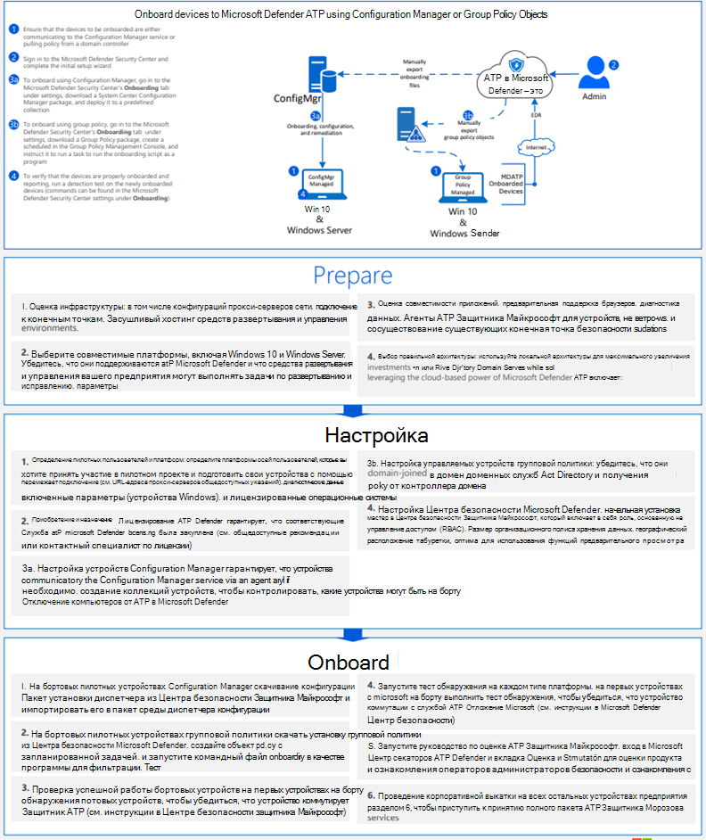
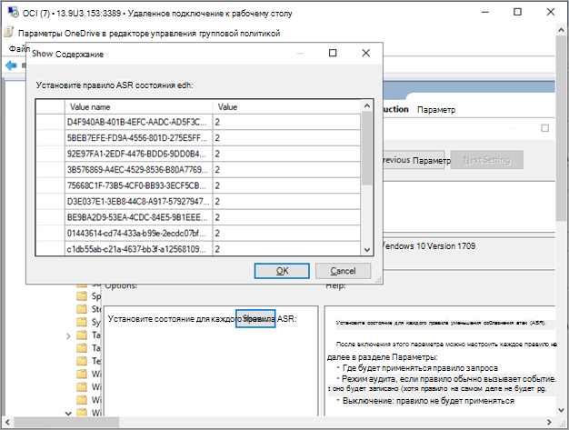

# Onboard Windows 10 с помощью групповой политикиOnboard Windows 10 devices using Group Policy 

[!INCLUDE [Microsoft 365 Defender rebranding](../../includes/microsoft-defender.md)]

**Область применения:****Applies to:**

- Групповая политикаGroup Policy
- [Microsoft Defender для конечной точкиMicrosoft Defender for Endpoint](https://go.microsoft.com/fwlink/p/?linkid=2154037)
- [Microsoft 365 DefenderMicrosoft 365 Defender](https://go.microsoft.com/fwlink/?linkid=2118804)

>Хотите испытать Defender для конечной точки?Want to experience Defender for Endpoint? [Зарегистрився для бесплатной пробной.Sign up for a free trial.](https://www.microsoft.com/microsoft-365/windows/microsoft-defender-atp?ocid=docs-wdatp-configureendpointsgp-abovefoldlink)

> [!NOTE]
> Чтобы использовать обновления групповой политики (GP) для развертывания пакета, необходимо быть на Windows Server 2008 R2 или более поздней версии.To use Group Policy (GP) updates to deploy the package, you must be on Windows Server 2008 R2 or later.
> 
> Для Windows Server 2019 может потребоваться заменить NT AUTHORITY\Well-Known-System-Account на NT AUTHORITY\SYSTEM XML-файла, который создается в предпочтениях групповой политики.For Windows Server 2019, you may need to replace NT AUTHORITY\Well-Known-System-Account with NT AUTHORITY\SYSTEM of the XML file that the Group Policy preference creates.

## Подключение устройств с помощью групповой политикиOnboard devices using Group Policy

Ознакомьтесь с [PDF или Visio,](https://github.com/MicrosoftDocs/microsoft-365-docs/raw/public/microsoft-365/security/defender-endpoint/downloads/mdatp-deployment-strategy.pdf) чтобы увидеть различные пути развертывания Defender для конечной точки. Check out the [PDF](https://github.com/MicrosoftDocs/microsoft-365-docs/raw/public/microsoft-365/security/defender-endpoint/downloads/mdatp-deployment-strategy.pdf)  or  [Visio](https://github.com/MicrosoftDocs/microsoft-365-docs/raw/public/microsoft-365/security/defender-endpoint/downloads/mdatp-deployment-strategy.vsdx) to see the various paths in deploying Defender for Endpoint. 

1. Откройте пакет конфигурации GP .zip *(WindowsDefenderATPOnboardingPackage.zip),* который вы скачали из мастера бортового обслуживания.Open the GP configuration package .zip file (*WindowsDefenderATPOnboardingPackage.zip*) that you downloaded from the service onboarding wizard. Вы также можете получить пакет из [Центр безопасности в Microsoft Defender:](https://securitycenter.windows.com/)You can also get the package from [Microsoft Defender Security Center](https://securitycenter.windows.com/):
 
    1. В области навигации выберите **Параметры**  >  **onboarding**.In the navigation pane, select **Settings** > **Onboarding**.

    1. Выберите Windows 10 в качестве операционной системы.Select Windows 10 as the operating system.
    
    1. В поле **Метод развертывания** выберите **групповую политику.**In the **Deployment method** field, select **Group policy**.
    
    1. Нажмите **кнопку Загрузка** пакета и сохраните .zip файл.Click **Download package** and save the .zip file.

2. Извлечение содержимого файла .zip в общее, только для чтения расположение, которое можно получить на устройстве.Extract the contents of the .zip file to a shared, read-only location that can be accessed by the device. У вас должна быть папка *OptionalParamsPolicy* и файл *WindowsDefenderATPOnboardingScript.cmd.*You should have a folder called *OptionalParamsPolicy* and the file *WindowsDefenderATPOnboardingScript.cmd*.

3. Откройте консоль [управления групповой](/internet-explorer/ie11-deploy-guide/group-policy-and-group-policy-mgmt-console-ie11) политикой (GPMC), щелкните правой кнопкой мыши объект групповой политики (GPO), который необходимо настроить, и нажмите **кнопку Изменить**.Open the [Group Policy Management Console](/internet-explorer/ie11-deploy-guide/group-policy-and-group-policy-mgmt-console-ie11) (GPMC), right-click the Group Policy Object (GPO) you want to configure and click **Edit**.

4. В **редакторе управления групповой политикой** перейдите к **конфигурации компьютера,** затем **параметры**"Предпочтения", а затем **параметры панели управления.**In the **Group Policy Management Editor**, go to **Computer configuration**, then **Preferences**, and then **Control panel settings**.

5. Щелкните правой кнопкой мыши **Запланированные задачи,** указать **на Новое,** а затем нажмите кнопку Немедленная задача **(по крайней мере Windows 7).**Right-click **Scheduled tasks**, point to **New**, and then click **Immediate Task (At least Windows 7)**.

6. В **открываемом** окне Задача перейдите на **вкладку General.** В **параметрах Безопасности** нажмите **кнопку Изменить пользователя или группу** и введите SYSTEM, а затем нажмите **кнопку Check Names** then **OK**.In the **Task** window that opens, go to the **General** tab. Under **Security options** click **Change User or Group** and type SYSTEM and then click **Check Names** then **OK**. NT AUTHORITY\SYSTEM отображается в качестве учетной записи пользователя, как будет работать задача.NT AUTHORITY\SYSTEM appears as the user account the task will run as.

7. Выберите **Выполнить, вошел** ли пользователь или нет, и проверьте поле Выполнить с **самыми** высокими привилегиями.Select **Run whether user is logged on or not** and check the **Run with highest privileges** check box.

8. Перейдите на **вкладку Действия** и нажмите **кнопку New...** **Убедитесь, что программа Start** выбрана в поле **Действия.**Go to the **Actions** tab and click **New...** Ensure that **Start a program** is selected in the **Action** field. Введите имя файла и расположение общего *файла WindowsDefenderATPOnboardingScript.cmd.*Enter the file name and location of the shared *WindowsDefenderATPOnboardingScript.cmd* file.

9. Нажмите **кнопку ОК** и закрой все открытые окна GPMC.Click **OK** and close any open GPMC windows.

>[!TIP]
> После работы на устройстве можно выполнить тест обнаружения, чтобы убедиться, что устройство правильно вошел в службу.After onboarding the device, you can choose to run a detection test to verify that the device is properly onboarded to the service. Дополнительные сведения см. в таблице [Run a detection test on a newly onboarded Defender for Endpoint device.](run-detection-test.md)For more information, see [Run a detection test on a newly onboarded Defender for Endpoint device](run-detection-test.md).

## Дополнительные параметры конфигурации Defender для конечной точкиAdditional Defender for Endpoint configuration settings
Для каждого устройства можно указать, можно ли собирать образцы с устройства при Центр безопасности в Microsoft Defender отправки файла для глубокого анализа.For each device, you can state whether samples can be collected from the device when a request is made through Microsoft Defender Security Center to submit a file for deep analysis.

Можно использовать групповую политику (GP) для настройки параметров, например параметров для общего доступа к примеру, используемого в функции глубокого анализа.You can use Group Policy (GP) to configure settings, such as settings for the sample sharing used in the deep analysis feature.

### Настройка параметров коллекции образцовConfigure sample collection settings
1.  На устройстве управления GP скопируйте следующие файлы из пакета конфигурации:On your GP management device, copy the following files from the configuration package:

    - _Скопируйте AtpConfiguration.admx_ в _C: \\ Windows \\ PolicyDefinitions_Copy _AtpConfiguration.admx_ into _C:\\Windows\\PolicyDefinitions_

    - _Скопируйте AtpConfiguration.adml_ в _C: \\ Windows \\ PolicyDefinitions \\ en-US_Copy _AtpConfiguration.adml_ into _C:\\Windows\\PolicyDefinitions\\en-US_

    Если вы используете административные шаблоны [центра хранения групповой](https://support.microsoft.com/help/3087759/how-to-create-and-manage-the-central-store-for-group-policy-administra)политики, скопируйте следующие файлы из пакета конфигурации:If you are using a [Central Store for Group Policy Administrative Templates](https://support.microsoft.com/help/3087759/how-to-create-and-manage-the-central-store-for-group-policy-administra), copy the following files from the configuration package:
    
    - _Скопируйте AtpConfiguration.admx в_ _\\ \\ \<forest.root\> \\ политики SysVol \\ \<forest.root\> \\ \\ PoliciesDefinitions_Copy _AtpConfiguration.admx_ into _\\\\\<forest.root\>\\SysVol\\\<forest.root\>\\Policies\\PolicyDefinitions_

    - Copy _AtpConfiguration.adml_ into _\\ \\ \<forest.root\> \\ SysVol \\ \<forest.root\> \\ \\ Policies PolicyDefinitions \\ en-US_Copy _AtpConfiguration.adml_ into _\\\\\<forest.root\>\\SysVol\\\<forest.root\>\\Policies\\PolicyDefinitions\\en-US_

2.  Откройте консоль [управления групповой политикой](/internet-explorer/ie11-deploy-guide/group-policy-and-group-policy-mgmt-console-ie11), щелкните правой кнопкой мыши GPO, который необходимо настроить, и нажмите **кнопку Изменить**.Open the [Group Policy Management Console](/internet-explorer/ie11-deploy-guide/group-policy-and-group-policy-mgmt-console-ie11), right-click the GPO you want to configure and click **Edit**.

3.  В **редакторе управления групповой политикой** перейдите к **конфигурации компьютера.**In the **Group Policy Management Editor**, go to **Computer configuration**.

4.  Щелкните **Политики,** а затем **административные шаблоны**.Click **Policies**, then **Administrative templates**.

5.  Щелкните **Windows компоненты** и **Защитник Windows SmartScreen**.Click **Windows components** and then **Windows Defender SmartScreen**.

6.  Выберите, чтобы включить или отключить общий доступ к примеру с устройств.Choose to enable or disable sample sharing from your devices.

>[!NOTE]
> Если значение не установлено, по умолчанию необходимо включить коллекцию образцов.If you don't set a value, the default value is to enable sample collection.

## Другие рекомендуемые параметры конфигурацииOther recommended configuration settings

### Обновление конфигурации защиты конечной точкиUpdate endpoint protection configuration

После настройки сценария бортовой настройки продолжайте редактирование той же групповой политики, чтобы добавить конфигурации защиты конечной точки.After configuring the onboarding script, continue editing the same group policy to add endpoint protection configurations. Выполните изменения групповой политики из системы Windows 10 или Server 2019, чтобы убедиться, что у вас есть все необходимые антивирусная программа в Microsoft Defender возможности.Perform group policy edits from a system running Windows 10 or Server 2019 to ensure you have all of the required Microsoft Defender Antivirus capabilities. Может потребоваться закрыть и открыть объект групповой политики для регистрации параметров конфигурации ATP Defender.You may need to close and reopen the group policy object to register the Defender ATP configuration settings.

Все политики находятся под `Computer Configuration\Policies\Administrative Templates` .All policies are located under `Computer Configuration\Policies\Administrative Templates`.

**Расположение политики:** \Windows компоненты\Защитник Windows ATP**Policy location:** \Windows Components\Windows Defender ATP

ПолитикаPolicy | SettingSetting 
:---|:---
Enable\Disable Sample collectionEnable\Disable Sample collection|   Включено - "Включить коллекцию образцов на машинах" провереноEnabled - "Enable sample collection on machines" checked

 

**Расположение политики:** \Windows компоненты\антивирусная программа в Microsoft Defender**Policy location:**  \Windows Components\Microsoft Defender Antivirus

ПолитикаPolicy | SettingSetting 
:---|:---
Настройка обнаружения для потенциально нежелательных приложенийConfigure detection for potentially unwanted applications | Включено, блокEnabled, Block

 

**Расположение политики:** \Windows компоненты\антивирусная программа в Microsoft Defender\MAPS**Policy location:** \Windows Components\Microsoft Defender Antivirus\MAPS

ПолитикаPolicy | SettingSetting 
:---|:---
Присоединяйтесь к Microsoft MAPSJoin Microsoft MAPS | Включено, расширенные КАРТЫEnabled, Advanced MAPS
Отправка образцов файлов при необходимости дополнительного анализаSend file samples when further analysis is required | Включено, отправка безопасных образцовEnabled, Send safe samples

 

**Расположение политики:** \Windows компоненты\антивирусная программа в Microsoft Defender\Защита в режиме реального времени**Policy location:** \Windows Components\Microsoft Defender Antivirus\Real-time Protection

ПолитикаPolicy | SettingSetting 
:---|:---
Отключение защиты в режиме реального времениTurn off real-time protection|ОтключеноDisabled
Включив мониторинг поведенияTurn on behavior monitoring|ВключеноEnabled
Сканирование всех загруженных файлов и вложенийScan all downloaded files and attachments|ВключеноEnabled
Мониторинг активности файлов и программ на компьютереMonitor file and program activity on your computer|ВключеноEnabled

 

**Расположение политики:** \Windows компоненты\антивирусная программа в Microsoft Defender\Scan**Policy location:**  \Windows Components\Microsoft Defender Antivirus\Scan

Эти параметры настраивают периодическое сканирование конечной точки.These settings configure periodic scans of the endpoint. Рекомендуется выполнять еженедельное быстрое сканирование с разрешением производительности.We recommend performing a weekly quick scan, performance permitting.

ПолитикаPolicy | SettingSetting 
:---|:---
Проверьте последнюю информацию о безопасности вирусов и шпионских программ перед запуском запланированного сканированияCheck for the latest virus and spyware security intelligence before running a scheduled scan |ВключеноEnabled

 

**Расположение политики:** \Windows компоненты\антивирусная программа в Microsoft Defender\Exploit Guard в Microsoft Defender\Уменьшение поверхности атаки**Policy location:** \Windows Components\Microsoft Defender Antivirus\Microsoft Defender Exploit Guard\Attack Surface Reduction

Получите текущий список GUID-интерфейсов уменьшения поверхности атаки из настройки правил уменьшения [поверхности атаки](customize-attack-surface-reduction.md)Get the current list of attack surface reduction GUIDs from [Customize attack surface reduction rules](customize-attack-surface-reduction.md)

1. Откройте политику **настройки политики уменьшения поверхности атаки.**Open the **Configure Attack Surface Reduction** policy.

1. Щелкните **Включено**.Select **Enabled**.

1. Выберите **кнопку Показать.**Select the **Show** button.

1. Добавьте каждый GUID в **поле Имя** значения со значением 2.Add each GUID in the **Value Name** field with a Value of 2.

   Это будет настроить каждый только для аудита.This will set each up for audit only.

   

ПолитикаPolicy | SettingSetting 
:---|:---
Настройка доступа к управляемой папкеConfigure Controlled folder access| Включен режим аудитаEnabled, Audit Mode

## Offboard devices using Group PolicyOffboard devices using Group Policy
По соображениям безопасности срок действия пакета, используемой для устройств Offboard, истекает через 30 дней после даты его загрузки.For security reasons, the package used to Offboard devices will expire 30 days after the date it was downloaded. Просроченные пакеты offboarding, отправленные на устройство, будут отклонены.Expired offboarding packages sent to a device will be rejected. При загрузке пакета offboarding вы будете уведомлены о дате истечения срока действия пакетов и он также будет включен в имя пакета.When downloading an offboarding package you will be notified of the packages expiry date and it will also be included in the package name.

> [!NOTE]
> На одном устройстве одновременно не следует развертывать политики бортового и оффбординга, в противном случае это приведет к непредсказуемым столкновениям.Onboarding and offboarding policies must not be deployed on the same device at the same time, otherwise this will cause unpredictable collisions.

1. Получите пакет offboarding из [Центр безопасности в Microsoft Defender:](https://securitycenter.windows.com/)Get the offboarding package from [Microsoft Defender Security Center](https://securitycenter.windows.com/):

    1. В области навигации выберите **Параметры**  >  **Offboarding**.In the navigation pane, select **Settings** > **Offboarding**.

    1. Выберите Windows 10 в качестве операционной системы.Select Windows 10 as the operating system.
    
    1. В поле **Метод развертывания** выберите **групповую политику.**In the **Deployment method** field, select **Group policy**.

    1. Нажмите **кнопку Загрузка** пакета и сохраните .zip файл.Click **Download package** and save the .zip file.

2. Извлечение содержимого файла .zip в общее, только для чтения расположение, которое можно получить на устройстве.Extract the contents of the .zip file to a shared, read-only location that can be accessed by the device. У вас должен быть *файл с именем WindowsDefenderATPOffboardingScript_valid_until_YYYY-MM-DD.cmd*.You should have a file named *WindowsDefenderATPOffboardingScript_valid_until_YYYY-MM-DD.cmd*.

3. Откройте консоль [управления групповой](/internet-explorer/ie11-deploy-guide/group-policy-and-group-policy-mgmt-console-ie11) политикой (GPMC), щелкните правой кнопкой мыши объект групповой политики (GPO), который необходимо настроить, и нажмите **кнопку Изменить**.Open the [Group Policy Management Console](/internet-explorer/ie11-deploy-guide/group-policy-and-group-policy-mgmt-console-ie11) (GPMC), right-click the Group Policy Object (GPO) you want to configure and click **Edit**.

4. В **редакторе управления групповой политикой** перейдите к **конфигурации компьютера,** затем **параметры**"Предпочтения", а затем **параметры панели управления.**In the **Group Policy Management Editor**, go to **Computer configuration,** then **Preferences**, and then **Control panel settings**.

5. Щелкните правой кнопкой мыши **Запланированные задачи,** указать **на Новое,** а затем нажмите **кнопку Немедленное задание**.Right-click **Scheduled tasks**, point to **New**, and then click **Immediate task**.

6. В **открываемом** окне Задача перейдите на **вкладку General.** Выберите учетную запись локального пользователя SYSTEM (BUILTIN\SYSTEM) в **параметрах Безопасности.**In the **Task** window that opens, go to the **General** tab. Choose the local SYSTEM user account (BUILTIN\SYSTEM) under **Security options**.

7. Выберите **Выполнить, вошел** ли пользователь в систему или нет, и проверьте поле **Выполнить** с самыми высокими привилегиями.Select **Run whether user is logged on or not** and check the **Run with highest privileges** check-box.

8. Перейдите на **вкладку Действия** и нажмите **кнопку New...**. **Убедитесь, что программа Start** выбрана в поле **Действия.**Go to the **Actions** tab and click **New...**. Ensure that **Start a program** is selected in the **Action** field. Введите имя файла и расположение *общего WindowsDefenderATPOffboardingScript_valid_until_YYYY-MM-DD.cmd.*Enter the file name and location of the shared  *WindowsDefenderATPOffboardingScript_valid_until_YYYY-MM-DD.cmd* file.

9. Нажмите **кнопку ОК** и закрой все открытые окна GPMC.Click **OK** and close any open GPMC windows.

> [!IMPORTANT]
> Отключение приводит к тому, что устройство перестает отправлять данные датчиков на портал, но данные с устройства, включая ссылки на все оповещения, которые у него были, будут храниться до 6 месяцев.Offboarding causes the device to stop sending sensor data to the portal but data from the device, including reference to any alerts it has had will be retained for up to 6 months.

## Мониторинг конфигурации устройстваMonitor device configuration
В групповой политике нет возможности отслеживать развертывание политик на устройствах.With Group Policy there isn’t an option to monitor deployment of policies on the devices. Мониторинг можно сделать непосредственно на портале или с помощью различных средств развертывания.Monitoring can be done directly on the portal, or by using the different deployment tools.

## Мониторинг устройств с помощью порталаMonitor devices using the portal
1. Перейдите [в Центр безопасности в Microsoft Defender](https://securitycenter.windows.com/).Go to [Microsoft Defender Security Center](https://securitycenter.windows.com/).
2. Щелкните **список Устройств**.Click **Devices list**.
3. Убедитесь, что устройства отображаются.Verify that devices are appearing.

> [!NOTE]
> Для начала показа устройств в списке Устройств может занять несколько **дней.**It can take several days for devices to start showing on the **Devices list**. Это включает время, необходимое для распространения политик на устройство, время, необходимое для входа пользователя, и время, необходимое для начала отчетов конечной точкой.This includes the time it takes for the policies to be distributed to the device, the time it takes before the user logs on, and the time it takes for the endpoint to start reporting.

## Похожие темыRelated topics
- [На борту Windows 10 устройства с Microsoft Endpoint Configuration ManagerOnboard Windows 10 devices using Microsoft Endpoint Configuration Manager](configure-endpoints-sccm.md)
- [Подключение устройств Windows 10 с помощью средств управления мобильными устройствамиOnboard Windows 10 devices using Mobile Device Management tools](configure-endpoints-mdm.md)
- [Подключение устройств Windows 10 с помощью локального сценарияOnboard Windows 10 devices using a local script](configure-endpoints-script.md)
- [Подключение временных устройств инфраструктуры виртуальных рабочих столов (VDI)Onboard non-persistent virtual desktop infrastructure (VDI) devices](configure-endpoints-vdi.md)
- [Запустите тест обнаружения на недавно висячем устройствах Microsoft Defender для конечных точекRun a detection test on a newly onboarded Microsoft Defender for Endpoint devices](run-detection-test.md)
- [Устранение неполадок в Microsoft Defender для проблем с бортовой точкой конечной точкиTroubleshoot Microsoft Defender for Endpoint onboarding issues](troubleshoot-onboarding.md)
