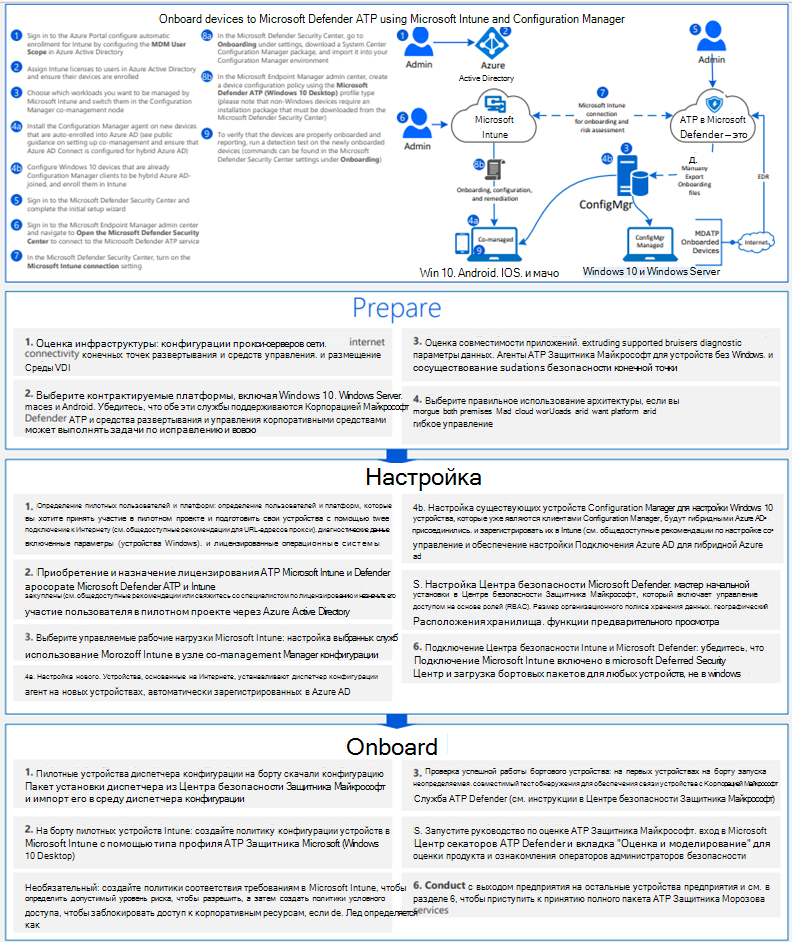
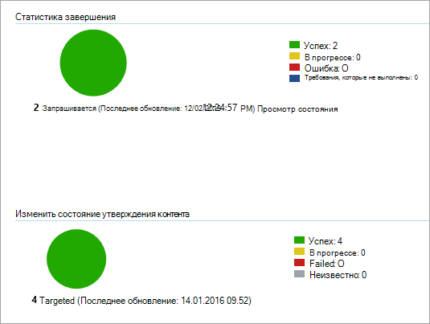

# <a name="onboard-windows-10-devices-using-configuration-manager"></a><span data-ttu-id="c66c7-104">Подключение устройств Windows 10 с помощью Configuration Manager</span><span class="sxs-lookup"><span data-stu-id="c66c7-104">Onboard Windows 10 devices using Configuration Manager</span></span>

[!INCLUDE [Microsoft 365 Defender rebranding](../../includes/microsoft-defender.md)]

<span data-ttu-id="c66c7-105">**Область применения:**</span><span class="sxs-lookup"><span data-stu-id="c66c7-105">**Applies to:**</span></span>

- [<span data-ttu-id="c66c7-106">Microsoft Defender для конечной точки</span><span class="sxs-lookup"><span data-stu-id="c66c7-106">Microsoft Defender for Endpoint</span></span>](https://go.microsoft.com/fwlink/p/?linkid=2154037)
- [<span data-ttu-id="c66c7-107">Microsoft 365 Defender</span><span class="sxs-lookup"><span data-stu-id="c66c7-107">Microsoft 365 Defender</span></span>](https://go.microsoft.com/fwlink/?linkid=2118804)
- <span data-ttu-id="c66c7-108">Текущий филиал Microsoft Endpoint Configuration Manager</span><span class="sxs-lookup"><span data-stu-id="c66c7-108">Microsoft Endpoint Configuration Manager current branch</span></span>
- <span data-ttu-id="c66c7-109">Диспетчер конфигураций System Center 2012 R2</span><span class="sxs-lookup"><span data-stu-id="c66c7-109">System Center 2012 R2 Configuration Manager</span></span>

><span data-ttu-id="c66c7-110">Хотите испытать Defender для конечной точки?</span><span class="sxs-lookup"><span data-stu-id="c66c7-110">Want to experience Defender for Endpoint?</span></span> [<span data-ttu-id="c66c7-111">Зарегистрився для бесплатной пробной.</span><span class="sxs-lookup"><span data-stu-id="c66c7-111">Sign up for a free trial.</span></span>](https://www.microsoft.com/microsoft-365/windows/microsoft-defender-atp?ocid=docs-wdatp-configureendpointssccm-abovefoldlink)

## <a name="supported-client-operating-systems"></a><span data-ttu-id="c66c7-112">Поддерживаемые клиентские операционные системы</span><span class="sxs-lookup"><span data-stu-id="c66c7-112">Supported client operating systems</span></span>

<span data-ttu-id="c66c7-113">На основе версии диспетчера конфигурации можно использовать следующие клиентские операционные системы:</span><span class="sxs-lookup"><span data-stu-id="c66c7-113">Based on the version of Configuration Manager you're running, the following client operating systems can be onboarded:</span></span>

#### <a name="configuration-manager-version-1910-and-prior"></a><span data-ttu-id="c66c7-114">Configuration Manager version 1910 and prior</span><span class="sxs-lookup"><span data-stu-id="c66c7-114">Configuration Manager version 1910 and prior</span></span>

- <span data-ttu-id="c66c7-115">Клиенты компьютеров с Windows 10</span><span class="sxs-lookup"><span data-stu-id="c66c7-115">Clients computers running Windows 10</span></span> 

#### <a name="configuration-manager-version-2002-and-later"></a><span data-ttu-id="c66c7-116">Configuration Manager version 2002 and later</span><span class="sxs-lookup"><span data-stu-id="c66c7-116">Configuration Manager version 2002 and later</span></span>

<span data-ttu-id="c66c7-117">Начиная с версии Configuration Manager 2002, вы можете использовать следующие операционные системы:</span><span class="sxs-lookup"><span data-stu-id="c66c7-117">Starting in Configuration Manager version 2002, you can onboard the following operating systems:</span></span>

- <span data-ttu-id="c66c7-118">Windows 8.1</span><span class="sxs-lookup"><span data-stu-id="c66c7-118">Windows 8.1</span></span>
- <span data-ttu-id="c66c7-119">Windows 10</span><span class="sxs-lookup"><span data-stu-id="c66c7-119">Windows 10</span></span>
- <span data-ttu-id="c66c7-120">Windows Server 2012 R2</span><span class="sxs-lookup"><span data-stu-id="c66c7-120">Windows Server 2012 R2</span></span>
- <span data-ttu-id="c66c7-121">Windows Server 2016</span><span class="sxs-lookup"><span data-stu-id="c66c7-121">Windows Server 2016</span></span>
- <span data-ttu-id="c66c7-122">Windows Server 2016, версия 1803 или более поздней версии</span><span class="sxs-lookup"><span data-stu-id="c66c7-122">Windows Server 2016, version 1803 or later</span></span>
- <span data-ttu-id="c66c7-123">Windows Server 2019</span><span class="sxs-lookup"><span data-stu-id="c66c7-123">Windows Server 2019</span></span>

>[!NOTE]
><span data-ttu-id="c66c7-124">Дополнительные сведения о том, как на борту Windows Server 2012 R2, Windows Server 2016 и Windows Server 2019 см. в таблице [Onboard Windows servers.](configure-server-endpoints.md)</span><span class="sxs-lookup"><span data-stu-id="c66c7-124">For more information on how to onboard Windows Server 2012 R2, Windows Server 2016, and Windows Server 2019, see, [Onboard Windows servers](configure-server-endpoints.md).</span></span>


### <a name="onboard-devices-using-system-center-configuration-manager"></a><span data-ttu-id="c66c7-125">Onboard devices using System Center Configuration Manager</span><span class="sxs-lookup"><span data-stu-id="c66c7-125">Onboard devices using System Center Configuration Manager</span></span>


<span data-ttu-id="c66c7-126">[](images/onboard-config-mgr.png#lightbox)</span><span class="sxs-lookup"><span data-stu-id="c66c7-126">[](images/onboard-config-mgr.png#lightbox)</span></span>


<span data-ttu-id="c66c7-127">Ознакомьтесь с [PDF или](https://github.com/MicrosoftDocs/microsoft-365-docs/raw/public/microsoft-365/security/defender-endpoint/downloads/mdatp-deployment-strategy.pdf)  [Visio,](https://github.com/MicrosoftDocs/microsoft-365-docs/raw/public/microsoft-365/security/defender-endpoint/downloads/mdatp-deployment-strategy.vsdx) чтобы увидеть различные пути развертывания Microsoft Defender для конечной точки.</span><span class="sxs-lookup"><span data-stu-id="c66c7-127">Check out the [PDF](https://github.com/MicrosoftDocs/microsoft-365-docs/raw/public/microsoft-365/security/defender-endpoint/downloads/mdatp-deployment-strategy.pdf)  or  [Visio](https://github.com/MicrosoftDocs/microsoft-365-docs/raw/public/microsoft-365/security/defender-endpoint/downloads/mdatp-deployment-strategy.vsdx) to see the various paths in deploying Microsoft Defender for Endpoint.</span></span> 


1. <span data-ttu-id="c66c7-128">Откройте пакет конфигурации Configuration Manager .zip file *(WindowsDefenderATPOnboardingPackage.zip), который* вы скачали из мастера бортового обслуживания.</span><span class="sxs-lookup"><span data-stu-id="c66c7-128">Open the Configuration Manager configuration package .zip file (*WindowsDefenderATPOnboardingPackage.zip*) that you downloaded from the service onboarding wizard.</span></span> <span data-ttu-id="c66c7-129">Вы также можете получить пакет из [Центра безопасности Защитника Майкрософт:](https://securitycenter.windows.com/)</span><span class="sxs-lookup"><span data-stu-id="c66c7-129">You can also get the package from [Microsoft Defender Security Center](https://securitycenter.windows.com/):</span></span>

    1. <span data-ttu-id="c66c7-130">В области навигации выберите **параметры**  >  **onboarding**.</span><span class="sxs-lookup"><span data-stu-id="c66c7-130">In the navigation pane, select **Settings** > **Onboarding**.</span></span>
    
    1. <span data-ttu-id="c66c7-131">Выберите Windows 10 в качестве операционной системы.</span><span class="sxs-lookup"><span data-stu-id="c66c7-131">Select Windows 10 as the operating system.</span></span>

    1. <span data-ttu-id="c66c7-132">В поле **Метод развертывания** выберите System Center Configuration **Manager 2012/2012 R2/1511/1602**.</span><span class="sxs-lookup"><span data-stu-id="c66c7-132">In the **Deployment method** field, select **System Center Configuration Manager 2012/2012 R2/1511/1602**.</span></span>
    
    1. <span data-ttu-id="c66c7-133">Выберите **пакет Загрузка** и сохраните файл .zip.</span><span class="sxs-lookup"><span data-stu-id="c66c7-133">Select **Download package**, and save the .zip file.</span></span>

2. <span data-ttu-id="c66c7-134">Извлеките содержимое файла .zip в общее расположение только для чтения, к которому можно получить доступ администраторов сети, которые будут развертывать пакет.</span><span class="sxs-lookup"><span data-stu-id="c66c7-134">Extract the contents of the .zip file to a shared, read-only location that can be accessed by the network administrators who will deploy the package.</span></span> <span data-ttu-id="c66c7-135">У вас должен быть файл с именем *WindowsDefenderATPOnboardingScript.cmd.*</span><span class="sxs-lookup"><span data-stu-id="c66c7-135">You should have a file named *WindowsDefenderATPOnboardingScript.cmd*.</span></span>

3. <span data-ttu-id="c66c7-136">Развертывание пакета, следуя шагам в статье [Packages and Programs System Center 2012 R2 Configuration Manager.](https://docs.microsoft.com/previous-versions/system-center/system-center-2012-R2/gg699369\(v=technet.10\))</span><span class="sxs-lookup"><span data-stu-id="c66c7-136">Deploy the package by following the steps in the [Packages and Programs in System Center 2012 R2 Configuration Manager](https://docs.microsoft.com/previous-versions/system-center/system-center-2012-R2/gg699369\(v=technet.10\)) article.</span></span>

    <span data-ttu-id="c66c7-137">а.</span><span class="sxs-lookup"><span data-stu-id="c66c7-137">a.</span></span> <span data-ttu-id="c66c7-138">Выберите предопределяемую коллекцию устройств для развертывания пакета.</span><span class="sxs-lookup"><span data-stu-id="c66c7-138">Choose a predefined device collection to deploy the package to.</span></span>

> [!NOTE]
> <span data-ttu-id="c66c7-139">Защитник для конечной точки не поддерживает вовне на этапе [Out-Of-Box Experience (OOBE).](https://answers.microsoft.com/en-us/windows/wiki/windows_10/how-to-complete-the-windows-10-out-of-box/47e3f943-f000-45e3-8c5c-9d85a1a0cf87)</span><span class="sxs-lookup"><span data-stu-id="c66c7-139">Defender for Endpoint doesn't support onboarding during the [Out-Of-Box Experience (OOBE)](https://answers.microsoft.com/en-us/windows/wiki/windows_10/how-to-complete-the-windows-10-out-of-box/47e3f943-f000-45e3-8c5c-9d85a1a0cf87) phase.</span></span> <span data-ttu-id="c66c7-140">Убедитесь, что пользователи заполняют OOBE после установки Или обновления Windows.</span><span class="sxs-lookup"><span data-stu-id="c66c7-140">Make sure users complete OOBE after running Windows installation or upgrading.</span></span>

>[!TIP]
> <span data-ttu-id="c66c7-141">После работы на устройстве можно выполнить тест обнаружения, чтобы убедиться, что устройство правильно вошел в службу.</span><span class="sxs-lookup"><span data-stu-id="c66c7-141">After onboarding the device, you can choose to run a detection test to verify that an device is properly onboarded to the service.</span></span> <span data-ttu-id="c66c7-142">Дополнительные сведения см. в таблице [Run a detection test on a newly onboarded Defender for Endpoint device.](run-detection-test.md)</span><span class="sxs-lookup"><span data-stu-id="c66c7-142">For more information, see [Run a detection test on a newly onboarded Defender for Endpoint device](run-detection-test.md).</span></span>
>
> <span data-ttu-id="c66c7-143">Обратите внимание, что в приложении Configuration Manager можно создать правило обнаружения, чтобы постоянно проверять, было ли устройство на борту.</span><span class="sxs-lookup"><span data-stu-id="c66c7-143">Note that it is possible to create a detection rule on a Configuration Manager application to continuously check if a device has been onboarded.</span></span> <span data-ttu-id="c66c7-144">Приложение — это другой тип объекта, чем пакет и программа.</span><span class="sxs-lookup"><span data-stu-id="c66c7-144">An application is a different type of object than a package and program.</span></span>
> <span data-ttu-id="c66c7-145">Если устройство еще не установлено (в связи с завершением OOBE или по какой-либо другой причине), диспетчер конфигурации будет повторно фиксироваться на борту устройства до тех пор, пока правило не обнаружит изменение состояния.</span><span class="sxs-lookup"><span data-stu-id="c66c7-145">If a device is not yet onboarded (due to pending OOBE completion or any other reason), Configuration Manager will retry to onboard the device until the rule detects the status change.</span></span>
> 
> <span data-ttu-id="c66c7-146">Это поведение может быть выполнено путем проверки правила обнаружения, если значение реестра "OnboardingState" (типа REG_DWORD) = 1.</span><span class="sxs-lookup"><span data-stu-id="c66c7-146">This behavior can be accomplished by creating a detection rule checking if the "OnboardingState" registry value (of type REG_DWORD) = 1.</span></span>
> <span data-ttu-id="c66c7-147">Это значение реестра расположено в статье "HKLM\SOFTWARE\Microsoft\Windows Advanced Threat Protection\Status".</span><span class="sxs-lookup"><span data-stu-id="c66c7-147">This registry value is located under "HKLM\SOFTWARE\Microsoft\Windows Advanced Threat Protection\Status".</span></span>
<span data-ttu-id="c66c7-148">Дополнительные сведения см. в дополнительных сведениях [в настройках методов обнаружения в System Center 2012 R2 Configuration Manager.](https://docs.microsoft.com/previous-versions/system-center/system-center-2012-R2/gg682159\(v=technet.10\)#step-4-configure-detection-methods-to-indicate-the-presence-of-the-deployment-type)</span><span class="sxs-lookup"><span data-stu-id="c66c7-148">For more information, see [Configure Detection Methods in System Center 2012 R2 Configuration Manager](https://docs.microsoft.com/previous-versions/system-center/system-center-2012-R2/gg682159\(v=technet.10\)#step-4-configure-detection-methods-to-indicate-the-presence-of-the-deployment-type).</span></span>

### <a name="configure-sample-collection-settings"></a><span data-ttu-id="c66c7-149">Настройка параметров коллекции образцов</span><span class="sxs-lookup"><span data-stu-id="c66c7-149">Configure sample collection settings</span></span>

<span data-ttu-id="c66c7-150">Для каждого устройства можно установить значение конфигурации, чтобы определить, можно ли собирать образцы с устройства при запросе через Центр безопасности Защитника Майкрософт для отправки файла для глубокого анализа.</span><span class="sxs-lookup"><span data-stu-id="c66c7-150">For each device, you can set a configuration value to state whether samples can be collected from the device when a request is made through Microsoft Defender Security Center to submit a file for deep analysis.</span></span>

>[!NOTE]
><span data-ttu-id="c66c7-151">Эти параметры конфигурации обычно делаются с помощью Configuration Manager.</span><span class="sxs-lookup"><span data-stu-id="c66c7-151">These configuration settings are typically done through Configuration Manager.</span></span> 

<span data-ttu-id="c66c7-152">Вы можете установить правило соответствия требованиям для элемента конфигурации в диспетчере конфигурации, чтобы изменить пример параметров обмена данными на устройстве.</span><span class="sxs-lookup"><span data-stu-id="c66c7-152">You can set a compliance rule for configuration item in Configuration Manager to change the sample share setting on a device.</span></span>

<span data-ttu-id="c66c7-153">Это правило должно быть *элементом* настройки правил соответствия требованиям, который задает значение ключа реестра на целевых устройствах, чтобы убедиться, что они являются жалобами.</span><span class="sxs-lookup"><span data-stu-id="c66c7-153">This rule should be a *remediating* compliance rule configuration item that sets the value of a registry key on targeted devices to make sure they’re complaint.</span></span>

<span data-ttu-id="c66c7-154">Конфигурация заданная с помощью следующей записи ключа реестра:</span><span class="sxs-lookup"><span data-stu-id="c66c7-154">The configuration is set through the following registry key entry:</span></span>

```console
Path: "HKLM\SOFTWARE\Policies\Microsoft\Windows Advanced Threat Protection"
Name: "AllowSampleCollection"
Value: 0 or 1
```

<span data-ttu-id="c66c7-155">Где:</span><span class="sxs-lookup"><span data-stu-id="c66c7-155">Where:</span></span><br>
<span data-ttu-id="c66c7-156">Тип ключа — это D-WORD.</span><span class="sxs-lookup"><span data-stu-id="c66c7-156">Key type is a D-WORD.</span></span> <br>
<span data-ttu-id="c66c7-157">Возможные значения:</span><span class="sxs-lookup"><span data-stu-id="c66c7-157">Possible values are:</span></span>
- <span data-ttu-id="c66c7-158">0 — не разрешает общий доступ к примеру с этого устройства</span><span class="sxs-lookup"><span data-stu-id="c66c7-158">0 - doesn't allow sample sharing  from this device</span></span>
- <span data-ttu-id="c66c7-159">1 — позволяет обмениваться всеми типами файлов с этого устройства</span><span class="sxs-lookup"><span data-stu-id="c66c7-159">1 - allows sharing of all file types from this device</span></span>

<span data-ttu-id="c66c7-160">Значение по умолчанию в случае, если ключ реестра не существует, составляет 1.</span><span class="sxs-lookup"><span data-stu-id="c66c7-160">The default value in case the registry key doesn’t exist is 1.</span></span>

<span data-ttu-id="c66c7-161">Дополнительные сведения о соответствии требованиям диспетчера конфигурации центра системы см. в введении параметров соответствия требованиям [в System Center 2012 R2 Configuration Manager.](https://docs.microsoft.com/previous-versions/system-center/system-center-2012-R2/gg682139\(v=technet.10\))</span><span class="sxs-lookup"><span data-stu-id="c66c7-161">For more information about System Center Configuration Manager Compliance, see [Introduction to compliance settings in System Center 2012 R2 Configuration Manager](https://docs.microsoft.com/previous-versions/system-center/system-center-2012-R2/gg682139\(v=technet.10\)).</span></span>


## <a name="other-recommended-configuration-settings"></a><span data-ttu-id="c66c7-162">Другие рекомендуемые параметры конфигурации</span><span class="sxs-lookup"><span data-stu-id="c66c7-162">Other recommended configuration settings</span></span>
<span data-ttu-id="c66c7-163">После включения устройств в службу важно воспользоваться включенными возможностями защиты от угроз, включив их в следующие рекомендуемые параметры конфигурации.</span><span class="sxs-lookup"><span data-stu-id="c66c7-163">After onboarding devices to the service, it's important to take advantage of the included threat protection capabilities by enabling them with the following recommended configuration settings.</span></span>

### <a name="device-collection-configuration"></a><span data-ttu-id="c66c7-164">Конфигурация коллекции устройств</span><span class="sxs-lookup"><span data-stu-id="c66c7-164">Device collection configuration</span></span>
<span data-ttu-id="c66c7-165">Если используется диспетчер конфигурации конечной точки версии 2002 или более поздней версии, можно расширить развертывание, включив серверы или клиенты на более позднем уровне.</span><span class="sxs-lookup"><span data-stu-id="c66c7-165">If you're using Endpoint Configuration Manager, version 2002 or later, you can choose to broaden the deployment to include servers or down-level clients.</span></span>


### <a name="next-generation-protection-configuration"></a><span data-ttu-id="c66c7-166">Конфигурация защиты следующего поколения</span><span class="sxs-lookup"><span data-stu-id="c66c7-166">Next generation protection configuration</span></span>
<span data-ttu-id="c66c7-167">Рекомендуется использовать следующие параметры конфигурации:</span><span class="sxs-lookup"><span data-stu-id="c66c7-167">The following configuration settings are recommended:</span></span>

<span data-ttu-id="c66c7-168">**Сканирование**</span><span class="sxs-lookup"><span data-stu-id="c66c7-168">**Scan**</span></span> <br>
- <span data-ttu-id="c66c7-169">Сканирование съемных устройств хранения, таких как USB-накопители: Да</span><span class="sxs-lookup"><span data-stu-id="c66c7-169">Scan removable storage devices such as USB drives: Yes</span></span>

<span data-ttu-id="c66c7-170">**Защита в режиме реального времени**</span><span class="sxs-lookup"><span data-stu-id="c66c7-170">**Real-time Protection**</span></span> <br>
- <span data-ttu-id="c66c7-171">Включить поведенческий мониторинг: Да</span><span class="sxs-lookup"><span data-stu-id="c66c7-171">Enable Behavioral Monitoring: Yes</span></span>
- <span data-ttu-id="c66c7-172">Включить защиту от потенциально нежелательных приложений при загрузке и до установки: Да</span><span class="sxs-lookup"><span data-stu-id="c66c7-172">Enable protection against Potentially Unwanted Applications at download and prior to installation: Yes</span></span>

<span data-ttu-id="c66c7-173">**Служба облачной защиты**</span><span class="sxs-lookup"><span data-stu-id="c66c7-173">**Cloud Protection Service**</span></span>
- <span data-ttu-id="c66c7-174">Тип членства в службе облачной защиты: расширенный членский состав</span><span class="sxs-lookup"><span data-stu-id="c66c7-174">Cloud Protection Service membership type: Advanced membership</span></span>

<span data-ttu-id="c66c7-175">**Уменьшение поверхности атаки** Настройка всех доступных правил для аудита.</span><span class="sxs-lookup"><span data-stu-id="c66c7-175">**Attack surface reduction** Configure all available rules to Audit.</span></span>

>[!NOTE]
> <span data-ttu-id="c66c7-176">Блокировка этих действий может прервать законные бизнес-процессы.</span><span class="sxs-lookup"><span data-stu-id="c66c7-176">Blocking these activities may interrupt legitimate business processes.</span></span> <span data-ttu-id="c66c7-177">Оптимальный подход — настройка всех параметров аудита, определение безопасных для включения и включение параметров конечных точек, не обнаруживающих ложных срабатывающих объектов.</span><span class="sxs-lookup"><span data-stu-id="c66c7-177">The best approach is setting everything to audit, identifying which ones are safe to turn on, and then enabling those settings on endpoints which do not have false positive detections.</span></span>


<span data-ttu-id="c66c7-178">**Защита сети**</span><span class="sxs-lookup"><span data-stu-id="c66c7-178">**Network protection**</span></span> <br>
<span data-ttu-id="c66c7-179">Перед включением сетевой защиты в режиме аудита или блокировки убедитесь, что вы установили обновление платформы антивирусных программ, которое можно получить на странице [поддержки.](https://support.microsoft.com/en-us/help/4560203/windows-defender-anti-malware-platform-binaries-are-missing)</span><span class="sxs-lookup"><span data-stu-id="c66c7-179">Prior to enabling network protection in audit or block mode, ensure that you've installed the antimalware platform update, which can be obtained from the [support page](https://support.microsoft.com/en-us/help/4560203/windows-defender-anti-malware-platform-binaries-are-missing).</span></span>


<span data-ttu-id="c66c7-180">**Контролируемый доступ к папкам**</span><span class="sxs-lookup"><span data-stu-id="c66c7-180">**Controlled folder access**</span></span><br>
<span data-ttu-id="c66c7-181">Включить функцию в режиме аудита не менее 30 дней.</span><span class="sxs-lookup"><span data-stu-id="c66c7-181">Enable the feature in audit mode for at least 30 days.</span></span> <span data-ttu-id="c66c7-182">После этого периода просмотрите обнаружения и создайте список приложений, которые могут записываться в защищенные каталоги.</span><span class="sxs-lookup"><span data-stu-id="c66c7-182">After this period, review detections and create a list of applications that are allowed to write to protected directories.</span></span>

<span data-ttu-id="c66c7-183">Дополнительные сведения см. в [дополнительных сведениях о доступе к управляемым папкам.](evaluate-controlled-folder-access.md)</span><span class="sxs-lookup"><span data-stu-id="c66c7-183">For more information, see [Evaluate controlled folder access](evaluate-controlled-folder-access.md).</span></span>


## <a name="offboard-devices-using-configuration-manager"></a><span data-ttu-id="c66c7-184">Offboard devices using Configuration Manager</span><span class="sxs-lookup"><span data-stu-id="c66c7-184">Offboard devices using Configuration Manager</span></span>

<span data-ttu-id="c66c7-185">По соображениям безопасности срок действия пакета, используемой для устройств Offboard, истекает через 30 дней после даты его загрузки.</span><span class="sxs-lookup"><span data-stu-id="c66c7-185">For security reasons, the package used to Offboard devices will expire 30 days after the date it was downloaded.</span></span> <span data-ttu-id="c66c7-186">Просроченные пакеты offboarding, отправленные на устройство, будут отклонены.</span><span class="sxs-lookup"><span data-stu-id="c66c7-186">Expired offboarding packages sent to a device will be rejected.</span></span> <span data-ttu-id="c66c7-187">При загрузке пакета offboarding вы будете уведомлены о дате истечения срока действия пакетов и он также будет включен в имя пакета.</span><span class="sxs-lookup"><span data-stu-id="c66c7-187">When downloading an offboarding package, you will be notified of the packages expiry date and it will also be included in the package name.</span></span>

> [!NOTE]
> <span data-ttu-id="c66c7-188">На одном устройстве одновременно не следует развертывать политики бортового и оффбординга, в противном случае это приведет к непредсказуемым столкновениям.</span><span class="sxs-lookup"><span data-stu-id="c66c7-188">Onboarding and offboarding policies must not be deployed on the same device at the same time, otherwise this will cause unpredictable collisions.</span></span>

### <a name="offboard-devices-using-microsoft-endpoint-manager-current-branch"></a><span data-ttu-id="c66c7-189">Offboard devices using Microsoft Endpoint Manager current branch</span><span class="sxs-lookup"><span data-stu-id="c66c7-189">Offboard devices using Microsoft Endpoint Manager current branch</span></span>

<span data-ttu-id="c66c7-190">Если вы используете текущую ветвь Microsoft Endpoint Manager, см. в таблице Создание файла конфигурации [offboarding.](https://docs.microsoft.com/configmgr/protect/deploy-use/windows-defender-advanced-threat-protection#create-an-offboarding-configuration-file)</span><span class="sxs-lookup"><span data-stu-id="c66c7-190">If you use Microsoft Endpoint Manager current branch, see [Create an offboarding configuration file](https://docs.microsoft.com/configmgr/protect/deploy-use/windows-defender-advanced-threat-protection#create-an-offboarding-configuration-file).</span></span>

### <a name="offboard-devices-using-system-center-2012-r2-configuration-manager"></a><span data-ttu-id="c66c7-191">Offboard devices using System Center 2012 R2 Configuration Manager</span><span class="sxs-lookup"><span data-stu-id="c66c7-191">Offboard devices using System Center 2012 R2 Configuration Manager</span></span>

1. <span data-ttu-id="c66c7-192">Получите пакет offboarding из [Центра безопасности Защитника Майкрософт:](https://securitycenter.windows.com/)</span><span class="sxs-lookup"><span data-stu-id="c66c7-192">Get the offboarding package from [Microsoft Defender Security Center](https://securitycenter.windows.com/):</span></span>

    1. <span data-ttu-id="c66c7-193">В области навигации выберите **Параметры**  >   **Offboarding**.</span><span class="sxs-lookup"><span data-stu-id="c66c7-193">In the navigation pane, select **Settings** >  **Offboarding**.</span></span>

    1. <span data-ttu-id="c66c7-194">Выберите Windows 10 в качестве операционной системы.</span><span class="sxs-lookup"><span data-stu-id="c66c7-194">Select Windows 10 as the operating system.</span></span>

    1. <span data-ttu-id="c66c7-195">В поле **Метод развертывания** выберите System Center Configuration **Manager 2012/2012 R2/1511/1602**.</span><span class="sxs-lookup"><span data-stu-id="c66c7-195">In the **Deployment method** field, select **System Center Configuration Manager 2012/2012 R2/1511/1602**.</span></span>
    
    1. <span data-ttu-id="c66c7-196">Выберите **пакет Загрузка** и сохраните файл .zip.</span><span class="sxs-lookup"><span data-stu-id="c66c7-196">Select **Download package**, and save the .zip file.</span></span>

2. <span data-ttu-id="c66c7-197">Извлеките содержимое файла .zip в общее расположение только для чтения, к которому можно получить доступ администраторов сети, которые будут развертывать пакет.</span><span class="sxs-lookup"><span data-stu-id="c66c7-197">Extract the contents of the .zip file to a shared, read-only location that can be accessed by the network administrators who will deploy the package.</span></span> <span data-ttu-id="c66c7-198">У вас должен быть *файл с именем WindowsDefenderATPOffboardingScript_valid_until_YYYY-MM-DD.cmd*.</span><span class="sxs-lookup"><span data-stu-id="c66c7-198">You should have a file named *WindowsDefenderATPOffboardingScript_valid_until_YYYY-MM-DD.cmd*.</span></span>

3. <span data-ttu-id="c66c7-199">Развертывание пакета, следуя шагам в статье [Packages and Programs System Center 2012 R2 Configuration Manager.](https://docs.microsoft.com/previous-versions/system-center/system-center-2012-R2/gg699369\(v=technet.10\))</span><span class="sxs-lookup"><span data-stu-id="c66c7-199">Deploy the package by following the steps in the [Packages and Programs in System Center 2012 R2 Configuration Manager](https://docs.microsoft.com/previous-versions/system-center/system-center-2012-R2/gg699369\(v=technet.10\)) article.</span></span>

    <span data-ttu-id="c66c7-200">а.</span><span class="sxs-lookup"><span data-stu-id="c66c7-200">a.</span></span> <span data-ttu-id="c66c7-201">Выберите предопределяемую коллекцию устройств для развертывания пакета.</span><span class="sxs-lookup"><span data-stu-id="c66c7-201">Choose a predefined device collection to deploy the package to.</span></span>

> [!IMPORTANT]
> <span data-ttu-id="c66c7-202">Отключение приводит к тому, что устройство перестает отправлять данные датчиков на портал, но данные с устройства, включая ссылки на все оповещения, которые у него были, будут храниться до 6 месяцев.</span><span class="sxs-lookup"><span data-stu-id="c66c7-202">Offboarding causes the device to stop sending sensor data to the portal but data from the device, including reference to any alerts it has had will be retained for up to 6 months.</span></span>


## <a name="monitor-device-configuration"></a><span data-ttu-id="c66c7-203">Мониторинг конфигурации устройства</span><span class="sxs-lookup"><span data-stu-id="c66c7-203">Monitor device configuration</span></span>

<span data-ttu-id="c66c7-204">Если вы используете текущую ветвь Microsoft Endpoint Manager, используйте встроенную панель мониторинга Defender для конечной точки в консоли Configuration Manager.</span><span class="sxs-lookup"><span data-stu-id="c66c7-204">If you're using Microsoft Endpoint Manager current branch, use the built-in Defender for Endpoint dashboard in the Configuration Manager console.</span></span> <span data-ttu-id="c66c7-205">Дополнительные сведения см. в [дополнительных сведениях Defender for Endpoint - Monitor.](https://docs.microsoft.com/configmgr/protect/deploy-use/windows-defender-advanced-threat-protection#monitor)</span><span class="sxs-lookup"><span data-stu-id="c66c7-205">For more information, see [Defender for Endpoint - Monitor](https://docs.microsoft.com/configmgr/protect/deploy-use/windows-defender-advanced-threat-protection#monitor).</span></span>

<span data-ttu-id="c66c7-206">Если вы используете System Center 2012 R2 Configuration Manager, мониторинг состоит из двух частей:</span><span class="sxs-lookup"><span data-stu-id="c66c7-206">If you're using System Center 2012 R2 Configuration Manager, monitoring consists of two parts:</span></span>

1. <span data-ttu-id="c66c7-207">Подтверждение правильного развертывания пакета конфигурации и успешного запуска (или успешного запуска) на устройствах в сети.</span><span class="sxs-lookup"><span data-stu-id="c66c7-207">Confirming the configuration package has been correctly deployed and is running (or has successfully run) on the devices in your network.</span></span>

2. <span data-ttu-id="c66c7-208">Проверка того, что устройства соответствуют службе Defender для конечной точки (это гарантирует, что устройство может завершить процесс бортовой обработки и может продолжать сообщать данные в службу).</span><span class="sxs-lookup"><span data-stu-id="c66c7-208">Checking that the devices are compliant with the Defender for Endpoint service (this ensures the device can complete the onboarding process and can continue to report data to the service).</span></span>

### <a name="confirm-the-configuration-package-has-been-correctly-deployed"></a><span data-ttu-id="c66c7-209">Подтверждение правильного развертывания пакета конфигурации</span><span class="sxs-lookup"><span data-stu-id="c66c7-209">Confirm the configuration package has been correctly deployed</span></span>

1. <span data-ttu-id="c66c7-210">В консоли Configuration Manager щелкните **Мониторинг** в нижней части панели навигации.</span><span class="sxs-lookup"><span data-stu-id="c66c7-210">In the Configuration Manager console, click **Monitoring** at the bottom of the navigation pane.</span></span>

2. <span data-ttu-id="c66c7-211">Выберите **Обзор** и **развертывание.**</span><span class="sxs-lookup"><span data-stu-id="c66c7-211">Select **Overview** and then **Deployments**.</span></span>

3. <span data-ttu-id="c66c7-212">Выберите развертывание с именем пакета.</span><span class="sxs-lookup"><span data-stu-id="c66c7-212">Select on the deployment with the package name.</span></span>

4. <span data-ttu-id="c66c7-213">Просмотрите индикаторы состояния в **статье Статистика завершения** и состояние **контента.**</span><span class="sxs-lookup"><span data-stu-id="c66c7-213">Review the status indicators under **Completion Statistics** and **Content Status**.</span></span>

    <span data-ttu-id="c66c7-214">При сбойных развертываниях (устройствах с ошибками, невыполнением требований или сбойных состояниях) может потребоваться устранение неполадок устройств.</span><span class="sxs-lookup"><span data-stu-id="c66c7-214">If there are failed deployments (devices with **Error**, **Requirements Not Met**, or **Failed statuses**), you may need to  troubleshoot the devices.</span></span> <span data-ttu-id="c66c7-215">Дополнительные сведения см. в выпуске [Устранение неполадок в microsoft Defender для конечной](troubleshoot-onboarding.md)точки.</span><span class="sxs-lookup"><span data-stu-id="c66c7-215">For more information, see, [Troubleshoot Microsoft Defender for Endpoint onboarding issues](troubleshoot-onboarding.md).</span></span>

    

### <a name="check-that-the-devices-are-compliant-with-the-microsoft-defender-for-endpoint-service"></a><span data-ttu-id="c66c7-217">Убедитесь, что устройства соответствуют службе Microsoft Defender для конечных точек.</span><span class="sxs-lookup"><span data-stu-id="c66c7-217">Check that the devices are compliant with the Microsoft Defender for Endpoint service</span></span>

<span data-ttu-id="c66c7-218">Вы можете установить правило соответствия требованиям для элемента конфигурации в System Center 2012 R2 Configuration Manager для мониторинга развертывания.</span><span class="sxs-lookup"><span data-stu-id="c66c7-218">You can set a compliance rule for configuration item in System Center 2012 R2 Configuration Manager to monitor your deployment.</span></span>

<span data-ttu-id="c66c7-219">Это правило должно быть *элементом* конфигурации правил соответствия требованиям, который отслеживает значение ключа реестра на целевых устройствах.</span><span class="sxs-lookup"><span data-stu-id="c66c7-219">This rule should be a *non-remediating* compliance rule configuration item that monitors the value of a registry key on targeted devices.</span></span>

<span data-ttu-id="c66c7-220">Мониторинг следующей записи ключа реестра:</span><span class="sxs-lookup"><span data-stu-id="c66c7-220">Monitor the following registry key entry:</span></span>

```console
Path: "HKLM\SOFTWARE\Microsoft\Windows Advanced Threat Protection\Status"
Name: "OnboardingState"
Value: "1"
```

<span data-ttu-id="c66c7-221">Дополнительные сведения см. в введении параметров соответствия требованиям [в System Center 2012 R2 Configuration Manager.](https://docs.microsoft.com/previous-versions/system-center/system-center-2012-R2/gg682139\(v=technet.10\))</span><span class="sxs-lookup"><span data-stu-id="c66c7-221">For more information, see [Introduction to compliance settings in System Center 2012 R2 Configuration Manager](https://docs.microsoft.com/previous-versions/system-center/system-center-2012-R2/gg682139\(v=technet.10\)).</span></span>

## <a name="related-topics"></a><span data-ttu-id="c66c7-222">Похожие темы</span><span class="sxs-lookup"><span data-stu-id="c66c7-222">Related topics</span></span>
- [<span data-ttu-id="c66c7-223">На борту устройств Windows 10 с использованием групповой политики</span><span class="sxs-lookup"><span data-stu-id="c66c7-223">Onboard Windows 10 devices using Group Policy</span></span>](configure-endpoints-gp.md)
- [<span data-ttu-id="c66c7-224">Подключение устройств Windows 10 с помощью средств управления мобильными устройствами</span><span class="sxs-lookup"><span data-stu-id="c66c7-224">Onboard Windows 10 devices using Mobile Device Management tools</span></span>](configure-endpoints-mdm.md)
- [<span data-ttu-id="c66c7-225">Подключение устройств Windows 10 с помощью локального сценария</span><span class="sxs-lookup"><span data-stu-id="c66c7-225">Onboard Windows 10 devices using a local script</span></span>](configure-endpoints-script.md)
- [<span data-ttu-id="c66c7-226">Подключение временных устройств инфраструктуры виртуальных рабочих столов (VDI)</span><span class="sxs-lookup"><span data-stu-id="c66c7-226">Onboard non-persistent virtual desktop infrastructure (VDI) devices</span></span>](configure-endpoints-vdi.md)
- [<span data-ttu-id="c66c7-227">Запустите тест обнаружения на недавно созданном устройстве Microsoft Defender для конечных точек</span><span class="sxs-lookup"><span data-stu-id="c66c7-227">Run a detection test on a newly onboarded Microsoft Defender for Endpoint device</span></span>](run-detection-test.md)
- [<span data-ttu-id="c66c7-228">Устранение неполадок в Microsoft Defender для проблем с бортовой точкой конечной точки</span><span class="sxs-lookup"><span data-stu-id="c66c7-228">Troubleshoot Microsoft Defender for Endpoint onboarding issues</span></span>](troubleshoot-onboarding.md)
