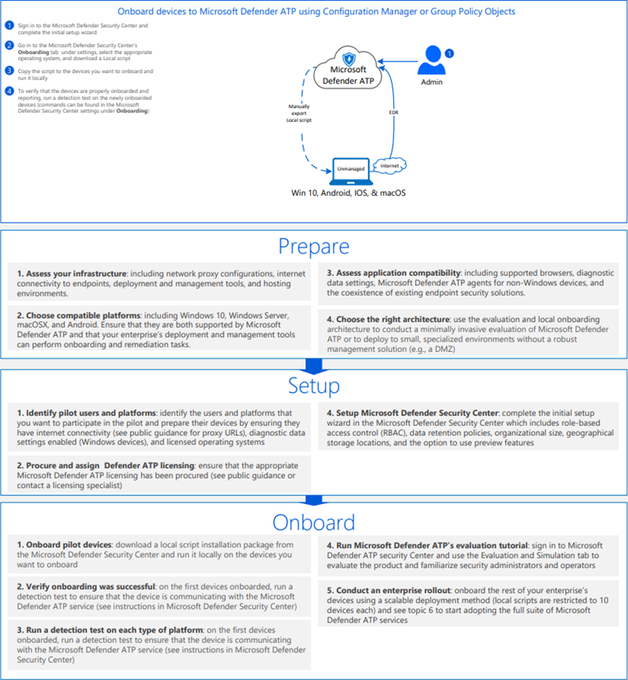

# <a name="onboard-windows-10-devices-using-a-local-script"></a><span data-ttu-id="7ab21-104">Подключение устройств Windows 10 с помощью локального сценария</span><span class="sxs-lookup"><span data-stu-id="7ab21-104">Onboard Windows 10 devices using a local script</span></span>

[!INCLUDE [Microsoft 365 Defender rebranding](../../includes/microsoft-defender.md)]

- [<span data-ttu-id="7ab21-105">Microsoft 365 Defender</span><span class="sxs-lookup"><span data-stu-id="7ab21-105">Microsoft 365 Defender</span></span>](https://go.microsoft.com/fwlink/?linkid=2118804)


><span data-ttu-id="7ab21-106">Хотите испытать Defender для конечной точки?</span><span class="sxs-lookup"><span data-stu-id="7ab21-106">Want to experience Defender for Endpoint?</span></span> [<span data-ttu-id="7ab21-107">Зарегистрився для бесплатной пробной.</span><span class="sxs-lookup"><span data-stu-id="7ab21-107">Sign up for a free trial.</span></span>](https://www.microsoft.com/microsoft-365/windows/microsoft-defender-atp?ocid=docs-wdatp-configureendpointsscript-abovefoldlink)

<span data-ttu-id="7ab21-108">Вы также можете вручную использовать отдельные устройства в Defender для конечной точки.</span><span class="sxs-lookup"><span data-stu-id="7ab21-108">You can also manually onboard individual devices to Defender for Endpoint.</span></span> <span data-ttu-id="7ab21-109">Это может потребоваться сначала при тестировании службы, прежде чем взять на себя обязательства по вмеяниям всех устройств в сети.</span><span class="sxs-lookup"><span data-stu-id="7ab21-109">You might want to do this first when testing the service before you commit to onboarding all devices in your network.</span></span>

> [!IMPORTANT]
> <span data-ttu-id="7ab21-110">Этот скрипт оптимизирован для использования на 10 устройствах.</span><span class="sxs-lookup"><span data-stu-id="7ab21-110">This script has been optimized for use on up to 10 devices.</span></span>
>
> <span data-ttu-id="7ab21-111">Для развертывания в масштабе используйте [другие параметры развертывания.](configure-endpoints.md)</span><span class="sxs-lookup"><span data-stu-id="7ab21-111">To deploy at scale, use [other deployment options](configure-endpoints.md).</span></span> <span data-ttu-id="7ab21-112">Например, можно развернуть сценарий бортовой связи на более чем 10 устройствах в производстве, а сценарий доступен на устройствах с Windows 10 на борту с [помощью групповой политики.](configure-endpoints-gp.md)</span><span class="sxs-lookup"><span data-stu-id="7ab21-112">For example, you can deploy an onboarding script to more than 10 devices in production with the script available in [Onboard Windows 10 devices using Group Policy](configure-endpoints-gp.md).</span></span>

## <a name="onboard-devices"></a><span data-ttu-id="7ab21-113">Бортовых устройств</span><span class="sxs-lookup"><span data-stu-id="7ab21-113">Onboard devices</span></span> 

<span data-ttu-id="7ab21-114">[](images/onboard-script.png#lightbox)</span><span class="sxs-lookup"><span data-stu-id="7ab21-114">[](images/onboard-script.png#lightbox)</span></span>


<span data-ttu-id="7ab21-115">Ознакомьтесь с [PDF или](https://github.com/MicrosoftDocs/microsoft-365-docs/raw/public/microsoft-365/security/defender-endpoint/downloads/mdatp-deployment-strategy.pdf)  [Visio,](https://github.com/MicrosoftDocs/microsoft-365-docs/raw/public/microsoft-365/security/defender-endpoint/downloads/mdatp-deployment-strategy.vsdx) чтобы увидеть различные пути развертывания Defender для конечной точки.</span><span class="sxs-lookup"><span data-stu-id="7ab21-115">Check out the [PDF](https://github.com/MicrosoftDocs/microsoft-365-docs/raw/public/microsoft-365/security/defender-endpoint/downloads/mdatp-deployment-strategy.pdf)  or  [Visio](https://github.com/MicrosoftDocs/microsoft-365-docs/raw/public/microsoft-365/security/defender-endpoint/downloads/mdatp-deployment-strategy.vsdx) to see the various paths in deploying Defender for Endpoint.</span></span> 


1.  <span data-ttu-id="7ab21-116">Откройте пакет конфигурации GP .zip file *(WindowsDefenderATPOnboardingPackage.zip), загруженный* из мастера бортового обслуживания.</span><span class="sxs-lookup"><span data-stu-id="7ab21-116">Open the GP configuration package .zip file (*WindowsDefenderATPOnboardingPackage.zip*) that you downloaded from the service onboarding wizard.</span></span> <span data-ttu-id="7ab21-117">Вы также можете получить пакет из [Центра безопасности Защитника Майкрософт:](https://securitycenter.windows.com/)</span><span class="sxs-lookup"><span data-stu-id="7ab21-117">You can also get the package from [Microsoft Defender Security Center](https://securitycenter.windows.com/):</span></span>

    1. <span data-ttu-id="7ab21-118">В области навигации выберите **параметры**  >  **onboarding**.</span><span class="sxs-lookup"><span data-stu-id="7ab21-118">In the navigation pane, select **Settings** > **Onboarding**.</span></span>

    1. <span data-ttu-id="7ab21-119">Выберите Windows 10 в качестве операционной системы.</span><span class="sxs-lookup"><span data-stu-id="7ab21-119">Select Windows 10 as the operating system.</span></span>

    1. <span data-ttu-id="7ab21-120">В поле **Метод развертывания** выберите **локальный скрипт**.</span><span class="sxs-lookup"><span data-stu-id="7ab21-120">In the **Deployment method** field, select **Local Script**.</span></span>

    1. <span data-ttu-id="7ab21-121">Нажмите **кнопку Скачать пакет** и сохранить файл .zip.</span><span class="sxs-lookup"><span data-stu-id="7ab21-121">Click **Download package** and save the .zip file.</span></span>

  
2.  <span data-ttu-id="7ab21-122">Извлечение содержимого пакета конфигурации в расположение на устройстве, которое необходимо на борту (например, на рабочем столе).</span><span class="sxs-lookup"><span data-stu-id="7ab21-122">Extract the contents of the configuration package to a location on the device you want to onboard (for example, the Desktop).</span></span> <span data-ttu-id="7ab21-123">У вас должен быть файл с именем *WindowsDefenderATPOnboardingScript.cmd.*</span><span class="sxs-lookup"><span data-stu-id="7ab21-123">You should have a file named *WindowsDefenderATPOnboardingScript.cmd*.</span></span>

3.  <span data-ttu-id="7ab21-124">Откройте повышенную командную строку на устройстве и запустите сценарий:</span><span class="sxs-lookup"><span data-stu-id="7ab21-124">Open an elevated command-line prompt on the device and run the script:</span></span>

    1.  <span data-ttu-id="7ab21-125">В меню **Пуск** введите **cmd**.</span><span class="sxs-lookup"><span data-stu-id="7ab21-125">Go to **Start** and type **cmd**.</span></span>

    1.  <span data-ttu-id="7ab21-126">Щелкните правой кнопкой мыши пункт **Командная строка** и выберите команду **Запуск от имени администратора**.</span><span class="sxs-lookup"><span data-stu-id="7ab21-126">Right-click **Command prompt** and select **Run as administrator**.</span></span>

        

4.  <span data-ttu-id="7ab21-128">Введите расположение файла скрипта.</span><span class="sxs-lookup"><span data-stu-id="7ab21-128">Type the location of the script file.</span></span> <span data-ttu-id="7ab21-129">Если вы скопировали файл на рабочий стол, введите: *%userprofile%\Desktop\WindowsDefenderATPOnboardingScript.cmd*</span><span class="sxs-lookup"><span data-stu-id="7ab21-129">If you copied the file to the desktop, type: *%userprofile%\Desktop\WindowsDefenderATPOnboardingScript.cmd*</span></span>

5.  <span data-ttu-id="7ab21-130">Нажмите **клавишу Ввод** или нажмите **кнопку ОК**.</span><span class="sxs-lookup"><span data-stu-id="7ab21-130">Press the **Enter** key or click **OK**.</span></span>

<span data-ttu-id="7ab21-131">Сведения о том, как вручную проверить соответствие устройству и правильно сообщать данные датчиков см. в статью Устранение неполадок [в microsoft Defender для](troubleshoot-onboarding.md)конечной точки.</span><span class="sxs-lookup"><span data-stu-id="7ab21-131">For information on how you can manually validate that the device is compliant and correctly reports sensor data see, [Troubleshoot Microsoft Defender for Endpoint onboarding issues](troubleshoot-onboarding.md).</span></span>


>[!TIP]
> <span data-ttu-id="7ab21-132">После работы на устройстве можно выполнить тест обнаружения, чтобы убедиться, что устройство правильно вошел в службу.</span><span class="sxs-lookup"><span data-stu-id="7ab21-132">After onboarding the device, you can choose to run a detection test to verify that an device is properly onboarded to the service.</span></span> <span data-ttu-id="7ab21-133">Дополнительные сведения см. в сайте [Run a detection test on a newly onboarded Microsoft Defender for Endpoint endpoint.](run-detection-test.md)</span><span class="sxs-lookup"><span data-stu-id="7ab21-133">For more information, see [Run a detection test on a newly onboarded Microsoft Defender for Endpoint endpoint](run-detection-test.md).</span></span>

## <a name="configure-sample-collection-settings"></a><span data-ttu-id="7ab21-134">Настройка параметров коллекции образцов</span><span class="sxs-lookup"><span data-stu-id="7ab21-134">Configure sample collection settings</span></span>
<span data-ttu-id="7ab21-135">Для каждого устройства можно установить значение конфигурации, чтобы определить, можно ли собирать образцы с устройства при запросе через Центр безопасности Защитника Майкрософт для отправки файла для глубокого анализа.</span><span class="sxs-lookup"><span data-stu-id="7ab21-135">For each device, you can set a configuration value to state whether samples can be collected from the device when a request is made through Microsoft Defender Security Center to submit a file for deep analysis.</span></span>

<span data-ttu-id="7ab21-136">Вы можете вручную настроить параметр обмена примерами на устройстве с помощью *regedit* или создания и запуска *файла .reg.*</span><span class="sxs-lookup"><span data-stu-id="7ab21-136">You can manually configure the sample sharing setting on the device by using *regedit* or creating and running a *.reg* file.</span></span>  

<span data-ttu-id="7ab21-137">Конфигурация заданная с помощью следующей записи ключа реестра:</span><span class="sxs-lookup"><span data-stu-id="7ab21-137">The configuration is set through the following registry key entry:</span></span>

```console
Path: “HKLM\SOFTWARE\Policies\Microsoft\Windows Advanced Threat Protection”
Name: "AllowSampleCollection"
Value: 0 or 1
```
<span data-ttu-id="7ab21-138">Где:</span><span class="sxs-lookup"><span data-stu-id="7ab21-138">Where:</span></span><br>
<span data-ttu-id="7ab21-139">Тип имени — это D-WORD.</span><span class="sxs-lookup"><span data-stu-id="7ab21-139">Name type is a D-WORD.</span></span> <br>
<span data-ttu-id="7ab21-140">Возможные значения:</span><span class="sxs-lookup"><span data-stu-id="7ab21-140">Possible values are:</span></span>
- <span data-ttu-id="7ab21-141">0 — не разрешает общий доступ к примеру с этого устройства</span><span class="sxs-lookup"><span data-stu-id="7ab21-141">0 - doesn't allow sample sharing  from this device</span></span>
- <span data-ttu-id="7ab21-142">1 — позволяет обмениваться всеми типами файлов с этого устройства</span><span class="sxs-lookup"><span data-stu-id="7ab21-142">1 - allows sharing of all file types from this device</span></span>

<span data-ttu-id="7ab21-143">Значение по умолчанию в случае, если ключ реестра не существует, составляет 1.</span><span class="sxs-lookup"><span data-stu-id="7ab21-143">The default value in case the registry key doesn’t exist is 1.</span></span>


## <a name="offboard-devices-using-a-local-script"></a><span data-ttu-id="7ab21-144">Offboard devices using a local script</span><span class="sxs-lookup"><span data-stu-id="7ab21-144">Offboard devices using a local script</span></span>
<span data-ttu-id="7ab21-145">По соображениям безопасности срок действия пакета, используемой для устройств Offboard, истекает через 30 дней после даты его загрузки.</span><span class="sxs-lookup"><span data-stu-id="7ab21-145">For security reasons, the package used to Offboard devices will expire 30 days after the date it was downloaded.</span></span> <span data-ttu-id="7ab21-146">Просроченные пакеты offboarding, отправленные на устройство, будут отклонены.</span><span class="sxs-lookup"><span data-stu-id="7ab21-146">Expired offboarding packages sent to an device will be rejected.</span></span> <span data-ttu-id="7ab21-147">При загрузке пакета offboarding вы будете уведомлены о дате истечения срока действия пакетов и он также будет включен в имя пакета.</span><span class="sxs-lookup"><span data-stu-id="7ab21-147">When downloading an offboarding package you will be notified of the packages expiry date and it will also be included in the package name.</span></span>

> [!NOTE]
> <span data-ttu-id="7ab21-148">На одном устройстве одновременно не следует развертывать политики бортового и оффбординга, в противном случае это приведет к непредсказуемым столкновениям.</span><span class="sxs-lookup"><span data-stu-id="7ab21-148">Onboarding and offboarding policies must not be deployed on the same device at the same time, otherwise this will cause unpredictable collisions.</span></span>

1. <span data-ttu-id="7ab21-149">Получите пакет offboarding из [Центра безопасности Защитника Майкрософт:](https://securitycenter.windows.com/)</span><span class="sxs-lookup"><span data-stu-id="7ab21-149">Get the offboarding package from [Microsoft Defender Security Center](https://securitycenter.windows.com/):</span></span>

    1. <span data-ttu-id="7ab21-150">В области навигации выберите **Параметры**  >  **Offboarding**.</span><span class="sxs-lookup"><span data-stu-id="7ab21-150">In the navigation pane, select **Settings** > **Offboarding**.</span></span>

    1. <span data-ttu-id="7ab21-151">Выберите Windows 10 в качестве операционной системы.</span><span class="sxs-lookup"><span data-stu-id="7ab21-151">Select Windows 10 as the operating system.</span></span>

    1. <span data-ttu-id="7ab21-152">В поле **Метод развертывания** выберите **локальный скрипт**.</span><span class="sxs-lookup"><span data-stu-id="7ab21-152">In the **Deployment method** field, select **Local Script**.</span></span>

    1. <span data-ttu-id="7ab21-153">Нажмите **кнопку Скачать пакет** и сохранить файл .zip.</span><span class="sxs-lookup"><span data-stu-id="7ab21-153">Click **Download package** and save the .zip file.</span></span>

2. <span data-ttu-id="7ab21-154">Извлеките содержимое файла .zip в общее расположение только для чтения, к нему можно получить доступ на устройствах.</span><span class="sxs-lookup"><span data-stu-id="7ab21-154">Extract the contents of the .zip file to a shared, read-only location that can be accessed by the devices.</span></span> <span data-ttu-id="7ab21-155">У вас должен быть *файл с именем WindowsDefenderATPOffboardingScript_valid_until_YYYY-MM-DD.cmd*.</span><span class="sxs-lookup"><span data-stu-id="7ab21-155">You should have a file named *WindowsDefenderATPOffboardingScript_valid_until_YYYY-MM-DD.cmd*.</span></span>

3.  <span data-ttu-id="7ab21-156">Откройте повышенную командную строку на устройстве и запустите сценарий:</span><span class="sxs-lookup"><span data-stu-id="7ab21-156">Open an elevated command-line prompt on the device and run the script:</span></span>

    1.  <span data-ttu-id="7ab21-157">В меню **Пуск** введите **cmd**.</span><span class="sxs-lookup"><span data-stu-id="7ab21-157">Go to **Start** and type **cmd**.</span></span>

    1.  <span data-ttu-id="7ab21-158">Щелкните правой кнопкой мыши пункт **Командная строка** и выберите команду **Запуск от имени администратора**.</span><span class="sxs-lookup"><span data-stu-id="7ab21-158">Right-click **Command prompt** and select **Run as administrator**.</span></span>

        

4.  <span data-ttu-id="7ab21-160">Введите расположение файла скрипта.</span><span class="sxs-lookup"><span data-stu-id="7ab21-160">Type the location of the script file.</span></span> <span data-ttu-id="7ab21-161">Если вы скопировали файл на рабочий стол, введите: *%userprofile%\Desktop\WindowsDefenderATPOffboardingScript_valid_until_YYYY-MM-DD.cmd*</span><span class="sxs-lookup"><span data-stu-id="7ab21-161">If you copied the file to the desktop, type: *%userprofile%\Desktop\WindowsDefenderATPOffboardingScript_valid_until_YYYY-MM-DD.cmd*</span></span>

5.  <span data-ttu-id="7ab21-162">Нажмите **клавишу Ввод** или нажмите **кнопку ОК**.</span><span class="sxs-lookup"><span data-stu-id="7ab21-162">Press the **Enter** key or click **OK**.</span></span>

> [!IMPORTANT]
> <span data-ttu-id="7ab21-163">Отключение приводит к тому, что устройство перестает отправлять данные датчиков на портал, но данные с устройства, включая ссылки на все оповещения, которые у него были, будут храниться до 6 месяцев.</span><span class="sxs-lookup"><span data-stu-id="7ab21-163">Offboarding causes the device to stop sending sensor data to the portal but data from the device, including reference to any alerts it has had will be retained for up to 6 months.</span></span>


## <a name="monitor-device-configuration"></a><span data-ttu-id="7ab21-164">Мониторинг конфигурации устройства</span><span class="sxs-lookup"><span data-stu-id="7ab21-164">Monitor device configuration</span></span>
<span data-ttu-id="7ab21-165">Вы можете следовать различным шагам проверки в проблемах с устранением неполадок, чтобы убедиться, что сценарий выполнен успешно и агент запущен. [](troubleshoot-onboarding.md)</span><span class="sxs-lookup"><span data-stu-id="7ab21-165">You can follow the different verification steps in the [Troubleshoot onboarding issues](troubleshoot-onboarding.md) to verify that the script completed successfully and the agent is running.</span></span>

<span data-ttu-id="7ab21-166">Мониторинг также можно сделать непосредственно на портале или с помощью различных средств развертывания.</span><span class="sxs-lookup"><span data-stu-id="7ab21-166">Monitoring can also be done directly on the portal, or by using the different deployment tools.</span></span>

### <a name="monitor-devices-using-the-portal"></a><span data-ttu-id="7ab21-167">Мониторинг устройств с помощью портала</span><span class="sxs-lookup"><span data-stu-id="7ab21-167">Monitor devices using the portal</span></span>
1. <span data-ttu-id="7ab21-168">Перейдите в Центр безопасности Защитника Майкрософт.</span><span class="sxs-lookup"><span data-stu-id="7ab21-168">Go to Microsoft Defender Security Center.</span></span>

2. <span data-ttu-id="7ab21-169">Щелкните **список Устройств**.</span><span class="sxs-lookup"><span data-stu-id="7ab21-169">Click **Devices list**.</span></span>

3. <span data-ttu-id="7ab21-170">Убедитесь, что устройства отображаются.</span><span class="sxs-lookup"><span data-stu-id="7ab21-170">Verify that devices are appearing.</span></span>


## <a name="related-topics"></a><span data-ttu-id="7ab21-171">Похожие темы</span><span class="sxs-lookup"><span data-stu-id="7ab21-171">Related topics</span></span>
- [<span data-ttu-id="7ab21-172">На борту устройств Windows 10 с использованием групповой политики</span><span class="sxs-lookup"><span data-stu-id="7ab21-172">Onboard Windows 10 devices using Group Policy</span></span>](configure-endpoints-gp.md)
- [<span data-ttu-id="7ab21-173">На борту устройств Windows 10 с помощью Microsoft Endpoint Configuration Manager</span><span class="sxs-lookup"><span data-stu-id="7ab21-173">Onboard Windows 10 devices using Microsoft Endpoint Configuration Manager</span></span>](configure-endpoints-sccm.md)
- [<span data-ttu-id="7ab21-174">Подключение устройств Windows 10 с помощью средств управления мобильными устройствами</span><span class="sxs-lookup"><span data-stu-id="7ab21-174">Onboard Windows 10 devices using Mobile Device Management tools</span></span>](configure-endpoints-mdm.md)
- [<span data-ttu-id="7ab21-175">Подключение временных устройств инфраструктуры виртуальных рабочих столов (VDI)</span><span class="sxs-lookup"><span data-stu-id="7ab21-175">Onboard non-persistent virtual desktop infrastructure (VDI) devices</span></span>](configure-endpoints-vdi.md)
- [<span data-ttu-id="7ab21-176">Запустите тест обнаружения на недавно созданном устройстве Microsoft Defender для конечных точек</span><span class="sxs-lookup"><span data-stu-id="7ab21-176">Run a detection test on a newly onboarded Microsoft Defender for Endpoint device</span></span>](run-detection-test.md)
- [<span data-ttu-id="7ab21-177">Устранение неполадок в Microsoft Defender для проблем с бортовой точкой конечной точки</span><span class="sxs-lookup"><span data-stu-id="7ab21-177">Troubleshoot Microsoft Defender for Endpoint onboarding issues</span></span>](troubleshoot-onboarding.md)
