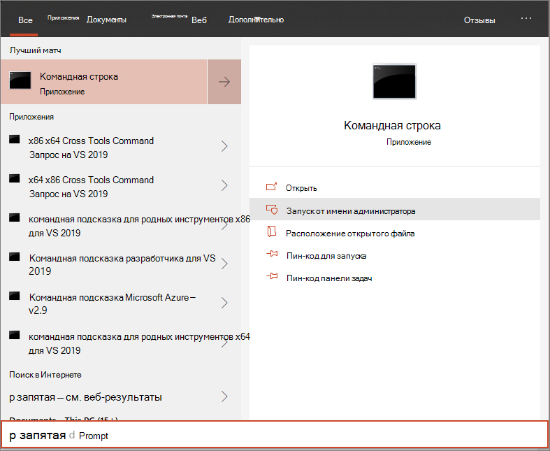

# <a name="onboard-windows-10-devices-using-a-local-script"></a>Подключение устройств Windows 10 с помощью локального сценария

[!INCLUDE [Microsoft 365 Defender rebranding](../../includes/microsoft-defender.md)]

- [Microsoft 365 Defender](https://go.microsoft.com/fwlink/?linkid=2118804)


>Хотите испытать Defender для конечной точки? [Зарегистрився для бесплатной пробной.](https://www.microsoft.com/microsoft-365/windows/microsoft-defender-atp?ocid=docs-wdatp-configureendpointsscript-abovefoldlink)

Вы также можете вручную использовать отдельные устройства в Defender для конечной точки. Это может потребоваться сначала при тестировании службы, прежде чем взять на себя обязательства по вмеяниям всех устройств в сети.

> [!IMPORTANT]
> Этот скрипт оптимизирован для использования на 10 устройствах.
>
> Для развертывания в масштабе используйте [другие параметры развертывания.](configure-endpoints.md) Например, можно развернуть сценарий onboarding на более чем 10 устройствах в производстве со сценарием, доступным на Windows 10 устройствах с помощью [групповой политики.](configure-endpoints-gp.md)

## <a name="onboard-devices"></a>Подключение устройств 

[](images/onboard-script.png#lightbox)


Ознакомьтесь с [PDF или Visio,](https://github.com/MicrosoftDocs/microsoft-365-docs/raw/public/microsoft-365/security/defender-endpoint/downloads/mdatp-deployment-strategy.pdf) чтобы увидеть различные пути развертывания Defender для конечной точки. [](https://github.com/MicrosoftDocs/microsoft-365-docs/raw/public/microsoft-365/security/defender-endpoint/downloads/mdatp-deployment-strategy.vsdx) 


1.  Откройте пакет конфигурации GP .zip *(WindowsDefenderATPOnboardingPackage.zip),* который вы скачали из мастера бортового обслуживания. Вы также можете получить пакет из [Центр безопасности в Microsoft Defender:](https://securitycenter.windows.com/)

    1. В области навигации выберите **Параметры**  >  **onboarding**.

    1. Выберите Windows 10 в качестве операционной системы.

    1. В поле **Метод развертывания** выберите **локальный скрипт**.

    1. Нажмите **кнопку Загрузка** пакета и сохраните .zip файл.

  
2.  Извлечение содержимого пакета конфигурации в расположение на устройстве, которое необходимо на борту (например, на рабочем столе). У вас должен быть файл с именем *WindowsDefenderATPLocalOnboardingScript.cmd.*

3.  Откройте повышенную командную строку на устройстве и запустите сценарий:

    1.  В меню **Пуск** введите **cmd**.

    1.  Щелкните правой кнопкой мыши пункт **Командная строка** и выберите команду **Запуск от имени администратора**.

        

4.  Введите расположение файла скрипта. Если вы скопировали файл на рабочий стол, введите: *%userprofile%\Desktop\WindowsDefenderATPLocalOnboardingScript.cmd*

5.  Нажмите **клавишу Ввод** или нажмите **кнопку ОК**.

Сведения о том, как вручную проверить соответствие устройству и правильно сообщать данные датчиков см. в статью Устранение неполадок [в microsoft Defender для](troubleshoot-onboarding.md)конечной точки.


>[!TIP]
> После работы на устройстве можно выполнить тест обнаружения, чтобы убедиться, что устройство правильно вошел в службу. Дополнительные сведения см. в сайте [Run a detection test on a newly onboarded Microsoft Defender for Endpoint endpoint.](run-detection-test.md)

## <a name="configure-sample-collection-settings"></a>Настройка параметров коллекции образцов
Для каждого устройства можно установить значение конфигурации, чтобы определить, можно ли собирать образцы с устройства при Центр безопасности в Microsoft Defender отправки файла для глубокого анализа.

Вы можете вручную настроить параметр обмена примерами на устройстве с помощью *regedit* или создания и запуска *файла .reg.*  

Конфигурация заданная с помощью следующей записи ключа реестра:

```console
Path: “HKLM\SOFTWARE\Policies\Microsoft\Windows Advanced Threat Protection”
Name: "AllowSampleCollection"
Value: 0 or 1
```
Где:<br>
Тип имени — это D-WORD. <br>
Возможные значения:
- 0 — не разрешает общий доступ к примеру с этого устройства
- 1 — позволяет обмениваться всеми типами файлов с этого устройства

Значение по умолчанию в случае, если ключ реестра не существует, составляет 1.


## <a name="offboard-devices-using-a-local-script"></a>Offboard devices using a local script
По соображениям безопасности срок действия пакета, используемой для устройств Offboard, истекает через 30 дней после даты его загрузки. Просроченные пакеты offboarding, отправленные на устройство, будут отклонены. При загрузке пакета offboarding вы будете уведомлены о дате истечения срока действия пакетов и он также будет включен в имя пакета.

> [!NOTE]
> На одном устройстве одновременно не следует развертывать политики бортового и оффбординга, в противном случае это приведет к непредсказуемым столкновениям.

1. Получите пакет offboarding из [Центр безопасности в Microsoft Defender:](https://securitycenter.windows.com/)

    1. В области навигации выберите **Параметры**  >  **Offboarding**.

    1. Выберите Windows 10 в качестве операционной системы.

    1. В поле **Метод развертывания** выберите **локальный скрипт**.

    1. Нажмите **кнопку Загрузка** пакета и сохраните .zip файл.

2. Извлечение содержимого файла .zip в общее расположение только для чтения, к нему можно получить доступ на устройствах. У вас должен быть *файл с именем WindowsDefenderATPOffboardingScript_valid_until_YYYY-MM-DD.cmd*.

3.  Откройте повышенную командную строку на устройстве и запустите сценарий:

    1.  В меню **Пуск** введите **cmd**.

    1.  Щелкните правой кнопкой мыши пункт **Командная строка** и выберите команду **Запуск от имени администратора**.

        

4.  Введите расположение файла скрипта. Если вы скопировали файл на рабочий стол, введите: *%userprofile%\Desktop\WindowsDefenderATPOffboardingScript_valid_until_YYYY-MM-DD.cmd*

5.  Нажмите **клавишу Ввод** или нажмите **кнопку ОК**.

> [!IMPORTANT]
> Отключение приводит к тому, что устройство перестает отправлять данные датчиков на портал, но данные с устройства, включая ссылки на все оповещения, которые у него были, будут храниться до 6 месяцев.


## <a name="monitor-device-configuration"></a>Мониторинг конфигурации устройства
Вы можете следовать различным шагам проверки в проблемах с устранением неполадок, чтобы убедиться, что сценарий выполнен успешно и агент запущен. [](troubleshoot-onboarding.md)

Мониторинг также можно сделать непосредственно на портале или с помощью различных средств развертывания.

### <a name="monitor-devices-using-the-portal"></a>Мониторинг устройств с помощью портала
1. Перейдите в Центр безопасности в Microsoft Defender.

2. Щелкните **список Устройств**.

3. Убедитесь, что устройства отображаются.


## <a name="related-topics"></a>Статьи по теме
- [Onboard Windows 10 с помощью групповой политики](configure-endpoints-gp.md)
- [На борту Windows 10 устройства с Microsoft Endpoint Configuration Manager](configure-endpoints-sccm.md)
- [Подключение устройств Windows 10 с помощью средств управления мобильными устройствами](configure-endpoints-mdm.md)
- [Подключение временных устройств инфраструктуры виртуальных рабочих столов (VDI)](configure-endpoints-vdi.md)
- [Запустите тест обнаружения на недавно созданном устройстве Microsoft Defender для конечных точек](run-detection-test.md)
- [Устранение неполадок в Microsoft Defender для проблем с бортовой точкой конечной точки](troubleshoot-onboarding.md)
