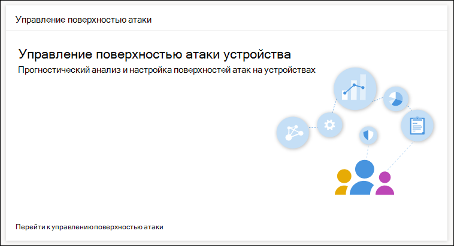
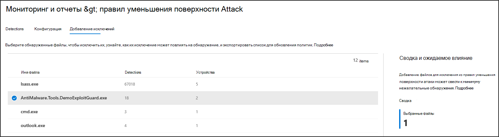

# Оптимизация развертывания и обнаружений правил сокращения направлений атакOptimize ASR rule deployment and detections

[!INCLUDE [Microsoft 365 Defender rebranding](../../includes/microsoft-defender.md)]

**Область применения:****Applies to:**
- [Microsoft Defender для конечной точкиMicrosoft Defender for Endpoint](https://go.microsoft.com/fwlink/p/?linkid=2154037)
- [Microsoft 365 DefenderMicrosoft 365 Defender](https://go.microsoft.com/fwlink/?linkid=2118804)

> Хотите испытать Defender для конечной точки?Want to experience Defender for Endpoint? [Зарегистрився для бесплатной пробной.](https://www.microsoft.com/en-us/WindowsForBusiness/windows-atp?ocid=docs-wdatp-onboardconfigure-abovefoldlink)[Sign up for a free trial](https://www.microsoft.com/en-us/WindowsForBusiness/windows-atp?ocid=docs-wdatp-onboardconfigure-abovefoldlink).

[Правила уменьшения поверхности атаки (ASR) определяют](./attack-surface-reduction.md) и предотвращают типичные эксплойты вредоносных программ.[Attack surface reduction (ASR) rules](./attack-surface-reduction.md) identify and prevent typical malware exploits. Они контролируют, когда и как может запускаться потенциально вредоносный код.They control when and how potentially malicious code can run. Например, они могут запретить JavaScript или VBScript запускать загруженный исполняемый файл, блокировать вызовы API Win32 из макроса Office и блокировать процессы, которые выполняются с USB-дисков.For example, they can prevent JavaScript or VBScript from launching a downloaded executable, block Win32 API calls from Office macros, and block processes that run from USB drives.

 
*Карта управления поверхностью атаки**Attack surface management card*

Карта *управления поверхностью атаки* — это точка входа в инструменты в центре Microsoft 365 безопасности, которые можно использовать для:The *Attack surface management card* is an entry point to tools in Microsoft 365 security center that you can use to:

* Понимание того, как в настоящее время в организации развернуты правила ASR.Understand how ASR rules are currently deployed in your organization.
* Просмотрите обнаружение ASR и определите возможные неправильные обнаружения.Review ASR detections and identify possible incorrect detections.
* Анализ воздействия исключений и создание списка путей для исключения файлов.Analyze the impact of exclusions and generate the list of file paths to exclude.

Выберите **Go для** мониторинга мониторинга поверхности & отчетов > правил уменьшения поверхности > добавления  >  **исключений.**Select **Go to attack surface management** > **Monitoring & reports > Attack surface reduction rules > Add exclusions**. Оттуда можно перейти к другим разделам центра Microsoft 365 безопасности.From there, you can navigate to other sections of Microsoft 365 security center.

 
Вкладка ***Добавление исключений** на странице Правил уменьшения поверхности атаки в центре Microsoft 365 безопасности*The ***Add exclusions** tab in the Attack surface reduction rules page in Microsoft 365 security center*

> [!NOTE]
> Чтобы получить Microsoft 365 центр безопасности, вам потребуется лицензия Microsoft 365 E3 E5 и учетная запись, которая имеет определенные роли в Azure Active Directory.To access Microsoft 365 security center, you need a Microsoft 365 E3 or E5 license and an account that has certain roles on Azure Active Directory. [Ознакомьтесь с требуемой лицензией и разрешениями.](/office365/securitycompliance/microsoft-security-and-compliance#required-licenses-and-permissions)[Read about required licenses and permissions](/office365/securitycompliance/microsoft-security-and-compliance#required-licenses-and-permissions).

Дополнительные сведения о развертывании правил ASR в центре Microsoft 365 см. в рубрике Монитор и управление развертыванием и обнаружением правил [ASR.](/office365/securitycompliance/monitor-devices#monitor-and-manage-asr-rule-deployment-and-detections)For more information about ASR rule deployment in Microsoft 365 security center, see [Monitor and manage ASR rule deployment and detections](/office365/securitycompliance/monitor-devices#monitor-and-manage-asr-rule-deployment-and-detections).

**Связанные темы****Related topics**

* [Убедитесь, что ваши устройства настроены правильноEnsure your devices are configured properly](configure-machines.md)
* [Запись устройств в Microsoft Defender для конечной точкиGet devices onboarded to Microsoft Defender for Endpoint](configure-machines-onboarding.md)
* [Отслеживание соответствия базовому стандарту безопасности Microsoft Defender для конечной точкиMonitor compliance to the Microsoft Defender for Endpoint security baseline](configure-machines-security-baseline.md)
