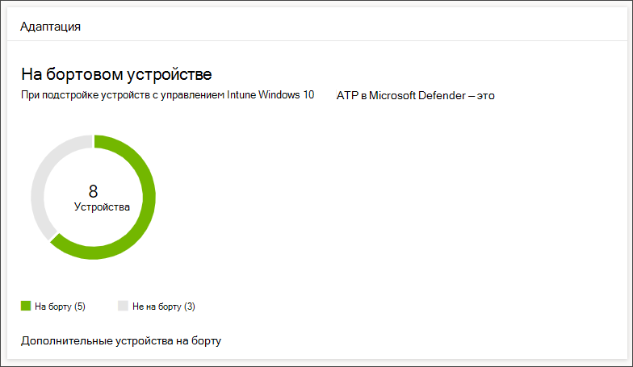
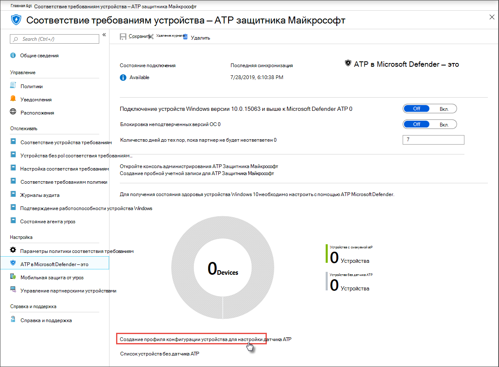

# Запись устройств в Microsoft Defender для конечной точкиGet devices onboarded to Microsoft Defender for Endpoint

[!INCLUDE [Microsoft 365 Defender rebranding](../../includes/microsoft-defender.md)]

**Область применения:****Applies to:**
- [Microsoft Defender для конечной точкиMicrosoft Defender for Endpoint](https://go.microsoft.com/fwlink/p/?linkid=2154037)
- [Microsoft 365 DefenderMicrosoft 365 Defender](https://go.microsoft.com/fwlink/?linkid=2118804)

>Хотите испытать Microsoft Defender для конечной точки?Want to experience Microsoft Defender for Endpoint? [Зарегистрився для бесплатной пробной.Sign up for a free trial.](https://www.microsoft.com/microsoft-365/windows/microsoft-defender-atp?ocid=docs-wdatp-onboardconfigure-abovefoldlink)

Каждое бортовом устройстве добавляет дополнительный датчик обнаружения конечных точек и ответа (EDR) и повышает видимость по поводу активности нарушения в сети.Each onboarded device adds an additional endpoint detection and response (EDR) sensor and increases visibility over breach activity in your network. Онбординг также обеспечивает проверку устройства на наличие уязвимых компонентов, а также проблемы с конфигурацией безопасности и получение критически важных действий по исправлению ситуации во время атак.Onboarding also ensures that a device can be checked for vulnerable components as well security configuration issues and can receive critical remediation actions during attacks.

Перед отслеживанием и управлением на борту устройств:Before you can track and manage onboarding of devices:
- [Регистрация устройств в управление IntuneEnroll your devices to Intune management](configure-machines.md#enroll-devices-to-intune-management)
- [Убедитесь, что у вас есть необходимые разрешенияEnsure you have the necessary permissions](configure-machines.md#obtain-required-permissions)

## Обнаружение и отслеживание незащищенных устройствDiscover and track unprotected devices

Карта **onboarding** предоставляет высококачественный обзор скорости вмеяния, сравнивая количество устройств с Windows 10, которые фактически были на борту, с Defender для конечной точки, и общее число устройств Windows 10, управляемых intune.The **Onboarding** card provides a high-level overview of your onboarding rate by comparing the number of Windows 10 devices that have actually onboarded to Defender for Endpoint against the total number of Intune-managed Windows 10 devices.

 
*Карта, показывающая бортовые устройства по сравнению с общее число устройств с управлением Intune в Windows 10**Card showing onboarded devices compared to the total number of Intune-managed Windows 10 device*

>[!NOTE]
>Если вы использовали диспетчер конфигурации Центра безопасности, сценарий бортовой обработки или другие методы бортовой обработки, которые не используют профили Intune, вы можете столкнуться с несоответствиями данных.If you used Security Center Configuration Manager, the onboarding script, or other onboarding methods that don’t use Intune profiles, you might encounter data discrepancies. Чтобы устранить эти несоответствия, создайте соответствующий профиль конфигурации Intune для onboarding Defender для конечной точки и назначьте этот профиль устройствам.To resolve these discrepancies, create a corresponding Intune configuration profile for Defender for Endpoint onboarding and assign that profile to your devices.

## На борту больше устройств с профилями IntuneOnboard more devices with Intune profiles

Defender for Endpoint предоставляет несколько удобных вариантов для устройств [с Windows 10.](onboard-configure.md)Defender for Endpoint provides several convenient options for [onboarding Windows 10 devices](onboard-configure.md). Однако для устройств с управляемым intune можно использовать профили Intune для удобного развертывания датчика Defender для конечных точек для выбора устройств, эффективно вовсю перенаправив эти устройства в службу.For Intune-managed devices, however, you can leverage Intune profiles to conveniently deploy the Defender for Endpoint sensor to select devices, effectively onboarding these devices to the service.

С **бортовой карты** выберите  дополнительные устройства для создания и назначения профиля в Intune.From the **Onboarding** card, select **Onboard more devices** to create and assign a profile on Intune. Ссылка приводит вас на страницу соответствия требованиям устройств в Intune, которая предоставляет аналогичный обзор состояния бортового устройства.The link takes you to the device compliance page on Intune, which provides a similar overview of your onboarding state.

 
   *Страница Microsoft Defender для соответствия требованиям для конечных устройств в управлении устройствами Intune**Microsoft Defender for Endpoint device compliance page on Intune device management*

>[!TIP]
>Кроме того, вы можете перейти на страницу соответствия требованиям для конечной точки Defender для конечной точки на портале [Microsoft Azure](https://portal.azure.com/) из всех служб **> Intune >** устройств > Microsoft Defender ATP .Alternatively, you can navigate to the Defender for Endpoint onboarding compliance page in the [Microsoft Azure portal](https://portal.azure.com/) from **All services > Intune > Device compliance > Microsoft Defender ATP**.

>[!NOTE]
> Если вы хотите просмотреть самые последние данные устройства, нажмите кнопку Список устройств **без датчика ATP**.If you want to view the most up-to-date device data, click on **List of devices without ATP sensor**.

На странице соответствия требованиям устройства создайте профиль конфигурации специально для развертывания датчика Defender для конечной точки и назначьте этот профиль устройствам, которые необходимо на борту.From the device compliance page, create a configuration profile specifically for the deployment of the Defender for Endpoint sensor and assign that profile to the devices you want to onboard. Для этого можно либо:To do this, you can either:

- Выберите **Создать профиль конфигурации устройства, чтобы настроить датчик ATP,** чтобы начать с предварительного профиля конфигурации устройства.Select **Create a device configuration profile to configure ATP sensor** to start with a predefined device configuration profile.
- Создайте профиль конфигурации устройства с нуля.Create the device configuration profile from scratch.

Дополнительные сведения см. в материале Об использовании профилей конфигурации устройств Intune на бортовых устройствах [в Defender для конечной точки.](https://docs.microsoft.com/intune/advanced-threat-protection#onboard-devices-by-using-a-configuration-profile)For more information, [read about using Intune device configuration profiles to onboard devices to Defender for Endpoint](https://docs.microsoft.com/intune/advanced-threat-protection#onboard-devices-by-using-a-configuration-profile).

>Хотите испытать Microsoft Defender для конечной точки?Want to experience Microsoft Defender for Endpoint? [Зарегистрився для бесплатной пробной.Sign up for a free trial.](https://www.microsoft.com/microsoft-365/windows/microsoft-defender-atp?ocid=docs-wdatp-onboardconfigure-belowfoldlink)

## Похожие темыRelated topics
- [Убедитесь, что ваши устройства настроены правильноEnsure your devices are configured properly](configure-machines.md)
- [Повышение соответствия базовому стандарту безопасности Defender для конечной точкиIncrease compliance to the Defender for Endpoint security baseline](configure-machines-security-baseline.md)
- [Оптимизация развертывания и обнаружений правил сокращения направлений атакOptimize ASR rule deployment and detections](configure-machines-asr.md)
