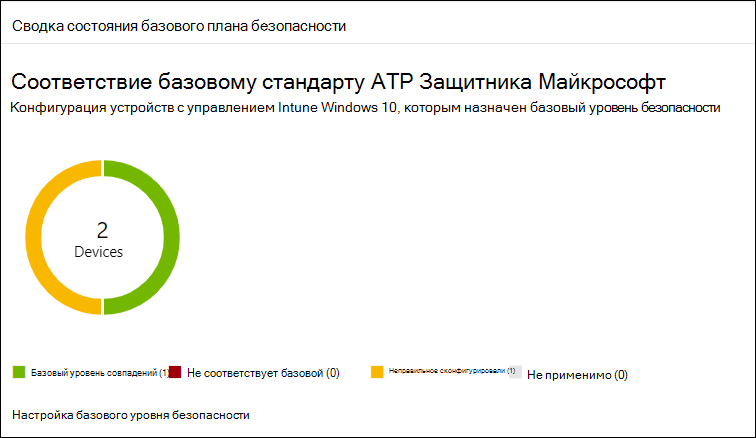
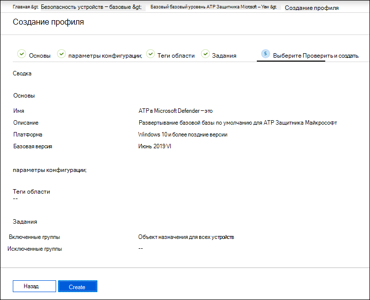

# Повышение соответствия базовому стандарту безопасности Microsoft Defender для конечной точки

[!INCLUDE [Microsoft 365 Defender rebranding](../../includes/microsoft-defender.md)]

**Область применения:**
- [Microsoft Defender для конечной точки](https://go.microsoft.com/fwlink/p/?linkid=2154037)
- [Microsoft 365 Defender](https://go.microsoft.com/fwlink/?linkid=2118804)

>Хотите испытать Defender для конечной точки? [Зарегистрився для бесплатной пробной.](https://www.microsoft.com/microsoft-365/windows/microsoft-defender-atp?ocid=docs-wdatp-onboardconfigure-abovefoldlink)

Базовые уровни безопасности обеспечивают настройку функций безопасности в соответствии с рекомендациями экспертов по безопасности и Windows системных администраторов. При развертывании базовый уровень безопасности Defender для конечной точки задает элементы управления безопасностью Defender for Endpoint для обеспечения оптимальной защиты.

Чтобы понять базовые показатели безопасности и их присвоение в Intune с помощью профилей конфигурации, ознакомьтесь [с этим часто задаваемым вопросам.](/intune/security-baselines#q--a)

Перед развертыванием и отслеживанием соответствия базовым требованиям безопасности:
- [Регистрация устройств в управление Intune](configure-machines.md#enroll-devices-to-intune-management)
- [Убедитесь, что у вас есть необходимые разрешения](configure-machines.md#obtain-required-permissions)

## Сравнение базовых показателей безопасности Microsoft Defender для конечной точки и Windows Intune
Базовая линия безопасности Windows Intune содержит полный набор рекомендуемых параметров, необходимых для безопасной настройки устройств, работающих Windows, включая параметры браузера, параметры PowerShell, а также параметры некоторых функций безопасности, таких как антивирусная программа в Microsoft Defender. В отличие от этого базовый параметр Defender for Endpoint предоставляет параметры, оптимизируют все элементы управления безопасностью в стеке Defender для конечной точки, включая параметры для обнаружение и нейтрализация атак на конечные точки (EDR), а также параметры, также найденные в базовой линии безопасности Windows Intune. Дополнительные сведения о каждом базовом сценарии см. в.

- [Windows базовые параметры безопасности для Intune](/intune/security-baseline-settings-windows)
- [Базовые параметры Microsoft Defender для конечной точки для Intune](/intune/security-baseline-settings-defender-atp)

В идеале для устройств, на борту в Defender для конечной точки, развернуты оба базовых плана: базовый уровень безопасности Windows Intune для первоначальной безопасности Windows, а затем базовый уровень безопасности Defender для конечной точки на уровне сверху, чтобы оптимально настроить элементы управления безопасностью Defender для конечной точки. Чтобы воспользоваться последними данными о рисках и угрозах и свести к минимуму конфликты по мере развития базовых показателей, всегда применяйте новейшие версии базовых показателей во всех продуктах, как только они будут выпущены.

>[!NOTE]
>Базовый уровень безопасности Defender для конечной точки оптимизирован для физических устройств и в настоящее время не рекомендуется использовать для виртуальных машин (виртуальных машин) или конечных точек VDI. Некоторые базовые параметры могут повлиять на удаленные интерактивные сеансы в виртуализированных средах.

## Мониторинг соответствия базовому стандарту безопасности Defender для конечной точки

**Базовая** карточка безопасности в управлении конфигурацией устройств предоставляет обзор соответствия требованиям для Windows 10 устройств, которые были назначены базовой базой безопасности Defender для конечной точки. 

 
*Карта, показывающая соответствие базовому стандарту безопасности Defender для конечной точки*

Каждому устройству предоставляется один из следующих типов состояния:

- **Соответствует базовому параметру**— параметры устройства соответствуют всем настройкам в базовой
- **Не соответствует базовой линии**— по крайней мере один параметр устройства не соответствует базовому
- **Неправильно настроенный**— по крайней мере один базовый параметр неправильно настроен на устройстве и находится в состоянии конфликта, ошибки или ожидания
- **Не применимо**. По крайней мере один базовый параметр не применим на устройстве

Чтобы просмотреть конкретные устройства, выберите **Настройка базового уровня** безопасности на карте. Это позволяет вам получить управление устройствами Intune. Затем выберите **состояние устройства** для имен и статусов устройств.

>[!NOTE]
>Могут возникнуть расхождения в агрегированных данных, отображаемой на странице управления конфигурацией устройств, и данных, отображаемой на экранах обзоров в Intune.

## Обзор и назначение базовой базы безопасности Microsoft Defender для конечной точки

Управление конфигурацией устройств отслеживает базовое соответствие только Windows 10 устройств, которые были специально назначены базовой базой безопасности Microsoft Defender для конечной точки. Вы можете удобно просмотреть базовый уровень и назначить его устройствам в управлении устройствами Intune.

1. Выберите **Настройка базовой базы безопасности** на базовой карте **безопасности,** чтобы перейти к управлению устройствами Intune. Отображается аналогичный обзор базового соответствия требованиям.

   >[!TIP]
   > Кроме того, вы можете перейти к базовой линии безопасности Defender для конечной точки на портале Microsoft Azure из всех служб **> Intune >** устройства > базовые > ATP в Защитнике Microsoft базовые > ATP в Защитнике Microsoft.

2. Создайте новый профиль.

    
   *Обзор базового обзора базовой безопасности Для Защитника Майкрософт для конечной точки в Intune*

3. Во время создания профиля можно просмотреть и настроить определенные параметры в базовом варианте.

    
   *Параметры базовой безопасности при создании профиля в Intune*

4. Назначьте профиль соответствующей группе устройств.

    
   *Назначение базового профиля безопасности в Intune*

5. Создайте профиль, чтобы сохранить его и развернуть его в назначенной группе устройств.

    
   *Создание базового профиля безопасности в Intune*

>[!TIP]
>Базовые показатели безопасности в Intune предоставляют удобный способ комплексной защиты и защиты устройств. [Дополнительные данные о базовых уровнях безопасности в Intune.](/intune/security-baselines)

>Хотите испытать Microsoft Defender для конечной точки? [Зарегистрився для бесплатной пробной.](https://www.microsoft.com/microsoft-365/windows/microsoft-defender-atp?ocid=docs-wdatp-onboardconfigure-belowfoldlink)

## Статьи по теме
- [Убедитесь, что ваши устройства настроены правильно](configure-machines.md)
- [Запись устройств в Microsoft Defender для конечной точки](configure-machines-onboarding.md)
- [Оптимизация развертывания и обнаружений правил сокращения направлений атак](configure-machines-asr.md)
