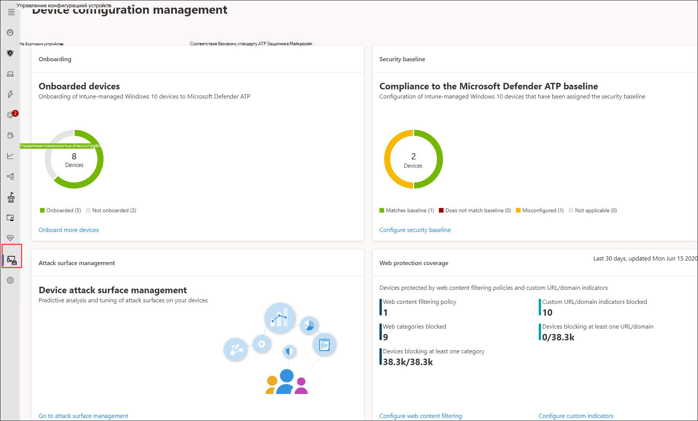
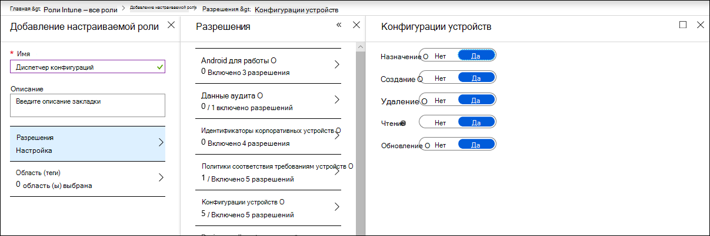

# Убедитесь, что ваши устройства настроены правильноEnsure your devices are configured properly

[!INCLUDE [Microsoft 365 Defender rebranding](../../includes/microsoft-defender.md)]

**Область применения:****Applies to:**
- [Microsoft Defender для конечной точкиMicrosoft Defender for Endpoint](https://go.microsoft.com/fwlink/p/?linkid=2154037)
- [Microsoft 365 DefenderMicrosoft 365 Defender](https://go.microsoft.com/fwlink/?linkid=2118804)

>Хотите испытать Defender для конечной точки?Want to experience Defender for Endpoint? [Зарегистрився для бесплатной пробной.Sign up for a free trial.](https://www.microsoft.com/microsoft-365/windows/microsoft-defender-atp?ocid=docs-wdatp-onboardconfigure-abovefoldlink)

С помощью правильно настроенных устройств можно повысить общую устойчивость к угрозам и повысить возможности обнаружения и реагирования на атаки.With properly configured devices, you can boost overall resilience against threats and enhance your capability to detect and respond to attacks. Управление конфигурацией безопасности помогает убедиться, что ваши устройства:Security configuration management helps ensure that your devices:

- Onboard to Microsoft Defender for EndpointOnboard to Microsoft Defender for Endpoint
- Встреча или превышение базовой конфигурации безопасности Defender для конечной точкиMeet or exceed the Defender for Endpoint security baseline configuration
- Иметь стратегические меры по смягчению последствий атакиHave strategic attack surface mitigations in place

Щелкните **управление конфигурацией** из меню навигации, чтобы открыть страницу управления конфигурацией устройства.Click **Configuration management** from the navigation menu to open the Device configuration management page.

 
*Страница управления конфигурацией устройств**Device configuration management page*

Вы можете отслеживать состояние конфигурации на организационном уровне и быстро принимать меры в ответ на плохое покрытие на борту, проблемы с соответствием требованиям и плохо оптимизированные меры по смягчению последствий атак с помощью прямых, глубоких ссылок на страницы управления устройствами в центре безопасности Microsoft Intune и Microsoft 365.You can track configuration status at an organizational level and quickly take action in response to poor onboarding coverage, compliance issues, and poorly optimized attack surface mitigations through direct, deep links to device management pages on Microsoft Intune and Microsoft 365 security center.

При этом вы можете воспользоваться преимуществами:In doing so, you benefit from:
- Всеобъемлющая видимость событий на устройствахComprehensive visibility of the events on your devices
- Надежный интеллект угроз и мощные технологии обучения устройств для обработки необработанных событий и определения активности и показателей угрозы нарушенияRobust threat intelligence and powerful device learning technologies for processing raw events and identifying the breach activity and threat indicators
- Полный набор функций безопасности, настроенных для эффективного остановки установки вредоносных имплантатов, захвата системных файлов и процессов, эксфильтрации данных и других действий с угрозами.A full stack of security features configured to efficiently stop the installation of malicious implants, hijacking of system files and process, data exfiltration, and other threat activities
- Оптимизация смягчения последствий атак, максимальное повышение стратегической защиты от активности угроз и сведение к минимуму влияния на производительностьOptimized attack surface mitigations, maximizing strategic defenses against threat activity while minimizing impact to productivity

## Регистрация устройств в управление IntuneEnroll devices to Intune management

Управление конфигурацией устройств тесно сотрудничает с управлением устройствами Intune для создания инвентаризации устройств в организации и базовой конфигурации безопасности.Device configuration management works closely with Intune device management to establish the inventory of the devices in your organization and the baseline security configuration. Вы сможете отслеживать и управлять вопросами конфигурации на устройствах с управлением intune Windows 10.You will be able to track and manage configuration issues on Intune-managed Windows 10 devices.

Прежде чем обеспечить правильную настройку устройств, зарегистрировать их в управление Intune.Before you can ensure your devices are configured properly, enroll them to Intune management. Регистрация intune является надежной и имеет несколько параметров регистрации для Windows 10 устройств.Intune enrollment is robust and has several enrollment options for Windows 10 devices. Дополнительные сведения о параметрах регистрации Intune см. в материале о настройке регистрации для [Windows устройств.](/intune/windows-enroll)For more information about Intune enrollment options, read about [setting up enrollment for Windows devices](/intune/windows-enroll).

>[!NOTE]
>Для регистрации Windows устройств в Intune администраторам должны быть назначены лицензии.To enroll Windows devices to Intune, administrators must have already been assigned licenses. [Узнайте о назначении лицензий для регистрации устройств.](/intune/licenses-assign)[Read about assigning licenses for device enrollment](/intune/licenses-assign).

>[!TIP] 
>Чтобы оптимизировать управление устройствами через Intune, [подключите Intune к Защитнику для конечной точки.](/intune/advanced-threat-protection#enable-windows-defender-atp-in-intune)To optimize device management through Intune, [connect Intune to Defender for Endpoint](/intune/advanced-threat-protection#enable-windows-defender-atp-in-intune).

## Получение необходимых разрешенийObtain required permissions
По умолчанию управлять профилями конфигурации устройств, необходимыми для бортовых устройств и развертывания базовой базы безопасности, могут только пользователи, которым назначена роль глобального администратора или администратора службы Intune в Azure AD.By default, only users who have been assigned the Global Administrator or the Intune Service Administrator role on Azure AD can manage and assign the device configuration profiles needed for onboarding devices and deploying the security baseline.

Если вам назначены другие роли, убедитесь, что у вас есть необходимые разрешения:If you have been assigned other roles, ensure you have the necessary permissions:

- Полные разрешения на конфигурации устройствFull permissions to device configurations
- Полные разрешения на базовые показатели безопасностиFull permissions to security baselines
- Чтение разрешений для политик соответствия требованиям к устройствамRead permissions to device compliance policies
- Чтение разрешений в организацииRead permissions to the organization

 
*Разрешения конфигурации устройств в Intune**Device configuration permissions on Intune*

>[!TIP] 
>Дополнительные новости о назначении разрешений в Intune см. в материале [о создании настраиваемой роли.](/intune/create-custom-role#to-create-a-custom-role)To learn more about assigning permissions on Intune, [read about creating custom roles](/intune/create-custom-role#to-create-a-custom-role).

## В этом разделеIn this section
СтатьяTopic | ОписаниеDescription
:---|:---
[Получить устройства на борту в Defender для конечной точкиGet devices onboarded to Defender for Endpoint](configure-machines-onboarding.md)| Отслеживание состояния onboarding устройств, управляемых intune, и дополнительных устройств на борту через Intune.Track onboarding status of Intune-managed devices and onboard more devices through Intune. 
[Повышение соответствия базовому стандарту безопасности Defender для конечной точкиIncrease compliance to the Defender for Endpoint security baseline](configure-machines-security-baseline.md) | Отслеживание базового соответствия и несоответствия.Track baseline compliance and noncompliance. Развертывание базовой базы безопасности на более управляемых intune устройствах.Deploy the security baseline to more Intune-managed devices.
[Оптимизация развертывания и обнаружений правил сокращения направлений атакOptimize ASR rule deployment and detections](configure-machines-asr.md) | Просмотрите развертывание правил и настройка обнаружения с помощью средств анализа воздействия в Microsoft 365 центре безопасности.Review rule deployment and tweak detections using impact analysis tools in Microsoft 365 security center.

>Хотите испытать Defender для конечной точки?Want to experience Defender for Endpoint? [Зарегистрився для бесплатной пробной.Sign up for a free trial.](https://www.microsoft.com/microsoft-365/windows/microsoft-defender-atp?ocid=docs-wdatp-onboardconfigure-belowfoldlink)
