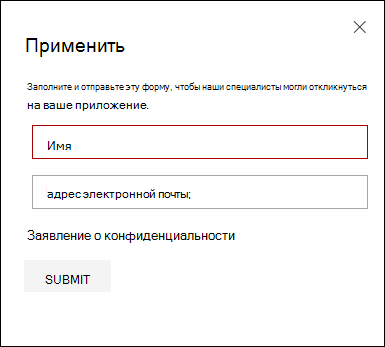
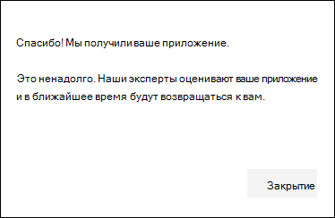
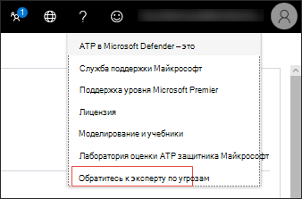
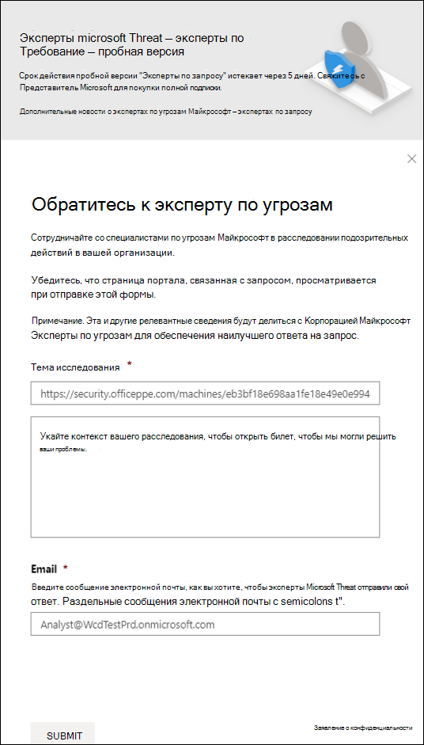
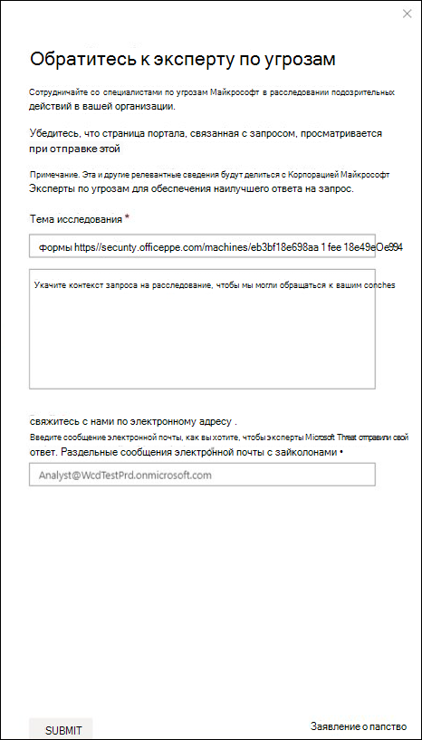

# Настройка возможностей экспертов Майкрософт по угрозам и управление ими

[!INCLUDE [Microsoft 365 Defender rebranding](../../includes/microsoft-defender.md)]

**Область применения:**
- [Microsoft Defender для конечной точки](https://go.microsoft.com/fwlink/p/?linkid=2154037)
- [Microsoft 365 Defender](https://go.microsoft.com/fwlink/?linkid=2118804)

>Хотите испытать Defender для конечной точки? [Зарегистрився для бесплатной пробной.](https://www.microsoft.com/microsoft-365/windows/microsoft-defender-atp?ocid=docs-wdatp-assignaccess-abovefoldlink)

## Подготовка 
> [!NOTE]
> Обсудите требования к требованиям с поставщиком технической службы Майкрософт и командой учетных записей, прежде чем применить к эксперты Майкрософт по угрозам - служба управляемой охоты на угрозы targeted Attack Notification.

Убедитесь, что Защитник для конечной точки развернут в среде с зарегистрированными устройствами, а не только на лабораторной настройках.

Если вы клиент Defender для **конечных** точек, вам необходимо подать заявление на эксперты Майкрософт по угрозам - Целевые уведомления о нападении, чтобы получить специальные сведения и анализ, чтобы помочь определить наиболее важные угрозы, чтобы вы могли быстро реагировать на них. Свяжитесь с командой учетных записей или представителем **Майкрософт,** чтобы подписаться на эксперты Майкрософт по угрозам - эксперты по запросу, чтобы проконсультироваться с нашими экспертами по угрозам по соответствующим обнаружениям и противникам.

## Apply for эксперты Майкрософт по угрозам - служба уведомлений о целевых атаках 
Если вы уже клиент Defender для конечной точки, вы можете подать заявление через Центр безопасности в Microsoft Defender. 

1. Из области навигации перейдите в Параметры > общие > расширенные функции > эксперты Майкрософт по угрозам **- Targeted Attack Notifications**.

2. Нажмите **Применить**.

    

3. Введите свое имя и адрес электронной почты, чтобы корпорация Майкрософт вернулась к вам в приложении.

    

4. Прочитайте [заявление о конфиденциальности,](https://privacy.microsoft.com/en-us/privacystatement)а затем **нажмите Кнопку Отправить,** когда вы закончили. Вы получите приветственный адрес электронной почты после утверждения приложения.

    

При его приеме вы получите приветственный адрес электронной почты, и вы увидите изменение кнопки **Apply** на кнопку toggle, которая находится "на". В случае, если вы хотите выйти из службы уведомлений о целевых атаках, сдвиньте кнопку "Off" и нажмите кнопку **Сохранить** предпочтения в нижней части страницы. 

## Где вы увидите целевые уведомления об атаке из эксперты Майкрософт по угрозам 
Вы можете получать целевое уведомление об атаке из эксперты Майкрософт по угрозам через следующую среду:  
- Страница Инциденты портала Defender for **Endpoint** 
- Панель оповещений портала "Защитник для **конечных точек"**  
- OData оповещения [API и](/windows/security/threat-protection/microsoft-defender-atp/get-alerts) [REST API](/windows/security/threat-protection/microsoft-defender-atp/pull-alerts-using-rest-api)
- [Таблица DeviceAlertEvents](/windows/security/threat-protection/microsoft-defender-atp/advanced-hunting-devicealertevents-table) в расширенных охотах
- При настройке электронной почты 

Чтобы получать целевые уведомления об атаке по электронной почте, создайте правило уведомления по электронной почте.

### Создание правила уведомления по электронной почте 
Вы можете создать правила для отправки уведомлений электронной почты для получателей уведомлений. Дополнительные сведения см. в публикации  [Configure alert notifications](configure-email-notifications.md) to create, edit, delete or troubleshoot email notification.

## Просмотр уведомления о целевой атаке  
Вы начнете получать целевое уведомление об атаке эксперты Майкрософт по угрозам электронной почты после настройки системы для получения уведомления электронной почты.  

1. Щелкните ссылку в электронной почте, чтобы перейти к соответствующему контексту оповещений на панели мониторинга с тегами **экспертов Threat**. 

2. На панели мониторинга выберите ту же тему оповещения, которую вы получили из электронной почты, чтобы просмотреть сведения.  

## Подписка на эксперты Майкрософт по угрозам - Эксперты по запросу
Это доступно в качестве службы подписки. Если вы уже клиент Defender для конечной точки, вы можете связаться со своим представителем Майкрософт, чтобы подписаться на эксперты Майкрософт по угрозам - Эксперты по запросу. 

## Проконсультируйтесь с экспертом по угрозам Майкрософт о подозрительных действиях в области кибербезопасности в вашей организации. 
Вы можете сотрудничать с эксперты Майкрософт по угрозам, которые могут быть вовлечены непосредственно из Центр безопасности в Microsoft Defender для быстрого и точного ответа. Эксперты предоставляют сведения, чтобы лучше понять сложные угрозы, целевые уведомления об атаках, которые вы получаете, или если вам нужно больше информации о оповещениях, потенциально скомпрометированном устройстве или контексте разведки угроз, которые вы видите на панели мониторинга портала. 

> [!NOTE]
> - Запросы оповещений, связанные с настраиваемыми данными разведки угроз в организации, в настоящее время не поддерживаются. Сведения о работе служб безопасности или группе реагирования на инциденты.
> - Чтобы отправить запрос  "Обратитесь к эксперту по угрозе", необходимо иметь разрешение на управление настройками безопасности на портале Центра безопасности.

1. Перейдите на страницу портала с соответствующими сведениями, которые необходимо исследовать, например, страницу **Incident.** Убедитесь, что перед отправкой запроса на расследование будет просмотрена страница соответствующего оповещения или устройства. 

2. В верхнем правом меню нажмите кнопку **?** . Затем выберите **Обратитесь к эксперту по угрозам**. 

    

    Откроется экран вылетов. На следующем экране показано, когда вы находитесь на пробной подписке.

    

    Следующий экран показывает, когда вы находитесь на полной эксперты Майкрософт по угрозам - эксперты по запросу подписки.

    

    Поле **темы запроса** предварительно заполнено ссылкой на соответствующую страницу для запроса на исследование. Например, ссылка на страницу сведений об инциденте, оповещении или устройстве, на которую вы были при запросе.

3.  В следующем поле укайте достаточно информации, чтобы эксперты Майкрософт по угрозам контекста для начала расследования.
  
4. Введите адрес электронной почты, который вы хотите использовать, чтобы соответствовать эксперты Майкрософт по угрозам.

> [!NOTE]
> Если вы хотите отслеживать состояние дел "Эксперты по запросу" с помощью Центра служб Майкрософт, перенаправление в диспетчер технической учетной записи. 

Просмотрите это видео для краткого обзора центра служб Майкрософт.

>[!VIDEO https://www.microsoft.com/videoplayer/embed/RE4pk9f] 

   
## Примеры тем исследования, которые можно проконсультироваться с эксперты Майкрософт по угрозам - Эксперты по запросу 

**Сведения об оповещении**
- Мы видим новый тип оповещений для двоичного двоичного параметра living-off-the-land: [AlertID]. Можете ли вы рассказать нам больше об этом оповещении и о том, как мы можем исследовать далее?
- Мы наблюдали две аналогичные атаки, которые пытаются выполнять вредоносные скрипты PowerShell, но создают различные оповещения. Одна из них — "Подозрительная командная строка PowerShell", а другая — "Вредоносный файл был обнаружен на основе показаний, предоставленных O365". В чем разница?
- Сегодня я получаю нечетное оповещение об аномальных количествах сбойных логинов с устройства пользователя с высоким профилем. Я не могу найти какие-либо дополнительные доказательства вокруг этих попыток войти. Как Защитник для конечной точки может видеть эти попытки? Какой тип входных входов отслеживается?
- Можете ли вы дать дополнительные сведения или сведения об этом оповещении: "Наблюдалось подозрительное поведение системной утилиты". 

**Возможный компьютерный компромисс**
- Можете ли вы помочь ответить, почему мы видим "Неизвестный процесс наблюдается?" Это сообщение или оповещение часто встречается на многих устройствах. Мы ценим любые входные данные для уточнения того, связано ли это сообщение или оповещение с вредоносными действиями.
- Можете ли вы помочь проверить возможный компромисс в следующей системе на [date] с аналогичным поведением, как предыдущее [имя вредоносных программ] обнаружение вредоносных программ в той же системе в [месяц]?

**Сведения о разведке угроз**
- Обнаружена фишинговая электронная почта, которая передала пользователю вредоносный документ Word. Вредоносный документ Word вызвал серию подозрительных событий, которые вызвали несколько оповещений Microsoft Defender о вредоносных программах. Есть ли у вас сведения об этой вредоносной программе? Если да, можете ли вы отправить мне ссылку?
- Недавно я увидел [ссылку на социальные сети, например, в Twitter или блоге] об угрозе, которая направлена на мою отрасль. Можете ли вы помочь мне понять, какую защиту защитник для конечной точки обеспечивает от этого субъекта угрозы? 

**эксперты Майкрософт по угрозам оповещений** 
- Может ли ваша группа реагирования на инциденты помочь нам в решении целевого уведомления об атаке, которое мы получили?
- Я получил это целевое уведомление об атаке из эксперты Майкрософт по угрозам. У нас нет собственной группы реагирования на инциденты. Что мы можем сделать сейчас и как сдержать инцидент?
- Я получил уведомление о целевой атаке из эксперты Майкрософт по угрозам. Какие данные вы можете предоставить нам, чтобы мы могли передать нашей группе реагирования на инциденты?

  >[!NOTE]
  >эксперты Майкрософт по угрозам — это служба управляемой охоты на кибербезопасность, а не служба реагирования на инциденты. Тем не менее, эксперты могут без проблем перенаупрестить расследование в службы группы обнаружения и реагирования Microsoft Cybersecurity Solutions Group (CSG) при необходимости. Вы также можете взаимодействовать со своей командой реагирования на инциденты для устранения проблем, которые требуют реагирования на инциденты. 

## Сценарий

### Получение отчета о ходе выполнения управляемого запроса на охоту 
Ответ от эксперты Майкрософт по угрозам зависит от вашего запроса. Они напишите вам отчет о  ходе консультации эксперта по угрозе в течение двух дней, чтобы сообщить о состоянии расследования из следующих категорий: 
- Дополнительные сведения необходимы для продолжения расследования 
- Для определения технического контекста необходим файл или несколько примеров файлов. 
- Для расследования требуется больше времени   
- Начальной информации было достаточно, чтобы завершить расследование 

Очень важно быстро реагировать, чтобы сохранить ход расследования. 

## Связанная тема
- [Обзор экспертов Майкрософт по угрозам](microsoft-threat-experts.md)
- [эксперты Майкрософт по угрозам в Microsoft 365 Обзор](/microsoft-365/security/mtp/microsoft-threat-experts)
