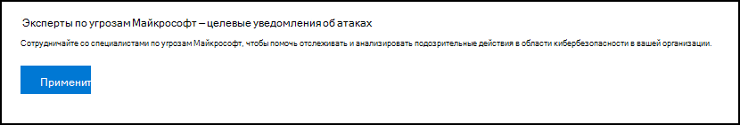

# Настройка возможностей экспертов Майкрософт по угрозам и управление имиConfigure and manage Microsoft Threat Experts capabilities

[!INCLUDE [Microsoft 365 Defender rebranding](../../includes/microsoft-defender.md)]

**Область применения:****Applies to:**
- [Microsoft Defender для конечной точкиMicrosoft Defender for Endpoint](https://go.microsoft.com/fwlink/p/?linkid=2154037)
- [Microsoft 365 DefenderMicrosoft 365 Defender](https://go.microsoft.com/fwlink/?linkid=2118804)

>Хотите испытать Defender для конечной точки?Want to experience Defender for Endpoint? [Зарегистрився для бесплатной пробной.Sign up for a free trial.](https://www.microsoft.com/microsoft-365/windows/microsoft-defender-atp?ocid=docs-wdatp-assignaccess-abovefoldlink)

## Прежде чем начатьBefore you begin 
> [!NOTE]
> Обсудите требования к требованиям с поставщиком технической службы Майкрософт и командой учетных записей, прежде чем применить к эксперты Майкрософт по угрозам - служба управляемой охоты на угрозы targeted Attack Notification.Discuss the eligibility requirements with your Microsoft Technical Service provider and account team before you apply to Microsoft Threat Experts - Targeted Attack Notification managed threat hunting service.

Убедитесь, что Защитник для конечной точки развернут в среде с зарегистрированными устройствами, а не только на лабораторной настройках.Ensure that you have Defender for Endpoint deployed in your environment with devices enrolled, and not just on a laboratory set-up.

Если вы клиент Defender для **конечных** точек, вам необходимо подать заявление на эксперты Майкрософт по угрозам - Целевые уведомления о нападении, чтобы получить специальные сведения и анализ, чтобы помочь определить наиболее важные угрозы, чтобы вы могли быстро реагировать на них.If you're a Defender for Endpoint customer, you need to apply for **Microsoft Threat Experts - Targeted Attack Notifications** to get special insights and analysis to help identify the most critical threats, so you can respond to them quickly. Свяжитесь с командой учетных записей или представителем **Майкрософт,** чтобы подписаться на эксперты Майкрософт по угрозам - эксперты по запросу, чтобы проконсультироваться с нашими экспертами по угрозам по соответствующим обнаружениям и противникам.Contact your account team or Microsoft representative to subscribe to **Microsoft Threat Experts - Experts on Demand** to consult with our threat experts on relevant detections and adversaries.

## Apply for эксперты Майкрософт по угрозам - служба уведомлений о целевых атакахApply for Microsoft Threat Experts - Targeted Attack Notifications service 
Если вы уже клиент Defender для конечной точки, вы можете подать заявление через Центр безопасности в Microsoft Defender.If you're already a Defender for Endpoint customer, you can apply through the Microsoft Defender Security Center. 

1. Из области навигации перейдите в Параметры > общие > расширенные функции > эксперты Майкрософт по угрозам **- Targeted Attack Notifications**.From the navigation pane, go to **Settings > General > Advanced features > Microsoft Threat Experts - Targeted Attack Notifications**.

2. Нажмите **Применить**.Click **Apply**.

    

3. Введите свое имя и адрес электронной почты, чтобы корпорация Майкрософт вернулась к вам в приложении.Enter your name and email address so that Microsoft can get back to you on your application.

    

4. Прочитайте [заявление о конфиденциальности,](https://privacy.microsoft.com/en-us/privacystatement)а затем **нажмите Кнопку Отправить,** когда вы закончили.Read the [privacy statement](https://privacy.microsoft.com/en-us/privacystatement), then click **Submit** when you're done. Вы получите приветственный адрес электронной почты после утверждения приложения.You will receive a welcome email once your application is approved.

    

При его приеме вы получите приветственный адрес электронной почты, и вы увидите изменение кнопки **Apply** на кнопку toggle, которая находится "на".When accepted, you will receive a welcome email and you will see the **Apply** button change to a toggle that is “on”. В случае, если вы хотите выйти из службы уведомлений о целевых атаках, сдвиньте кнопку "Off" и нажмите кнопку **Сохранить** предпочтения в нижней части страницы.In case you want to take yourself out of the Targeted Attack Notifications service, slide the toggle “off” and click **Save preferences** at the bottom of the page. 

## Где вы увидите целевые уведомления об атаке из эксперты Майкрософт по угрозамWhere you'll see the targeted attack notifications from Microsoft Threat Experts 
Вы можете получать целевое уведомление об атаке из эксперты Майкрософт по угрозам через следующую среду:You can receive targeted attack notification from Microsoft Threat Experts through the following medium:  
- Страница Инциденты портала Defender for **Endpoint**The Defender for Endpoint portal's **Incidents** page 
- Панель оповещений портала "Защитник для **конечных точек"**The Defender for Endpoint portal's **Alerts** dashboard  
- OData оповещения [API и](/windows/security/threat-protection/microsoft-defender-atp/get-alerts) [REST API](/windows/security/threat-protection/microsoft-defender-atp/pull-alerts-using-rest-api)OData alerting [API](/windows/security/threat-protection/microsoft-defender-atp/get-alerts) and [REST API](/windows/security/threat-protection/microsoft-defender-atp/pull-alerts-using-rest-api)
- [Таблица DeviceAlertEvents](/windows/security/threat-protection/microsoft-defender-atp/advanced-hunting-devicealertevents-table) в расширенных охотах[DeviceAlertEvents](/windows/security/threat-protection/microsoft-defender-atp/advanced-hunting-devicealertevents-table) table in Advanced hunting
- При настройке электронной почтыYour email, if you choose to configure it 

Чтобы получать целевые уведомления об атаке по электронной почте, создайте правило уведомления по электронной почте.To receive targeted attack notifications through email, create an email notification rule.

### Создание правила уведомления по электронной почтеCreate an email notification rule 
Вы можете создать правила для отправки уведомлений электронной почты для получателей уведомлений.You can create rules to send email notifications for notification recipients. Дополнительные сведения см. в публикации  [Configure alert notifications](configure-email-notifications.md) to create, edit, delete or troubleshoot email notification.See  [Configure alert notifications](configure-email-notifications.md) to create, edit, delete, or troubleshoot email notification, for details.

## Просмотр уведомления о целевой атакеView the targeted attack notification  
Вы начнете получать целевое уведомление об атаке эксперты Майкрософт по угрозам электронной почты после настройки системы для получения уведомления электронной почты.You'll start receiving targeted attack notification from Microsoft Threat Experts in your email after you have configured your system to receive email notification.  

1. Щелкните ссылку в электронной почте, чтобы перейти к соответствующему контексту оповещений на панели мониторинга с тегами **экспертов Threat**.Click the link in the email to go to the corresponding alert context in the dashboard tagged with **Threat experts**. 

2. На панели мониторинга выберите ту же тему оповещения, которую вы получили из электронной почты, чтобы просмотреть сведения.From the dashboard, select the same alert topic that you got from the email, to view the details.  

## Подписка на эксперты Майкрософт по угрозам - Эксперты по запросуSubscribe to Microsoft Threat Experts - Experts on Demand
Это доступно в качестве службы подписки.This is available as a subscription service. Если вы уже клиент Defender для конечной точки, вы можете связаться со своим представителем Майкрософт, чтобы подписаться на эксперты Майкрософт по угрозам - Эксперты по запросу.If you're already a Defender for Endpoint customer, you can contact your Microsoft representative to subscribe to Microsoft Threat Experts - Experts on Demand. 

## Проконсультируйтесь с экспертом по угрозам Майкрософт о подозрительных действиях в области кибербезопасности в вашей организации.Consult a Microsoft threat expert about suspicious cybersecurity activities in your organization 
Вы можете сотрудничать с эксперты Майкрософт по угрозам, которые могут быть вовлечены непосредственно из Центр безопасности в Microsoft Defender для быстрого и точного ответа.You can partner with Microsoft Threat Experts who can be engaged directly from within the Microsoft Defender Security Center for timely and accurate response. Эксперты предоставляют сведения, чтобы лучше понять сложные угрозы, целевые уведомления об атаках, которые вы получаете, или если вам нужно больше информации о оповещениях, потенциально скомпрометированном устройстве или контексте разведки угроз, которые вы видите на панели мониторинга портала.Experts provide insights to better understand complex threats, targeted attack notifications that you get, or if you need more information about the alerts, a potentially compromised device, or a threat intelligence context that you see on your portal dashboard. 

> [!NOTE]
> - Запросы оповещений, связанные с настраиваемыми данными разведки угроз в организации, в настоящее время не поддерживаются.Alert inquiries related to your organization's customized threat intelligence data are currently not supported. Сведения о работе служб безопасности или группе реагирования на инциденты.Consult your security operations or incident response team for details.
> - Чтобы отправить запрос  "Обратитесь к эксперту по угрозе", необходимо иметь разрешение на управление настройками безопасности на портале Центра безопасности.You need to have the **Manage security settings** permission in the Security Center portal to be able to submit a "Consult a threat expert" inquiry.

1. Перейдите на страницу портала с соответствующими сведениями, которые необходимо исследовать, например, страницу **Incident.**Navigate to the portal page with the relevant information that you'd like to investigate, for example, the **Incident** page. Убедитесь, что перед отправкой запроса на расследование будет просмотрена страница соответствующего оповещения или устройства.Ensure that the page for the relevant alert or device is in view before you send an investigation request. 

2. В верхнем правом меню нажмите кнопку **?**From the upper right-hand menu, click the **?** .icon. Затем выберите **Обратитесь к эксперту по угрозам**.Then, select **Consult a threat expert**. 

    

    Откроется экран вылетов.A flyout screen opens. На следующем экране показано, когда вы находитесь на пробной подписке.The following screen shows when you are on a trial subscription.

    

    Следующий экран показывает, когда вы находитесь на полной эксперты Майкрософт по угрозам - эксперты по запросу подписки.The following screen shows when you are on a full Microsoft Threat Experts - Experts on-Demand subscription.

    

    Поле **темы запроса** предварительно заполнено ссылкой на соответствующую страницу для запроса на исследование.The **Inquiry topic** field is pre-populated with the link to the relevant page for your investigation request. Например, ссылка на страницу сведений об инциденте, оповещении или устройстве, на которую вы были при запросе.For example, a link to the incident, alert, or device details page that you were at when you made the request.

3.  В следующем поле укайте достаточно информации, чтобы эксперты Майкрософт по угрозам контекста для начала расследования.In the next field, provide enough information to give the Microsoft Threat Experts enough context to start the investigation.
  
4. Введите адрес электронной почты, который вы хотите использовать, чтобы соответствовать эксперты Майкрософт по угрозам.Enter the email address that you'd like to use to correspond with Microsoft Threat Experts.

> [!NOTE]
> Если вы хотите отслеживать состояние дел "Эксперты по запросу" с помощью Центра служб Майкрософт, перенаправление в диспетчер технической учетной записи.If you would like to track the status of your Experts on Demand cases through Microsoft Services Hub, reach out to your Technical Account Manager. 

Просмотрите это видео для краткого обзора центра служб Майкрософт.Watch this video for a quick overview of the Microsoft Services Hub.

>[!VIDEO https://www.microsoft.com/videoplayer/embed/RE4pk9f] 

   
## Примеры тем исследования, которые можно проконсультироваться с эксперты Майкрософт по угрозам - Эксперты по запросуSample investigation topics that you can consult with Microsoft Threat Experts - Experts on Demand 

**Сведения об оповещении****Alert information**
- Мы видим новый тип оповещений для двоичного двоичного параметра living-off-the-land: [AlertID].We see a new type of alert for a living-off-the-land binary: [AlertID]. Можете ли вы рассказать нам больше об этом оповещении и о том, как мы можем исследовать далее?Can you tell us something more about this alert and how we can investigate further?
- Мы наблюдали две аналогичные атаки, которые пытаются выполнять вредоносные скрипты PowerShell, но создают различные оповещения.We’ve observed two similar attacks, which try to execute malicious PowerShell scripts but generate different alerts. Одна из них — "Подозрительная командная строка PowerShell", а другая — "Вредоносный файл был обнаружен на основе показаний, предоставленных O365".One is "Suspicious PowerShell command line" and the other is "A malicious file was detected based on indication provided by O365". В чем разница?What is the difference?
- Сегодня я получаю нечетное оповещение об аномальных количествах сбойных логинов с устройства пользователя с высоким профилем.I receive an odd alert today for abnormal number of failed logins from a high profile user’s device. Я не могу найти какие-либо дополнительные доказательства вокруг этих попыток войти.I cannot find any further evidence around these sign-in attempts. Как Защитник для конечной точки может видеть эти попытки?How can Defender for Endpoint see these attempts? Какой тип входных входов отслеживается?What type of sign-ins are being monitored?
- Можете ли вы дать дополнительные сведения или сведения об этом оповещении: "Наблюдалось подозрительное поведение системной утилиты".Can you give more context or insights about this alert: “Suspicious behavior by a system utility was observed”. 

**Возможный компьютерный компромисс****Possible machine compromise**
- Можете ли вы помочь ответить, почему мы видим "Неизвестный процесс наблюдается?"Can you help answer why we see “Unknown process observed?” Это сообщение или оповещение часто встречается на многих устройствах.This message or alert is seen frequently on many devices. Мы ценим любые входные данные для уточнения того, связано ли это сообщение или оповещение с вредоносными действиями.We appreciate any input to clarify whether this message or alert is related to malicious activity.
- Можете ли вы помочь проверить возможный компромисс в следующей системе на [date] с аналогичным поведением, как предыдущее [имя вредоносных программ] обнаружение вредоносных программ в той же системе в [месяц]?Can you help validate a possible compromise on the following system on [date] with similar behaviors as the previous [malware name] malware detection on the same system in [month]?

**Сведения о разведке угроз****Threat intelligence details**
- Обнаружена фишинговая электронная почта, которая передала пользователю вредоносный документ Word.We detected a phishing email that delivered a malicious Word document to a user. Вредоносный документ Word вызвал серию подозрительных событий, которые вызвали несколько оповещений Microsoft Defender о вредоносных программах.The malicious Word document caused a series of suspicious events, which triggered multiple Microsoft Defender alerts for [malware name] malware. Есть ли у вас сведения об этой вредоносной программе?Do you have any information on this malware? Если да, можете ли вы отправить мне ссылку?If yes, can you send me a link?
- Недавно я увидел [ссылку на социальные сети, например, в Twitter или блоге] об угрозе, которая направлена на мою отрасль.I recently saw a [social media reference, for example, Twitter or blog] post about a threat that is targeting my industry. Можете ли вы помочь мне понять, какую защиту защитник для конечной точки обеспечивает от этого субъекта угрозы?Can you help me understand what protection Defender for Endpoint provides against this threat actor? 

**эксперты Майкрософт по угрозам оповещений****Microsoft Threat Experts’ alert communications** 
- Может ли ваша группа реагирования на инциденты помочь нам в решении целевого уведомления об атаке, которое мы получили?Can your incident response team help us address the targeted attack notification that we got?
- Я получил это целевое уведомление об атаке из эксперты Майкрософт по угрозам.I received this targeted attack notification from Microsoft Threat Experts. У нас нет собственной группы реагирования на инциденты.We don’t have our own incident response team. Что мы можем сделать сейчас и как сдержать инцидент?What can we do now, and how can we contain the incident?
- Я получил уведомление о целевой атаке из эксперты Майкрософт по угрозам.I received a targeted attack notification from Microsoft Threat Experts. Какие данные вы можете предоставить нам, чтобы мы могли передать нашей группе реагирования на инциденты?What data can you provide to us that we can pass on to our incident response team?

  >[!NOTE]
  >эксперты Майкрософт по угрозам — это служба управляемой охоты на кибербезопасность, а не служба реагирования на инциденты.Microsoft Threat Experts is a managed cybersecurity hunting service and not an incident response service. Тем не менее, эксперты могут без проблем перенаупрестить расследование в службы группы обнаружения и реагирования Microsoft Cybersecurity Solutions Group (CSG) при необходимости.However, the experts can seamlessly transition the investigation to Microsoft Cybersecurity Solutions Group (CSG)'s  Detection and Response Team (DART) services, when necessary. Вы также можете взаимодействовать со своей командой реагирования на инциденты для устранения проблем, которые требуют реагирования на инциденты.You can also opt to engage with your own incident response team to address issues that requires an incident response. 

## СценарийScenario

### Получение отчета о ходе выполнения управляемого запроса на охотуReceive a progress report about your managed hunting inquiry 
Ответ от эксперты Майкрософт по угрозам зависит от вашего запроса.Response from Microsoft Threat Experts varies according to your inquiry. Они напишите вам отчет о  ходе консультации эксперта по угрозе в течение двух дней, чтобы сообщить о состоянии расследования из следующих категорий:They will email a progress report to you about your **Consult a threat expert** inquiry within two days, to communicate the investigation status from the following categories: 
- Дополнительные сведения необходимы для продолжения расследованияMore information is needed to continue with the investigation 
- Для определения технического контекста необходим файл или несколько примеров файлов.A file or several file samples are needed to determine the technical context 
- Для расследования требуется больше времениInvestigation requires more time   
- Начальной информации было достаточно, чтобы завершить расследованиеInitial information was enough to conclude the investigation 

Очень важно быстро реагировать, чтобы сохранить ход расследования.It is crucial to respond in quickly to keep the investigation moving. 

## Связанная темаRelated topic
- [Обзор экспертов Майкрософт по угрозамMicrosoft Threat Experts overview](microsoft-threat-experts.md)
- [эксперты Майкрософт по угрозам в Microsoft 365 ОбзорMicrosoft Threat Experts in Microsoft 365 Overview](/microsoft-365/security/mtp/microsoft-threat-experts)
