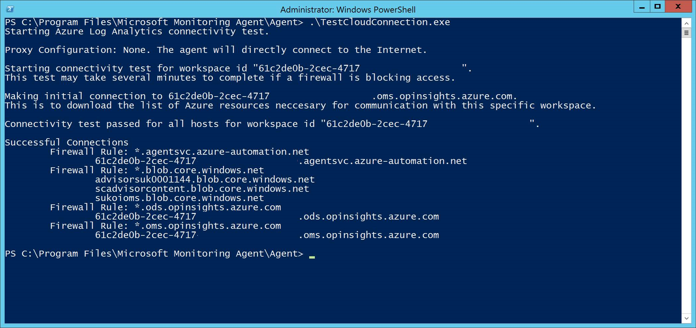

# <a name="configure-device-proxy-and-internet-connectivity-settings"></a>Настройка параметров прокси-сервера устройства и соединения с Интернетом

[!INCLUDE [Microsoft 365 Defender rebranding](../../includes/microsoft-defender.md)]

**Область применения:**
- [Microsoft Defender для конечной точки](https://go.microsoft.com/fwlink/p/?linkid=2154037)
- [Microsoft 365 Defender](https://go.microsoft.com/fwlink/?linkid=2118804)

> Хотите испытать Defender для конечной точки? [Зарегистрився для бесплатной пробной.](https://www.microsoft.com/en-us/WindowsForBusiness/windows-atp?ocid=docs-wdatp-configureendpointsscript-abovefoldlink)

Датчик Defender для конечной точки требует от Корпорации Майкрософт Windows HTTP (WinHTTP) для отчета о данных датчиков и связи со службой Defender для конечных точек.

Встроенный датчик Defender for Endpoint работает в системном контексте с помощью учетной записи LocalSystem. Датчик использует службы http Windows Microsoft (WinHTTP), чтобы включить связь с облачной службой Defender для конечной точки.

> [!TIP]
> В организациях, в которых прокси-серверы переадресации используются в качестве шлюза в Интернет, можно использовать защиту сети для изучения прокси-сервера. Дополнительные сведения см. в статье [Исследование событий подключения, происходящих за прокси-серверами переадресации](investigate-behind-proxy.md).

Параметр конфигурации WinHTTP не зависит от параметров прокси Windows Интернета (WinINet) и может обнаружить прокси-сервер только с помощью следующих методов обнаружения:

- Методы автоматического обнаружения:

  - Прозрачный прокси

  - Протокол автоматического обнаружения веб-прокси (WPAD)

    > [!NOTE]
    > Если вы используете прозрачный прокси или WPAD в сетевой топологии, вам не нужны специальные параметры конфигурации. Дополнительные сведения об исключениях URL-адресов Defender для конечной точки в прокси-сервере см. в ссылке Включить доступ к URL-адресам службы Defender для конечных точек на [прокси-сервере.](#enable-access-to-microsoft-defender-for-endpoint-service-urls-in-the-proxy-server)

- Конфигурация статического прокси вручную:

  - Конфигурация на основе реестра

  - WinHTTP, настроенный с помощью команды netsh, подходит только для настольных компьютеров в стабильной топологии (например: настольный компьютер в корпоративной сети за тем же прокси-сервером)

## <a name="configure-the-proxy-server-manually-using-a-registry-based-static-proxy"></a>Настройка прокси-сервера вручную с использованием статического прокси-сервера на основе реестра

Настройка статического прокси-сервера на основе реестра, чтобы позволить только датчику Defender для конечной точки сообщать диагностические данные и общаться с службами Defender для конечных точек, если компьютеру не разрешено подключение к Интернету.

> [!NOTE]
> При использовании этого параметра в Windows 10 или Windows Server 2019 рекомендуется использовать следующий (или более поздний) процесс сборки и накопительного обновления:
>
> - Windows 10, версия 1809 или Windows Server 2019 -https://support.microsoft.com/kb/5001384
> - Windows 10 версии 1909 —https://support.microsoft.com/kb/4601380
> - Windows 10 версии 2004 —https://support.microsoft.com/kb/4601382
> - Windows 10 версии 20H2 —https://support.microsoft.com/kb/4601382
>
> Эти обновления улучшают подключение и надежность канала CnC (Command and Control).

Статический прокси-сервер можно настроить с помощью групповой политики (GP). Групповые политики можно найти в следующих статьях:

- **Административные шаблоны > Windows компоненты > сбора и предварительного просмотра > настраивают использование прокси-сервера для службы подключенных пользователей и телеметрии**

  Установите его для **включения и** выберите отключение использования **прокси-сервера с проверкой подлинности.**

  

- **Административные шаблоны > Windows компоненты >** сбора и предварительного просмотра > настраивают подключенные пользовательские интерфейсы и телеметрию:

  Настройка прокси-сервера

  

  Политика задает два значения реестра, как REG_SZ, так и REG_DWORD, под `TelemetryProxyServer` `DisableEnterpriseAuthProxy` ключом `HKLM\Software\Policies\Microsoft\Windows\DataCollection` реестра.

  Значение реестра принимает `TelemetryProxyServer` следующий формат строки:

  ```text
  <server name or ip>:<port>
  ```

  Например, 10.0.0.6:8080

  Следует назначить значение реестра `DisableEnterpriseAuthProxy` — 1.

## <a name="configure-the-proxy-server-manually-using-netsh-command"></a>Настройка прокси-сервера вручную с помощью команды netsh

Используйте команду netsh для настройки статического прокси на уровне системы.

> [!NOTE]
>
> - Это повлияет на все приложения, в том числе службы Windows, которые используют WinHTTP с прокси по умолчанию.</br>
> - Ноутбуки, которые меняют топологию (например, из офиса в дом), будут неисправными с сеткой. Используйте настройку статических прокси-серверов на основе реестра.

1. Откройте командную строку с повышенными правами:

   1. В меню **Пуск** введите **cmd**.

   1. Щелкните правой кнопкой мыши пункт **Командная строка** и выберите команду **Запуск от имени администратора**.

2. Введите следующую команду и нажмите клавишу **ВВОД**:

   ```PowerShell
   netsh winhttp set proxy <proxy>:<port>
   ```

   Пример: `netsh winhttp set proxy 10.0.0.6:8080`

Чтобы сбросить прокси winhttp, введите следующую команду и нажмите клавишу **ВВОД**:

```PowerShell
netsh winhttp reset proxy
```

Дополнительные сведения см. в статье [Синтаксис команд, контексты и форматирование Netsh](/windows-server/networking/technologies/netsh/netsh-contexts).

## <a name="enable-access-to-microsoft-defender-for-endpoint-service-urls-in-the-proxy-server"></a>Включить доступ к URL-адресам службы "Защитник Майкрософт для конечных точек" на прокси-сервере

Если прокси-сервер или брандмауэр блокирует весь трафик по умолчанию и пропускает только определенные домены, добавьте домены, перечисленные в загружаемой электронной таблице, в список разрешенных доменов.

В следующей загружаемой таблице перечислены службы и связанные с ними URL-адреса, к которые должна подключаться ваша сеть. Необходимо убедиться, что нет правил фильтрации брандмауэра или сети, которые бы  отказывали в доступе к этим URL-адресам, или вам может потребоваться создать правило разрешить специально для них.

| Таблица списка доменов | Описание |
|:-----|:-----|
|<br/>  | Таблица определенных DNS-записей для расположения служб, географических местоположений и ОС. <br><br>[Скачайте таблицу здесь.](https://download.microsoft.com/download/8/a/5/8a51eee5-cd02-431c-9d78-a58b7f77c070/mde-urls.xlsx)

Если на прокси-сервере или брандмауэре включено сканирование HTTPS (проверка SSL), исключите домены, перечисленные в приведенной выше таблице, из сканирования HTTPS.

> [!NOTE]
> settings-win.data.microsoft.com требуется только при Windows 10 устройствах с версией 1803 или более ранней версии.<br>
>
> URL-адреса, которые включают в них v20, необходимы только при Windows 10 устройствах с версией 1803 или более поздней версии. Например, необходимо для устройства Windows 10 версии 1803 или более поздней версии и на борту в регионе `us-v20.events.data.microsoft.com` data служба хранилища США.
>
> Если вы используете антивирусная программа в Microsoft Defender среды, см. в рубке Настройка сетевых подключений к [облачной антивирусная программа в Microsoft Defender службе](/windows/security/threat-protection/microsoft-defender-antivirus/configure-network-connections-microsoft-defender-antivirus).

Если прокси-сервер или брандмауэр блокирует анонимный трафик, так как датчик Defender для конечной точки подключается из системного контекста, убедитесь, что анонимный трафик разрешен в указанных ранее URL-адресах.

### <a name="microsoft-monitoring-agent-mma---proxy-and-firewall-requirements-for-older-versions-of-windows-client-or-windows-server"></a>Microsoft Monitoring Agent (MMA) — требования прокси и брандмауэра для более старых версий Windows или Windows Server

В приведенной ниже информации приведены сведения о конфигурации прокси и брандмауэра, необходимые для связи с агентом Log Analytics (часто называются Microsoft Monitoring Agent) для предыдущих версий Windows, таких как Windows 7 SP1, Windows 8.1, Windows Server 2008 R2, Windows Server 2012 R2 и Windows Server 2016.

|Ресурсы агентов|Порты |Направление |Обход проверки HTTP|
|------|---------|--------|--------|
|*.ods.opinsights.azure.com |Порт 443 |Исходящий|Да |  
|*.oms.opinsights.azure.com |Порт 443 |Исходящий|Да |  
|*.blob.core.windows.net |Порт 443 |Исходящий|Да |
|*.azure-automation.net |Порт 443 |Исходящий|Да |  

> [!NOTE]
> В качестве облачного решения диапазон IP может изменяться. Рекомендуется перейти к параметру разрешения DNS.

## <a name="confirm-microsoft-monitoring-agent-mma-service-url-requirements"></a>Подтверждение Microsoft Monitoring Agent (MMA) ТРЕБОВАНИЯ URL-адреса службы 

См. следующие инструкции по устранению требования под диктовки (*) для конкретной среды при использовании Microsoft Monitoring Agent (MMA) для предыдущих версий Windows.

1. На борту предыдущей операционной системы с Microsoft Monitoring Agent (MMA) в Defender для конечной точки (дополнительные сведения см. в предыдущих версиях Windows [Defender для](https://go.microsoft.com/fwlink/p/?linkid=2010326) конечной точки и на Windows серверах. [](configure-server-endpoints.md#windows-server-2008-r2-sp1-windows-server-2012-r2-and-windows-server-2016)

2. Убедитесь, что машина успешно сообщается на Microsoft 365 Defender портале.

3. Запустите TestCloudConnection.exe из "C:\Program Files\Microsoft Monitoring Agent\Agent", чтобы проверить подключение и увидеть необходимые URL-адреса для конкретного рабочего пространства.

4. Проверьте список URL-адресов Microsoft Defender для конечных точек для полного списка требований к вашему региону (см. в таблице URL-адресов [службы).](https://download.microsoft.com/download/8/a/5/8a51eee5-cd02-431c-9d78-a58b7f77c070/mde-urls.xlsx)

    

Конечные точки URL \* \* ods.opinsights.azure.com, \* \* .oms.opinsights.azure.com и .agentsvc.azure-automation.net URL-адресов. ID Рабочей области имеет особый характер для среды и рабочего пространства и может быть найден в разделе Onboarding клиента в Microsoft 365 Defender портале.

Конечную blob.core.windows.net URL-адрес можно заменить URL-адресами, показанными в разделе "Правило брандмауэра: \* \* .blob.core.windows.net" результатов тестирования.

> [!NOTE]
> В случае висячего использования через Azure Defender может использоваться несколько пространств работы. Вам потребуется выполнить процедуру TestCloudConnection.exe на бортовом компьютере из каждого рабочего пространства (чтобы определить, есть ли какие-либо изменения url-адресов *.blob.core.windows.net между рабочей областью).

## <a name="verify-client-connectivity-to-microsoft-defender-for-endpoint-service-urls"></a>Проверка подключения клиента к URL-адресам службы Microsoft Defender для конечных точек

Убедитесь в том, что настройка прокси-сервера выполнена успешно, служба WinHTTP может обнаружить и передать данные через прокси-сервер в вашей среде, а прокси-сервер разрешает трафик на URL-адреса службы Защитника для конечных точек.

1. Скачайте средство клиентского анализатора [MDATP](https://aka.ms/mdatpanalyzer) на компьютер, на котором работает датчик Defender для конечной точки.

2. Извлеките содержимое MDATPClientAnalyzer.zip на устройство.

3. Откройте командную строку с повышенными правами:

   1. В меню **Пуск** введите **cmd**.

   1. Щелкните правой кнопкой мыши пункт **Командная строка** и выберите команду **Запуск от имени администратора**.

4. Введите следующую команду и нажмите клавишу **ВВОД**:

    ```PowerShell
    HardDrivePath\MDATPClientAnalyzer.cmd
    ```

    Замените *HardDrivePath* путем, на который был загружен инструмент MDATPClientAnalyzer, например:

    ```PowerShell
    C:\Work\tools\MDATPClientAnalyzer\MDATPClientAnalyzer.cmd
    ```

5. *ИзвлечениеMDATPClientAnalyzerResult.zip,* созданного инструментом в папке, используемой в *HardDrivePath.*

6. Откройте *MDATPClientAnalyzerResult.txt* и убедитесь в том, что вы выполнили действия по настройке прокси-сервера, чтобы включить обнаружение сервера и доступ к URL-адресам службы.

   Средство проверяет возможность подключения URL-адресов службы Защитника для конечной точки, которые настроены для работы службы Защитника для конечной точки с клиентом. Затем результаты выводятся в файл *MDATPClientAnalyzerResult.txt* для каждого URL-адреса, который потенциально можно использоваться для общения с Защитником для служб конечных точек. Пример:

   ```text
   Testing URL : https://xxx.microsoft.com/xxx
   1 - Default proxy: Succeeded (200)
   2 - Proxy auto discovery (WPAD): Succeeded (200)
   3 - Proxy disabled: Succeeded (200)
   4 - Named proxy: Doesn't exist
   5 - Command line proxy: Doesn't exist
   ```

Если по крайней мере один из вариантов подключения возвращает состояние (200), то клиент Defender для конечной точки может правильно взаимодействовать с проверенным URL-адресом, используя этот метод подключения.

Однако, если результаты проверки подключения указывают на сбой, отображается ошибка HTTP (см. Коды состояния HTTP). Затем можно использовать URL-адреса в таблице, показанной в Таблице Включить доступ к URL-адресам службы Defender для конечных точек [на прокси-сервере.](#enable-access-to-microsoft-defender-for-endpoint-service-urls-in-the-proxy-server) Url-адреса, которые вы будете использовать, будут зависеть от региона, выбранного во время процедуры бортовой работы.

> [!NOTE]
> Анализатор подключений несовместим с правилом ASR — [Блокировка создания процессов, исходящих от команд PSExec и WMI](/windows/security/threat-protection/windows-defender-exploit-guard/attack-surface-reduction#attack-surface-reduction-rules). Необходимо временно отключить это правило, чтобы запустить средство подключения.
>
> При наборе TelemetryProxyServer в реестре или через групповую политику защитник для конечной точки отпадет на прямую, если не может получить доступ к определенному прокси-серверу.

## <a name="related-topics"></a>Статьи по теме

- [Подключение устройств Windows 10](configure-endpoints.md)
- [Устранение неполадок в Microsoft Defender для проблем с бортовой точкой конечной точки](troubleshoot-onboarding.md)
