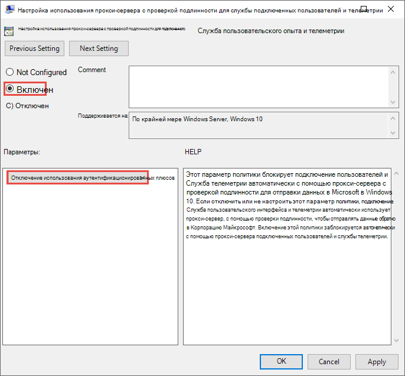

# <a name="configure-device-proxy-and-internet-connectivity-settings"></a><span data-ttu-id="8ee46-104">Настройка параметров прокси-сервера устройства и подключения к Интернету</span><span class="sxs-lookup"><span data-stu-id="8ee46-104">Configure device proxy and Internet connectivity settings</span></span>

[!INCLUDE [Microsoft 365 Defender rebranding](../../includes/microsoft-defender.md)]

<span data-ttu-id="8ee46-105">**Область применения:**</span><span class="sxs-lookup"><span data-stu-id="8ee46-105">**Applies to:**</span></span>
- [<span data-ttu-id="8ee46-106">Microsoft Defender для конечной точки</span><span class="sxs-lookup"><span data-stu-id="8ee46-106">Microsoft Defender for Endpoint</span></span>](https://go.microsoft.com/fwlink/p/?linkid=2154037)
- [<span data-ttu-id="8ee46-107">Microsoft 365 Defender</span><span class="sxs-lookup"><span data-stu-id="8ee46-107">Microsoft 365 Defender</span></span>](https://go.microsoft.com/fwlink/?linkid=2118804)

> <span data-ttu-id="8ee46-108">Хотите испытать Defender для конечной точки?</span><span class="sxs-lookup"><span data-stu-id="8ee46-108">Want to experience Defender for Endpoint?</span></span> [<span data-ttu-id="8ee46-109">Зарегистрився для бесплатной пробной.</span><span class="sxs-lookup"><span data-stu-id="8ee46-109">Sign up for a free trial.</span></span>](https://www.microsoft.com/en-us/WindowsForBusiness/windows-atp?ocid=docs-wdatp-configureendpointsscript-abovefoldlink)

<span data-ttu-id="8ee46-110">Датчик Defender для конечной точки требует от Корпорации Майкрософт Windows HTTP (WinHTTP) для отчета о данных датчиков и связи со службой Defender для конечных точек.</span><span class="sxs-lookup"><span data-stu-id="8ee46-110">The Defender for Endpoint sensor requires Microsoft Windows HTTP (WinHTTP) to report sensor data and communicate with the Defender for Endpoint service.</span></span>

<span data-ttu-id="8ee46-111">Встроенный датчик Defender for Endpoint работает в системном контексте с помощью учетной записи LocalSystem.</span><span class="sxs-lookup"><span data-stu-id="8ee46-111">The embedded Defender for Endpoint sensor runs in system context using the LocalSystem account.</span></span> <span data-ttu-id="8ee46-112">Датчик использует службы http Windows Microsoft (WinHTTP), чтобы включить связь с облачной службой Defender для конечной точки.</span><span class="sxs-lookup"><span data-stu-id="8ee46-112">The sensor uses Microsoft Windows HTTP Services (WinHTTP) to enable communication with the Defender for Endpoint cloud service.</span></span>

>[!TIP]
><span data-ttu-id="8ee46-113">В организациях, в которых прокси-серверы переадресации используются в качестве шлюза в Интернет, можно использовать защиту сети для изучения прокси-сервера.</span><span class="sxs-lookup"><span data-stu-id="8ee46-113">For organizations that use forward proxies as a gateway to the Internet, you can use network protection to investigate behind a proxy.</span></span> <span data-ttu-id="8ee46-114">Дополнительные сведения см. в статье [Исследование событий подключения, происходящих за прокси-серверами переадресации](investigate-behind-proxy.md).</span><span class="sxs-lookup"><span data-stu-id="8ee46-114">For more information, see [Investigate connection events that occur behind forward proxies](investigate-behind-proxy.md).</span></span>

<span data-ttu-id="8ee46-115">Параметр конфигурации WinHTTP не зависит от параметров прокси Windows Интернета (WinINet) и может обнаружить прокси-сервер только с помощью следующих методов обнаружения:</span><span class="sxs-lookup"><span data-stu-id="8ee46-115">The WinHTTP configuration setting is independent of the Windows Internet (WinINet) Internet browsing proxy settings and can only discover a proxy server by using the following discovery methods:</span></span>

- <span data-ttu-id="8ee46-116">Методы автоматического обнаружения:</span><span class="sxs-lookup"><span data-stu-id="8ee46-116">Auto-discovery methods:</span></span>

  - <span data-ttu-id="8ee46-117">Прозрачный прокси</span><span class="sxs-lookup"><span data-stu-id="8ee46-117">Transparent proxy</span></span>

  - <span data-ttu-id="8ee46-118">Протокол автоматического обнаружения веб-прокси (WPAD)</span><span class="sxs-lookup"><span data-stu-id="8ee46-118">Web Proxy Auto-discovery Protocol (WPAD)</span></span>

    > [!NOTE]
    > <span data-ttu-id="8ee46-119">Если вы используете прозрачный прокси или WPAD в сетевой топологии, вам не нужны специальные параметры конфигурации.</span><span class="sxs-lookup"><span data-stu-id="8ee46-119">If you're using Transparent proxy or WPAD in your network topology, you don't need special configuration settings.</span></span> <span data-ttu-id="8ee46-120">Дополнительные сведения об исключениях URL-адресов Defender для конечной точки в прокси-сервере см. в ссылке Включить доступ к URL-адресам службы Defender для конечных точек на [прокси-сервере.](#enable-access-to-microsoft-defender-for-endpoint-service-urls-in-the-proxy-server)</span><span class="sxs-lookup"><span data-stu-id="8ee46-120">For more information on Defender for Endpoint URL exclusions in the proxy, see [Enable access to Defender for Endpoint service URLs in the proxy server](#enable-access-to-microsoft-defender-for-endpoint-service-urls-in-the-proxy-server).</span></span>

- <span data-ttu-id="8ee46-121">Конфигурация статического прокси вручную:</span><span class="sxs-lookup"><span data-stu-id="8ee46-121">Manual static proxy configuration:</span></span>

  - <span data-ttu-id="8ee46-122">Конфигурация на основе реестра</span><span class="sxs-lookup"><span data-stu-id="8ee46-122">Registry based configuration</span></span>

  - <span data-ttu-id="8ee46-123">WinHTTP, настроенный с помощью команды netsh, подходит только для настольных компьютеров в стабильной топологии (например: настольный компьютер в корпоративной сети за тем же прокси-сервером)</span><span class="sxs-lookup"><span data-stu-id="8ee46-123">WinHTTP configured using netsh command – Suitable only for desktops in a stable topology (for example: a desktop in a corporate network behind the same proxy)</span></span>

## <a name="configure-the-proxy-server-manually-using-a-registry-based-static-proxy"></a><span data-ttu-id="8ee46-124">Настройка прокси-сервера вручную с использованием статического прокси-сервера на основе реестра</span><span class="sxs-lookup"><span data-stu-id="8ee46-124">Configure the proxy server manually using a registry-based static proxy</span></span>

<span data-ttu-id="8ee46-125">Настройка статического прокси-сервера на основе реестра, чтобы позволить только датчику Defender для конечной точки сообщать диагностические данные и общаться с службами Defender для конечных точек, если компьютеру не разрешено подключение к Интернету.</span><span class="sxs-lookup"><span data-stu-id="8ee46-125">Configure a registry-based static proxy to allow only Defender for Endpoint sensor to report diagnostic data and communicate with Defender for Endpoint services if a computer is not permitted to connect to the Internet.</span></span>

> [!NOTE]
> <span data-ttu-id="8ee46-126">При использовании этого параметра в Windows 10 или Windows Server 2019 рекомендуется использовать следующий (или более поздний) процесс сборки и накопительного обновления:</span><span class="sxs-lookup"><span data-stu-id="8ee46-126">When using this option on Windows 10 or Windows Server 2019, it is recommended to have the following (or later) build and cumulative update rollup:</span></span>
>
> - <span data-ttu-id="8ee46-127">Windows 10 версии 1809 или Windows Server 2019 —https://support.microsoft.com/kb/5001384</span><span class="sxs-lookup"><span data-stu-id="8ee46-127">Windows 10, version 1809 or Windows Server 2019 - https://support.microsoft.com/kb/5001384</span></span>
> - <span data-ttu-id="8ee46-128">Windows 10 версии 1909 —https://support.microsoft.com/kb/4601380</span><span class="sxs-lookup"><span data-stu-id="8ee46-128">Windows 10, version 1909 - https://support.microsoft.com/kb/4601380</span></span>
> - <span data-ttu-id="8ee46-129">Windows 10 версии 2004 —https://support.microsoft.com/kb/4601382</span><span class="sxs-lookup"><span data-stu-id="8ee46-129">Windows 10, version 2004 - https://support.microsoft.com/kb/4601382</span></span>
> - <span data-ttu-id="8ee46-130">Windows 10 версии 20H2 —https://support.microsoft.com/kb/4601382</span><span class="sxs-lookup"><span data-stu-id="8ee46-130">Windows 10, version 20H2 - https://support.microsoft.com/kb/4601382</span></span>
>
> <span data-ttu-id="8ee46-131">Эти обновления улучшают подключение и надежность канала CnC (Command and Control).</span><span class="sxs-lookup"><span data-stu-id="8ee46-131">These updates improve the connectivity and reliability of the CnC (Command and Control) channel.</span></span>

<span data-ttu-id="8ee46-132">Статический прокси-сервер можно настроить с помощью групповой политики (GP).</span><span class="sxs-lookup"><span data-stu-id="8ee46-132">The static proxy is configurable through Group Policy (GP).</span></span> <span data-ttu-id="8ee46-133">Групповые политики можно найти в следующих статьях:</span><span class="sxs-lookup"><span data-stu-id="8ee46-133">The group policy can be found under:</span></span>

- <span data-ttu-id="8ee46-134">**Административные шаблоны > Windows компоненты > сбора и предварительного просмотра > настраивают использование прокси-сервера для службы подключенных пользователей и телеметрии**</span><span class="sxs-lookup"><span data-stu-id="8ee46-134">**Administrative Templates > Windows Components > Data Collection and Preview Builds > Configure Authenticated Proxy usage for the Connected User Experience and Telemetry Service**</span></span>

  <span data-ttu-id="8ee46-135">Установите его для **включения и** выберите отключение использования **прокси-сервера с проверкой подлинности.**</span><span class="sxs-lookup"><span data-stu-id="8ee46-135">Set it to **Enabled** and select **Disable Authenticated Proxy usage**.</span></span>

  

- <span data-ttu-id="8ee46-137">**Административные шаблоны > Windows компоненты >** сбора и предварительного просмотра > настраивают подключенные пользовательские интерфейсы и телеметрию:</span><span class="sxs-lookup"><span data-stu-id="8ee46-137">**Administrative Templates > Windows Components > Data Collection and Preview Builds > Configure connected user experiences and telemetry**:</span></span>

  <span data-ttu-id="8ee46-138">Настройка прокси-сервера</span><span class="sxs-lookup"><span data-stu-id="8ee46-138">Configure the proxy</span></span>

  

  <span data-ttu-id="8ee46-140">Политика задает два значения реестра, как REG_SZ, так и REG_DWORD, под `TelemetryProxyServer` `DisableEnterpriseAuthProxy` ключом `HKLM\Software\Policies\Microsoft\Windows\DataCollection` реестра.</span><span class="sxs-lookup"><span data-stu-id="8ee46-140">The policy sets two registry values, `TelemetryProxyServer` as REG_SZ and `DisableEnterpriseAuthProxy` as REG_DWORD, under the registry key `HKLM\Software\Policies\Microsoft\Windows\DataCollection`.</span></span>

  <span data-ttu-id="8ee46-141">Значение реестра принимает `TelemetryProxyServer` следующий формат строки:</span><span class="sxs-lookup"><span data-stu-id="8ee46-141">The registry value `TelemetryProxyServer` takes the following string format:</span></span>

  ```text
  <server name or ip>:<port>
  ```

  <span data-ttu-id="8ee46-142">Например, 10.0.0.6:8080</span><span class="sxs-lookup"><span data-stu-id="8ee46-142">For example: 10.0.0.6:8080</span></span>

  <span data-ttu-id="8ee46-143">Следует назначить значение реестра `DisableEnterpriseAuthProxy` — 1.</span><span class="sxs-lookup"><span data-stu-id="8ee46-143">The registry value `DisableEnterpriseAuthProxy` should be set to 1.</span></span>

## <a name="configure-the-proxy-server-manually-using-netsh-command"></a><span data-ttu-id="8ee46-144">Настройка прокси-сервера вручную с помощью команды netsh</span><span class="sxs-lookup"><span data-stu-id="8ee46-144">Configure the proxy server manually using netsh command</span></span>

<span data-ttu-id="8ee46-145">Используйте команду netsh для настройки статического прокси на уровне системы.</span><span class="sxs-lookup"><span data-stu-id="8ee46-145">Use netsh to configure a system-wide static proxy.</span></span>

> [!NOTE]
> - <span data-ttu-id="8ee46-146">Это повлияет на все приложения, в том числе службы Windows, которые используют WinHTTP с прокси по умолчанию.</span><span class="sxs-lookup"><span data-stu-id="8ee46-146">This will affect all applications including Windows services which use WinHTTP with default proxy.</span></span></br>
> - <span data-ttu-id="8ee46-147">Ноутбуки, которые меняют топологию (например, из офиса в дом), будут неисправными с сеткой.</span><span class="sxs-lookup"><span data-stu-id="8ee46-147">Laptops that are changing topology (for example: from office to home) will malfunction with netsh.</span></span> <span data-ttu-id="8ee46-148">Используйте настройку статических прокси-серверов на основе реестра.</span><span class="sxs-lookup"><span data-stu-id="8ee46-148">Use the registry-based static proxy configuration.</span></span>

1. <span data-ttu-id="8ee46-149">Откройте командную строку с повышенными правами:</span><span class="sxs-lookup"><span data-stu-id="8ee46-149">Open an elevated command-line:</span></span>

   1. <span data-ttu-id="8ee46-150">В меню **Пуск** введите **cmd**.</span><span class="sxs-lookup"><span data-stu-id="8ee46-150">Go to **Start** and type **cmd**.</span></span>

   1. <span data-ttu-id="8ee46-151">Щелкните правой кнопкой мыши пункт **Командная строка** и выберите команду **Запуск от имени администратора**.</span><span class="sxs-lookup"><span data-stu-id="8ee46-151">Right-click **Command prompt** and select **Run as administrator**.</span></span>

2. <span data-ttu-id="8ee46-152">Введите следующую команду и нажмите клавишу **ВВОД**:</span><span class="sxs-lookup"><span data-stu-id="8ee46-152">Enter the following command and press **Enter**:</span></span>

   ```PowerShell
   netsh winhttp set proxy <proxy>:<port>
   ```

   <span data-ttu-id="8ee46-153">Пример: `netsh winhttp set proxy 10.0.0.6:8080`</span><span class="sxs-lookup"><span data-stu-id="8ee46-153">For example: `netsh winhttp set proxy 10.0.0.6:8080`</span></span>

<span data-ttu-id="8ee46-154">Чтобы сбросить прокси winhttp, введите следующую команду и нажмите клавишу **ВВОД**:</span><span class="sxs-lookup"><span data-stu-id="8ee46-154">To reset the winhttp proxy, enter the following command and press **Enter**:</span></span>

```PowerShell
netsh winhttp reset proxy
```

<span data-ttu-id="8ee46-155">Дополнительные сведения см. в статье [Синтаксис команд, контексты и форматирование Netsh](/windows-server/networking/technologies/netsh/netsh-contexts).</span><span class="sxs-lookup"><span data-stu-id="8ee46-155">See [Netsh Command Syntax, Contexts, and Formatting](/windows-server/networking/technologies/netsh/netsh-contexts) to learn more.</span></span>

## <a name="enable-access-to-microsoft-defender-for-endpoint-service-urls-in-the-proxy-server"></a><span data-ttu-id="8ee46-156">Включить доступ к URL-адресам службы "Защитник Майкрософт для конечных точек" на прокси-сервере</span><span class="sxs-lookup"><span data-stu-id="8ee46-156">Enable access to Microsoft Defender for Endpoint service URLs in the proxy server</span></span>

<span data-ttu-id="8ee46-157">Если прокси-сервер или брандмауэр блокирует весь трафик по умолчанию и пропускает только определенные домены, добавьте домены, перечисленные в загружаемой электронной таблице, в список разрешенных доменов.</span><span class="sxs-lookup"><span data-stu-id="8ee46-157">If a proxy or firewall is blocking all traffic by default and allowing only specific domains through, add the domains listed in the downloadable sheet to the allowed domains list.</span></span>

<span data-ttu-id="8ee46-158">В следующей загружаемой таблице перечислены службы и связанные с ними URL-адреса, к которые должна подключаться ваша сеть.</span><span class="sxs-lookup"><span data-stu-id="8ee46-158">The following downloadable spreadsheet lists the services and their associated URLs that your network must be able to connect to.</span></span> <span data-ttu-id="8ee46-159">Необходимо убедиться, что нет правил фильтрации брандмауэра или сети, которые бы  отказывали в доступе к этим URL-адресам, или вам может потребоваться создать правило разрешить специально для них.</span><span class="sxs-lookup"><span data-stu-id="8ee46-159">You should ensure that there are no firewall or network filtering rules that would deny access to these URLs, or you may need to create an *allow* rule specifically for them.</span></span>


| <span data-ttu-id="8ee46-160">Таблица списка доменов</span><span class="sxs-lookup"><span data-stu-id="8ee46-160">Spreadsheet of domains list</span></span> | <span data-ttu-id="8ee46-161">Описание</span><span class="sxs-lookup"><span data-stu-id="8ee46-161">Description</span></span> |
|:-----|:-----|
|<br/>  | <span data-ttu-id="8ee46-163">Таблица определенных DNS-записей для расположения служб, географических местоположений и ОС.</span><span class="sxs-lookup"><span data-stu-id="8ee46-163">Spreadsheet of specific DNS records for service locations, geographic locations, and OS.</span></span> <br><br>[<span data-ttu-id="8ee46-164">Скачайте таблицу здесь.</span><span class="sxs-lookup"><span data-stu-id="8ee46-164">Download the spreadsheet here.</span></span>](https://download.microsoft.com/download/8/a/5/8a51eee5-cd02-431c-9d78-a58b7f77c070/mde-urls.xlsx) 


<span data-ttu-id="8ee46-165">Если на прокси-сервере или брандмауэре включено сканирование HTTPS (проверка SSL), исключите домены, перечисленные в приведенной выше таблице, из сканирования HTTPS.</span><span class="sxs-lookup"><span data-stu-id="8ee46-165">If a proxy or firewall has HTTPS scanning (SSL inspection) enabled, exclude the domains listed in the above table from HTTPS scanning.</span></span>

> [!NOTE]
> <span data-ttu-id="8ee46-166">settings-win.data.microsoft.com требуется только при Windows 10 устройствах с версией 1803 или более ранней версии.</span><span class="sxs-lookup"><span data-stu-id="8ee46-166">settings-win.data.microsoft.com is only needed if you have Windows 10 devices running version 1803 or earlier.</span></span><br>


> [!NOTE]
> <span data-ttu-id="8ee46-167">URL-адреса, которые включают в них v20, необходимы только при Windows 10 устройствах с версией 1803 или более поздней версии.</span><span class="sxs-lookup"><span data-stu-id="8ee46-167">URLs that include v20 in them are only needed if you have Windows 10 devices running version 1803 or later.</span></span> <span data-ttu-id="8ee46-168">Например, необходимо для устройства Windows 10 версии 1803 или более поздней версии и на борту в регионе `us-v20.events.data.microsoft.com` data служба хранилища США.</span><span class="sxs-lookup"><span data-stu-id="8ee46-168">For example, `us-v20.events.data.microsoft.com` is needed for a Windows 10 device running version 1803 or later and onboarded to US Data Storage region.</span></span>


> [!NOTE]
> <span data-ttu-id="8ee46-169">Если вы используете антивирусная программа в Microsoft Defender среды, см. в рубке Настройка сетевых подключений к [облачной антивирусная программа в Microsoft Defender службе](/windows/security/threat-protection/microsoft-defender-antivirus/configure-network-connections-microsoft-defender-antivirus).</span><span class="sxs-lookup"><span data-stu-id="8ee46-169">If you are using Microsoft Defender Antivirus in your environment, see [Configure network connections to the Microsoft Defender Antivirus cloud service](/windows/security/threat-protection/microsoft-defender-antivirus/configure-network-connections-microsoft-defender-antivirus).</span></span>

<span data-ttu-id="8ee46-170">Если прокси-сервер или брандмауэр блокирует анонимный трафик, так как датчик Defender для конечной точки подключается из системного контекста, убедитесь, что анонимный трафик разрешен в указанных ранее URL-адресах.</span><span class="sxs-lookup"><span data-stu-id="8ee46-170">If a proxy or firewall is blocking anonymous traffic, as Defender for Endpoint sensor is connecting from system context, make sure anonymous traffic is permitted in the previously listed URLs.</span></span>

### <a name="microsoft-monitoring-agent-mma---proxy-and-firewall-requirements-for-older-versions-of-windows-client-or-windows-server"></a><span data-ttu-id="8ee46-171">Microsoft Monitoring Agent (MMA) — требования прокси и брандмауэра для более старых версий Windows или Windows Server</span><span class="sxs-lookup"><span data-stu-id="8ee46-171">Microsoft Monitoring Agent (MMA) - proxy and firewall requirements for older versions of Windows client or Windows Server</span></span>

<span data-ttu-id="8ee46-172">В приведенной ниже информации приведены сведения о конфигурации прокси и брандмауэра, необходимые для связи с агентом Log Analytics (часто называются Microsoft Monitoring Agent) для предыдущих версий Windows, таких как Windows 7 SP1, Windows 8.1, Windows Server 2008 R2, Windows Server 2012 R2 и Windows Server 2016.</span><span class="sxs-lookup"><span data-stu-id="8ee46-172">The information below list the proxy and firewall configuration information required to communicate with Log Analytics agent (often referred to as Microsoft Monitoring Agent) for the previous versions of Windows such as Windows 7 SP1, Windows 8.1, Windows Server 2008 R2, Windows Server 2012 R2, and Windows Server 2016.</span></span>

|<span data-ttu-id="8ee46-173">Ресурс агента</span><span class="sxs-lookup"><span data-stu-id="8ee46-173">Agent Resource</span></span>|<span data-ttu-id="8ee46-174">Порты</span><span class="sxs-lookup"><span data-stu-id="8ee46-174">Ports</span></span> |<span data-ttu-id="8ee46-175">Direction</span><span class="sxs-lookup"><span data-stu-id="8ee46-175">Direction</span></span> |<span data-ttu-id="8ee46-176">Обход проверки HTTPS</span><span class="sxs-lookup"><span data-stu-id="8ee46-176">Bypass HTTPS inspection</span></span>|
|------|---------|--------|--------|   
|<span data-ttu-id="8ee46-177">\*.ods.opinsights.azure.com</span><span class="sxs-lookup"><span data-stu-id="8ee46-177">\*.ods.opinsights.azure.com</span></span> |<span data-ttu-id="8ee46-178">Порт 443</span><span class="sxs-lookup"><span data-stu-id="8ee46-178">Port 443</span></span> |<span data-ttu-id="8ee46-179">Исходящие</span><span class="sxs-lookup"><span data-stu-id="8ee46-179">Outbound</span></span>|<span data-ttu-id="8ee46-180">Да</span><span class="sxs-lookup"><span data-stu-id="8ee46-180">Yes</span></span> |  
|<span data-ttu-id="8ee46-181">\*.oms.opinsights.azure.com</span><span class="sxs-lookup"><span data-stu-id="8ee46-181">\*.oms.opinsights.azure.com</span></span> |<span data-ttu-id="8ee46-182">Порт 443</span><span class="sxs-lookup"><span data-stu-id="8ee46-182">Port 443</span></span> |<span data-ttu-id="8ee46-183">Исходящие</span><span class="sxs-lookup"><span data-stu-id="8ee46-183">Outbound</span></span>|<span data-ttu-id="8ee46-184">Да</span><span class="sxs-lookup"><span data-stu-id="8ee46-184">Yes</span></span> |  
|<span data-ttu-id="8ee46-185">\*.blob.core.windows.net</span><span class="sxs-lookup"><span data-stu-id="8ee46-185">\*.blob.core.windows.net</span></span> |<span data-ttu-id="8ee46-186">Порт 443</span><span class="sxs-lookup"><span data-stu-id="8ee46-186">Port 443</span></span> |<span data-ttu-id="8ee46-187">Исходящие</span><span class="sxs-lookup"><span data-stu-id="8ee46-187">Outbound</span></span>|<span data-ttu-id="8ee46-188">Да</span><span class="sxs-lookup"><span data-stu-id="8ee46-188">Yes</span></span> |
|<span data-ttu-id="8ee46-189">\*.azure-automation.net</span><span class="sxs-lookup"><span data-stu-id="8ee46-189">\*.azure-automation.net</span></span> |<span data-ttu-id="8ee46-190">Порт 443</span><span class="sxs-lookup"><span data-stu-id="8ee46-190">Port 443</span></span> |<span data-ttu-id="8ee46-191">Исходящие</span><span class="sxs-lookup"><span data-stu-id="8ee46-191">Outbound</span></span>|<span data-ttu-id="8ee46-192">Да</span><span class="sxs-lookup"><span data-stu-id="8ee46-192">Yes</span></span> |  


> [!NOTE]
> <span data-ttu-id="8ee46-193">В качестве облачного решения диапазон IP может изменяться.</span><span class="sxs-lookup"><span data-stu-id="8ee46-193">As a cloud-based solution, the IP range can change.</span></span> <span data-ttu-id="8ee46-194">Рекомендуется перейти к параметру разрешения DNS.</span><span class="sxs-lookup"><span data-stu-id="8ee46-194">It's recommended you move to DNS resolving setting.</span></span>

## <a name="confirm-microsoft-monitoring-agent-mma-service-url-requirements"></a><span data-ttu-id="8ee46-195">Подтверждение Microsoft Monitoring Agent (MMA) ТРЕБОВАНИЯ URL-адреса службы</span><span class="sxs-lookup"><span data-stu-id="8ee46-195">Confirm Microsoft Monitoring Agent (MMA) Service URL Requirements</span></span> 

<span data-ttu-id="8ee46-196">См. следующие инструкции по устранению требования под диктовки (\*) для конкретной среды при использовании Microsoft Monitoring Agent (MMA) для предыдущих версий Windows.</span><span class="sxs-lookup"><span data-stu-id="8ee46-196">Please see the following guidance to eliminate the wildcard (\*) requirement for your specific environment when using the Microsoft Monitoring Agent (MMA) for previous versions of Windows.</span></span>

1.  <span data-ttu-id="8ee46-197">На борту предыдущей операционной системы с Microsoft Monitoring Agent (MMA) в Defender для конечной точки (дополнительные сведения см. в предыдущих версиях Windows [Defender для](https://go.microsoft.com/fwlink/p/?linkid=2010326) конечной точки и на Windows серверах. [](configure-server-endpoints.md#windows-server-2008-r2-sp1-windows-server-2012-r2-and-windows-server-2016)</span><span class="sxs-lookup"><span data-stu-id="8ee46-197">Onboard a previous operating system with the Microsoft Monitoring Agent (MMA) into Defender for Endpoint (for more information, see [Onboard previous versions of Windows on Defender for Endpoint](https://go.microsoft.com/fwlink/p/?linkid=2010326) and [Onboard Windows servers](configure-server-endpoints.md#windows-server-2008-r2-sp1-windows-server-2012-r2-and-windows-server-2016).</span></span>

2.  <span data-ttu-id="8ee46-198">Убедитесь, что машина успешно сообщается на Центр безопасности в Microsoft Defender портале.</span><span class="sxs-lookup"><span data-stu-id="8ee46-198">Ensure the machine is successfully reporting into the Microsoft Defender Security Center portal.</span></span>

3.  <span data-ttu-id="8ee46-199">Запустите TestCloudConnection.exe из "C:\Program Files\Microsoft Monitoring Agent\Agent", чтобы проверить подключение и увидеть необходимые URL-адреса для конкретного рабочего пространства.</span><span class="sxs-lookup"><span data-stu-id="8ee46-199">Run the TestCloudConnection.exe tool from “C:\Program Files\Microsoft Monitoring Agent\Agent” to validate the connectivity and to see the required URLs for your specific workspace.</span></span>

4.  <span data-ttu-id="8ee46-200">Проверьте список URL-адресов Microsoft Defender для конечных точек для полного списка требований к вашему региону (см. в таблице URL-адресов [службы).](https://download.microsoft.com/download/8/a/5/8a51eee5-cd02-431c-9d78-a58b7f77c070/mde-urls.xlsx)</span><span class="sxs-lookup"><span data-stu-id="8ee46-200">Check the Microsoft Defender for Endpoint URLs list for the complete list of requirements for your region (please refer to the Service URLs [Spreadsheet](https://download.microsoft.com/download/8/a/5/8a51eee5-cd02-431c-9d78-a58b7f77c070/mde-urls.xlsx)).</span></span>

    

<span data-ttu-id="8ee46-202">Конечные точки URL-адресов (\*), используемые в \*.ods.opinsights.azure.com, \*.oms.opinsights.azure.com и \*.agentsvc.azure-automation.net URL-адреса, могут быть заменены вашим конкретным ИД рабочего пространства.</span><span class="sxs-lookup"><span data-stu-id="8ee46-202">The wildcards (\*) used in \*.ods.opinsights.azure.com, \*.oms.opinsights.azure.com, and \*.agentsvc.azure-automation.net URL endpoints can be replaced with your specific Workspace ID.</span></span> <span data-ttu-id="8ee46-203">ID Рабочей области имеет особый характер для среды и рабочего пространства и может быть найден в разделе Onboarding клиента в Центр безопасности в Microsoft Defender портале.</span><span class="sxs-lookup"><span data-stu-id="8ee46-203">The Workspace ID is specific to your environment and workspace and can be found in the Onboarding section of your tenant within the Microsoft Defender Security Center portal.</span></span>

<span data-ttu-id="8ee46-204">Конечная точка URL blob.core.windows.net \*.blob.core.windows.net может быть заменена URL-адресами, показанными в разделе "Правило брандмауэра: \*.blob.core.windows.net" результатов тестирования.</span><span class="sxs-lookup"><span data-stu-id="8ee46-204">The \*.blob.core.windows.net URL endpoint can be replaced with the URLs shown in the “Firewall Rule: \*.blob.core.windows.net” section of the test results.</span></span> 

> [!NOTE]
> <span data-ttu-id="8ee46-205">В случае висячего использования через Azure Defender может использоваться несколько пространств работы.</span><span class="sxs-lookup"><span data-stu-id="8ee46-205">In the case of onboarding via Azure Defender, multiple workspaces maybe used.</span></span> <span data-ttu-id="8ee46-206">Вам потребуется выполнить процедуру TestCloudConnection.exe на бортовом компьютере из каждого рабочего пространства (чтобы определить, есть ли какие-либо изменения url-адресов \*.blob.core.windows.net между рабочей областью).</span><span class="sxs-lookup"><span data-stu-id="8ee46-206">You will need to perform the TestCloudConnection.exe procedure above on an onboarded machine from each workspace (to determine if there are any changes to the \*.blob.core.windows.net URLs between the workspaces).</span></span>

## <a name="verify-client-connectivity-to-microsoft-defender-for-endpoint-service-urls"></a><span data-ttu-id="8ee46-207">Проверка подключения клиента к URL-адресам службы Microsoft Defender для конечных точек</span><span class="sxs-lookup"><span data-stu-id="8ee46-207">Verify client connectivity to Microsoft Defender for Endpoint service URLs</span></span>

<span data-ttu-id="8ee46-208">Убедитесь в том, что настройка прокси-сервера выполнена успешно, служба WinHTTP может обнаружить и передать данные через прокси-сервер в вашей среде, а прокси-сервер разрешает трафик на URL-адреса службы Защитника для конечных точек.</span><span class="sxs-lookup"><span data-stu-id="8ee46-208">Verify the proxy configuration completed successfully, that WinHTTP can discover and communicate through the proxy server in your environment, and that the proxy server allows traffic to the Defender for Endpoint service URLs.</span></span>

1. <span data-ttu-id="8ee46-209">Скачайте [MDATP клиентского анализатора](https://aka.ms/mdatpanalyzer) на компьютер, на котором работает датчик Defender для конечной точки.</span><span class="sxs-lookup"><span data-stu-id="8ee46-209">Download the [MDATP Client Analyzer tool](https://aka.ms/mdatpanalyzer) to the PC where Defender for Endpoint sensor is running on.</span></span>

2. <span data-ttu-id="8ee46-210">Извлеките содержимое MDATPClientAnalyzer.zip на устройство.</span><span class="sxs-lookup"><span data-stu-id="8ee46-210">Extract the contents of MDATPClientAnalyzer.zip on the device.</span></span>

3. <span data-ttu-id="8ee46-211">Откройте командную строку с повышенными правами:</span><span class="sxs-lookup"><span data-stu-id="8ee46-211">Open an elevated command-line:</span></span>

   1. <span data-ttu-id="8ee46-212">В меню **Пуск** введите **cmd**.</span><span class="sxs-lookup"><span data-stu-id="8ee46-212">Go to **Start** and type **cmd**.</span></span>

   1.  <span data-ttu-id="8ee46-213">Щелкните правой кнопкой мыши пункт **Командная строка** и выберите команду **Запуск от имени администратора**.</span><span class="sxs-lookup"><span data-stu-id="8ee46-213">Right-click **Command prompt** and select **Run as administrator**.</span></span>

4. <span data-ttu-id="8ee46-214">Введите следующую команду и нажмите клавишу **ВВОД**:</span><span class="sxs-lookup"><span data-stu-id="8ee46-214">Enter the following command and press **Enter**:</span></span>

    ```PowerShell
    HardDrivePath\MDATPClientAnalyzer.cmd
    ```

    <span data-ttu-id="8ee46-215">Замените *HardDrivePath* путем, на который был загружен инструмент MDATPClientAnalyzer, например:</span><span class="sxs-lookup"><span data-stu-id="8ee46-215">Replace *HardDrivePath* with the path where the MDATPClientAnalyzer tool was downloaded to, for example:</span></span>

    ```PowerShell
    C:\Work\tools\MDATPClientAnalyzer\MDATPClientAnalyzer.cmd
    ```

5. <span data-ttu-id="8ee46-216">*ИзвлечениеMDATPClientAnalyzerResult.zip,* созданного инструментом в папке, используемой в *HardDrivePath.*</span><span class="sxs-lookup"><span data-stu-id="8ee46-216">Extract the *MDATPClientAnalyzerResult.zip* file created by tool in the folder used in the *HardDrivePath*.</span></span>

6. <span data-ttu-id="8ee46-217">Откройте *MDATPClientAnalyzerResult.txt* и убедитесь в том, что вы выполнили действия по настройке прокси-сервера, чтобы включить обнаружение сервера и доступ к URL-адресам службы.</span><span class="sxs-lookup"><span data-stu-id="8ee46-217">Open *MDATPClientAnalyzerResult.txt* and verify that you have performed the proxy configuration steps to enable server discovery and access to the service URLs.</span></span>

   <span data-ttu-id="8ee46-218">Средство проверяет возможность подключения URL-адресов службы Защитника для конечной точки, которые настроены для работы службы Защитника для конечной точки с клиентом.</span><span class="sxs-lookup"><span data-stu-id="8ee46-218">The tool checks the connectivity of Defender for Endpoint service URLs that Defender for Endpoint client is configured to interact with.</span></span> <span data-ttu-id="8ee46-219">Затем результаты выводятся в файл *MDATPClientAnalyzerResult.txt* для каждого URL-адреса, который потенциально можно использоваться для общения с Защитником для служб конечных точек.</span><span class="sxs-lookup"><span data-stu-id="8ee46-219">It then prints the results into the *MDATPClientAnalyzerResult.txt* file for each URL that can potentially be used to communicate with the Defender for Endpoint services.</span></span> <span data-ttu-id="8ee46-220">Пример:</span><span class="sxs-lookup"><span data-stu-id="8ee46-220">For example:</span></span>

   ```text
   Testing URL : https://xxx.microsoft.com/xxx
   1 - Default proxy: Succeeded (200)
   2 - Proxy auto discovery (WPAD): Succeeded (200)
   3 - Proxy disabled: Succeeded (200)
   4 - Named proxy: Doesn't exist
   5 - Command line proxy: Doesn't exist
   ```

<span data-ttu-id="8ee46-221">Если по крайней мере один из вариантов подключения возвращает состояние (200), то клиент Defender для конечной точки может правильно взаимодействовать с проверенным URL-адресом, используя этот метод подключения.</span><span class="sxs-lookup"><span data-stu-id="8ee46-221">If at least one of the connectivity options returns a (200) status, then the Defender for Endpoint client can communicate with the tested URL properly using this connectivity method.</span></span>

<span data-ttu-id="8ee46-222">Однако, если результаты проверки подключения указывают на сбой, отображается ошибка HTTP (см. Коды состояния HTTP).</span><span class="sxs-lookup"><span data-stu-id="8ee46-222">However, if the connectivity check results indicate a failure, an HTTP error is displayed (see HTTP Status Codes).</span></span> <span data-ttu-id="8ee46-223">Затем можно использовать URL-адреса в таблице, показанной в Таблице Включить доступ к URL-адресам службы Defender для конечных точек [на прокси-сервере.](#enable-access-to-microsoft-defender-for-endpoint-service-urls-in-the-proxy-server)</span><span class="sxs-lookup"><span data-stu-id="8ee46-223">You can then use the URLs in the table shown in [Enable access to Defender for Endpoint service URLs in the proxy server](#enable-access-to-microsoft-defender-for-endpoint-service-urls-in-the-proxy-server).</span></span> <span data-ttu-id="8ee46-224">Url-адреса, которые вы будете использовать, будут зависеть от региона, выбранного во время процедуры бортовой работы.</span><span class="sxs-lookup"><span data-stu-id="8ee46-224">The URLs you'll use will depend on the region selected during the onboarding procedure.</span></span>

> [!NOTE]
> <span data-ttu-id="8ee46-225"> Анализатор подключений не совместим с правилом ASR — [Блокировка создания процессов, исходящих от команд PSExec и WMI](/windows/security/threat-protection/windows-defender-exploit-guard/attack-surface-reduction#attack-surface-reduction-rules).</span><span class="sxs-lookup"><span data-stu-id="8ee46-225">The Connectivity Analyzer tool is not compatible with ASR rule [Block process creations originating from PSExec and WMI commands](/windows/security/threat-protection/windows-defender-exploit-guard/attack-surface-reduction#attack-surface-reduction-rules).</span></span> <span data-ttu-id="8ee46-226">Необходимо временно отключить это правило, чтобы запустить средство подключения.</span><span class="sxs-lookup"><span data-stu-id="8ee46-226">You will need to temporarily disable this rule to run the connectivity tool.</span></span>


> [!NOTE]
> <span data-ttu-id="8ee46-227">При наборе TelemetryProxyServer в реестре или через групповую политику защитник для конечной точки отпадет на прямую, если не может получить доступ к определенному прокси-серверу.</span><span class="sxs-lookup"><span data-stu-id="8ee46-227">When the TelemetryProxyServer is set, in Registry or via Group Policy, Defender for Endpoint will fall back to direct if it can't access the defined proxy.</span></span>

## <a name="related-topics"></a><span data-ttu-id="8ee46-228">Связанные статьи</span><span class="sxs-lookup"><span data-stu-id="8ee46-228">Related topics</span></span>

- [<span data-ttu-id="8ee46-229">Подключение устройств Windows 10</span><span class="sxs-lookup"><span data-stu-id="8ee46-229">Onboard Windows 10 devices</span></span>](configure-endpoints.md)
- [<span data-ttu-id="8ee46-230">Устранение неполадок в Microsoft Defender для проблем с бортовой точкой конечной точки</span><span class="sxs-lookup"><span data-stu-id="8ee46-230">Troubleshoot Microsoft Defender for Endpoint onboarding issues</span></span>](troubleshoot-onboarding.md)
