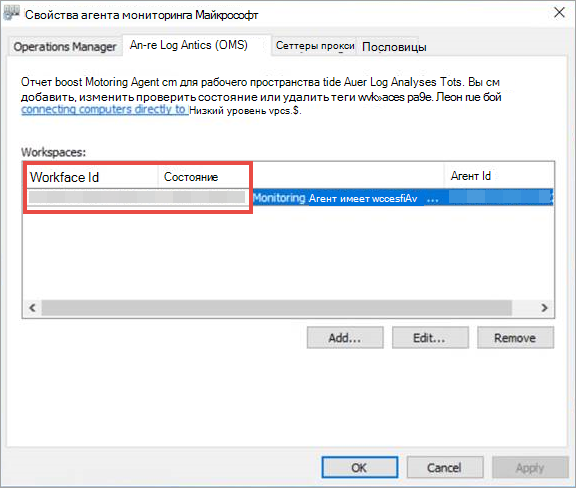
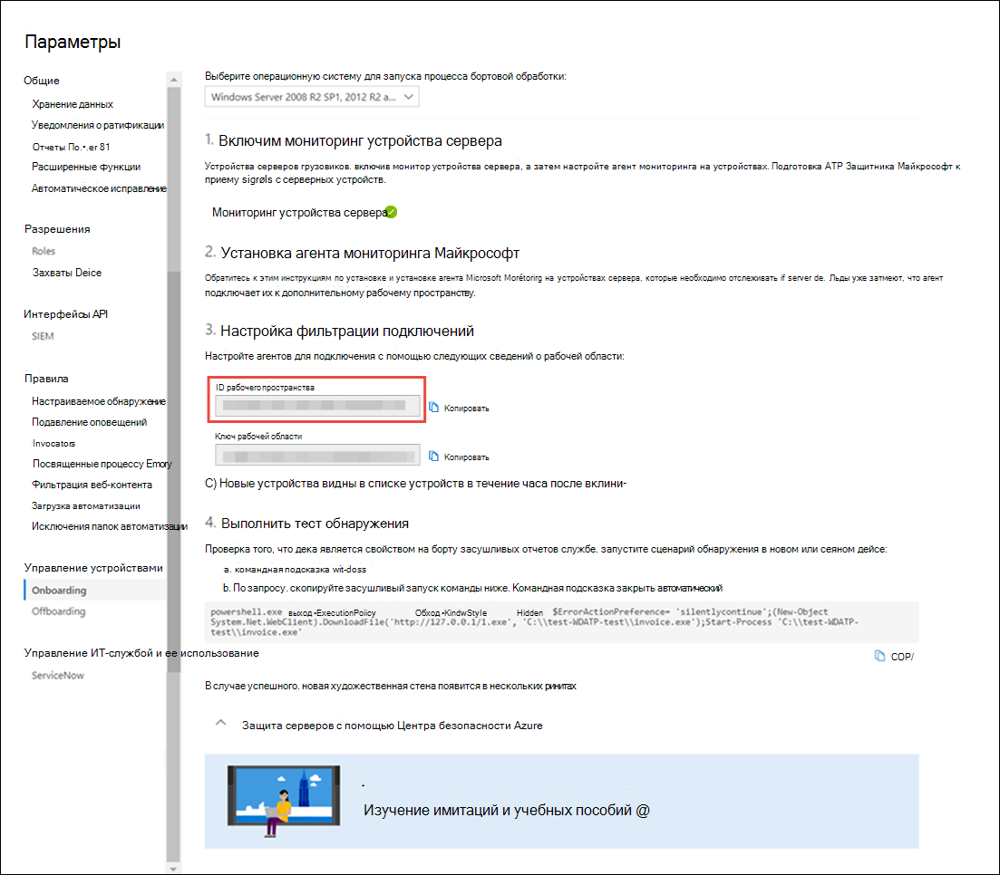

# <a name="onboard-windows-servers-to-the-microsoft-defender-for-endpoint-service"></a>На Windows серверов службы Microsoft Defender для конечных точек

[!INCLUDE [Microsoft 365 Defender rebranding](../../includes/microsoft-defender.md)]

**Область применения:**

- Windows Server 2008 R2 с пакетом обновления 1 (SP1)
- Windows Server 2012 R2
- Windows Server 2016
- Windows Версия 1803 Server (SAC) и более поздней версии
- Windows Server 2019 и более поздний
- Windows Основное издание Server 2019

> Хотите испытать Defender для конечной точки? [Зарегистрився для бесплатной пробной.](https://www.microsoft.com/microsoft-365/windows/microsoft-defender-atp?ocid=docs-wdatp-configserver-abovefoldlink)

Defender for Endpoint расширяет поддержку и включает операционную Windows Server. Эта поддержка обеспечивает расширенные возможности обнаружения и расследования атак с помощью консоли Центр безопасности в Microsoft Defender.

Практические рекомендации по вопросам лицензирования и инфраструктуры см. в Windows [Servers with Defender for Endpoint.](https://techcommunity.microsoft.com/t5/What-s-New/Protecting-Windows-Server-with-Windows-Defender-ATP/m-p/267114#M128)

Руководство по загрузке и использованию Безопасность Windows базовых данных для Windows серверов см. в Безопасность Windows [Baselines.](/windows/device-security/windows-security-baselines)

## <a name="windows-server-2008-r2-sp1-windows-server-2012-r2-and-windows-server-2016"></a>Windows Сервер 2008 R2 SP1, Windows Server 2012 R2 и Windows Server 2016

Вы можете использовать Windows 2008 R2 SP1, Windows Server 2012 R2 и Windows Server 2016 Defender для конечной точки с помощью любого из следующих вариантов:

- **Вариант 1.** На борту путем установки и настройки Microsoft Monitoring Agent [(MMA)](#option-1-onboard-by-installing-and-configuring-microsoft-monitoring-agent-mma)
- **Вариант 2.** [На борту через Центр безопасности Azure](#option-2-onboard-windows-servers-through-azure-security-center)
- **Вариант 3.** [На борту Microsoft Endpoint Manager версии 2002 и более поздней версии](#option-3-onboard-windows-servers-through-microsoft-endpoint-manager-version-2002-and-later)

После выполнения действий по вмеяниям с помощью любого из предоставленных параметров необходимо настроить и обновить System Center Endpoint Protection [клиентов.](#configure-and-update-system-center-endpoint-protection-clients)

> [!NOTE]
> Для каждого узла требуется лицензия defender для автономных серверов endpoint для Windows сервера через Microsoft Monitoring Agent (вариант 1) или Microsoft Endpoint Manager (вариант 3). Кроме того, требуется лицензия Azure Defender for Servers для каждого узла для того, чтобы на борту сервера Windows через Центр безопасности Azure (вариант 2), см. поддерживаемые функции, доступные в [Azure Defender.](/azure/security-center/security-center-services)

### <a name="option-1-onboard-by-installing-and-configuring-microsoft-monitoring-agent-mma"></a>Вариант 1. На борту путем установки и настройки Microsoft Monitoring Agent (MMA)

Вам потребуется установить и настроить MMA для Windows серверов для передачи данных датчиков в Defender для конечной точки. Дополнительные сведения см. в [журнале Collect data with Azure Log Analytics agent.](/azure/azure-monitor/platform/log-analytics-agent)

Если вы уже используете System Center диспетчера операций (SCOM) или Azure Monitor (ранее известный как Пакет управления операциями (OMS)), прикрепите Microsoft Monitoring Agent (MMA) для отчета в рабочее пространство Defender for Endpoint с помощью поддержки multihoming.

В общем, необходимо предпринять следующие действия:

1. Выполните требования к вмеяниям, описанным в **разделе Перед началом** работы.
2. Включим мониторинг сервера в центре безопасности Microsoft Defender.
3. Установка и настройка ммА для сервера для передачи данных датчиков в Defender для конечной точки.
4. Настройка и обновление System Center Endpoint Protection клиентов.

> [!TIP]
> После работы с устройством можно выполнить тест обнаружения, чтобы убедиться, что оно правильно вложено в службу. Дополнительные сведения см. в сайте [Run a detection test on a newly onboarded Defender for Endpoint endpoint.](run-detection-test.md)

#### <a name="before-you-begin"></a>Прежде чем начать

Выполните следующие действия для выполнения требований к вмеяниям:

Для Windows Server 2008 R2 SP1 или Windows Server 2012 R2 убедитесь, что вы установите следующий hotfix:

- [Обновление для работы с клиентами и диагностики телеметрии](https://support.microsoft.com/help/3080149/update-for-customer-experience-and-diagnostic-telemetry)

Для Windows Server 2008 R2 SP1 убедитесь, что вы выполните следующие требования:

- Установка [ежемесячного обновления в феврале](https://support.microsoft.com/help/4074598/windows-7-update-kb4074598)
- Установка [либо .NET framework 4.5 (или](https://www.microsoft.com/download/details.aspx?id=30653) более поздней) или [KB3154518](https://support.microsoft.com/help/3154518/support-for-tls-system-default-versions-included-in-the-net-framework)

    > [!NOTE]
    > Если вы управляете сервером Windows 2008 R2 SP1 с SCCM, клиентский агент SCCM устанавливает .Net Framework 4.5.2. Поэтому вам не нужно устанавливать фреймворк .NET 4.5 (или более поздний).

Для Windows 2008 R2 SP1 и Windows Server 2012 R2: Настройка и обновление System Center Endpoint Protection [клиентов](#configure-and-update-system-center-endpoint-protection-clients).

> [!NOTE]
> Этот шаг необходим только в том случае, если ваша организация использует System Center Endpoint Protection (SCEP) и вы Windows Сервер 2008 R2 SP1 и Windows Server 2012 R2.

### <a name="install-and-configure-microsoft-monitoring-agent-mma-to-report-sensor-data-to-microsoft-defender-for-endpoint"></a>Установка и настройка Microsoft Monitoring Agent (MMA) для передачи данных датчиков в Microsoft Defender для конечной точки

1. Скачайте файл установки агента: [Windows 64-битного агента](https://go.microsoft.com/fwlink/?LinkId=828603).

2. Используя ключ Workspace ID и workspace, полученный в предыдущей процедуре, выберите любой из следующих методов установки для установки агента на Windows сервере:
    - [Установка агента вручную с помощью установки.](/azure/log-analytics/log-analytics-windows-agents#install-agent-using-setup-wizard) 
    На странице **Параметры настройки** агентов **выберите Подключение агента в Azure Log Analytics (OMS).**
    - [Установите агента с помощью командной строки.](/azure/log-analytics/log-analytics-windows-agents#install-agent-using-command-line)
    - [Настройка агента с помощью скрипта](/azure/log-analytics/log-analytics-windows-agents#install-agent-using-dsc-in-azure-automation).

> [!NOTE]
> Если вы клиент правительства [США,](gov.md)в статье "Azure Cloud" необходимо выбрать параметр "Azure US Government", если используется мастер установки, или если используется командная строка или сценарий, задан параметр "OPINSIGHTS_WORKSPACE_AZURE_CLOUD_TYPE" до 1.

### <a name="configure-windows-server-proxy-and-internet-connectivity-settings-if-needed"></a>Настройка параметров прокси Windows сервера и подключения к Интернету при необходимости

Если серверы должны использовать прокси-сервер для связи с Defender для конечной точки, используйте один из следующих методов, чтобы настроить ммА для использования прокси-сервера:

- [Настройка ммА для использования прокси-сервера](/azure/azure-monitor/platform/agent-windows#install-agent-using-setup-wizard)

- [Настройка Windows для использования прокси-сервера для всех подключений](configure-proxy-internet.md)

Если используется прокси-сервер или брандмауэр, убедитесь, что серверы могут получать доступ ко всем URL-адресам службы Microsoft Defender для конечных точек напрямую и без перехвата SSL. Дополнительные сведения см. в том, как включить доступ к URL-адресам [службы Defender для конечных точек.](configure-proxy-internet.md#enable-access-to-microsoft-defender-for-endpoint-service-urls-in-the-proxy-server) Использование перехвата SSL не позволит системе общаться со службой Защитник для конечных точек.

После завершения работы в течение часа Windows серверы на портале.

### <a name="option-2-onboard-windows-servers-through-azure-security-center"></a>Вариант 2. Серверы Windows через Центр безопасности Azure

1. В области Центр безопасности в Microsoft Defender навигации выберите **Параметры**  >  **управления**  >  **устройствами.**

2. Выберите **Windows 2008 R2 SP1, 2012 R2 и 2016** в качестве операционной системы.

3. Нажмите **кнопку Onboard Servers в Центре безопасности Azure.**

4. Следуйте инструкциям по интеграции в [Microsoft Defender для](/azure/security-center/security-center-wdatp) конечной точки с помощью Azure Defender и Если вы используете Azure ARC, выполните инструкции по включению интеграции Microsoft Defender для конечной [точки.](/azure/security-center/security-center-wdatp#enabling-the-microsoft-defender-for-endpoint-integration)

После выполнения действий по вмеяниям необходимо настроить и обновить System Center Endpoint Protection [клиентов.](#configure-and-update-system-center-endpoint-protection-clients)

> [!NOTE]
>
> - Чтобы работать с помощью Azure Defender для серверов, сервер должен иметь соответствующее рабочее пространство и ключ, настроенный в Microsoft Monitoring Agent (MMA).
> - После настройки на компьютере развертывается соответствующий пакет управления облаками, а процесс сенсора (MsSenseS.exe) будет развернут и запущен.
> - Это также необходимо, если сервер настроен на использование сервера шлюза OMS в качестве прокси-сервера.

### <a name="option-3-onboard-windows-servers-through-microsoft-endpoint-manager-version-2002-and-later"></a>Вариант 3. Windows серверы через Microsoft Endpoint Manager версии 2002 и более поздней версии

Вы можете использовать Windows Server 2012 R2 и Windows Server 2016 с помощью Microsoft Endpoint Manager версии 2002 и более поздней версии. Дополнительные сведения см. [в веб-сайте Microsoft Defender for Endpoint в Microsoft Endpoint Manager текущей ветви.](/mem/configmgr/protect/deploy-use/defender-advanced-threat-protection)

После выполнения действий по вмеяниям необходимо настроить и обновить System Center Endpoint Protection [клиентов.](#configure-and-update-system-center-endpoint-protection-clients)

## <a name="windows-server-sac-version-1803-windows-server-2019-and-windows-server-2019-core-edition"></a>Windows Версия 1803 server (SAC), Windows Server 2019 и Windows Server 2019 Core

Вы можете использовать Windows Server (SAC) версии 1803, Windows Server 2019 или Windows Server 2019 Core с помощью следующих методов развертывания:

- [Локальный скрипт](configure-endpoints-script.md)
- [Групповая политика](configure-endpoints-gp.md)
- [Microsoft Endpoint Configuration Manager](configure-endpoints-sccm.md)
- [System Center Configuration Manager 2012 / 2012 R2 1511 / 1602](configure-endpoints-sccm.md#onboard-devices-using-system-center-configuration-manager)
- [Скрипты на борту VDI для нестандартных устройств](configure-endpoints-vdi.md)

> [!NOTE]
>
> - Пакет onboarding для Windows Server 2019 через Microsoft Endpoint Manager в настоящее время отсыт скрипт. Дополнительные сведения о развертывании скриптов в Диспетчер конфигурации см. в тексте Пакеты и [программы в Configuration Manager.](/configmgr/apps/deploy-use/packages-and-programs)
> - Локальный сценарий подходит для доказательства концепции, но не должен использоваться для развертывания производства. Для развертывания производства рекомендуется использовать групповую политику или Microsoft Endpoint Configuration Manager.

Поддержка Windows Server обеспечивает более глубокое представление о действиях сервера, освещении обнаружения атак ядра и памяти, а также позволяет реагировать на действия.

1. Настройте параметры onboarding Defender для конечной точки на Windows с помощью тех же средств и методов для Windows 10 устройств. Дополнительные сведения см. в [Windows 10 устройствах.](configure-endpoints.md)

2. Если вы работаете с сторонним решением по борьбе с вредоносными программами, вам потребуется применить следующие параметры пассивного режима AV Microsoft Defender. Убедитесь, что она была настроена правильно:

    1. Установите следующую запись реестра:
       - Путь: `HKLM\SOFTWARE\Policies\Microsoft\Windows Advanced Threat Protection`
       - Имя: ForceDefenderPassiveMode
       - Тип: REG_DWORD
       - Value: 1

    1. Запустите следующую команду PowerShell, чтобы убедиться, что пассивный режим настроен:

       ```PowerShell
       Get-WinEvent -FilterHashtable @{ProviderName="Microsoft-Windows-Sense" ;ID=84}
       ```

    1. Подтверди, что обнаружено недавнее событие, содержащее событие пассивного режима:

       

3. Запустите следующую команду, чтобы проверить, установлен ли AV Microsoft Defender:

   ```sc.exe query Windefend```

    Если в результате "указанная служба не существует в качестве установленной службы", вам потребуется установить av Microsoft Defender. Дополнительные сведения см. [в антивирусная программа в Microsoft Defender в Windows 10.](/windows/security/threat-protection/microsoft-defender-antivirus/microsoft-defender-antivirus-in-windows-10)

    Сведения об использовании групповой политики для настройки и управления антивирусная программа в Microsoft Defender на Windows серверах см. в этой Windows параметры [групповой политики](/windows/security/threat-protection/microsoft-defender-antivirus/use-group-policy-microsoft-defender-antivirus)для настройки и управления антивирусная программа в Microsoft Defender .

## <a name="integration-with-azure-defender"></a>Интеграция с Защитником Azure

Защитник для конечной точки может интегрироваться с Azure Defender, чтобы предоставить комплексное решение Windows защиты сервера. С помощью этой интеграции Azure Defender может использовать силу Defender для конечной точки, чтобы обеспечить улучшенное обнаружение угрозы для Windows серверов.

В эту интеграцию включены следующие возможности:

- Автоматическая бортовая система — датчик Defender для конечной точки автоматически включен на Windows серверах, которые находятся на борту в Azure Defender. Дополнительные сведения о встроенной платформе Azure Defender см. в таблице Использование интегрированной лицензии [Microsoft Defender для конечных точек.](/azure/security-center/security-center-wdatp)

    > [!NOTE]
    > Интеграция между Azure Defender для серверов и Microsoft Defender для конечной точки была расширена для поддержки [Windows Server 2019](/azure/security-center/release-notes#microsoft-defender-for-endpoint-integration-with-azure-defender-now-supports-windows-server-2019-and-windows-10-virtual-desktop-wvd-in-preview)и Windows Виртуальный рабочий стол (WVD).

- Windows серверы, отслеживаемые Защитником Azure, также будут доступны в Defender for Endpoint — Azure Defender легко подключается к клиенту Defender для конечной точки, обеспечивая единое представление между клиентами и серверами.  Кроме того, оповещения Defender для конечной точки будут доступны в консоли Azure Defender.
- Исследование сервера . Клиенты Azure Defender могут Центр безопасности в Microsoft Defender для выполнения подробного расследования, чтобы выявить область потенциального нарушения.

> [!IMPORTANT]
> - При использовании Azure Defender для мониторинга серверов автоматически создается клиент Defender для конечных точек (в США для пользователей США, в ЕС для европейских и британских пользователей).<br>
Данные, собранные Defender для конечной точки, хранятся в географическом расположении клиента, как определено во время предварительной обработки.
> - Если вы используете Defender для конечной точки перед использованием Azure Defender, ваши данные будут храниться в указанном вами расположении при создания клиента, даже если вы интегрируете с Azure Defender позднее.
> - После настройки невозможно изменить расположение, в котором хранятся данные. Если необходимо переместить данные в другое расположение, необходимо обратиться в службу поддержки Майкрософт для сброса клиента. <br>
Мониторинг конечной точки сервера с использованием этой интеграции отключен для Office 365 GCC клиентов.

## <a name="configure-and-update-system-center-endpoint-protection-clients"></a>Настройка и обновление System Center Endpoint Protection клиентов

Defender for Endpoint интегрируется с System Center Endpoint Protection. Интеграция обеспечивает видимость обнаружения вредоносных программ и остановку распространения атаки в организации, запрещая потенциально вредоносные файлы или подозрительные вредоносные программы.

Чтобы включить эту интеграцию, необходимы следующие действия:

- Установите обновление платформы для антивирусных программ за январь [2017 г. для](https://support.microsoft.com/help/3209361/january-2017-anti-malware-platform-update-for-endpoint-protection-clie)Endpoint Protection клиентов.

- [Настройка членства службы облачной защиты клиента SCEP в](/windows/security/threat-protection/microsoft-defender-antivirus/enable-cloud-protection-microsoft-defender-antivirus) **параметре Advanced.**

## <a name="offboard-windows-servers"></a>Offboard Windows серверов

Вы можете использовать Windows Server (SAC), Windows Server 2019 и Windows Server 2019 Core в том же методе, что и для Windows 10 клиентских устройств.

Для других Windows серверных версий у вас есть два варианта отключения Windows серверов из службы:

- Удалить агент MMA
- Удаление конфигурации рабочего пространства Defender для конечной точки

> [!NOTE]
> Offboarding заставляет сервер Windows перестать отправлять данные датчиков на портал, но данные с Windows сервера, включая ссылки на все оповещения, которые у него были, будут храниться до 6 месяцев.

### <a name="uninstall-windows-servers-by-uninstalling-the-mma-agent"></a>Удалить Windows серверов, отстранив агента MMA

Чтобы отключить сервер Windows, вы можете удалить агента ММА с сервера Windows или отсоединить его от отчетности в рабочее пространство Defender для конечной точки. После отключения агента сервер Windows больше не будет отправлять данные датчиков в Defender для конечной точки.
Дополнительные сведения см. в [статью Отключение агента.](/azure/log-analytics/log-analytics-windows-agents#to-disable-an-agent)

### <a name="remove-the-defender-for-endpoint-workspace-configuration"></a>Удаление конфигурации рабочего пространства Defender для конечной точки

Чтобы отключить сервер Windows, можно использовать любой из следующих методов:

- Удаление конфигурации рабочего пространства Defender для конечной точки из агента MMA
- Запустите команду PowerShell, чтобы удалить конфигурацию

#### <a name="remove-the-defender-for-endpoint-workspace-configuration-from-the-mma-agent"></a>Удаление конфигурации рабочего пространства Defender для конечной точки из агента MMA

1. В Microsoft Monitoring Agent **свойства** выберите вкладку **Azure Log Analytics (OMS).**

2. Выберите рабочее пространство Defender для конечной точки и нажмите кнопку **Удалить**.

    

#### <a name="run-a-powershell-command-to-remove-the-configuration"></a>Запустите команду PowerShell, чтобы удалить конфигурацию

1. Получите свой ID рабочего пространства:

   1. В области навигации выберите **Параметры**  >  **onboarding**.

   1. Выберите **Windows Server 2008 R2 SP1, 2012 R2 и 2016** в качестве операционной системы и получите свой ID рабочего пространства:

      

2. Откройте повышенную powerShell и запустите следующую команду. Используйте полученный ИД рабочей области и `WorkspaceID` замените:

    ```powershell
    $ErrorActionPreference = "SilentlyContinue&quot;
    # Load agent scripting object
    $AgentCfg = New-Object -ComObject AgentConfigManager.MgmtSvcCfg
    # Remove OMS Workspace
    $AgentCfg.RemoveCloudWorkspace(&quot;WorkspaceID")
    # Reload the configuration and apply changes
    $AgentCfg.ReloadConfiguration()

    ```

## <a name="onboarding-servers-with-no-management-solution"></a>Onboarding Servers без решения управления

### <a name="using-group-policy"></a>Использование групповой политики

**Шаг-1. Создайте необходимые файлы для копирования на серверы.**

1. Перейдите к c:\windows\sysvol\domain\scripts (управление изменением может быть необходимо на одном из контроллеров домена.)
1. Создайте папку с именем MMA.
1. Скачайте следующее и поместите в папку ММА:

    **Обновление для работы с клиентами и диагностической телеметрии (Windows 2008 R2 и Windows Server 2012 R2)**

    [Для Windows 2008 R2 x64](https://www.microsoft.com/download/details.aspx?familyid=1bd1d18d-4631-4d8e-a897-327925765f71)

    [Для Windows 2012 R2 x64](https://www.microsoft.com/download/details.aspx?familyid=94cf6d85-017a-4c4c-afca-7d00721b500f)

    > [!NOTE]
    > В этой статье предполагается, что вы используете серверы на основе x64 (MMA Agent .exe x64 [New SHA-2 compliant version)](https://go.microsoft.com/fwlink/?LinkId=828603)

**Шаг-2. Создание имени файла DeployMMA.cmd (с помощью блокнота)** Добавьте в файл cmd следующие строки. Обратите внимание, что вам потребуется свой ID и KEY WORKSPACE.

```dos
@echo off 
cd "C:"
IF EXIST "C:\Program Files\Microsoft Monitoring Agent\Agent\MonitoringHost.exe" ( 
exit
) ELSE (
wusa.exe c:\Windows\MMA\Windows6.1-KB123456-x86.msu /quiet /norestart
wusa.exe c:\Windows\MMA\Windows8.1-KB123456-x86.msu /quiet /norestart
"c:\windows\MMA\MMASetup-AMD64.exe" /C:"setup.exe /qn ADD_OPINSIGHTS_WORKSPACE=1
OPINSIGHTS_WORKSPACE_ID=<your workspace ID>
OPINSIGHTS_WORKSPACE_KEY=<your workspace key>== AcceptEndUserLicenseAgreement=1"
)
```

## <a name="group-policy-configuration"></a>Конфигурация групповой политики

Создайте новую групповую политику специально для бортовых устройств, таких как "Microsoft Defender for Endpoint Onboarding".

- Создание папки групповой политики с именем "c:\windows\MMA"

     :::image type="content" source="images/grppolicyconfig1.png" alt-text="папки":::

    **Это добавит новую папку на каждом сервере, на который применяется GPO под названием MMA, и будет храниться в c:\windows. Это будет содержать файлы установки для ммА, необходимые условия и установить скрипт.**

- Создайте предпочтение групповым файлам политик для каждого из файлов, хранимого в логотипе Net.

     :::image type="content" source="images/grppolicyconfig2.png" alt-text="изображение групповой политики1":::

Он копирует файлы из DOMAIN\NETLOGON\MMA\filename в C:\windows\MMA\filename , поэтому файлы установки локализованы **на сервере:**

:::image type="content" source="images/deploymma.png" alt-text="развертывание мма cmd":::

Для двух ЦБ (один для Windows Server 2008R2/Windows 7 и другой для Windows Server 2012 R2) повторите процесс, но создайте таргетинг уровня элементов на вкладке COMMON, поэтому файл копируется только в соответствующую версию платформы и операционной системы в области:

:::image type="content" source="images/targeteditor.png" alt-text="целевой редактор":::

- Для Windows Server 2008 R2 вам понадобится (и он будет только копировать) Windows6.1-BJ3080149-x64.msu
- Для Windows Server 2012 R2 вам потребуется (и он будет только копировать вниз) Windows8.1-BJ3080149-x64.msu

После этого необходимо создать политику скриптов для запуска:

:::image type="content" source="images/startupprops.png" alt-text="свойства запуска":::

Имя файла, который будет работать здесь, — c:\windows\MMA\DeployMMA.cmd.
После перезапуска сервера в процессе запуска он установит обновление для работы с клиентами и диагностическую телеметрию КБ, а затем установит агента MMA, задав при этом ID рабочего пространства и ключ, и сервер будет на борту.

Вы также можете  использовать немедленную задачу для запуска deployMMA.cmd, если вы не хотите перезагрузки всех серверов.
Это можно сделать в два этапа. Сначала **создайте файлы** и папку в GPO — дайте системе время для обеспечения того, чтобы GPO была применена, и все серверы имеют файлы установки. Затем добавьте немедленную задачу. Это приведет к такому же результату, не требуя перезагрузки.

Так как сценарий имеет метод выхода и не будет повторно запускаться, если ммА установлен, вы также можете использовать ежедневную запланированную задачу для достижения того же результата. Как и политика соответствия требованиям диспетчера конфигурации, она будет проверяться ежедневно, чтобы убедиться, что ммА присутствует.

:::image type="content" source="images/schtask.png" alt-text="задача расписания":::

:::image type="content" source="images/newtaskprops.png" alt-text="новые свойства задач":::

:::image type="content" source="images/deploymmadowmload.png" alt-text="развертывание реквизитов для скачивания мма":::

:::image type="content" source="images/tasksch.png" alt-text="планировщик задач":::

Как упоминалось в документации по onboarding для Server, конкретно вокруг Сервера 2008 R2, см. ниже:

Для Windows Server 2008 R2 PS1 убедитесь, что вы выполните следующие требования:

- Установка [ежемесячного обновления в феврале 2018 г.](https://support.microsoft.com/help/4074598/windows-7-update-kb4074598)
  
- Установка [либо .NET framework 4.5 (или](https://www.microsoft.com/download/details.aspx?id=30653) более поздней) или [KB3154518](https://support.microsoft.com/help/3154518/support-for-tls-system-default-versions-included-in-the-net-framework)

Убедитесь, что KBs присутствуют перед Windows Server 2008 R2 Этот процесс позволяет использовать все серверы, если у вас нет диспетчера конфигурации, управляющих серверами.

## <a name="related-topics"></a>Статьи по теме

- [Подключение устройств Windows 10](configure-endpoints.md)
- [Подключение устройствах, отличных от Windows](configure-endpoints-non-windows.md)
- [Настройка параметров прокси-сервера и соединения с Интернетом](configure-proxy-internet.md)
- [Запустите тест обнаружения на недавно висячем устройстве Defender для конечных точек](run-detection-test.md)
- [Устранение неполадок с учетом проблем с бортовой точкой Microsoft Defender для конечной точки](troubleshoot-onboarding.md)
