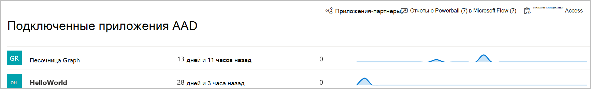

# Подключенные приложения в Microsoft Defender для конечной точкиConnected applications in Microsoft Defender for Endpoint

[!INCLUDE [Microsoft 365 Defender rebranding](../../includes/microsoft-defender.md)]

**Область применения:****Applies to:**
- [Microsoft Defender для конечной точкиMicrosoft Defender for Endpoint](https://go.microsoft.com/fwlink/p/?linkid=2154037)
- [Microsoft 365 DefenderMicrosoft 365 Defender](https://go.microsoft.com/fwlink/?linkid=2118804)

>Хотите испытать Defender для конечной точки?Want to experience Defender for Endpoint? [Зарегистрився для бесплатной пробной.Sign up for a free trial.](https://www.microsoft.com/microsoft-365/windows/microsoft-defender-atp?ocid=docs-wdatp-assignaccess-abovefoldlink)

Подключенные приложения интегрируются с платформой Defender для конечных точек с помощью API.Connected applications integrates with the Defender for Endpoint platform using APIs. 

Приложения используют стандартный протокол OAuth 2.0 для проверки подлинности и предоставления маркеров для использования в API конечных токенов Microsoft Defender.Applications use standard OAuth 2.0 protocol to authenticate and provide tokens for use with Microsoft Defender for Endpoint APIs.  Кроме того, приложения Azure Active Directory (Azure AD) позволяют администраторам клиентов устанавливать явный контроль над доступом к API с помощью соответствующего приложения.In addition, Azure Active Directory (Azure AD) applications allow tenant admins to set explicit control over which APIs can be accessed using the corresponding app.
 
Чтобы использовать API  с подключенным приложением, необходимо следовать этим шагам.You'll need to follow [these steps](https://docs.microsoft.com/microsoft-365/security/defender-endpoint/apis-intro) to use the APIs with the connected application.
 
## Доступ к подключенной странице приложенияAccess the connected application page
Из левого меню навигации выберите **приложения &**  >  **AAD.**From the left navigation menu, select **Partners & APIs** > **Connected AAD applications**.

 
## Просмотр сведений о подключенных приложенияхView connected application details
На странице Подключенные приложения содержится информация о приложениях Azure AD, подключенных к Microsoft Defender для конечной точки в вашей организации.The Connected applications page provides information about the Azure AD applications connected to Microsoft Defender for Endpoint in your organization. Вы можете просмотреть использование подключенных приложений: последнее просмотрение, количество запросов за последние 24 часа и тенденции запроса за последние 30 дней.You can review the usage of the connected applications: last seen, number of requests in the past 24 hours, and request trends in the last 30 days.

 
## Изменение, перенастройка или удаление подключенного приложенияEdit, reconfigure, or delete a connected application
Ссылка **"Параметры открытого приложения"** открывает соответствующую страницу управления приложениями Azure AD на портале Azure.The **Open application settings** link opens the corresponding Azure AD application management page in the Azure portal. На портале Azure можно управлять разрешениями, перенастройка или удаление подключенных приложений.From the Azure portal, you can manage permissions, reconfigure, or delete the connected applications.
