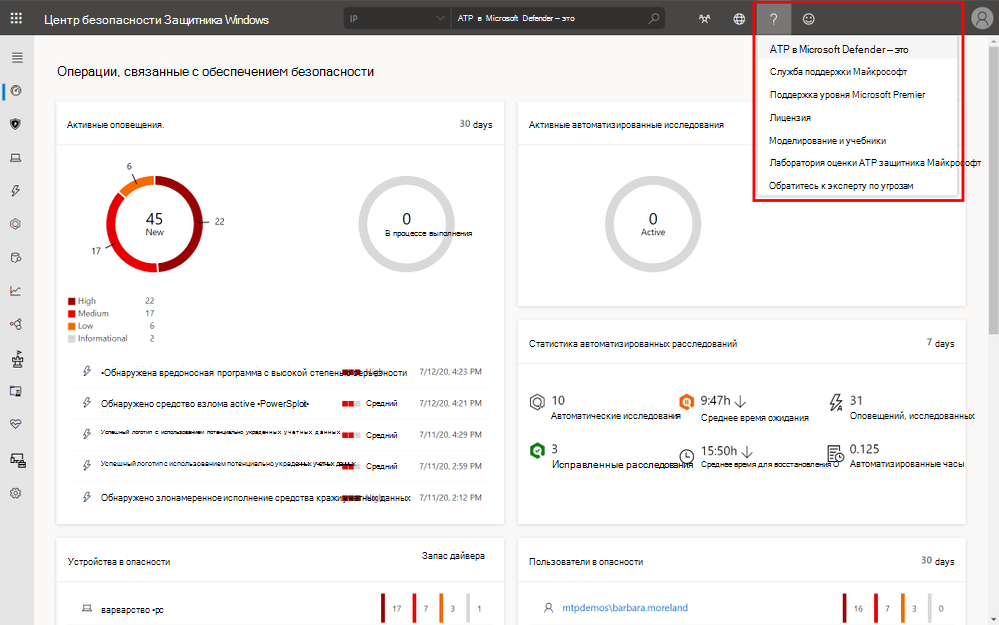
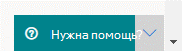
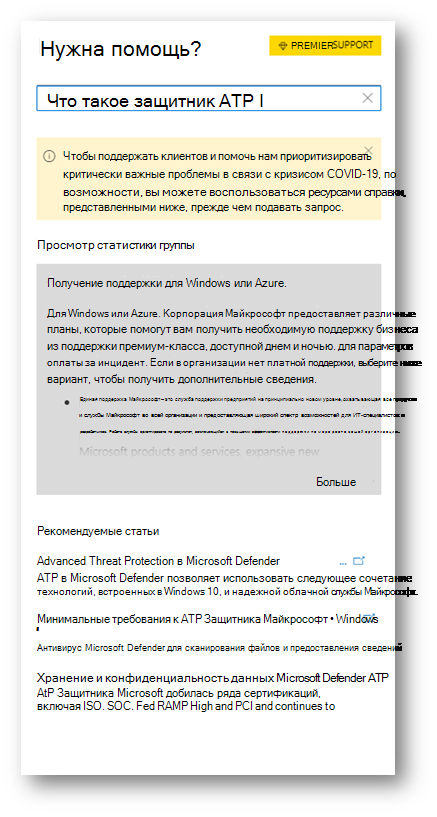
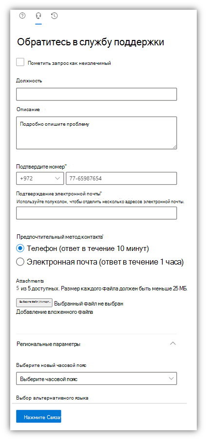

# Обратитесь в службу поддержки Microsoft Defender для конечной точкиContact Microsoft Defender for Endpoint support

[!INCLUDE [Microsoft 365 Defender rebranding](../../includes/microsoft-defender.md)]

**Область применения:****Applies to:**
- [Microsoft Defender для конечной точкиMicrosoft Defender for Endpoint](https://go.microsoft.com/fwlink/p/?linkid=2154037)
- [Microsoft 365 DefenderMicrosoft 365 Defender](https://go.microsoft.com/fwlink/?linkid=2118804)

>Хотите испытать Defender для конечной точки?Want to experience Defender for Endpoint? [Зарегистрився для бесплатной пробной.Sign up for a free trial.](https://www.microsoft.com/microsoft-365/windows/microsoft-defender-atp?ocid=docs-wdatp-assignaccess-abovefoldlink)

Defender for Endpoint недавно обновил процесс поддержки, чтобы предложить более современный и расширенный опыт поддержки.Defender for Endpoint has recently upgraded the support process to offer a more modern and advanced support experience. 

Новый виджет позволяет клиентам:The new widget allows customers to:
- Поиск решений распространенных проблемFind solutions to common problems
- Отправка случая поддержки в службу поддержки МайкрософтSubmit a support case to the Microsoft support team

## Предварительные условияPrerequisites
Важно знать конкретные роли, которые имеют разрешение на открытие случаев поддержки.It's important to know the specific roles that have permission to open support cases.

Как минимум необходимо иметь роль администратора службы поддержки **или** администратора helpdesk.At a minimum, you must have a Service Support Administrator **OR** Helpdesk Administrator role.

Дополнительные сведения о том, какие роли имеют разрешения, см. в см. в [рублях Разрешения администратора безопасности.](/azure/active-directory/users-groups-roles/directory-assign-admin-roles#security-administrator-permissions)For more information on which roles have permission see, [Security Administrator permissions](/azure/active-directory/users-groups-roles/directory-assign-admin-roles#security-administrator-permissions). Роли, включаемые `microsoft.office365.supportTickets/allEntities/allTasks` в действие, могут отправлять кейс.Roles that include the action `microsoft.office365.supportTickets/allEntities/allTasks` can submit a case.

Общие сведения о ролях администратора см. в общих [сведениях о ролях администратора.](/microsoft-365/admin/add-users/about-admin-roles?view=o365-worldwide&preserve-view=true)For general information on admin roles, see [About admin roles](/microsoft-365/admin/add-users/about-admin-roles?view=o365-worldwide&preserve-view=true).

## Доступ к виджетуAccess the widget
Доступ к новому виджету поддержки можно сделать одним из двух способов:Accessing the new support widget can be done in one of two ways:

1.  Нажав на знак вопроса в правом верхнем справа от портала, а затем нажав на кнопку "Поддержка Майкрософт":Clicking on the question mark on the top right of the portal and then clicking on "Microsoft support":

    

2. Нажав на **справку о необходимости?**Clicking on the **Need help?**  кнопка в правом нижнем справа от Центр безопасности в Microsoft Defender:button in the bottom right of the Microsoft Defender Security Center:

    

В виджете вам будут предложены два варианта:In the widget you will be offered two options:

- Поиск решений распространенных проблемFind solutions to common problems    
- Создание запроса на обслуживаниеOpen a service request  

## Поиск решений распространенных проблемFind solutions to common problems
Этот параметр включает статьи, которые могут быть связаны с вопросом, который вы можете задать.This option includes articles that might be related to the question you may ask. Просто начните вводить вопрос в поле поиска и статьи, связанные с поиском, будут всплыть.Just start typing the question in the search box and articles related to your search will be surfaced.

Если предложенных статей недостаточно, можно открыть запрос на обслуживание.In case the suggested articles are not sufficient, you can open a service request.

## Создание запроса на обслуживаниеOpen a service request

Узнайте, как открыть билеты поддержки, обратившись в службу поддержки Defender для конечной точки.Learn how to open support tickets by contacting Defender for Endpoint support. 

> [!Note]
> Если у вас есть контракт на поддержку permier с Microsoft, вы увидите премьер-тег на виджете.If you have a permier support contract with Microsoft, you will see the premier tag on the widget. Если нет, обратитесь к руководителю учетной записи Майкрософт.If not, contact your Microsoft account manager.

### Обращение в службу поддержкиContact support
Этот параметр доступен, щелкнув значок, похожий на гарнитуру.This option is available by clicking the icon that looks like a headset. Затем вы получите следующую страницу для отправки дела поддержки:You will then get the following page to submit your support case:

1. Заполните название и описание проблемы, с которой вы столкнулись, а также номер телефона и адрес электронной почты, где мы можем связаться с вами.Fill in a title and description for the issue you are facing, as well as a phone number and email address where we may reach you. 

2. (Необязательный) Включаем до пяти вложений, которые имеют отношение к проблеме, чтобы обеспечить дополнительный контекст для случая поддержки.(Optional) Include up to five attachments that are relevant to the issue in order to provide additional context for the support case. 

3. Если применимо, выберите часовой пояс и альтернативный язык.Select your time zone and an alternative language, if applicable. Запрос будет отправлен в службу поддержки Майкрософт.The request will be sent to Microsoft Support Team. В ближайшее время группа ответит на запрос службы.The team will respond to your service request shortly.

## Статьи по темеRelated topics
- [Устранение неполадок службыTroubleshoot service issues](troubleshoot-mdatp.md)
- [Проверка работоспособности службы](service-status.md).[Check service health](service-status.md)
