# <a name="how-to-control-usb-devices-and-other-removable-media-using-microsoft-defender-for-endpoint"></a>Управление USB-устройствами и другими съемными носителями с помощью Microsoft Defender для конечной точки

**Применяется к:** [Microsoft Defender для конечной точки](https://go.microsoft.com/fwlink/p/?linkid=2069559)

Корпорация Майкрософт рекомендует многоуровневый подход к обеспечению безопасности съемных [мультимедиа,](https://aka.ms/devicecontrolblog)а Microsoft Defender for Endpoint предоставляет несколько функций мониторинга и управления, чтобы предотвратить угрозы на несанкционированных периферийных устройствах:

1. Откройте для себя подключенные события подключения и воспроизведения для [периферийных устройств в Microsoft Defender для продвинутой охоты endpoint.](#discover-plug-and-play-connected-events) Определение или расследование подозрительной активности использования.

2. Настройте, чтобы разрешить или заблокировать только некоторые съемные устройства и предотвратить угрозы.
    1. [Разрешить или заблокировать съемные устройства](#allow-or-block-removable-devices) на основе гранулированной конфигурации, чтобы запретить записи доступа к съемным дискам и утверждать или отказывать устройствам с помощью USB-устройств. Гибкое назначение политик параметров установки устройств на основе отдельных или групп Azure Active Directory пользователей и устройств Azure AD.

    2. [Предотвращение угроз из съемного хранилища,](#prevent-threats-from-removable-storage) вносяного съемными устройствами хранения, с помощью включения:  
        - антивирусная программа в Microsoft Defender защиты в режиме реального времени (RTP) для сканирования съемного хранилища для вредоносных программ.  
        - Правило USB-службы по уменьшению поверхности атаки (ASR) для блокировки ненавязаных и неподписаных процессов, запускаемого из USB.  
        - Параметры защиты прямого доступа к памяти (DMA) для смягчения DMA-атак, включая защиту DMA ядра для Thunderbolt и блокировку DMA до тех пор, пока пользователь не войдет.  

3. [Создание настраиваемых](#create-customized-alerts-and-response-actions) оповещений и ответных действий для мониторинга использования съемных устройств на основе этих событий подключения и воспроизведения или любых других событий Microsoft Defender для конечных точек с пользовательскими правилами [обнаружения.](/microsoft-365/security/defender-endpoint/custom-detection-rules)

4. [Реагируйте на угрозы](#respond-to-threats) периферийных устройств в режиме реального времени на основе свойств, сообщаемого каждым периферийным устройством.

>[!Note]
>Эти меры по снижению угрозы помогают предотвратить проникновения вредоносных программ в среду. Чтобы защитить корпоративные данные от выхода из среды, можно также настроить меры по предотвращению потери данных. Например, на Windows 10 устройствах можно настроить [BitLocker](/windows/security/information-protection/bitlocker/bitlocker-overview.md) и Windows Information [Protection,](/windows/security/information-protection/create-wip-policy-using-intune-azure.md)которые шифруют данные компании, даже если они хранятся на личном устройстве, или использовать [CSP служба хранилища/RemovableDiskDenyWriteAccesss,](/windows/client-management/mdm/policy-csp-storage#storage-removablediskdenywriteaccess) чтобы запретить записывать доступ к съемным дискам. Кроме того, вы можете классифицировать и защищать файлы на Windows устройствах (включая их установленные [USB-устройства)](/windows/security/threat-protection/windows-defender-atp/information-protection-in-windows-overview) с помощью Microsoft Defender для конечной точки и Azure Information Protection.

## <a name="discover-plug-and-play-connected-events"></a>Обнаружение подключенных событий и воспроизведения подключенных событий

Вы можете просматривать подключенные события в Microsoft Defender для конечной точки, чтобы определить подозрительные действия по использованию или выполнить внутренние исследования.
Примеры запросов для расширенных запросов на охоту Defender для конечной точки см. в примере запросов microsoft Defender для конечной точки GitHub [репо](https://github.com/Microsoft/WindowsDefenderATP-Hunting-Queries).

Примеры Power BI отчетов доступны для Microsoft Defender для конечной точки, которые можно использовать для расширенных запросов на охоту. С помощью этих шаблонов, в том числе для управления устройствами, можно интегрировать в Power BI. Дополнительные сведения см. в GitHub репозитории [шаблонов PowerBI.](https://github.com/microsoft/MDATP-PowerBI-Templates) Дополнительные Power BI см. в [Power BI](/microsoft-365/security/defender-endpoint/api-power-bi) создать настраиваемые отчеты.

## <a name="allow-or-block-removable-devices"></a>Разрешить или заблокировать съемные устройства
В следующей таблице описывается, как Microsoft Defender для конечной точки может разрешить или заблокировать съемные устройства на основе гранулированной конфигурации.

| Control  | Описание |
|----------|-------------|
| [Ограничение USB-дисков и других периферийных устройств](#restrict-usb-drives-and-other-peripherals) | Вы можете разрешить или запретить пользователям устанавливать только USB-диски и другие периферийные устройства, включенные в список разрешенных или несанкционированных устройств или типов устройств. |
| [Блокировка установки и использования съемного хранилища](#block-installation-and-usage-of-removable-storage) | Невозможно установить или использовать съемное хранилище. |
| [Разрешить установку и использование специально утвержденных периферийных устройств](#allow-installation-and-usage-of-specifically-approved-peripherals)   | Вы можете установить и использовать только утвержденные периферийные устройства, сообщая о конкретных свойствах в их микропрограммных обеспечениях. |
| [Предотвращение установки специально запрещенных периферийных устройств](#prevent-installation-of-specifically-prohibited-peripherals) | Нельзя установить или использовать запрещенные периферийные устройства, сообщая о конкретных свойствах в их микропрограмме. |
| [Разрешить установку и использование специально утвержденных периферийных устройств с соответствием ID экземпляров устройств](#allow-installation-and-usage-of-specifically-approved-peripherals-with-matching-device-instance-ids) | Вы можете установить и использовать только утвержденные периферийные устройства, которые соответствуют любым из этих ID экземпляров устройства. |
| [Предотвращение установки и использования специально запрещенных периферийных устройств с соответствием ID экземпляров устройств](#prevent-installation-and-usage-of-specifically-prohibited-peripherals-with-matching-device-instance-ids) | Нельзя установить или использовать запрещенные периферийные устройства, которые соответствуют ни одному из этих ID-экземпляров устройства. |
| [Ограничение служб, которые используют Bluetooth](#limit-services-that-use-bluetooth) | Можно ограничить службы, которые могут использовать Bluetooth. |
| [Используйте Microsoft Defender для базовых параметров конечной точки](#use-microsoft-defender-for-endpoint-baseline-settings) | Рекомендуемую конфигурацию для ATP можно установить с помощью базовой базы безопасности Defender для конечной точки. |

### <a name="restrict-usb-drives-and-other-peripherals"></a>Ограничение USB-дисков и других периферийных устройств

Чтобы предотвратить заражение вредоносными программами или потерю данных, организация может ограничить USB-накопители и другие периферийные устройства. В следующей таблице описывается, как Microsoft Defender для конечной точки может помочь предотвратить установку и использование USB-дисков и других периферийных устройств.

| Control  | Описание
|----------|-------------|
| [Разрешить установку и использование USB-дисков и других периферийных устройств](#allow-installation-and-usage-of-usb-drives-and-other-peripherals) | Разрешить пользователям устанавливать только USB-диски и другие периферийные устройства, включенные в список авторизованных устройств или типов устройств |
| [Предотвращение установки и использования USB-дисков и других периферийных устройств](#prevent-installation-and-usage-of-usb-drives-and-other-peripherals) | Запретить пользователям устанавливать USB-диски и другие периферийные устройства, включенные в список несанкционированных устройств и типов устройств |

Все вышеперечисленные элементы управления можно установить с помощью [административных шаблонов](/intune/administrative-templates-windows)Intune. Соответствующие политики размещены здесь, в шаблонах администратора Intune:

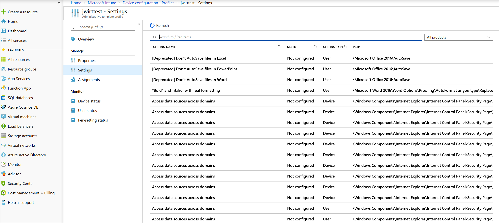

>[!Note]
>С помощью Intune можно применить политики конфигурации устройств для пользователей Azure AD и/или групп устройств.
Вышеуказанные политики также можно настроить с помощью параметров [CSP](/windows/client-management/mdm/policy-csp-deviceinstallation) установки устройств и [GPOs установки устройств.](/previous-versions/dotnet/articles/bb530324(v=msdn.10))

> [!Note]
> Всегда проверяйте и уточняйте эти параметры с помощью пилотной группы пользователей и устройств, прежде чем применять их в производстве.
Дополнительные сведения об управлении USB-устройствами см. в [блоге Microsoft Defender for Endpoint.](https://www.microsoft.com/security/blog/2018/12/19/windows-defender-atp-has-protections-for-usb-and-removable-devices/)

#### <a name="allow-installation-and-usage-of-usb-drives-and-other-peripherals"></a>Разрешить установку и использование USB-дисков и других периферийных устройств

Один из способов подхода к установке и использованию USB-дисков и других периферийных устройств — это разрешить все. После этого можно начать уменьшать допустимые usb-драйверы и другие периферийные устройства.

>[!Note]
>Так как несанкционированный usb-периферийный компьютер может иметь прошивку, которая подменит его свойства USB, рекомендуется разрешить только специально утвержденные периферийные usb-устройства и ограничить доступ к ним пользователям.

1. Включить **предотвращение установки устройств, не описанных другими настройками политики** для всех пользователей.
2. Включить **разрешить установку устройств с помощью драйверов,** которые соответствуют этим классам установки устройств для всех [классов установки устройств.](/windows-hardware/drivers/install/system-defined-device-setup-classes-available-to-vendors)

Чтобы обеспечить соблюдение политики для уже установленных устройств, применяем политики предотвращения, которые имеют этот параметр.

При настройке политики установки разрешаемых устройств необходимо разрешить и все родительские атрибуты. Вы можете просмотреть родителей устройства, открыв диспетчер устройств и просмотреть по подключению.

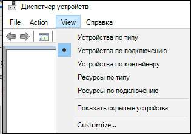

В этом примере необходимо добавить следующие классы: HID, Keyboard и {36fc9e60-c465-11cf-8056-44453540000}. Дополнительные [сведения см. в записи usb-драйверов,](/windows-hardware/drivers/usbcon/supported-usb-classes) предоставленных Корпорацией Майкрософт.

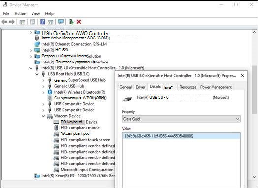

Если вы хотите ограничиться определенными устройствами, удалите класс установки устройства периферийного устройства, который необходимо ограничить. Затем добавьте ID устройства, который необходимо добавить. ID устройства основан на значении ID поставщика и продукта для устройства. Сведения о форматах идентификаторов устройств см. в [стандартных идентификаторах USB.](/windows-hardware/drivers/install/standard-usb-identifiers) 

Чтобы найти ID устройства, см. [в руб. Look up device ID.](#look-up-device-id) 

Пример:

1. Удалите класс USBDevice из допустимой установки устройств с помощью драйверов, которые соответствуют **этим настройкам устройств.**
2. Добавьте ID устройства, чтобы разрешить установку устройства, которое соответствует **любому из этих ID-устройств.** 


#### <a name="prevent-installation-and-usage-of-usb-drives-and-other-peripherals"></a>Предотвращение установки и использования USB-дисков и других периферийных устройств

Если вы хотите предотвратить установку класса устройства или определенных устройств, можно использовать политики предотвращения установки устройств:

1. Включить предотвращение установки устройств, которые соответствуют любым из этих **ID-устройств,** и добавить эти устройства в список.
2. Включить **предотвращение установки устройств с помощью драйверов, которые соответствуют этим** классам установки устройства.

> [!Note]
> Политики по предотвращению установки устройств имеют приоритет над политиками установки разрешающего устройства.

Предотвращение установки устройств, которые соответствуют какой-либо из этих политик **ID-устройств,** позволяет указать список устройств, Windows не допускается установка. 

Чтобы предотвратить установку устройств, которые соответствуют любым из этих ID-устройств: 

1. [Найди ID](#look-up-device-id) устройства для устройств, Windows запретить установку.

   

2. Включить **предотвращение установки устройств,** которые соответствуют любым из этих ID-устройств, и добавьте в список поставщиков или продуктов.

    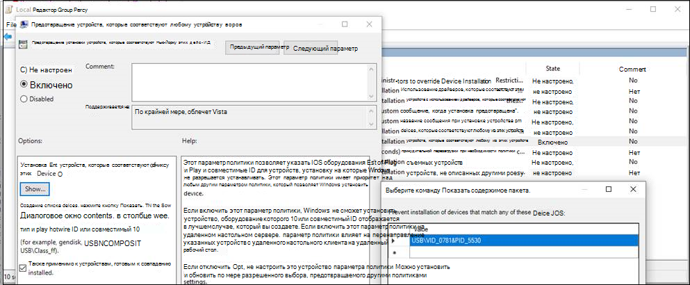

#### <a name="look-up-device-id"></a>Ид устройства

С помощью диспетчера устройств можно найти ID устройства.

1. Open Device Manager.
2. Щелкните **Просмотр** и выберите **Устройства по подключению.**
3. С дерева щелкните правой кнопкой мыши устройство и выберите **Свойства**.
4. В диалоговом окне для выбранного устройства щелкните вкладку **Details.**
5. Щелкните  выпадаемый список свойств и выберите **"Аппаратные ids".**
6. Щелкните правой кнопкой мыши верхнее значение ID и выберите **Copy**.

Сведения о форматах идентификаторов устройств см. в [стандартных идентификаторах USB.](/windows-hardware/drivers/install/standard-usb-identifiers)

Сведения о ID-данных поставщиков см. в [см. в сайте USB-членов.](https://www.usb.org/members)

Ниже приводится пример для поисков ID поставщика устройств или ID продукта (который является частью ID устройства) с помощью PowerShell: 

```powershell
Get-WMIObject -Class Win32_DiskDrive |
Select-Object -Property * 
```

Предотвращение **установки** устройств с использованием драйверов, которые соответствуют политике классов установки этих устройств, позволяет указать классы установки устройств, Windows не допускается установка. 

Чтобы предотвратить установку определенных классов устройств: 

1. Найдите GUID класса установки устройства из классов установки устройств с системным [определением, доступных для поставщиков.](/windows-hardware/drivers/install/system-defined-device-setup-classes-available-to-vendors)

2. Включить **предотвращение установки устройств с помощью драйверов,** которые соответствуют этим классам установки устройств, и добавить guID класса в список.

    > [!div class="mx-imgBorder"]
    > 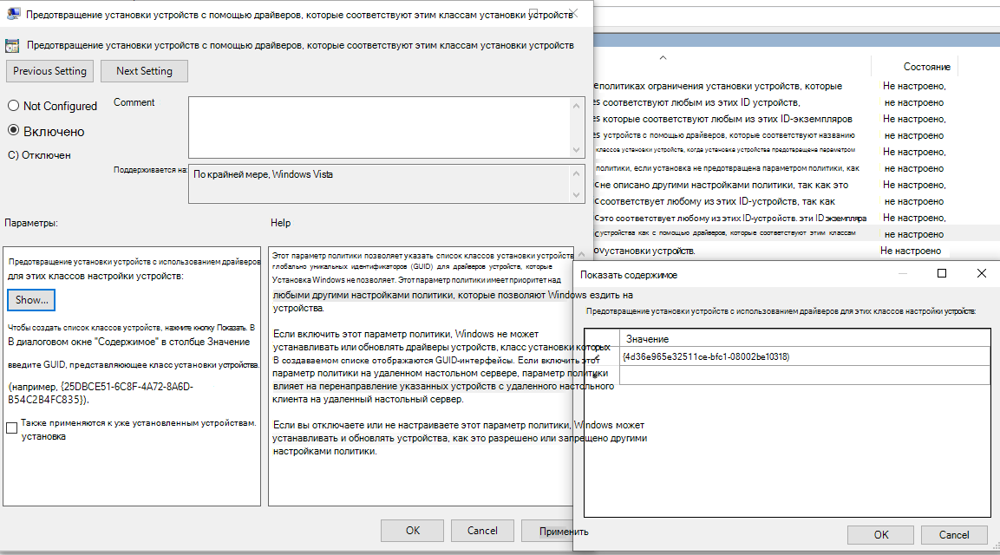

### <a name="block-installation-and-usage-of-removable-storage"></a>Блокировка установки и использования съемного хранилища

1. Во входе [в Microsoft Endpoint Manager центр администрирования.](https://endpoint.microsoft.com/)

2. Щелкните   >  **Профили конфигурации устройств**  >  **Создание профиля**.

    > [!div class="mx-imgBorder"]
    > 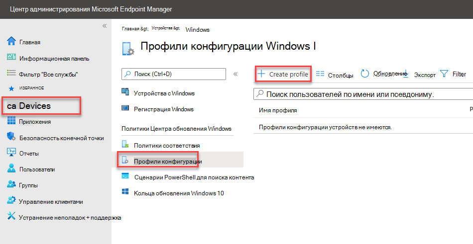

3. Используйте указанные ниже параметры:

   - Имя. Введите имя профиля
   - Описание. Введите описание
   - Платформа: Windows 10 и более поздней
   - Тип профиля: ограничения устройств

   > [!div class="mx-imgBorder"]
   > 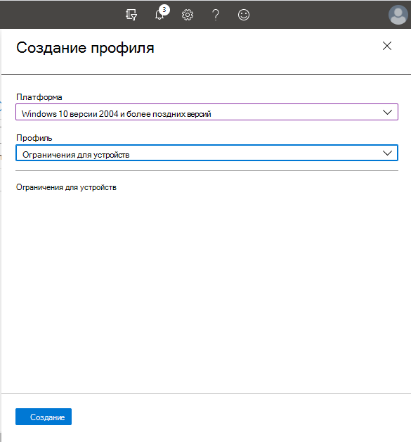

4. Нажмите **кнопку Настройка**  >  **общего**.  

5. Для **съемного хранилища и** **USB-подключения (только для мобильных устройств)** выберите **Блок**. **Съемное хранилище** включает USB-накопители, в то время как usb-подключение (только для мобильных **устройств)** исключает usb-зарядку, но включает другие USB-подключения только на мобильных устройствах. 

   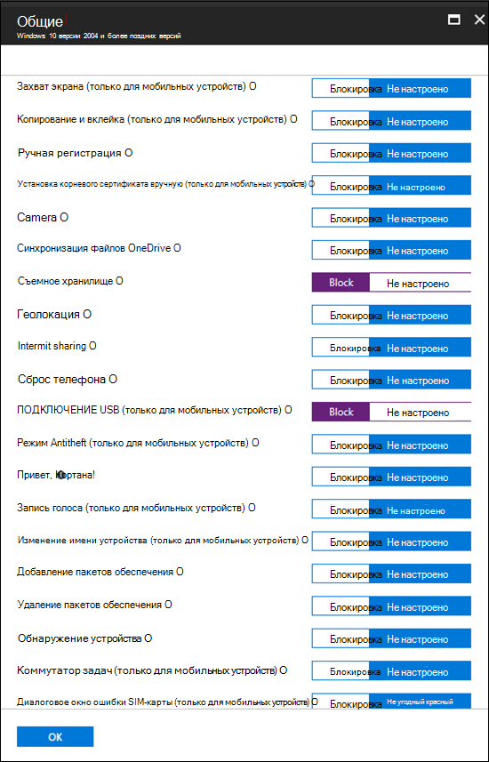

6. Нажмите **кнопку ОК,** **чтобы** закрыть общие параметры и ограничения **устройства.**

7. Нажмите **кнопку Создать,** чтобы сохранить профиль.

### <a name="allow-installation-and-usage-of-specifically-approved-peripherals"></a>Разрешить установку и использование специально утвержденных периферийных устройств

Периферийные устройства, которые разрешены к установке, могут быть указаны их [идентификатором оборудования.](/windows-hardware/drivers/install/device-identification-strings) Список общих структур идентификаторов см. в [рубрике Форматы идентификаторов устройств.](/windows-hardware/drivers/install/device-identifier-formats) Проверьте конфигурацию перед развертыванием, чтобы убедиться, что она блокируется и позволяет ожидаемым устройствам. В идеале протестировать различные экземпляры оборудования. Например, протестировать несколько USB-ключей, а не только один.

Пример SyncML, позволяющий установить определенные ID устройства, см. в [примере DeviceInstallation/AllowInstallationOfMatchingDeviceIDs CSP](/windows/client-management/mdm/policy-csp-deviceinstallation#deviceinstallation-allowinstallationofmatchingdeviceids). Чтобы разрешить определенные классы устройств, см. [в рублях DeviceInstallation/AllowInstallationOfMatchingDeviceSetupClasses CSP](/windows/client-management/mdm/policy-csp-deviceinstallation#deviceinstallation-allowinstallationofmatchingdevicesetupclasses).
Разрешение установки определенных устройств также требует включения [DeviceInstallation/PreventInstallationOfDevicesNotDescribedByOtherPolicySettings](/windows/client-management/mdm/policy-csp-deviceinstallation#deviceinstallation-preventinstallationofdevicesnotdescribedbyotherpolicysettings).

### <a name="prevent-installation-of-specifically-prohibited-peripherals"></a>Предотвращение установки специально запрещенных периферийных устройств

Microsoft Defender для конечной точки блокирует установку и использование запрещенных периферийных устройств с помощью любого из этих параметров:

- [Административные шаблоны](/intune/administrative-templates-windows) могут блокировать любое устройство с помощью подгоняемого кода оборудования или класса установки.  
- [Параметры CSP установки](/windows/client-management/mdm/policy-csp-deviceinstallation) устройств с настраиваемым профилем в Intune. Вы можете [предотвратить установку определенных ID-устройств](/windows/client-management/mdm/policy-csp-deviceinstallation#deviceinstallation-preventinstallationofmatchingdeviceids) или [предотвратить определенные классы устройств.](/windows/client-management/mdm/policy-csp-deviceinstallation#deviceinstallation-preventinstallationofmatchingdevicesetupclasses)

### <a name="allow-installation-and-usage-of-specifically-approved-peripherals-with-matching-device-instance-ids"></a>Разрешить установку и использование специально утвержденных периферийных устройств с соответствием ID экземпляров устройств

Периферийные устройства, которые разрешены к установке, могут быть указаны по их [ID экземпляра устройства.](/windows-hardware/drivers/install/device-instance-ids) Проверьте конфигурацию перед развертыванием, чтобы убедиться, что она позволяет ожидаемым устройствам. В идеале протестировать различные экземпляры оборудования. Например, протестировать несколько USB-ключей, а не только один.

Вы можете разрешить установку и использование утвержденных периферийных устройств с соответствием ID экземпляра устройства, настроив параметр [политики DeviceInstallation/AllowInstallationOfMatchingDeviceInstanceIDs.](/windows/client-management/mdm/policy-csp-deviceinstallation#deviceinstallation-allowinstallationofmatchingdeviceinstanceids)

### <a name="prevent-installation-and-usage-of-specifically-prohibited-peripherals-with-matching-device-instance-ids"></a>Предотвращение установки и использования специально запрещенных периферийных устройств с соответствием ID экземпляров устройств

Периферийные устройства, которые запрещено устанавливать, могут быть указаны по их ID экземпляра [устройства.](/windows-hardware/drivers/install/device-instance-ids) Проверьте конфигурацию перед развертыванием, чтобы убедиться, что она позволяет ожидаемым устройствам. В идеале протестировать различные экземпляры оборудования. Например, протестировать несколько USB-ключей, а не только один.

Вы можете предотвратить установку запрещенных периферийных устройств с соответствием ID экземпляров устройств, настроив параметр [политики DeviceInstallation/PreventInstallationOfMatchingDeviceInstanceIDs.](/windows/client-management/mdm/policy-csp-deviceinstallation#deviceinstallation-preventinstallationofmatchingdeviceinstanceids)

### <a name="limit-services-that-use-bluetooth"></a>Ограничение служб, которые используют Bluetooth

С помощью Intune можно ограничить службы, которые могут Bluetooth с помощью ["Bluetooth разрешенных служб".](/windows/client-management/mdm/policy-csp-bluetooth#servicesallowedlist-usage-guide) Состояние по умолчанию параметров "Bluetooth разрешенных служб" означает, что все разрешено.  Как только будет добавлена служба, она станет разрешенным списком. Если клиент добавляет значения Клавиатуры и Мыши и не добавляет GUID-интерфейсы передачи файлов, передача файлов должна быть заблокирована.

> [!div class="mx-imgBorder"]
> 

### <a name="use-microsoft-defender-for-endpoint-baseline-settings"></a>Используйте Microsoft Defender для базовых параметров конечной точки

Базовые параметры Microsoft Defender для конечной точки представляют рекомендуемую конфигурацию для защиты от угроз. Параметры конфигурации для базового уровня расположены на странице редактирования профилей параметров конфигурации.

> [!div class="mx-imgBorder"]
> 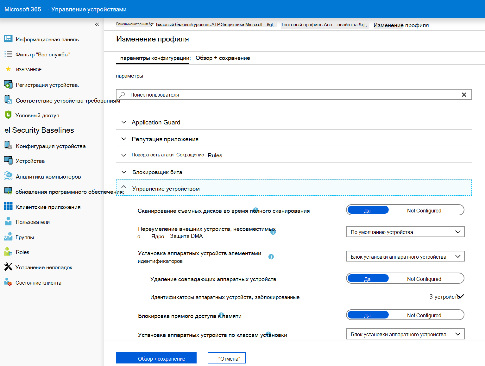

## <a name="prevent-threats-from-removable-storage"></a>Предотвращение угроз из съемного хранилища
  
Съемные устройства хранения могут представлять дополнительный риск безопасности для организации. Microsoft Defender для конечной точки может помочь выявлять и блокировать вредоносные файлы на съемных устройствах хранения.

Microsoft Defender для конечной точки также может запретить использовать usb-периферийные устройства на устройствах для предотвращения внешних угроз. Это делается с помощью свойств, сообщаемой периферийными устройствами USB, чтобы определить, можно ли установить и использовать их на устройстве.

Обратите внимание, что если вы блокируете USB-устройства или другие классы устройств с помощью политик установки устройств, подключенные устройства, такие как телефоны, по-прежнему могут заряжать.

>[!NOTE]
>Всегда проверяйте и уточняйте эти параметры с помощью пилотной группы пользователей и устройств перед широкой распространением в организации. 

В следующей таблице описывается, как Microsoft Defender для конечной точки может помочь предотвратить угрозы из съемного хранилища.

Дополнительные сведения об управлении USB-устройствами см. в [блоге Microsoft Defender for Endpoint.](https://aka.ms/devicecontrolblog)

| Control  | Описание |
|----------|-------------|
| [Включить антивирусная программа в Microsoft Defender сканирование](#enable-microsoft-defender-antivirus-scanning) | Включить антивирусная программа в Microsoft Defender для защиты в режиме реального времени или запланированного сканирования.|
| [Блокировать ненавязаные и неподписаные процессы на периферийных устройствах USB](#block-untrusted-and-unsigned-processes-on-usb-peripherals) | Блоки USB-файлов, которые неподписались или не соответствуют действительности. |
| [Защита от атак прямого доступа к памяти (DMA)](#protect-against-direct-memory-access-dma-attacks) | Настройка параметров для защиты от атак DMA. |

>[!NOTE]
>Так как несанкционированный usb-периферийный компьютер может иметь прошивку, которая подменит его свойства USB, рекомендуется разрешить только специально утвержденные периферийные usb-устройства и ограничить доступ к ним пользователям.

### <a name="enable-microsoft-defender-antivirus-scanning"></a>Включить антивирусная программа в Microsoft Defender сканирование

Защита авторизованного съемного хранилища с помощью [](/microsoft-365/security/defender-endpoint/configure-real-time-protection-microsoft-defender-antivirus) антивирусная программа в Microsoft Defender требует включения защиты в режиме реального времени или планирования сканирования и настройки съемных дисков для сканирования.

- Если включена защита в режиме реального времени, файлы сканируют перед их доступом и выполнением. Область сканирования включает все файлы, в том числе на установленных съемных устройствах, таких как USB-диски. Можно по желанию запустить скрипт [PowerShell](/samples/browse/?redirectedfrom=TechNet-Gallery) для выполнения настраиваемого сканирования USB-накопителя после его установки, чтобы антивирусная программа в Microsoft Defender все файлы на съемных устройствах после крепления съемного устройства. Однако рекомендуется в режиме реального времени обеспечить защиту для повышения производительности сканирования, особенно для больших устройств хранения.

- Если используются запланированные проверки, необходимо отключить параметр DisableRemovableDriveScanning (включен по умолчанию), чтобы сканировать съемное устройство во время полного сканирования. Съемные устройства сканируют во время быстрого или настраиваемого сканирования независимо от параметра DisableRemovableDriveScanning.

>[!NOTE]
>Рекомендуется в режиме реального времени выполнять мониторинг для сканирования. В Intune можно включить мониторинг Windows 10 в режиме реального времени в антивирусная программа в Microsoft Defender в режиме  >    >    >  **реального времени.**

<!-- Need to build out point in the preceding note. 
-->

### <a name="block-untrusted-and-unsigned-processes-on-usb-peripherals"></a>Блокировать ненавязаные и неподписаные процессы на периферийных устройствах USB

Конечные пользователи могут подключать съемные устройства, зараженные вредоносными программами.
Чтобы предотвратить заражение, компания может блокировать USB-файлы, которые не подписаны или не соответствуют действительности.
Кроме того, компании могут использовать [](/microsoft-365/security/defender-endpoint/attack-surface-reduction) функцию аудита правил снижения поверхности атаки для мониторинга активности ненарушимого и неподписаного процесса, выполняемого на периферии USB.
Это можно сделать, установив ненарушимые и неподписаные процессы, которые запускают из **USB** только в **блок** или **аудит,** соответственно.
С помощью этого правила администраторы могут запретить или проверять неподписанных или ненадежных исполняемых файлов из usb съемных дисков, включая SD-карты.
Затронутые типы файлов включают исполняемые файлы (такие как .exe, .dll или SCR) и файлы сценариев, такие как PowerShell (.ps), VisualBasic (.vbs) или файлы JavaScript (.js).

Эти параметры требуют [включения защиты в режиме реального времени.](/microsoft-365/security/defender-endpoint/configure-real-time-protection-microsoft-defender-antivirus)

1. Вход в [Microsoft Endpoint Manager](https://endpoint.microsoft.com/).

2. Нажмите **кнопку Устройства**  >  **Windows**  >  **Политики настройки**  >  **Создайте профиль**. 

    

3. Используйте указанные ниже параметры:
   - Платформа: Windows 10 и более поздней 
   - Тип профиля: ограничения устройств

   > [!div class="mx-imgBorder"]
   > 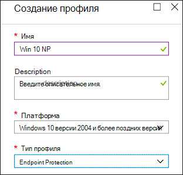

4. Щелкните **Создать**.  

5. Для неподписаных и ненарушимых процессов, которые **запускают из USB,** выберите **Блок**.

   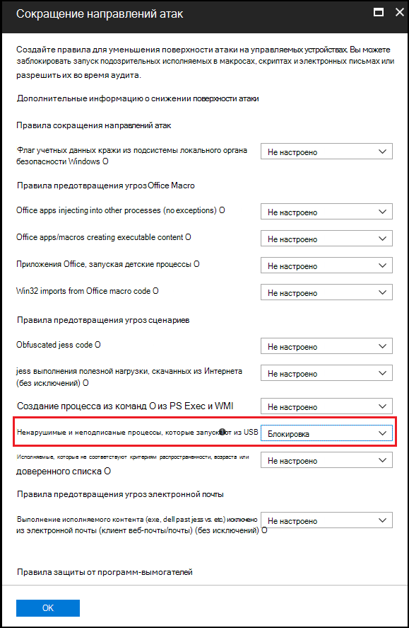

6. Нажмите **кнопку ОК,** чтобы закрыть параметры и **ограничения устройства.**

### <a name="protect-against-direct-memory-access-dma-attacks"></a>Защита от атак прямого доступа к памяти (DMA)

DMA-атаки могут привести к раскрытию конфиденциальной информации, которая находится на компьютере, или даже впрыскивание вредоносных программ, позволяющих злоумышленникам удаленно обходить экран блокировки или управлять компьютерами. Чтобы предотвратить DMA-атаки, помогают следующие параметры:

1. Начиная с Windows 10 версии 1803, Корпорация Майкрософт представила защиту DMA ядра для [Thunderbolt](/windows/security/information-protection/kernel-dma-protection-for-thunderbolt.md) для обеспечения защиты от атак DMA через порты Thunderbolt. Защита от DMA ядра для Thunderbolt включена производителями системы и не может быть включена или отключена пользователями.

   Начиная с Windows 10 версии 1809, вы можете настроить уровень защиты DMA ядра, настроив [CSP DMA Guard](/windows/client-management/mdm/policy-csp-dmaguard#dmaguard-deviceenumerationpolicy). Это дополнительный контроль для периферийных устройств, которые не поддерживают изоляцию памяти устройств (также известные как DMA-remapping). Изоляция памяти позволяет ОС использовать подразделение управления памятью I/O (IOMMU) устройства для блокировки незавернутого доступа к I/O или памяти периферийным устройством (песочница памяти). Другими словами, ОС назначает периферийной стороне определенный диапазон памяти. Если периферийное устройство пытается читать или записывать в память за пределами назначенного диапазона, осмий блокирует его.

   Периферийные устройства, поддерживают изоляцию памяти устройства, всегда могут подключаться. Периферийные устройства, которые не могут быть заблокированы, разрешены или разрешены только после того, как пользователь вошел (по умолчанию).

2. В Windows 10 системах, которые не поддерживают защиту DMA ядра, можно:

   - [Блокировка DMA до тех пор, пока пользователь не запишет](/windows/client-management/mdm/policy-csp-dataprotection#dataprotection-allowdirectmemoryaccess)
   - [Блокировка всех подключений через порты Thunderbolt (включая USB-устройства)](https://support.microsoft.com/help/2516445/blocking-the-sbp-2-driver-and-thunderbolt-controllers-to-reduce-1394-d)

## <a name="create-customized-alerts-and-response-actions"></a>Создание настраиваемых оповещений и ответных действий

Вы можете создавать настраиваемые оповещения и действия реагирования с помощью соединиттеля WDATP и пользовательских правил обнаружения:

**Действия реагирования соединитетеля Wdatp:**

**Исследование:** Инициировать расследования, собрать пакет исследований и изолировать машину.

**Сканирование угроз** на USB-устройствах.

**Ограничение выполнения** всех приложений на компьютере, за исключением предопределяемого набора MDATP соединительных MDATP, является одним из более чем 200 заранее определенных соединительных окне, включая Outlook, Teams, Slack и т.д. Можно построить настраиваемые соединители.
- [Дополнительные сведения о действиях реагирования соединитела WDATP](/connectors/wdatp/)

**Действие реагирования на пользовательские правила обнаружения:** Можно применять как действия на уровне компьютера, так и на уровне файлов.
- [Дополнительные сведения о действиях реагирования на пользовательские правила обнаружения](/microsoft-365/security/defender-endpoint/custom-detection-rules)

Сведения о связанных с управлением устройствами событиях предварительной охоты и примерах создания пользовательских оповещений см. в дополнительных обновлениях [охоты: события USB,](https://techcommunity.microsoft.com/t5/Microsoft-Defender-ATP/Advanced-hunting-updates-USB-events-machine-level-actions-and/ba-p/824152)действия на уровне машины и изменения схемы.

## <a name="respond-to-threats"></a>Реагирование на угрозы

Вы можете создавать настраиваемые оповещений и автоматические действия реагирования с помощью правил настраиваемой обнаружения конечных точек [Microsoft Defender для конечной точки.](/microsoft-365/security/defender-endpoint/custom-detection-rules) Действия реагирования в настраиваемом обнаружении охватывают как действия на уровне компьютера, так и на уровне файлов. Вы также можете создавать оповещения и автоматические действия отклика с помощью [PowerApps](https://powerapps.microsoft.com/) и Flow с [соединителом](https://flow.microsoft.com/) [Microsoft Defender для конечной точки.](/connectors/wdatp/) Соединител поддерживает действия по расследованию, проверке угроз и ограничению запущенных приложений. Это один из более чем 200 предварительно определенных соединительных окне, включая Outlook, Teams, Slack и другие. Также можно построить настраиваемые соединители. Дополнительные [информацию](/connectors/) о соединителах см. в дополнительных подробной информации о соединителах.
 
Например, с помощью любого подхода можно автоматически запустить антивирусная программа в Microsoft Defender, когда usb-устройство установлено на компьютер.

## <a name="related-topics"></a>Статьи по теме

- [Настройка защиты в режиме реального времени для антивирусная программа в Microsoft Defender](/microsoft-365/security/defender-endpoint/configure-real-time-protection-microsoft-defender-antivirus)
- [Defender/AllowFullScanRemovableDriveScanning](/windows/client-management/mdm/policy-csp-defender#defender-allowfullscanremovabledrivescanning)
- [CSP политики/deviceInstallation](/windows/client-management/mdm/policy-csp-deviceinstallation)
- [Выполните настраиваемую проверку съемного устройства](/samples/browse/?redirectedfrom=TechNet-Gallery)
- [Шаблон PowerBI управления устройствами для настраиваемой отчетности](https://github.com/microsoft/MDATP-PowerBI-Templates)
- [BitLocker](/windows/security/information-protection/bitlocker/bitlocker-overview.md) 
- [Windows Information Protection](/windows/security/information-protection/windows-information-protection/create-wip-policy-using-intune-azure.md)
