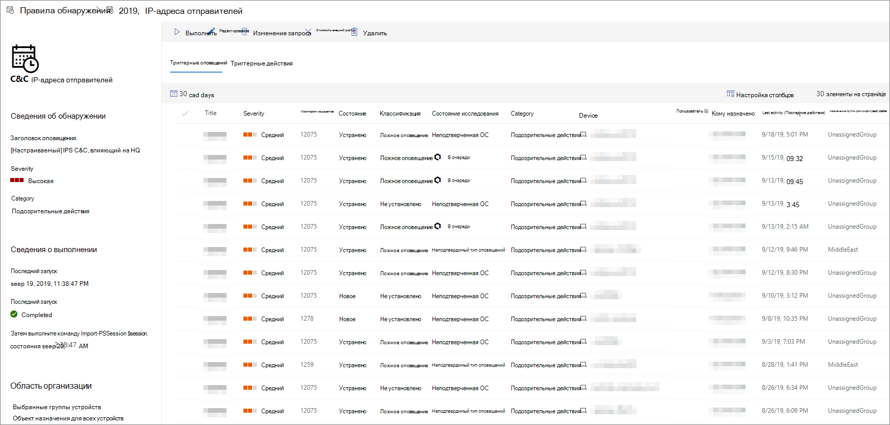

# Просмотр и управление пользовательскими правилами обнаруженияView and manage custom detection rules

[!INCLUDE [Microsoft 365 Defender rebranding](../../includes/microsoft-defender.md)]

**Область применения:****Applies to:**
- [Microsoft Defender для конечной точкиMicrosoft Defender for Endpoint](https://go.microsoft.com/fwlink/p/?linkid=2154037)
- [Microsoft 365 DefenderMicrosoft 365 Defender](https://go.microsoft.com/fwlink/?linkid=2118804)

>Хотите испытать Defender для конечной точки?Want to experience Defender for Endpoint? [Зарегистрився для бесплатной пробной.Sign up for a free trial.](https://www.microsoft.com/microsoft-365/windows/microsoft-defender-atp?ocid=docs-wdatp-assignaccess-abovefoldlink)

Управление [существующими пользовательскими правилами обнаружения,](custom-detection-rules.md) чтобы убедиться, что они эффективно находят угрозы и принимают меры.Manage your existing [custom detection rules](custom-detection-rules.md) to ensure they are effectively finding threats and taking actions. Узнайте, как просмотреть список правил, проверить предыдущие запуски и просмотреть срабатываемую ими оповещений.Explore how to view the list of rules, check their previous runs, and review the alerts they have triggered. Вы также можете запустить правило по запросу и изменить его.You can also run a rule on demand and modify it.

## Обязательные разрешенияRequired permissions

Чтобы создать или управлять пользовательскими обнаружениями, [ваша роль](user-roles.md#create-roles-and-assign-the-role-to-an-azure-active-directory-group) должна иметь разрешение на управление **настройками безопасности.**To create or manage custom detections, [your role](user-roles.md#create-roles-and-assign-the-role-to-an-azure-active-directory-group) needs to have the **manage security settings** permission.

## Просмотр существующих правилView existing rules

Чтобы просмотреть все существующие пользовательские правила обнаружения, перейдите к **настройкам**  >  **настраиваемой обнаружения.**To view all existing custom detection rules, navigate to **Settings** > **Custom detections**. На странице перечислены все правила со следующими сведениями о запуске:The page lists all the rules with the following run information:

- **Последний запуск**— при последнем запуске правила для проверки совпадений запросов и создания оповещений**Last run**—when a rule was last run to check for query matches and generate alerts
- **Состояние последнего запуска**— успешно ли выполнило правило**Last run status**—whether a rule ran successfully
- **Следующий запуск**— следующий запланированный запуск**Next run**—the next scheduled run
- **Состояние**— независимо от того, включено или отключено правило**Status**—whether a rule has been turned on or off

## Просмотр сведений о правилах, изменение правила и правила запускаView rule details, modify rule, and run rule

Чтобы просмотреть всестороннюю информацию о пользовательском правиле обнаружения, выберите имя правила из списка правил в **настройках**  >  **настраиваемого обнаружения.**To view comprehensive information about a custom detection rule, select the name of rule from the list of rules in **Settings** > **Custom detections**. На странице выбранного правила отображаются следующие сведения:A page about the selected rule displays the following information:

- Общие сведения о правиле, включая сведения о оповещении, состоянии запуска и областиGeneral information about the rule, including the details of the alert, run status, and scope
- Список срабатывных оповещенийList of triggered alerts
- Список срабатывуем действийList of triggered actions

 
*Страница правила обнаружения настраиваемой**Custom detection rule page*

На этой странице также можно принять следующие действия по правилу:You can also take the following actions on the rule from this page:

- **Запустите**— запустите правило немедленно.**Run**—run the rule immediately. Это действие также сбрасывает интервал для следующего запуска.This action also resets the interval for the next run.
- **Изменение**— изменение правила без изменения запроса**Edit**—modify the rule without changing the query
- **Изменение запроса**— изменение запроса в продвинутой охоте**Modify query**—edit the query in advanced hunting
- **Включаем**  /  **Отключите** правило или остановите его работу**Turn on** / **Turn off**—enable the rule or stop it from running
- **Удаление**— отключите правило и удалите его**Delete**—turn off the rule and remove it

>[!TIP]
>Чтобы быстро просмотреть сведения и принять меры по элементу в таблице, используйте столбец выбора [&#10003;] слева от таблицы.To quickly view information and take action on an item in a table, use the selection column [&#10003;] at the left of the table.

## Статьи по темеRelated topics
- [Обзор настраиваемых обнаруженийCustom detections overview](overview-custom-detections.md)
- [Создание правил обнаруженияCreate detection rules](custom-detection-rules.md)
- [Обзор расширенной охотыAdvanced hunting overview](advanced-hunting-overview.md)
- [Просмотр и организация оповещенийView and organize alerts](alerts-queue.md)
