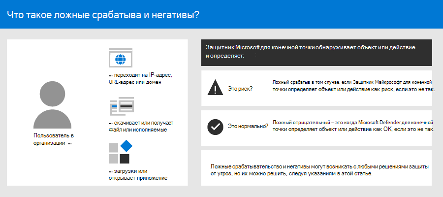
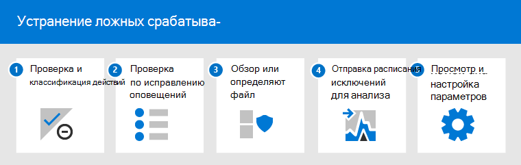
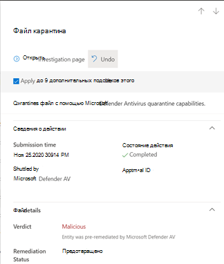
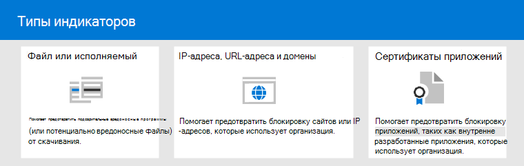

# <a name="address-false-positivesnegatives-in-microsoft-defender-for-endpoint"></a>Устранение ложных положительных/отрицательных срабатываний в Microsoft Defender для конечной точки

[!INCLUDE [Microsoft 365 Defender rebranding](../../includes/microsoft-defender.md)]

**Область применения**

- [Microsoft Defender для конечной точки](https://go.microsoft.com/fwlink/p/?linkid=2146806)

В решениях по защите конечной точки ложный срабатывка — это объект, например файл или процесс, который был обнаружен и идентифицирован как вредоносный, даже если объект на самом деле не представляет угрозы. Ложный отрицательный — это объект, который не был обнаружен в качестве угрозы, даже если он на самом деле является вредоносным. Ложные срабатыва-срабатывательство могут возникать с любым решением защиты от угроз, включая [Microsoft Defender для конечной точки.](microsoft-defender-endpoint.md)



К счастью, можно предпринять шаги для устранения и уменьшения подобных проблем. Если в Microsoft 365 Defender (ранее Центр безопасности в Microsoft Defender) [](microsoft-defender-security-center.md) вы видите ложные срабатыва-минусы, операции безопасности могут предпринять действия для их устранения, используя следующий процесс:

1.  [Проверка и классификация оповещений](#part-1-review-and-classify-alerts) 
2.  [Просмотр действий по исправлению, которые были приняты](#part-2-review-remediation-actions)
3.  [Обзор и определение исключений](#part-3-review-or-define-exclusions)
4.  [Отправка объекта для анализа](#part-4-submit-a-file-for-analysis)
5.  [Просмотр и настройка параметров защиты от угроз](#part-5-review-and-adjust-your-threat-protection-settings)

Вы можете получить помощь, если у вас по-прежнему есть проблемы с ложными срабатываниями и отрицательными после выполнения задач, описанных в этой статье. См. [по-прежнему нужна помощь?](#still-need-help)



> [!NOTE]
> Эта статья предназначена в качестве руководства для операторов безопасности и администраторов безопасности, использующих [Microsoft Defender для конечной точки.](microsoft-defender-endpoint.md)

## <a name="part-1-review-and-classify-alerts"></a>Часть 1. Проверка и классификация оповещений

Если вы видите [предупреждение,](alerts.md) которое было вызвано, так как что-то было обнаружено как вредоносное или подозрительное, чего не должно было быть, вы можете подавить предупреждение для этого объекта. Можно также подавить оповещения, которые не обязательно являются ложными срабатывательными, но неважными. Рекомендуется также классифицировать оповещения. 

Управление оповещениями и классификация true/false positives помогает обучить решение защиты от угроз и со временем снизить количество ложных срабатывающих или ложных срабатывающих. Эти действия также помогают снизить уровень шума на панели мониторинга операций безопасности, чтобы ваша группа безопасности была сосредоточена на более приоритетных работах.

### <a name="determine-whether-an-alert-is-accurate"></a>Определение точности оповещений

Прежде чем классифицировать или подавить оповещение, определите, является ли оповещение точным, ложным срабатывательным или доброкачественным.

1. Перейдите на портал Microsoft 365 Defender [https://security.microsoft.com](https://security.microsoft.com) () и войдите.

2. В области навигации выберите очередь **Оповещений.**

3. Выберите оповещение, чтобы получить дополнительные сведения о оповещении. [(См. оповещение об отзыве в Microsoft Defender для конечной точки.)](review-alerts.md)

4. В зависимости от состояния оповещений необходимо предпринять действия, описанные в следующей таблице: 

| Состояние оповещений | Действия |
|:---|:---|
| Оповещение является точным | Назначьте оповещение, а затем [изучите его](investigate-alerts.md) далее. |
| Оповещение является ложным срабатывательным | 1. [Классифицировать оповещение](#classify-an-alert) как ложное срабатывательное. <br/>2. [Подавление оповещения](#suppress-an-alert). <br/> 3. [Создайте индикатор](#indicators-for-microsoft-defender-for-endpoint) для Microsoft Defender для конечной точки. <br/> 4. [Отправка файла в Корпорацию Майкрософт для анализа.](#part-4-submit-a-file-for-analysis) |
| Оповещение является точным, но доброкачественным (неважным) | [Классифицировать оповещение](#classify-an-alert) как истинное положительное, а затем [подавить оповещение.](#suppress-an-alert) |

### <a name="classify-an-alert"></a>Классификация оповещений

Оповещений можно классифицировать как ложные срабатыва или истинные положительные Microsoft 365 Defender. Классификация оповещений помогает обучить Microsoft Defender для конечной точки, чтобы со временем вы могли видеть больше истинных оповещений и меньше ложных оповещений.

1. Перейдите на портал Microsoft 365 Defender [https://security.microsoft.com](https://security.microsoft.com) () и войдите.

2. Выберите **очередь оповещений,** а затем выберите оповещение.

3. Для выбранного оповещения выберите **оповещение "Управление**  >  **действиями".** Открывается поле для вылетов.

4. В разделе **Управление оповещениями** выберите true **alert** или **False alert**. (Используйте **ложное оповещение** для классификации ложного срабатыва.)

> [!TIP]
> Дополнительные сведения о подавлении оповещений см. в рублях [Управление оповещениями Microsoft Defender для конечных точек.](/microsoft-365/security/defender-endpoint/manage-alerts) И если ваша организация использует сервер управления сведениями о безопасности и событиями (SIEM), не забудьте также определить правило подавления. 

### <a name="suppress-an-alert"></a>Подавление оповещений

Если у вас есть оповещений, которые являются ложными срабатывательными или являются истинными срабатывательными, но для неважных событий, вы можете подавить эти оповещения в Microsoft 365 Defender. Подавление оповещений помогает снизить уровень шума в панели мониторинга операций безопасности. 

1. Перейдите на портал Microsoft 365 Defender [https://security.microsoft.com](https://security.microsoft.com) () и войдите.

2. В области навигации выберите очередь **Оповещений.**

3. Выберите оповещение, которое необходимо подавить, чтобы открыть его области **Details.**

4. В области **Details** выберите ellipsis **(...),** а затем создайте правило **подавления.**

5. Укажите все параметры для правила подавления, а затем выберите **Сохранить**.

> [!TIP]
> Нужна помощь с правилами подавления? См. [статью Suppress an alert and create a new suppression rule.](/microsoft-365/security/defender-endpoint/manage-alerts#suppress-an-alert-and-create-a-new-suppression-rule)

## <a name="part-2-review-remediation-actions"></a>Часть 2. Обзор действий по исправлению

[Действия по](manage-auto-investigation.md#remediation-actions)исправлению, например отправка файла на карантин или остановка процесса, принимаются для сущностями (например, файлами), которые обнаруживаются как угрозы. Несколько типов действий по исправлению происходят автоматически с помощью автоматического расследования и антивирусная программа в Microsoft Defender:   
- Карантин файла
- Удаление ключа реестра
- Убить процесс
- Остановка службы
- Отключение драйвера
- Удаление запланированной задачи

Другие действия, например запуск антивирусного сканирования или сбор пакета исследований, происходят вручную или с помощью [Live Response.](live-response.md) Действия, принятые с помощью Live Response, не могут быть отменены.

После проверки оповещений следующим шагом будет проверка действий [по исправлению.](manage-auto-investigation.md) Если какие-либо действия были приняты в результате ложных срабатывай, можно отменить большинство видов действий по исправлению. В частности, вы можете:

- [Восстановление карантинового файла из Центра действий](#restore-a-quarantined-file-from-the-action-center)
- [Отмена нескольких действий одновременно](#undo-multiple-actions-at-one-time)
- [Удаление файла из карантина на нескольких устройствах.](#remove-a-file-from-quarantine-across-multiple-devices)  и 
- [Восстановление файла из карантина](#restore-file-from-quarantine)

Когда вы закончили проверку и отмену действий, которые были приняты в результате ложных срабатывай, приступай к рассмотрению или [определению исключений.](#part-3-review-or-define-exclusions)

### <a name="review-completed-actions"></a>Просмотр завершенных действий

1. Перейдите в центр действий [https://security.microsoft.com/action-center](https://security.microsoft.com/action-center) () и войдите. 

2. Выберите **вкладку** "История", чтобы просмотреть список принятых действий.  

3. Выберите элемент, чтобы просмотреть дополнительные сведения о принятом действии по исправлению.

### <a name="restore-a-quarantined-file-from-the-action-center"></a>Восстановление карантинового файла из Центра действий

1. Перейдите в центр действий [https://security.microsoft.com/action-center](https://security.microsoft.com/action-center) () и войдите. 

2. На **вкладке История** выберите действие, которое необходимо отменить.

3. В области вылетов выберите **Отмена**. Если действие не удается отменить с помощью этого метода, вы не увидите кнопку **Undo.** (Дополнительные дополнительные дополнительные действия см. в [см. в деле Отмена завершенных действий.)](manage-auto-investigation.md#undo-completed-actions)

### <a name="undo-multiple-actions-at-one-time"></a>Отмена нескольких действий одновременно

1. Перейдите в центр действий [https://security.microsoft.com/action-center](https://security.microsoft.com/action-center) () и войдите. 

2. На **вкладке История** выберите действия, которые необходимо отменить.

3. В области справа от экрана выберите **Отмена**.

### <a name="remove-a-file-from-quarantine-across-multiple-devices"></a>Удаление файла из карантина на нескольких устройствах 

> [!div class="mx-imgBorder"]
> 

1. Перейдите в центр действий [https://security.microsoft.com/action-center](https://security.microsoft.com/action-center) () и войдите. 

2. На **вкладке История** выберите файл с карантиным файлом типа **Action.**

3. В области справа от экрана выберите **Применить** к X дополнительные экземпляры этого файла, а затем **отменить**.

### <a name="restore-file-from-quarantine"></a>Восстановление файла из карантина

Вы можете откатить и удалить файл из карантина, если вы определили, что он чист после расследования. Запустите следующую команду на каждом устройстве, где файл был карантин.

1. Откройте на устройстве повышенную командную строку:

   1. В меню **Пуск** введите _cmd_.

   1. Щелкните правой **кнопкой мыши командную подсказку** и выберите **Выполнить в качестве администратора.**

2. Введите следующую команду и нажмите **кнопку Ввод:**

    ```console
    "ProgramFiles%\Windows Defender\MpCmdRun.exe" –Restore –Name EUS:Win32/CustomEnterpriseBlock –All
    ```

    > [!IMPORTANT]
    > В некоторых сценариях **имя угрозы может** отображаться как `EUS:Win32/
      CustomEnterpriseBlock!cl` . Defender for Endpoint восстановит все настраиваемые заблокированные файлы, которые были на карантине на этом устройстве за последние 30 дней.
    > Файл, который был на карантине в качестве потенциальной сетевой угрозы, может не быть восстановлен. Если пользователь пытается восстановить файл после карантина, этот файл может быть недоступным. Это может быть связано с тем, что система больше не имеет сетевых учетных данных для доступа к файлу. Как правило, это результат временного входа в систему или общую папку, а срок действия маркеров доступа истек.

3. В области справа от экрана выберите **Применить** к X дополнительные экземпляры этого файла, а затем **отменить**. 

## <a name="part-3-review-or-define-exclusions"></a>Часть 3. Просмотр или определение исключений

Исключение — это объект, например файл или URL-адрес, который указывается в качестве исключения для действий по исправлению. Исключенная сущность по-прежнему может быть обнаружена, но никаких действий по исправлению в этом объекте не принимаются. То есть обнаруженный файл или процесс не будут остановлены, отправлены на карантин, удалены или иным образом изменены Microsoft Defender для конечной точки. 

Чтобы определить исключения в Microsoft Defender для конечной точки, выполните следующие задачи:
- [Определение исключений для антивирусная программа в Microsoft Defender](#exclusions-for-microsoft-defender-antivirus)
- [Создание индикаторов "разрешить" для Microsoft Defender для конечной точки](#indicators-for-microsoft-defender-for-endpoint)

> [!NOTE]
> антивирусная программа в Microsoft Defender исключения применяются только к антивирусной защите, а не к другим возможностям Microsoft Defender для конечных точек. Чтобы исключить файлы в широком масштабе, используйте исключения для антивирусная программа в Microsoft Defender и [настраиваемые](/microsoft-365/security/defender-endpoint/manage-indicators) индикаторы для Microsoft Defender для конечной точки.

Процедуры в этом разделе описывают определение исключений и показателей.

### <a name="exclusions-for-microsoft-defender-antivirus"></a>Исключения для антивирусная программа в Microsoft Defender

В общем, не нужно определять исключения для антивирусная программа в Microsoft Defender. Убедитесь, что исключения определяются экономно и включаются только файлы, папки, процессы и открытые процессом файлы, в результате чего срабатывалось ложное срабатывание. Кроме того, не забудьте регулярно проверять определенные исключения. Рекомендуется [использовать](/mem/endpoint-manager-overview) Microsoft Endpoint Manager для определения или редактирования исключений антивирусов; Однако вы можете использовать другие [](/azure/active-directory-domain-services/manage-group-policy) методы, например групповую политику (см. [в статью Управление Защитником Майкрософт для конечной точки).](manage-atp-post-migration.md)

> [!TIP]
> Нужна помощь с антивирусными исключениями? См. в рубке Настройка и проверка исключений [для антивирусная программа в Microsoft Defender проверки.](configure-exclusions-microsoft-defender-antivirus.md)

#### <a name="use-microsoft-endpoint-manager-to-manage-antivirus-exclusions-for-existing-policies"></a>Использование Microsoft Endpoint Manager для управления исключениями антивирусов (для существующих политик)

1. Перейдите в центр администрирования Microsoft Endpoint Manager [https://endpoint.microsoft.com](https://endpoint.microsoft.com) () и войдите.

2. Выберите **антивирус безопасности**  >  **Конечной точки,** а затем выберите существующую политику. (Если у вас нет существующей политики или вы хотите создать новую политику, переперейти к [следующей процедуре).](#use-microsoft-endpoint-manager-to-create-a-new-antivirus-policy-with-exclusions)

3. Выберите **свойства,** а рядом с настройками **конфигурации** выберите **Изменить**.

4. **Расширите антивирусная программа в Microsoft Defender исключений** и укажите исключения.

5. Выберите **Обзор + сохранение,** а затем выберите **Сохранить**.

#### <a name="use-microsoft-endpoint-manager-to-create-a-new-antivirus-policy-with-exclusions"></a>Используйте Microsoft Endpoint Manager для создания новой антивирусной политики с исключениями

1. Перейдите в центр администрирования Microsoft Endpoint Manager [https://endpoint.microsoft.com](https://endpoint.microsoft.com) () и войдите.

2. Выберите **антивирус безопасности**  >  **конечной точки**  >  **+ Создание политики**. 

3. Выберите платформу **(например, Windows 10,** **macOS** или **Windows 10 и Windows Server).**

4. Для **профиля** выберите **антивирусная программа в Microsoft Defender исключений,** а затем выберите **Создать**.

5. Укажите имя и описание профиля, а затем выберите **Далее**.

6. На **вкладке Параметры конфигурации** укажите исключения антивируса, а затем выберите **Далее**.

7. На **вкладке Теги Области,** если вы используете теги области в организации, укажите теги области для создаемой политики. [(См. теги Область](/mem/intune/fundamentals/scope-tags).)

8. На **вкладке Назначения** укажите пользователей и группы, к которым должна применяться политика, а затем выберите **Далее**. (Если вам нужна помощь с назначениями, см. в странице Назначение профилей пользователей и устройств [в Microsoft Intune.)](/mem/intune/configuration/device-profile-assign)

9. На **вкладке Обзор + создайте** вкладку, просмотрите параметры и выберите **Создать**.

### <a name="indicators-for-microsoft-defender-for-endpoint"></a>Индикаторы для Microsoft Defender для конечной точки

[Индикаторы](/microsoft-365/security/defender-endpoint/manage-indicators) (в частности, индикаторы компромисса или IoCs) позволяют группе операций безопасности определять обнаружение, предотвращение и исключение сущностями. Например, можно указать определенные файлы, которые будут пропущены из действий по проверке и исправлению в Microsoft Defender для конечной точки. Или индикаторы можно использовать для создания оповещений для определенных файлов, IP-адресов или URL-адресов.

Чтобы указать объекты в качестве исключений для Microsoft Defender для конечной точки, создайте индикаторы "разрешить" для этих сущностями. Такие индикаторы "разрешить" в Microsoft Defender для конечной точки применяются к защите следующего [поколения,](microsoft-defender-antivirus-in-windows-10.md) [обнаружение и нейтрализация атак на конечные точки](overview-endpoint-detection-response.md)и автоматическому расследованию & [исправлению.](/microsoft-365/security/defender-endpoint/automated-investigations)

Индикаторы "Разрешить" можно создать для:

- [Files](#indicators-for-files)
- [IP-адреса, URL-адреса и домены](#indicators-for-ip-addresses-urls-or-domains)
- [Сертификаты приложений](#indicators-for-application-certificates)



#### <a name="indicators-for-files"></a>Индикаторы для файлов

При создании [индикатора "разрешить"](/microsoft-365/security/defender-endpoint/indicator-file)для файла, например исполняемого, это помогает предотвратить блокировку файлов, которые использует ваша организация. Файлы могут включать переносные исполняемые (PE) файлы, такие как `.exe` и `.dll` файлы. 

Перед созданием индикаторов для файлов убедитесь, что следующие требования выполнены:
- антивирусная программа в Microsoft Defender настраивается с включенной облачной защитой (см. [управление облачной защитой)](/windows/security/threat-protection/microsoft-defender-antivirus/deploy-manage-report-microsoft-defender-antivirus)
- Клиентская версия antimalware — 4.18.1901.x или более поздней версии 
- Устройства запускаются Windows 10 версии 1703 или более поздней версии; Windows Server 2016; или Windows Server 2019 
- Включена [функция Block или allow](/microsoft-365/security/defender-endpoint/advanced-features) 

#### <a name="indicators-for-ip-addresses-urls-or-domains"></a>Индикаторы IP-адресов, URL-адресов или доменов

При создании [индикатора "разрешить" для IP-адреса, URL-адреса](/microsoft-365/security/defender-endpoint/indicator-ip-domain)или домена это помогает предотвратить блокировку сайтов или IP-адресов, которые использует организация.

Прежде чем создавать индикаторы для IP-адресов, URL-адресов или доменов, убедитесь, что следующие требования выполнены:
- Защита сети в Защитнике для конечной точки включена в режиме блокировки (см. [включить защиту сети)](/microsoft-365/security/defender-endpoint/enable-network-protection)
- Клиентская версия antimalware — 4.18.1906.x или более поздней версии 
- Устройства запускаются Windows 10 версии 1709 или более поздней версии 

Настраиваемые сетевые индикаторы включаем в [Microsoft 365 Defender.](microsoft-defender-security-center.md) Дополнительные возможности см. [в дополнительных подробностях.](/microsoft-365/security/defender-endpoint/advanced-features)

#### <a name="indicators-for-application-certificates"></a>Индикаторы для сертификатов приложений 

При создании [индикатора "разрешить"](/microsoft-365/security/defender-endpoint/indicator-certificates)для сертификата приложений это помогает предотвратить блокировку приложений, таких как внутренне разработанные приложения, которые использует организация. `.CER` или `.PEM` поддерживаются расширения файлов.   

Перед созданием индикаторов для сертификатов приложений убедитесь, что следующие требования выполнены:

- антивирусная программа в Microsoft Defender настраивается с включенной облачной защитой (см. [управление облачной защитой)](deploy-manage-report-microsoft-defender-antivirus.md)
- Клиентская версия antimalware — 4.18.1901.x или более поздней версии 
- Устройства запускаются Windows 10 версии 1703 или более поздней версии; Windows Server 2016; или Windows Server 2019 
- Определения защиты от вирусов и угроз устарели  

> [!TIP]
> При создании индикаторов можно определить их по одному или импортировать сразу несколько элементов. Имейте в виду, что для одного клиента существует ограничение в 15 000 индикаторов. Для этого может потребоваться сначала собрать некоторые сведения, например сведения о хаши файлов. Перед созданием индикаторов обязательно просмотрите [необходимые условия.](manage-indicators.md) 

## <a name="part-4-submit-a-file-for-analysis"></a>Часть 4. Отправка файла для анализа

Вы можете отправить объекты, такие как файлы и обнаружения без файлов, в Корпорацию Майкрософт для анализа. Исследователи безопасности Майкрософт анализируют все представленные материалы, а их результаты помогают информировать Microsoft Defender для возможностей защиты от угроз конечной точки. При входе на сайт отправки можно отслеживать отправку.

### <a name="submit-a-file-for-analysis"></a>Отправка файла для анализа

Если у вас есть файл, ошибочно обнаруженный как вредоносный или пропущенный, выполните следующие действия, чтобы отправить файл для анализа.

1. Просмотрите рекомендации здесь: [Отправка файлов для анализа](/windows/security/threat-protection/intelligence/submission-guide).

2. Посетите сайт портал для обнаружения угроз (Microsoft) отправки () и [https://www.microsoft.com/wdsi/filesubmission](https://www.microsoft.com/wdsi/filesubmission) отправьте файл(ы).

### <a name="submit-a-fileless-detection-for-analysis"></a>Отправка обнаружения без файлов для анализа

Если что-то было обнаружено в качестве вредоносного по поведению, а у вас нет файла, вы можете отправить файл `Mpsupport.cab` для анализа. Вы можете получить файл *.cab* с помощью средства Microsoft Malware Protection Command-Line Utility (MPCmdRun.exe) Windows 10.

1.  Перейдите к администратору и ` C:\ProgramData\Microsoft\Windows Defender\Platform\<version>` `MpCmdRun.exe` запустите его в качестве администратора.

2.  `mpcmdrun.exe -GetFiles`Введите, а затем нажмите **введите**.
   Создается .cab, содержащий различные диагностические журналы. Расположение файла указывается в выходе командной подсказки. По умолчанию расположение `C:\ProgramData\Microsoft\Microsoft Defender\Support\MpSupportFiles.cab` является .

3.  Просмотрите рекомендации здесь: [Отправка файлов для анализа](/windows/security/threat-protection/intelligence/submission-guide).

4.  Посетите сайт портал для обнаружения угроз (Microsoft) отправки и отправьте [https://www.microsoft.com/wdsi/filesubmission](https://www.microsoft.com/wdsi/filesubmission) .cab файлы.

### <a name="what-happens-after-a-file-is-submitted"></a>Что происходит после отправки файла?

Ваша отправка немедленно проверяется нашими системами, чтобы дать вам последнее определение еще до того, как аналитик начнет обработку вашего дела. Возможно, файл уже был отправлен и обработан аналитиком. В этих случаях определение будет принято быстро.

Для представлений, которые еще не обработаны, они приоритизированы для анализа следующим образом:

- Более высокий приоритет отдается распространенным файлам, которые могут повлиять на большое число компьютеров.
- Более высокий приоритет отдается клиентам, которые являются аутентификацией, особенно корпоративным клиентам с действительными удостоверениями безопасности программного обеспечения [(SAID).](https://www.microsoft.com/licensing/licensing-programs/software-assurance-default.aspx)
- К отправкам, помеченным как высокооритетные владельцы SAID, уделяется немедленное внимание.

Чтобы проверить обновления, касающиеся отправки, впишитесь на сайте портал для обнаружения угроз (Microsoft) [отправки.](https://www.microsoft.com/wdsi/filesubmission) 

> [!TIP]
> Дополнительные данные см. в [материалах Отправка файлов для анализа.](/windows/security/threat-protection/intelligence/submission-guide#how-does-microsoft-prioritize-submissions)

## <a name="part-5-review-and-adjust-your-threat-protection-settings"></a>Часть 5. Просмотр и настройка параметров защиты от угроз

Microsoft Defender для конечной точки предлагает широкий спектр параметров, в том числе возможность настройки параметров для различных функций и возможностей. Если вы получаете множество ложных срабатыважений, просмотрите параметры защиты от угроз в организации. Возможно, потребуется внести некоторые изменения в:

- [Защита с облачным доставкой](#cloud-delivered-protection)
- [Исправление потенциально нежелательных приложений](#remediation-for-potentially-unwanted-applications)
- [Автоматическое расследование и исправление](#automated-investigation-and-remediation)

### <a name="cloud-delivered-protection"></a>Облачная защита

Проверьте уровень облачной защиты для антивирусная программа в Microsoft Defender. По умолчанию для облачной защиты установлено значение **Not configured,** что соответствует нормальному уровню защиты для большинства организаций. Если ваша облачная защита задана для **высокой,** высокой **или** нулевой толерантности, может возникнуть большее количество ложных срабатывай.

> [!TIP]
> Дополнительные подробности о настройке облачной защиты см. в этой [информации.](/windows/security/threat-protection/microsoft-defender-antivirus/specify-cloud-protection-level-microsoft-defender-antivirus)

Рекомендуется использовать [Microsoft Endpoint Manager](/mem/endpoint-manager-overview) для редактирования или установки параметров облачной защиты; Однако вы можете использовать другие [](/azure/active-directory-domain-services/manage-group-policy) методы, например групповую политику (см. [в статью Управление Защитником Майкрософт для конечной точки).](manage-atp-post-migration.md)

#### <a name="use-microsoft-endpoint-manager-to-review-and-edit-cloud-delivered-protection-settings-for-existing-policies"></a>Используйте Microsoft Endpoint Manager для просмотра и редактирования параметров облачной защиты (для существующих политик)

1. Перейдите в центр администрирования Microsoft Endpoint Manager [https://endpoint.microsoft.com](https://endpoint.microsoft.com) () и войдите.

2. Выберите **антивирус безопасности Endpoint** и выберите  >   существующую политику. (Если у вас нет существующей политики или вы хотите создать новую политику, переперейти к [следующей процедуре).](#use-microsoft-endpoint-manager-to-set-cloud-delivered-protection-settings-for-a-new-policy)

3. В **статье Управление** выберите **свойства**. Затем, рядом с **настройками конфигурации,** выберите **Изменить**.

4. **Расширите защиту облака** и просмотрите текущий параметр в строке уровень защиты с доставкой в облаке.  Мы рекомендуем установить облачную защиту **в Not configured,** которая обеспечивает сильную защиту, снижая при этом вероятность получения ложных срабатываемых срабатываемых данных.

5. Выберите **Обзор + сохранить,** а затем **сохранить**.

#### <a name="use-microsoft-endpoint-manager-to-set-cloud-delivered-protection-settings-for-a-new-policy"></a>Используйте Microsoft Endpoint Manager для установки параметров защиты с облачной доставкой (для новой политики)

1. Перейдите в центр администрирования Microsoft Endpoint Manager [https://endpoint.microsoft.com](https://endpoint.microsoft.com) () и войдите.

2. Выберите **антивирус безопасности**  >  **конечной точки**  >  **+ Создайте политику**.

3. Для **платформы** выберите параметр, а затем  для **Profile** выберите антивирус или **антивирусная программа в Microsoft Defender** (конкретный параметр зависит от выбранного для **платформы.)** Затем выберите **Создать**.

4. На **вкладке Basics** укажите имя и описание политики. Затем нажмите кнопку **Далее**.

5. На **вкладке Параметры конфигурации** расширим **защиту облака** и укажите следующие параметры:
   - Установите **Включив облачную защиту с доставкой в** **да**.
   - Установите для параметра **Уровень облачной защиты** значение **Не настроено**. (Этот уровень обеспечивает высокий уровень защиты по умолчанию, снижая при этом вероятность получения ложных срабатывай.)

6. На **вкладке Теги области,** если вы используете теги области в организации, укажите теги области для политики. [(См. теги Область](/mem/intune/fundamentals/scope-tags).)

7. На **вкладке Назначения** укажите пользователей и группы, к которым должна применяться политика, а затем выберите **Далее**. (Если вам нужна помощь с назначениями, см. в странице Назначение профилей пользователей и устройств [в Microsoft Intune.)](/mem/intune/configuration/device-profile-assign)

8. На **вкладке Обзор + создайте** вкладку, просмотрите параметры и выберите **Создать**.  

### <a name="remediation-for-potentially-unwanted-applications"></a>Исправление потенциально нежелательных приложений

Потенциально нежелательные приложения (PUA) — это категория программного обеспечения, которое может вызывать медленное запуск устройств, отображение неожиданных объявлений или установку другого программного обеспечения, которое может быть неожиданным или нежелательным. Примеры PUA включают рекламное программное обеспечение, программное обеспечение для комплектации и программное обеспечение для уклонения от уплаты налогов, которое ведет себя по-разному с продуктами безопасности. Хотя PUA не считается вредоносным, некоторые виды программного обеспечения являются PUA на основе их поведения и репутации.

> [!TIP]
> Дополнительные новости о PUA см. в статью Обнаружение и [блокировка потенциально нежелательных приложений.](/windows/security/threat-protection/microsoft-defender-antivirus/detect-block-potentially-unwanted-apps-microsoft-defender-antivirus)
 
В зависимости от приложений, которые использует ваша организация, вы можете получать ложные срабатывания в результате параметров защиты PUA. При необходимости рассмотрите возможность запуска защиты PUA в режиме аудита на некоторое время или применить защиту PUA к подмножество устройств в организации. Защита PUA может быть настроена для браузера Microsoft Edge и для антивирусная программа в Microsoft Defender.

Рекомендуется использовать [Microsoft Endpoint Manager](/mem/endpoint-manager-overview) для редактирования или установки параметров защиты PUA; Однако вы можете использовать другие [](/azure/active-directory-domain-services/manage-group-policy) методы, например групповую политику (см. [в статью Управление Защитником Майкрософт для конечной точки).](manage-atp-post-migration.md)

#### <a name="use-microsoft-endpoint-manager-to-edit-pua-protection-for-existing-configuration-profiles"></a>Используйте Microsoft Endpoint Manager для редактирования защиты PUA (для существующих профилей конфигурации)

1. Перейдите в центр администрирования Microsoft Endpoint Manager [https://endpoint.microsoft.com](https://endpoint.microsoft.com) () и войдите.

2. Выберите   >  **профили конфигурации устройств** и выберите существующую политику. (Если у вас нет существующей политики или вы хотите создать новую политику, переперейти к [следующей процедуре.)](#use-microsoft-endpoint-manager-to-set-pua-protection-for-a-new-configuration-profile)

3. В **статье Управление** выберите **свойства,** а затем, рядом с настройками **конфигурации,** выберите **Изменить**.

4. На **вкладке Параметры конфигурации** прокрутите вниз и **антивирусная программа в Microsoft Defender**.

5. Set **Detect potentially unwanted applications** to **Audit.** (Вы можете отключить его, но с помощью режима аудита вы сможете увидеть обнаружения.)

6. Выберите **Обзор + сохранение,** а затем выберите **Сохранить**.

#### <a name="use-microsoft-endpoint-manager-to-set-pua-protection-for-a-new-configuration-profile"></a>Используйте Microsoft Endpoint Manager для настройки защиты PUA (для нового профиля конфигурации)

1. Перейдите в центр администрирования Microsoft Endpoint Manager [https://endpoint.microsoft.com](https://endpoint.microsoft.com) () и войдите.

2. Выберите   >  **профили конфигурации устройств**+  >  **Создайте профиль.**

3. Для **платформы** **выберите** Windows 10 и более поздний, а для **Profile** выберите **ограничения устройства.**

4. На **вкладке Basics** укажите имя и описание политики. Затем нажмите кнопку **Далее**.

5. На **вкладке Параметры конфигурации** прокрутите вниз и **антивирусная программа в Microsoft Defender**.

6. Установите **Обнаружение потенциально нежелательных приложений** для **аудита,** а затем выберите **Далее**. (Вы можете отключить защиту PUA, но с помощью режима аудита вы сможете увидеть обнаружения.)

7. На **вкладке Назначения** укажите пользователей и группы, к которым должна применяться политика, а затем выберите **Далее**. (Если вам нужна помощь с назначениями, см. в странице Назначение профилей пользователей и устройств [в Microsoft Intune.)](/mem/intune/configuration/device-profile-assign)

8. На **вкладке Правила применимости** укажите выпуски или версии ОС, чтобы включить или исключить из политики. Например, можно настроить политику, которая будет применяться на всех устройствах определенных выпусков Windows 10. Затем нажмите кнопку **Далее**.

9. На **вкладке Обзор + создайте** вкладку, просмотрите параметры и выберите **Создать**.

### <a name="automated-investigation-and-remediation"></a>Автоматическое исследование и защита

[Возможности автоматического](automated-investigations.md) расследования и восстановления (AIR) предназначены для проверки оповещений и принятия незамедлительных действий для устранения нарушений. По мере запуска оповещений и запуска автоматического расследования для каждого исследуемого доказательства создается вердикт. Вердикты могут быть *вредоносными,* *подозрительными* или *не найдены угрозы.* 

В зависимости [](/microsoft-365/security/defender-endpoint/automation-levels) от уровня автоматизации, установленного для организации и других параметров безопасности, действия по исправлению принимаются к артефактам, которые считаются вредоносными *или* *подозрительными.* В некоторых случаях действия по исправлению происходят автоматически; в других случаях действия по исправлению принимаются вручную или только после утверждения вашей командой операций безопасности. 

- [Дополнительные статьи об уровнях автоматизации;](/microsoft-365/security/defender-endpoint/automation-levels) И потом 
- [Настройка возможностей AIR в Defender для конечной точки.](/microsoft-365/security/defender-endpoint/configure-automated-investigations-remediation)

> [!IMPORTANT]
> Рекомендуется использовать *полную автоматизацию* для автоматического расследования и устранения последствий. Не выключайте эти возможности из-за ложного срабатыва. Вместо этого используйте [индикаторы "разрешить"](#indicators-for-microsoft-defender-for-endpoint)для определения исключений и сохраняйте автоматическое исследование и исправление, чтобы автоматически принимать соответствующие действия. Следуя [этому указанию,](automation-levels.md#levels-of-automation) вы можете уменьшить количество оповещений, которые должна обрабатывать группа операций безопасности. 

## <a name="still-need-help"></a>Требуется дополнительная помощь?

Если вы проработали все действия в этой статье и по-прежнему нуждались в помощи, обратитесь в техническую поддержку.

1. Перейдите Microsoft 365 Defender [https://security.microsoft.com](https://security.microsoft.com) () и войдите.

2. В правом верхнем углу выберите знак вопроса **(?),** а затем выберите **поддержку Майкрософт.**

3. В **окне Помощник поддержки** опишите проблему и отправьте сообщение. Оттуда можно открыть запрос на обслуживание.  

## <a name="see-also"></a>См. также

[Управление защитником Майкрософт для конечной точки](manage-atp-post-migration.md)

[Обзор портала Microsoft 365 Defender](/microsoft-365/security/defender-endpoint/use) 
