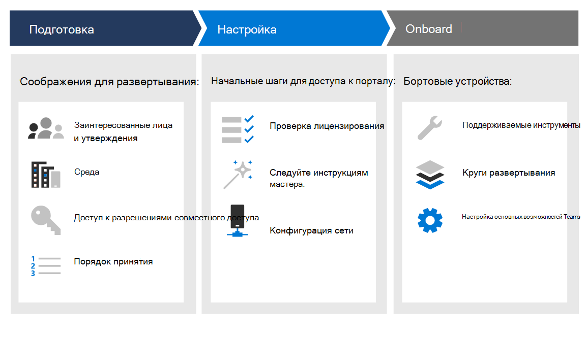
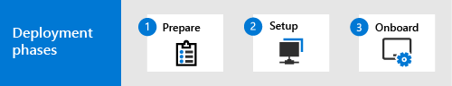

# Этапы развертыванияDeployment phases

[!INCLUDE [Microsoft 365 Defender rebranding](../../includes/microsoft-defender.md)]

**Область применения:****Applies to:**
- [Microsoft Defender для конечной точкиMicrosoft Defender for Endpoint](https://go.microsoft.com/fwlink/p/?linkid=2154037)
- [Microsoft 365 DefenderMicrosoft 365 Defender](https://go.microsoft.com/fwlink/?linkid=2118804)

>Хотите испытать Defender для конечной точки?Want to experience Defender for Endpoint? [Зарегистрився для бесплатной пробной.Sign up for a free trial.](https://www.microsoft.com/microsoft-365/windows/microsoft-defender-atp?ocid=docs-wdatp-assignaccess-abovefoldlink)

Узнайте, как развернуть Microsoft Defender для конечной точки, чтобы ваше предприятие воспользовалось профилактической защитой, обнаружением нарушений, автоматическим расследованием и ответом.Learn how to deploy Microsoft Defender for Endpoint so that your enterprise can take advantage of preventative protection, post-breach detection, automated investigation, and response. 

Это руководство помогает вам работать с заинтересованными сторонами для подготовки среды и бортовых устройств методично, переходя от оценки к содержательному пилоту, к полному развертыванию.This guide helps you work across stakeholders to prepare your environment and then onboard devices in a methodical way, moving from evaluation, to a meaningful pilot, to full deployment.

Каждый раздел соответствует отдельной статье в этом решении.Each section corresponds to a separate article in this solution.

|ЭтапPhase | ОписаниеDescription | 
|:-------|:-----|
| [Этап 1. ПодготовкаPhase 1: Prepare](prepare-deployment.md)| Узнайте, что необходимо учитывать при развертывании Defender для конечной точки, таких как утверждения заинтересованных сторон, соображения среды, разрешения доступа и порядок принятия возможностей.Learn about what you need to consider when deploying Defender for Endpoint such as stakeholder approvals, environment considerations, access permissions, and adoption order of capabilities. 
| [Этап 2. НастройкаPhase 2: Setup](production-deployment.md)|  Получите инструкции по начальным шагам, которые необходимо предпринять, чтобы получить доступ к порталу, например к проверке лицензирования, завершению мастера установки и конфигурации сети.Get guidance on the initial steps you need to take so that you can access the portal such as validating licensing, completing the setup wizard, and network configuration. 
| [Этап 3. ПодключениеPhase 3: Onboard](onboarding.md) | Узнайте, как использовать кольца развертывания, поддерживаемые средства бортового использования в зависимости от типа конечной точки, и настройка доступных возможностей.Learn how to make use of deployment rings, supported onboarding tools based on the type of endpoint, and configuring available capabilities. 

После завершения этого руководства вы будете настроены с нужными разрешениями доступа, конечные точки будут на борту и отчеты о данных датчиков службы, а также возможности, такие как защита следующего поколения и снижение поверхности атаки будут на месте.After you've completed this guide, you'll be setup with the right access permissions, your endpoints will be onboarded and reporting sensor data to the service, and capabilities such as next-generation protection and attack surface reduction will be in place.

Независимо от архитектуры среды и метода развертывания, которые вы выбрали в руководстве по развертыванию [Plan,](deployment-strategy.md) это руководство будет поддерживать вас в конечных точках на борту.Regardless of the environment architecture and method of deployment you choose outlined in the [Plan deployment](deployment-strategy.md) guidance, this guide is going to support you in onboarding endpoints. 

## Ключевые возможностиKey capabilities

Несмотря на то, что Microsoft Defender для конечной точки предоставляет множество возможностей, основная цель этого руководства по развертыванию состоит в том, чтобы начать работу с помощью бортовых устройств.While Microsoft Defender for Endpoint provides many capabilities, the primary purpose of this deployment guide is to get you started by onboarding devices. В дополнение к onboarding, это руководство начинается со следующими возможностями.In addition to onboarding, this guidance gets you started with the following capabilities.

ВозможностьCapability | ОписаниеDescription 
:---|:---
Обнаружение и устранение угроз на конечных точкахEndpoint detection and response | Для обнаружения, расследования и реагирования на попытки вторжения и активных нарушений на месте работают возможности обнаружения конечных точек и реагирования на них.Endpoint detection and response capabilities are put in place to detect, investigate, and respond to intrusion attempts and active breaches.
Защита нового поколенияNext-generation protection | Чтобы еще больше усилить периметр безопасности сети, Microsoft Defender для конечной точки использует защиту следующего поколения, предназначенную для улавливания всех типов возникающих угроз.To further reinforce the security perimeter of your network, Microsoft Defender for Endpoint uses next-generation protection designed to catch all types of emerging threats.
Сокращение направлений атакAttack surface reduction |  Предоставление первой линии защиты в стеке.Provide the first line of defense in the stack. Обеспечивая правильное настройку параметров конфигурации и применяя методы смягчения последствий, этот набор возможностей позволяет противостоять атакам и эксплуатации.By ensuring configuration settings are properly set and exploit mitigation techniques are applied, these set of capabilities resist attacks and exploitation.

Все эти возможности доступны для владельцев лицензий Конечной точки для Microsoft Defender.All these capabilities are available for Microsoft Defender for Endpoint license holders. Дополнительные сведения см. [в сведениях о требованиях к лицензированию.](minimum-requirements.md#licensing-requirements)For more information, see [Licensing requirements](minimum-requirements.md#licensing-requirements).

## ОбластьScope

### В областиIn scope

-   Использование Microsoft Endpoint Manager и Microsoft Endpoint Manager конечных точек в службе и настройка возможностейUse of Microsoft Endpoint Manager and Microsoft Endpoint Manager to onboard endpoints into the service and configure capabilities

-   Включение функций Defender для обнаружение и нейтрализация атак на конечные точки (EDR)Enabling Defender for Endpoint endpoint detection and response (EDR)  capabilities

-   Включение возможностей платформы защиты конечных точек Defender для конечной точки (EPP)Enabling Defender for Endpoint endpoint protection platform (EPP) capabilities

    -   Защита нового поколенияNext-generation protection

    -   Сокращение направлений атакAttack surface reduction

### Вне области поддержкиOut of scope

Ниже из этого руководства по развертыванию находятся вне сферы действия:The following are out of scope of this deployment guide:

-   Конфигурация сторонних решений, которые могут интегрироваться с Defender для endpointConfiguration of third-party solutions that might integrate with Defender for Endpoint

-   Тестирование на проникновение в производственной средеPenetration testing in production environment

## См. такжеSee also
- [Этап 1. ПодготовкаPhase 1: Prepare](prepare-deployment.md)
- [Этап 2. НастройкаPhase 2: Set up](production-deployment.md)
- [Этап 3. ПодключениеPhase 3: Onboard](onboarding.md)
- [Планирование развертыванияPlan deployment](deployment-strategy.md)