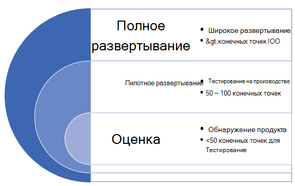

# Развертывание Microsoft Defender для конечной точки в кольцахDeploy Microsoft Defender for Endpoint in rings

[!INCLUDE [Microsoft 365 Defender rebranding](../../includes/microsoft-defender.md)]

**Область применения:****Applies to:**
- [Microsoft Defender для конечной точкиMicrosoft Defender for Endpoint](https://go.microsoft.com/fwlink/p/?linkid=2154037)
- [Microsoft 365 DefenderMicrosoft 365 Defender](https://go.microsoft.com/fwlink/?linkid=2118804)

>Хотите испытать Defender для конечной точки?Want to experience Defender for Endpoint? [Зарегистрився для бесплатной пробной.Sign up for a free trial.](https://www.microsoft.com/microsoft-365/windows/microsoft-defender-atp?ocid=docs-wdatp-assignaccess-abovefoldlink)

Развертывание Microsoft Defender для конечной точки можно сделать с помощью подхода к развертыванию на основе кольца.Deploying Microsoft Defender for Endpoint can be done using a ring-based deployment approach. 

Кольца развертывания можно применить в следующих сценариях:The deployment rings can be applied in the following scenarios:
- [Новые развертыванияNew deployments](#new-deployments)
- [Существующие развертыванияExisting deployments](#existing-deployments)

## Новые развертыванияNew deployments

Метод на основе кольца — это метод определения набора конечных точек для бортового устройства и проверки соответствия определенным критериям перед началом развертывания службы на более широком наборе устройств.A ring-based approach is a method of identifying a set of endpoints to onboard and verifying that certain criteria is met before proceeding to deploy the service to a larger set of devices. Вы можете определить критерии выхода для каждого кольца и убедиться, что они удовлетворены перед переходом на следующее кольцо.You can define the exit criteria for each ring and ensure that they are satisfied before moving on to the next ring.

Внедрение развертывания на основе кольца помогает уменьшить возможные проблемы, которые могут возникнуть при развертывании службы.Adopting a ring-based deployment helps reduce potential issues that could arise while rolling out the service. Сначала с помощью пилотного пилотирования определенного числа устройств можно определить потенциальные проблемы и снизить возможные риски, которые могут возникнуть.By piloting a certain number of devices first, you can identify potential issues and mitigate potential risks that might arise. 

В таблице 1 приводится пример колец развертывания, которые можно использовать.Table 1 provides an example of the deployment rings you might use. 

**Таблица 1****Table 1**

|**Кольцо развертывания****Deployment ring**|**Описание****Description**|
|:-----|:-----|
ОценкаEvaluate | Кольцо 1. Определение 50 систем для пилотного тестированияRing 1: Identify 50 systems for pilot testing 
Пилотное развертываниеPilot | Кольцо 2. Определение следующих конечных точек 50-100 в производственной средеRing 2: Identify the next 50-100  endpoints in production environment    
Полное развертываниеFull deployment | Кольцо 3. Выкатка службы для остальной среды с большими приращениямиRing 3: Roll out service to the rest of environment in larger increments

### Критерии выходаExit criteria
Пример набора критериев выхода для этих колец может включать в себя:An example set of exit criteria for these rings can include:
- Устройства показываются в списке инвентаризации устройствDevices show up in the device inventory list
- Оповещения отображаются на панели мониторингаAlerts appear in dashboard
- [Выполнить тест обнаруженияRun a detection test](run-detection-test.md)
- [Запуск смоделированной атаки на устройствоRun a simulated attack on a device](attack-simulations.md)

### ОценкаEvaluate
Определите небольшое количество тестовых машин в вашей среде, чтобы они были на борту службы.Identify a small number of test machines in your environment to onboard to the service. В идеале эти машины будут иметь менее 50 конечных точек.Ideally, these machines would be fewer than 50 endpoints. 

### Пилотное развертываниеPilot
Microsoft Defender для конечной точки поддерживает различные конечные точки, которые можно использовать в службе.Microsoft Defender for Endpoint supports a variety of endpoints that you can onboard to the service. В этом кольце определите несколько устройств на борту и на основе определяемого вами критерия выхода решите перейти к следующему кольцу развертывания.In this ring, identify several devices to onboard and based on the exit criteria you define, decide to proceed to the next deployment ring.

В следующей таблице показаны поддерживаемые конечные точки и соответствующий инструмент, который можно использовать на бортовых устройствах службы.The following table shows the supported endpoints and the corresponding tool you can use to onboard devices to the service. 

| EndpointEndpoint     | Средство развертыванияDeployment tool                       |
|--------------|------------------------------------------|
| **Windows****Windows**  |  [Локальный скрипт (до 10 устройств)Local script (up to 10 devices)](configure-endpoints-script.md)   ПРИМЕЧАНИЕ. Если вы хотите развернуть более 10 устройств в рабочей среде, используйте метод групповой политики или другие поддерживаемые ниже средства.NOTE: If you want to deploy more than 10 devices in a production environment, use the Group Policy method instead or the other supported tools listed below.   [Групповая политикаGroup Policy](configure-endpoints-gp.md)    [Microsoft Endpoint Manager/ Mobile Device ManagerMicrosoft Endpoint Manager/ Mobile Device Manager](configure-endpoints-mdm.md)     [Microsoft Endpoint Configuration ManagerMicrosoft Endpoint Configuration Manager](configure-endpoints-sccm.md)   [Скрипты VDIVDI scripts](configure-endpoints-vdi.md)   |
| **macOS****macOS**    | [Локальный скриптLocal script](mac-install-manually.md)   [Менеджер конечных точек МайкрософтMicrosoft Endpoint Manager](mac-install-with-intune.md)   [JAMF ProJAMF Pro](mac-install-with-jamf.md)   [Управление мобильными устройствамиMobile Device Management](mac-install-with-other-mdm.md) |
| **Linux Server****Linux Server** | [Локальный скриптLocal script](linux-install-manually.md)   [PuppetPuppet](linux-install-with-puppet.md)   [AnsibleAnsible](linux-install-with-ansible.md)|
| **iOS****iOS**      | [На основе приложенияApp-based](ios-install.md)                                |
| **Android****Android**  | [Менеджер конечных точек МайкрософтMicrosoft Endpoint Manager](android-intune.md)               | 

### Полное развертываниеFull deployment
На данном этапе вы можете использовать материал [развертывания Plan](deployment-strategy.md) для планирования развертывания.At this stage, you can use the [Plan deployment](deployment-strategy.md) material to help you plan your deployment. 

Используйте следующий материал, чтобы выбрать соответствующую архитектуру Microsoft Defender для конечной точки, которая лучше всего подходит для вашей организации.Use the following material to select the appropriate Microsoft Defender for Endpoint architecture that best suites your organization.

|**Item****Item**|**Описание****Description**|
|:-----|:-----|
|  [PDF](https://github.com/MicrosoftDocs/microsoft-365-docs/raw/public/microsoft-365/security/defender-endpoint/downloads/mdatp-deployment-strategy.pdf)  \| [Visio](https://github.com/MicrosoftDocs/microsoft-365-docs/raw/public/microsoft-365/security/defender-endpoint/downloads/mdatp-deployment-strategy.vsdx)[PDF](https://github.com/MicrosoftDocs/microsoft-365-docs/raw/public/microsoft-365/security/defender-endpoint/downloads/mdatp-deployment-strategy.pdf)  \| [Visio](https://github.com/MicrosoftDocs/microsoft-365-docs/raw/public/microsoft-365/security/defender-endpoint/downloads/mdatp-deployment-strategy.vsdx) | Материалы по архитектуре помогут вам спланировать развертывание для следующих архитектур:The architectural material helps you plan your deployment for the following architectures: <ul><li> Облачное развертываниеCloud-native </li><li> Совместное управлениеCo-management </li><li> Локальное развертываниеOn-premise</li><li>Оценка и локальное внедрениеEvaluation and local onboarding</li>

## Существующие развертыванияExisting deployments

### Конечные точки WindowsWindows endpoints
Для Windows и/или Windows Servers вы выбираете несколько машин для досрочного тестирования (перед обновлением во вторник) с помощью программы проверки обновления безопасности **(SUVP).**For Windows and/or Windows Servers, you select several machines to test ahead of time (before patch Tuesday) by using the **Security Update Validation program (SUVP)**.

Дополнительные сведения см. в указанных ниже статьях.For more information, see:
- [Что такое программа проверки обновления безопасностиWhat is the Security Update Validation Program](https://techcommunity.microsoft.com/t5/windows-it-pro-blog/what-is-the-security-update-validation-program/ba-p/275767)
- [Программа проверки обновления программного обеспечения и Центр Майкрософт по защите от вредоносных программ создания — TwC Interactive Timeline Part 4Software Update Validation Program and Microsoft Malware Protection Center Establishment - TwC Interactive Timeline Part 4](https://www.microsoft.com/security/blog/2012/03/28/software-update-validation-program-and-microsoft-malware-protection-center-establishment-twc-interactive-timeline-part-4/)

### Конечные точки, не в WindowsNon-Windows endpoints
С помощью macOS и Linux можно воспользоваться несколькими системами и запустить их в канале InsidersFast.With macOS and Linux, you could take a couple of systems and run in the "InsidersFast" channel.

>[!NOTE]
>В идеале не менее одного администратора безопасности и одного разработчика, чтобы вы могли находить проблемы с совместимостью, производительностью и надежностью до того, как сборка будет перенастройка в канал "Production".Ideally at least one security admin and one developer so that you are able to find compatibility, performance and reliability issues before the build makes it into the "Production" channel.

Выбор канала определяет тип и частоту обновлений, предлагаемых вашему устройству.The choice of the channel determines the type and frequency of updates that are offered to your device. Устройства в инсайдерской быстрой являются первыми, которые получают обновления и новые функции, а затем инсайдеры медленно и, наконец, prod.Devices in insiders-fast are the first ones to receive updates and new features, followed later by insiders-slow and lastly by prod.

Для предварительного просмотра новых функций и обеспечения ранней обратной связи рекомендуется настроить некоторые устройства в вашем предприятии, чтобы использовать как инсайдеры-быстрые, так и инсайдеры-медленные.In order to preview new features and provide early feedback, it is recommended that you configure some devices in your enterprise to use either insiders-fast or insiders-slow.

>[!WARNING]
>Переключение канала после начальной установки требует повторной установки продукта.Switching the channel after the initial installation requires the product to be reinstalled. Чтобы переключить канал продукта: удалить существующий пакет, перенастройте устройство для использования нового канала и выполните действия в этом документе, чтобы установить пакет из нового расположения.To switch the product channel: uninstall the existing package, re-configure your device to use the new channel, and follow the steps in this document to install the package from the new location.
