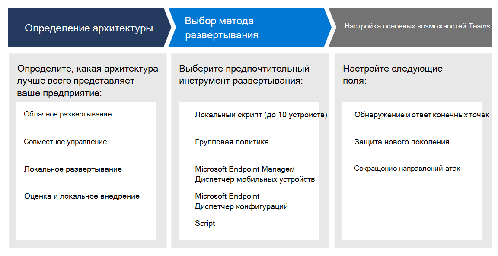

# Планирование развертывания конечной точки в Microsoft DefenderPlan your Microsoft Defender for Endpoint deployment 

[!INCLUDE [Microsoft 365 Defender rebranding](../../includes/microsoft-defender.md)]

**Область применения:****Applies to:**
- [Microsoft Defender для конечной точкиMicrosoft Defender for Endpoint](https://go.microsoft.com/fwlink/p/?linkid=2154037)
- [Microsoft 365 DefenderMicrosoft 365 Defender](https://go.microsoft.com/fwlink/?linkid=2118804)

>Хотите испытать Defender для конечной точки?Want to experience Defender for Endpoint? [Зарегистрився для бесплатной пробной.Sign up for a free trial.](https://www.microsoft.com/microsoft-365/windows/microsoft-defender-atp?ocid=docs-wdatp-secopsdashboard-abovefoldlink) 

Запланируйте развертывание Microsoft Defender для конечной точки, чтобы максимально повысить возможности безопасности в пакете и лучше защитить свое предприятие от киберугроз.Plan your Microsoft Defender for Endpoint deployment so that you can maximize the security capabilities within the suite and better protect your enterprise from cyber threats.

Это решение содержит рекомендации по выявлению архитектуры среды, выбор типа средства развертывания, который наилучшим образом соответствует вашим потребностям, и инструкции по настройке возможностей.This solution provides guidance on how to identify your environment architecture, select the type of deployment tool that best fits your needs, and guidance on how to configure capabilities.

## Шаг 1. Определение архитектурыStep 1: Identify architecture
Мы понимаем, что каждая корпоративная среда уникальна, поэтому мы предоставили несколько вариантов, чтобы предоставить вам гибкость при выборе способов развертывания службы.We understand that every enterprise environment is unique, so we've provided several options to give you the flexibility in choosing how to deploy the service.

В зависимости от среды некоторые средства лучше подходят для определенных архитектур.Depending on your environment, some tools are better suited for certain architectures. 

Используйте следующий материал, чтобы выбрать соответствующую архитектуру Defender для конечной точки, которая лучше всего подходит для вашей организации.Use the following material to select the appropriate Defender for Endpoint architecture that best suites your organization.

| ItemItem | ОписаниеDescription |
|:-----|:-----|
|  [PDF](https://github.com/MicrosoftDocs/microsoft-365-docs/raw/public/microsoft-365/security/defender-endpoint/downloads/mdatp-deployment-strategy.pdf)  \| [Visio](https://github.com/MicrosoftDocs/microsoft-365-docs/raw/public/microsoft-365/security/defender-endpoint/downloads/mdatp-deployment-strategy.vsdx)[PDF](https://github.com/MicrosoftDocs/microsoft-365-docs/raw/public/microsoft-365/security/defender-endpoint/downloads/mdatp-deployment-strategy.pdf)  \| [Visio](https://github.com/MicrosoftDocs/microsoft-365-docs/raw/public/microsoft-365/security/defender-endpoint/downloads/mdatp-deployment-strategy.vsdx) | Материалы по архитектуре помогут вам спланировать развертывание для следующих архитектур:The architectural material helps you plan your deployment for the following architectures: <ul><li> Облачное развертываниеCloud-native </li><li> Совместное управлениеCo-management </li><li> Локальное развертываниеOn-premise</li><li>Оценка и локальное внедрениеEvaluation and local onboarding</li>

## Шаг 2. Выбор метода развертыванияStep 2: Select deployment method
Defender for Endpoint поддерживает различные конечные точки, которые можно использовать на борту службы.Defender for Endpoint supports a variety of endpoints that you can onboard to the service. 

В следующей таблице перечислены поддерживаемые конечные точки и соответствующий инструмент развертывания, который можно использовать для правильного планирования развертывания.The following table lists the supported endpoints and the corresponding deployment tool that you can use so that you can plan the deployment appropriately.

| EndpointEndpoint     | Средство развертыванияDeployment tool                       |
|--------------|------------------------------------------|
| **Windows****Windows**  |  [Локальный скрипт (до 10 устройств)Local script (up to 10 devices)](configure-endpoints-script.md)    [Групповая политикаGroup Policy](configure-endpoints-gp.md)    [Microsoft Endpoint Manager/ Mobile Device ManagerMicrosoft Endpoint Manager/ Mobile Device Manager](configure-endpoints-mdm.md)     [Microsoft Endpoint Configuration ManagerMicrosoft Endpoint Configuration Manager](configure-endpoints-sccm.md)   [Скрипты VDIVDI scripts](configure-endpoints-vdi.md)   |
| **macOS****macOS**    | [Локальный скриптLocal script](mac-install-manually.md)   [Менеджер конечных точек МайкрософтMicrosoft Endpoint Manager](mac-install-with-intune.md)   [JAMF ProJAMF Pro](mac-install-with-jamf.md)   [Управление мобильными устройствамиMobile Device Management](mac-install-with-other-mdm.md) |
| **Linux Server****Linux Server** | [Локальный скриптLocal script](linux-install-manually.md)   [PuppetPuppet](linux-install-with-puppet.md)   [AnsibleAnsible](linux-install-with-ansible.md)|
| **iOS****iOS**      | [На основе приложенияApp-based](ios-install.md)                                |
| **Android****Android**  | [Менеджер конечных точек МайкрософтMicrosoft Endpoint Manager](android-intune.md)               | 

## Шаг 3. Настройка возможностейStep 3: Configure capabilities
После использования конечных точек настройте возможности безопасности в Defender для конечной точки, чтобы можно было максимально повысить надежность защиты, доступную в наборе.After onboarding endpoints, configure the security capabilities in Defender for Endpoint so that you can maximize the robust security protection available in the suite. Возможности включают в себя:Capabilities include:

- Обнаружение и устранение угроз на конечных точкахEndpoint detection and response
- Защита следующего поколенияNext-generation protection
- Сокращение направлений атакAttack surface reduction

  
## Статьи по темеRelated topics
- [Этапы развертыванияDeployment phases](deployment-phases.md)
