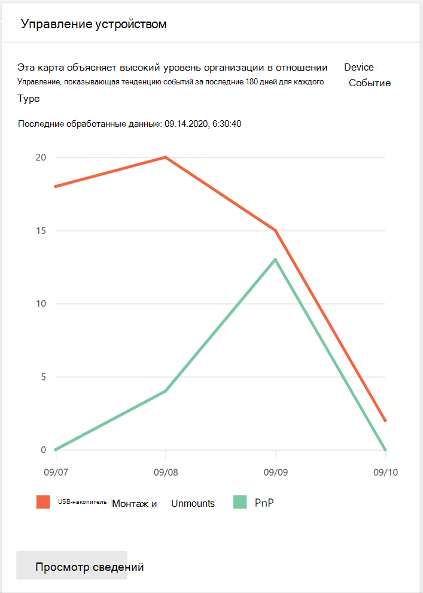
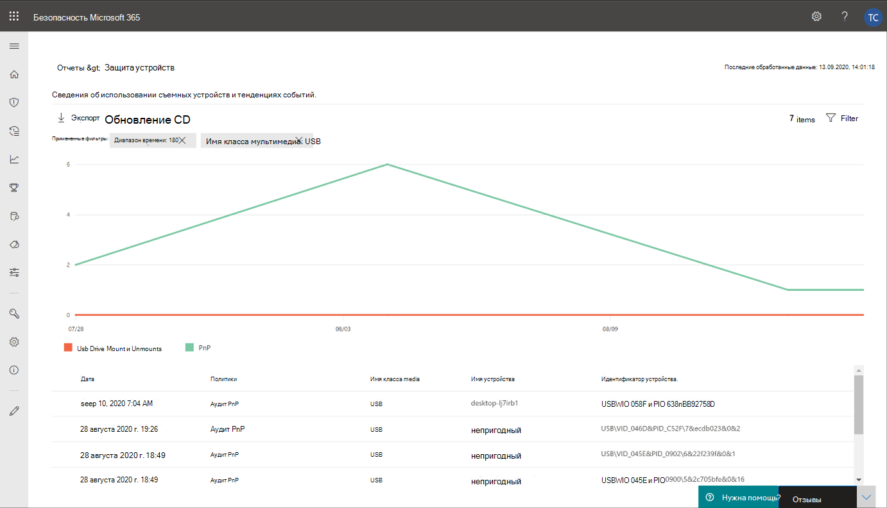
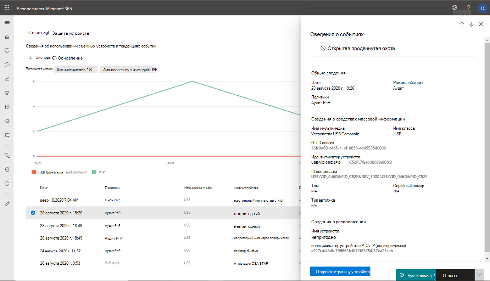
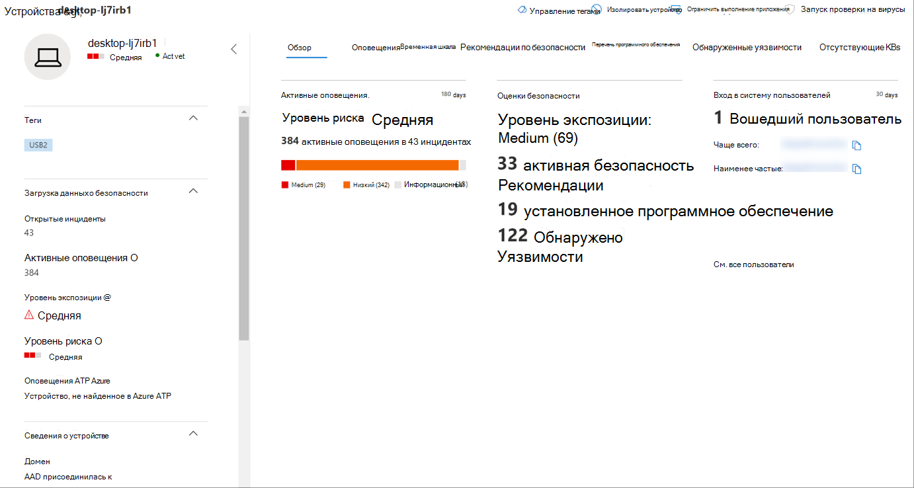

# Защита данных организации с помощью управления устройствамиProtect your organization’s data with device control

**Применяется к:** [Microsoft Defender для конечной точки](https://go.microsoft.com/fwlink/p/?linkid=2069559)**Applies to:** [Microsoft Defender for Endpoint](https://go.microsoft.com/fwlink/p/?linkid=2069559)

Управление устройствами Microsoft Defender для конечных точек защищает от потери данных, отслеживая и контролируя использование мультимедиа устройствами в организации, такими как использование съемных устройств хранения и USB-дисков.Microsoft Defender for Endpoint device control protects against data loss, by monitoring and controlling media use by devices in your organization, such as the use of removable storage devices and USB drives.

В отчете управления устройством можно просматривать события, которые связаны с использованием мультимедиа, например:With the device control report, you can view events that relate to media usage, such as:

- **События аудита:** Показывает количество событий аудита, которые происходят при подключении внешних мультимедиа.**Audit events:** Shows the number of audit events that occur when external media is connected.
- **События политики:** Показывает количество событий политики, которые происходят при запуске политики управления устройствами.**Policy events:** Shows the number of policy events that occur when a device control policy is triggered.

> [!NOTE]
> Событие аудита для отслеживания использования мультимедиа включено по умолчанию для устройств, включенных в Microsoft Defender для конечной точки.The audit event to track media usage is enabled by default for devices onboarded to Microsoft Defender for Endpoint.

## Понимание событий аудитаUnderstanding the audit events

События аудита включают:The audit events include:

- **Установка usb-накопителей и их неподъемная установка:** События аудита, которые создаются при смонтировании или неподъемном usb-накопителе.**USB drive mount and unmount:** Audit events that are generated when a USB drive is mounted or unmounted.
- **PnP:** События аудита plug и Play создаются при подключении съемного хранилища, принтера или Bluetooth мультимедиа.**PnP:** Plug and Play audit events are generated when removable storage, a printer, or Bluetooth media is connected.

## Мониторинг безопасности управления устройствамиMonitor device control security

Управление устройствами в Microsoft Defender для конечной точки предоставляет администраторам безопасности средства, позволяющие отслеживать безопасность управления устройствами своей организации с помощью отчетов.Device control in Microsoft Defender for Endpoint empowers security administrators with tools that enable them to track their organization’s device control security through reports. Отчет об устройстве можно найти в центре безопасности Microsoft 365, перейдите к отчету > **устройств.**You can find the device control report in the Microsoft 365 security center by going to **Reports > Device protection**.

Карта защиты устройств на панели **мониторинга Отчеты** показывает количество событий аудита, созданных типом мультимедиа, за последние 180 дней.The Device protection card on the **Reports** dashboard shows the number of audit events generated by media type, over the last 180 days.

> [!div class="mx-imgBorder"]
> 

Кнопка **"Просмотр сведений"** отображает больше данных об использовании мультимедиа на странице **отчета об устройстве.**The **View details** button shows more media usage data in the **device control report** page.

На странице предоставляется панель мониторинга с совокупным числом событий на один тип и списком событий.The page provides a dashboard with aggregated number of events per type and a list of events. Администраторы могут фильтровать диапазон времени, имя класса мультимедиа и ID устройства.Administrators can filter on time range, media class name, and device ID.

> [!div class="mx-imgBorder"]
> 

При выборе события появляется вылет, который показывает дополнительные сведения:When you select an event, a flyout appears that shows you more information:

- **Общие сведения:** Дата, режим действия и политика этого события.**General details:** Date, Action mode, and the policy of this event.
- **Сведения о средствах массовой информации:** Сведения о средствах массовой информации включают имя мультимедиа, имя класса, GUID класса, ID устройства, ID поставщика, том, серийный номер и тип автобуса.**Media information:** Media information includes Media name, Class name, Class GUID, Device ID, Vendor ID, Volume, Serial number, and Bus type.
- **Сведения о расположении:** Имя устройства и MDATP устройства.**Location details:** Device name and MDATP device ID.

> [!div class="mx-imgBorder"]
> 

Чтобы увидеть действия в режиме реального времени для этого средства массовой информации в организации, выберите кнопку **Open Advanced hunting.**To see real-time activity for this media across the organization, select the **Open Advanced hunting** button. Это включает встроенный заранее определенный запрос.This includes an embedded, pre-defined query.

> [!div class="mx-imgBorder"]
> 

Чтобы увидеть безопасность устройства, выберите кнопку **Открыть** страницу устройства на вылете.To see the security of the device, select the **Open device page** button on the flyout. Эта кнопка открывает страницу сущности устройства.This button opens the device entity page.

> [!div class="mx-imgBorder"]
> 

## Задержки с отчетностьюReporting delays

Отчет управления устройством может иметь 12-часовую задержку со времени подключения мультимедиа к моменту отражения события в карте или в списке домена.The device control report can have a 12-hour delay from the time a media connection occurs to the time the event is reflected in the card or in the domain list.
