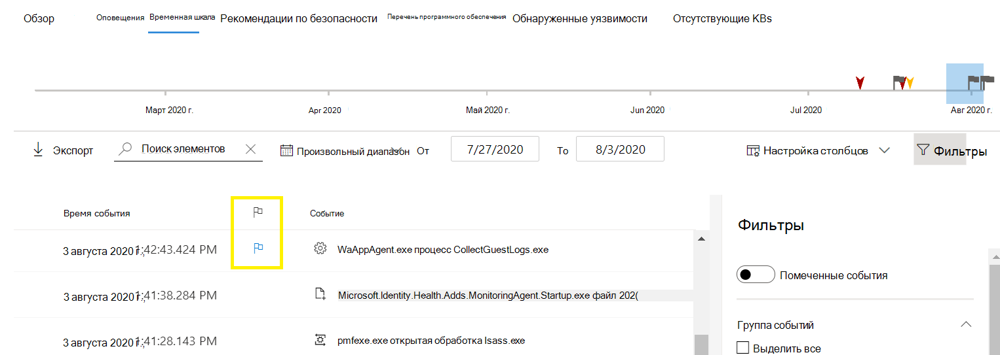
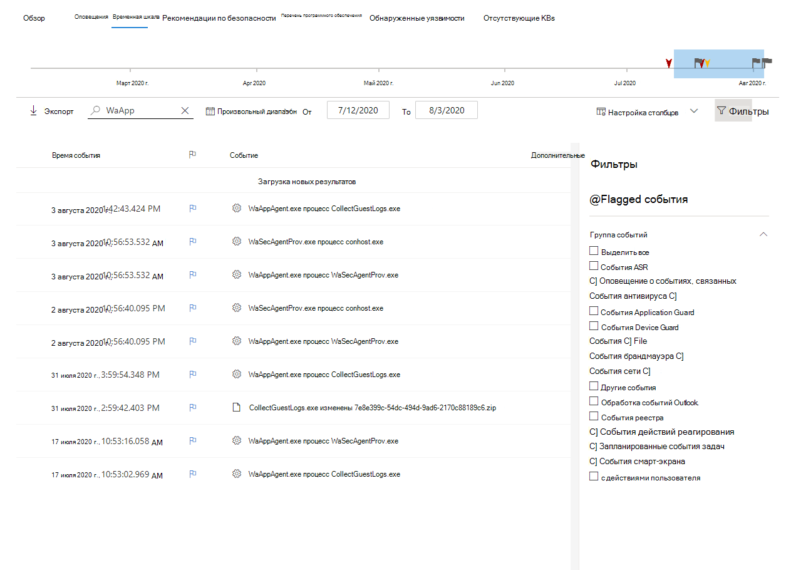

# Флаги событий событий Microsoft Defender для конечных устройствMicrosoft Defender for Endpoint device timeline event flags

[!INCLUDE [Microsoft 365 Defender rebranding](../../includes/microsoft-defender.md)]

**Область применения:****Applies to:**
- [Microsoft Defender для конечной точкиMicrosoft Defender for Endpoint](https://go.microsoft.com/fwlink/p/?linkid=2154037)
- [Microsoft 365 DefenderMicrosoft 365 Defender](https://go.microsoft.com/fwlink/?linkid=2118804)

>Хотите испытать Defender для конечной точки?Want to experience Defender for Endpoint? [Зарегистрився для бесплатной пробной.Sign up for a free trial.](https://www.microsoft.com/microsoft-365/windows/microsoft-defender-atp?ocid=docs-wdatp-assignaccess-abovefoldlink)

Флаги событий в временной шкале устройств Defender для конечных точек помогают фильтровать и организовывать определенные события при расследовании возможных атак.Event flags in the Defender for Endpoint device timeline help you filter and organize specific events when you're  investigate potential attacks.

В временной шкале устройства Defender для конечных точек предоставляется хронологическое представление событий и связанных оповещений, наблюдаемых на устройстве.The Defender for Endpoint device timeline provides a chronological view of the events and associated alerts observed on a device. Этот список событий обеспечивает полную видимость любых событий, файлов и IP-адресов, наблюдаемых на устройстве.This list of events provides full visibility into any events, files, and IP addresses observed on the device. Иногда список может быть длительным.The list can sometimes be lengthy. Флаги событий временной шкалы устройств помогают отслеживать события, которые могут быть связаны.Device timeline event flags help you track events that could be related. 

После того как вы прошли временную шкалу устройства, вы можете сортировать, фильтровать и экспортировать определенные события, которые вы помечены.After you've gone through a device timeline, you can sort, filter, and export the specific events that you flagged.

Во время навигации по временной шкале устройства можно искать и фильтровать определенные события.While navigating the device timeline, you can search and filter for specific events. Вы можете установить флаги событий по:You can set event flags by: 

- Выделение наиболее важных событийHighlighting the most important events 
- Маркировка событий, которые требуют глубокого погруженияMarking events that requires deep dive 
- Создание хронологии чистого нарушенияBuilding a clean breach timeline

## Пометить событиеFlag an event
1. Найдите событие, которое необходимо пометитьFind the event that you want to flag
2. Щелкните значок флага в столбце Флаг.Click the flag icon in the Flag column. 

## Просмотр помеченных событийView flagged events  
1. В разделе **Фильтры временной шкалы** в включить **помеченные события.**In the timeline **Filters** section, enable **Flagged events**.
2. Нажмите **Применить**.Click **Apply**. Отображаются только помеченные события.Only flagged events are displayed.
Дополнительные фильтры можно применить, нажав на планку времени.You can apply additional filters by clicking on the time bar. В этом случае будут показываться события только до помеченного события.This will only show events prior to the flagged event.  

