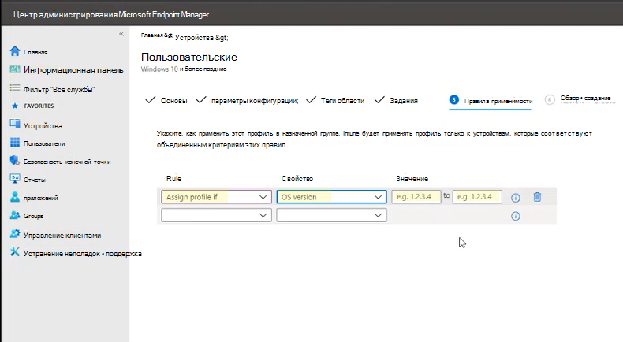

# <a name="enable-attack-surface-reduction-rules"></a>Включить правила сокращения направлений атак

**Область применения:**

- [Microsoft Defender для конечной точки](https://go.microsoft.com/fwlink/p/?linkid=2154037)
- [Microsoft 365 Defender](https://go.microsoft.com/fwlink/?linkid=2118804)

> [!TIP]
> Хотите испытать Defender для конечной точки? [Зарегистрився для бесплатной пробной.](https://www.microsoft.com/microsoft-365/windows/microsoft-defender-atp?ocid=docs-wdatp-assignaccess-abovefoldlink)

[Правила уменьшения поверхности](attack-surface-reduction.md) атаки (правила ASR) помогают предотвратить действия, которые вредоносные программы часто используют для компрометации устройств и сетей.

## <a name="requirements"></a>Требования

Функции уменьшения поверхности атаки в Windows версиях

Вы можете установить правила уменьшения поверхности атаки для устройств, которые работают с любыми из следующих выпусков и версий Windows:

- Windows 10 Pro версии [1709](/windows/whats-new/whats-new-windows-10-version-1709) или более поздней версии
- Windows 10 Корпоративная версии [1709](/windows/whats-new/whats-new-windows-10-version-1709) или более поздней версии
- Windows Сервер, [версия 1803 (полугодовой канал)](/windows-server/get-started/whats-new-in-windows-server-1803) или более поздний
- [Windows Server 2019](/windows-server/get-started-19/whats-new-19)

Чтобы использовать весь набор функций правил уменьшения поверхности атаки, необходимо:

- антивирусная программа как основной av (защита в режиме реального времени)
- [Защита облачной доставки](/windows/security/threat-protection/microsoft-defender-antivirus/enable-cloud-protection-microsoft-defender-antivirus) (для этого требуются некоторые правила)
- Windows 10 Корпоративная Лицензия E5 или E3 или Microsoft 365 бизнес-лицензия

Хотя правила уменьшения поверхности атаки не требуют лицензии Windows E5 с лицензией Windows [E5,](/windows/deployment/deploy-enterprise-licenses)вы получаете расширенные возможности управления, включая мониторинг, аналитику и рабочий процесс, доступные в Defender for Endpoint, а также возможности отчетности и конфигурации в центре безопасности Microsoft 365. Эти расширенные возможности недоступны с лицензией E3, но вы все равно можете использовать viewer событий для просмотра событий, чтобы просмотреть события правила уменьшения поверхности атаки.

Каждое правило ASR содержит один из четырех параметров:

- **Не настроен:** отключить правило ASR
- **Блок**: Включить правило ASR
- **Аудит.** Оцените, как правило ASR повлияет на организацию, если включено
- **Предупреждение.** Включить правило ASR, но разрешить конечному пользователю обойти блокировку

> [!IMPORTANT]
> В настоящее время режим предупреждения не поддерживается для трех правил ASR при настройке правил ASR в Microsoft Endpoint Manager (MEM). Дополнительные дополнительные информации см. [в том, как не](attack-surface-reduction.md#cases-where-warn-mode-is-not-supported)поддерживается режим предупреждения.

Настоятельно рекомендуется использовать правила ASR с лицензией Windows E5 (или аналогичный SKU лицензирования), чтобы использовать расширенные возможности мониторинга и отчетности, доступные в [Microsoft Defender for Endpoint](microsoft-defender-endpoint.md) (Defender for Endpoint). Однако если у вас есть другая лицензия, например Windows Professional или Windows E3, которая не включает расширенные возможности мониторинга и отчетности, вы можете разработать собственные средства мониторинга и отчетности в верхней части событий, которые создаются на каждой конечной точке при запуске правил ASR (например, переададка событий).

> [!TIP]
> Дополнительные дополнительные Windows см. Windows 10 [лицензирование](https://www.microsoft.com/licensing/product-licensing/windows10?activetab=windows10-pivot:primaryr5) и руководство по лицензированию томов [для Windows 10](https://download.microsoft.com/download/2/D/1/2D14FE17-66C2-4D4C-AF73-E122930B60F6/Windows-10-Volume-Licensing-Guide.pdf).

Вы можете включить правила уменьшения поверхности атаки с помощью любого из этих методов:

- [Microsoft Intune](#intune)
- [Управление мобильными устройствами (MDM)](#mdm)
- [Microsoft Endpoint Configuration Manager](#microsoft-endpoint-configuration-manager)
- [Групповая политика](#group-policy)
- [PowerShell](#powershell)

Enterprise, например Intune или Microsoft Endpoint Manager, рекомендуется. Enterprise управления на уровне будет переписать любые противоречивые параметры групповой политики или PowerShell при запуске.

## <a name="exclude-files-and-folders-from-asr-rules"></a>Исключение файлов и папок из правил ASR

Вы можете исключить оценку файлов и папок большинством правил уменьшения поверхности атаки. Это означает, что даже если правило ASR определяет файл или папку с вредоносным поведением, оно не будет блокировать работу файла. Это потенциально может позволить небезопасным файлам запускать и заражать устройства.

Вы также можете исключить запуск правил ASR на основе хеш-файлов сертификатов и файлов, разрешив указанные индикаторы файла и сертификата Defender для конечной точки. [(См. управление индикаторами.)](manage-indicators.md)

> [!IMPORTANT]
> Исключение файлов или папок может серьезно уменьшить защиту, предоставляемую правилами ASR. Исключенные файлы будут разрешены для запуска, и отчет или событие не будут записаны.
> Если правила ASR обнаруживают файлы, которые, как вы считаете, не следует обнаруживать, сначала следует использовать режим аудита для [проверки правила.](evaluate-attack-surface-reduction.md)

Вы можете указать отдельные файлы или папки (с помощью путей папок или полностью квалифицированных имен ресурсов), но вы не можете указать правила, к которым применяются исключения. Исключение применяется только при старте исключенного приложения или службы. Например, если добавлено исключение для уже запущенной службы обновления, служба обновления будет продолжать запускать события до тех пор, пока служба не будет остановлена и перезапущена.

Правила ASR поддерживают переменные среды и подкарды. Сведения об использовании подмастерьев см. в материалах [Use wildcards in the file name and folder path or extension exclusion lists.](configure-extension-file-exclusions-microsoft-defender-antivirus.md#use-wildcards-in-the-file-name-and-folder-path-or-extension-exclusion-lists)

Следующие процедуры включения правил ASR включают инструкции по исключению файлов и папок.

## <a name="intune"></a>Intune

1. Выберите **профили**  >  **конфигурации устройств.** Выберите существующий профиль защиты конечной точки или создайте новый. Чтобы создать новый, выберите **Создать профиль** и ввести сведения для этого профиля. Для **типа профиля** выберите защиту **конечных точек.** Если вы выбрали существующий профиль, выберите **свойства** и **выберите** Параметры.

2. В области **защиты конечной** точки выберите Защитник Windows **Exploit Guard,** а затем выберите **сокращение поверхности атаки.** Выберите нужный параметр для каждого правила ASR.

3. В **соответствии с исключениями для** уменьшения поверхности атаки введите отдельные файлы и папки. Вы также можете выбрать **Импорт для** импорта CSV-файла, который содержит файлы и папки, чтобы исключить из правил ASR. Каждая строка в CSV-файле должна быть отформатирована следующим образом:

   `C:\folder`, `%ProgramFiles%\folder\file`, `C:\path`

4. Выберите **ОК** на трех стемнах конфигурации. Затем выберите **Создать,** если вы создаете новый файл защиты конечной точки или **сохраните,** если вы редактируете существующий.

## <a name="mem"></a>MEM

Вы можете использовать Microsoft Endpoint Manager (MEM) OMA-URI для настройки настраиваемых правил ASR. В следующей процедуре используется правило [Block abuse of exploited vulnerable signed drivers](attack-surface-reduction.md#block-abuse-of-exploited-vulnerable-signed-drivers) for the example.

1. Откройте центр администрирования Microsoft Endpoint Manager (MEM). В **домашнем меню** нажмите  **кнопку Устройства,** выберите **профиль конфигурации** и нажмите **кнопку Создать профиль**.

   > [!div class="mx-imgBorder"]
   > 

2. В **"Создание профиля"** в следующих двух списках выпадаемой части выберите следующее:

   - В **Платформе** выберите Windows 10 **и более поздней**
   - В **типе profile** выберите **Шаблоны**

   Выберите **настраиваемый,** а затем нажмите **кнопку Создать**.

   > [!div class="mx-imgBorder"]
   > 

3. Настраиваемый инструмент шаблона открывается для шага **1 Basics**. В **1 Basics,** in **Name** введите имя шаблона, а в **Описании** можно ввести описание (необязательно).

   > [!div class="mx-imgBorder"]
   > 

4. Нажмите кнопку **Далее**. Параметры **конфигурации шага 2 открываются.** Для OMA-URI Параметры нажмите **кнопку Добавить**. Теперь отображаются два варианта: **Добавить и** **экспортировать**.

   > [!div class="mx-imgBorder"]
   > 

5. Щелкните **Добавить** еще раз. Откроется **добавление строки OMA-URI Параметры.** В **строке Добавить** строку сделайте следующее:

   - В **Name** введите имя правила.
   - В **описании** введите краткое описание.
   - В **OMA-URI** введите или введите определенную ссылку OMA-URI для правила, которое вы добавляете.
   - В **типе Data** выберите **строку**.
   - В **Значение**, введите или введите значение GUID, знак и значение состояния без пробелов \= _(GUID=StateValue)._ Где: {0: Отключение (Отключите правило ASR)}, {1: Блок (Включить правило ASR)}, {2: Аудит (Оценка влияния правила ASR на организацию при включении)}, {6 : Предупреждение (Включить правило ASR, но разрешить конечному пользователю обойти блокировку)}

   > [!div class="mx-imgBorder"]
   > 

6. Щелкните **Сохранить**. **Добавление строки** закрывается. В **настраиваемом**, нажмите **кнопку Далее**. В **тегах 3 Scope** теги области необязательны. Выполните одно из указанных ниже действий.

   - Нажмите **кнопку Выберите теги Область,** выберите тег области (необязательный), а затем нажмите **кнопку Далее**.
   - Или нажмите **кнопку Далее**

7. В **шаге 4 Назначения** в включенных группах **для** групп, которые необходимо применить это правило, выберите из следующих параметров:

   - **Добавление групп**
   - **Добавление всех пользователей**
   - **Добавление всех устройств**

   > [!div class="mx-imgBorder"]
   > 

8. В **исключенных группах** выберите все группы, которые необходимо исключить из этого правила, а затем нажмите **кнопку Далее**.

9. В **шаге 5 Правила применимости** для следующих параметров сделайте следующее:

   - В **правиле** выберите либо **Назначение профиля, если**, или не **назначать профиль, если**
   - В **Свойстве** выберите свойство, к которому необходимо применить это правило
   - В **Value** введите применимое значение или диапазон значений

   > [!div class="mx-imgBorder"]
   > 

10. Нажмите кнопку **Далее**. В **шаге 6 Обзор + создание**, просмотрите параметры и сведения, которые вы выбрали и ввели, а затем нажмите **кнопку Создать**.

    > [!div class="mx-imgBorder"]
    > 

    > [!NOTE]
    > Правила активны и действуют в течение нескольких минут.

>[!NOTE]
> Обработка конфликтов:
>
> Если назначить устройству две разные политики ASR, то способ обработки конфликта — это правила, назначаемые разным состояниям, не существует управления конфликтами, и в результате происходит ошибка.
>
> Неконфликтные правила не привнося ошибку, и правило будет применяться правильно. В результате применяется первое правило и последующие правила, не конфликтующие, объединяются в политику.

## <a name="mdm"></a>MDM

Используйте [поставщика служб конфигурации ./Vendor/MSFT/Policy/Config/Defender/AttackSurfaceReductionRules](/windows/client-management/mdm/policy-csp-defender#defender-attacksurfacereductionrules) для индивидуального включить и задать режим для каждого правила.

Ниже приводится пример для справки с использованием [значений GUID для правил ASR.](attack-surface-reduction.md#attack-surface-reduction-rules)

`OMA-URI path: ./Vendor/MSFT/Policy/Config/Defender/AttackSurfaceReductionRules`

`Value: 75668C1F-73B5-4CF0-BB93-3ECF5CB7CC84=2|3B576869-A4EC-4529-8536-B80A7769E899=1|D4F940AB-401B-4EfC-AADC-AD5F3C50688A=2|D3E037E1-3EB8-44C8-A917-57927947596D=1|5BEB7EFE-FD9A-4556-801D-275E5FFC04CC=0|BE9BA2D9-53EA-4CDC-84E5-9B1EEEE46550=1`

Значения, которые необходимо включить (Block), отключить, предупредить или включить в режиме аудита:

- 0. Отключение (отключение правила ASR)
- 1. Блок (Включить правило ASR)
- 2. Аудит (Оцените, как правило ASR повлияет на организацию, если включено)
- 6. Предупреждение (Включить правило ASR, но разрешить конечному пользователю обойти блок). Режим Warn теперь доступен для большинства правил ASR.

Для добавления исключений используйте поставщика служб конфигурации [./Vendor/MSFT/Policy/Config/Defender/AttackSurfaceReductionOnlyExclusions.](/windows/client-management/mdm/policy-csp-defender#defender-attacksurfacereductiononlyexclusions)

Пример.

`OMA-URI path: ./Vendor/MSFT/Policy/Config/Defender/AttackSurfaceReductionOnlyExclusions`

`Value: c:\path|e:\path|c:\Exclusions.exe`

> [!NOTE]
> Обязательно введите значения OMA-URI без пробелов.

## <a name="microsoft-endpoint-configuration-manager"></a>Microsoft Endpoint Configuration Manager

1. В Microsoft Endpoint Configuration Manager перейдите в **службу Assets and Compliance**  >  **Endpoint Protection** Защитник Windows  >  **Exploit Guard**.

2. Выберите   >  **домашнее создание политики защиты от эксплойтов**.

3. Введите имя и описание, выберите **сокращение поверхности атаки** и выберите **Далее.**

4. Выберите правила, которые будут блокировать действия или аудит, и выберите **Далее**.

5. Просмотрите параметры и выберите **Далее,** чтобы создать политику.

6. После создания политики **закрой**.

## <a name="group-policy"></a>Групповая политика

> [!WARNING]
> Если управлять компьютерами и устройствами с помощью Intune, Configuration Manager или другой платформы управления на корпоративном уровне, программное обеспечение управления перезаписает все противоречивые параметры групповой политики при запуске.

1. Для этого на компьютере, управляющем групповыми политиками, откройте [Консоль управления групповой политикой](https://technet.microsoft.com/library/cc731212.aspx), щелкните правой кнопкой мыши нужный объект групповой политики и выберите **Изменить**.

2. В **редакторе управления групповыми политиками** перейдите к **конфигурации компьютера** и выберите **Административные шаблоны**.

3. Расширь **дерево, Windows компоненты антивирусная программа в Microsoft Defender**  >    >  **Exploit Guard в Microsoft Defender**  >  **атаки.**

4. Выберите **Настройка правил уменьшения поверхности атаки и** выберите **Включено.** Затем можно установить отдельное состояние для каждого правила в разделе параметры.

   Выберите **Показать...** и введите ID правила в столбце **Имя** значения и выбранное состояние в столбце **Значение** следующим образом:

   - 0. Отключение (отключение правила ASR)
   - 1. Блок (Включить правило ASR)
   - 2. Аудит (Оцените, как правило ASR повлияет на организацию, если включено)
   - 6. Предупреждение (Включить правило ASR, но разрешить конечному пользователю обойти блок)

   :::image type="content" source="images/asr-rules-gp.png" alt-text="Правила ASR в групповой политике":::

5. Чтобы исключить файлы и папки из правил ASR, выберите исключить файлы и пути из настройки правил уменьшения поверхности **Атаки** и установите параметр **Включено**. Выберите **Показать и** ввести каждый файл или папку в столбце Имя **значения.** Введите **0** в **столбце Значение** для каждого элемента.

   > [!WARNING]
   > Не используйте кавычка, так как они не поддерживаются ни для столбца **value name,** ни для **столбца Value.**

## <a name="powershell"></a>PowerShell

> [!WARNING]
> Если управлять компьютерами и устройствами с помощью Intune, Configuration Manager или другой платформы управления на корпоративном уровне, программное обеспечение управления перезаписает все противоречивые параметры PowerShell при запуске. Чтобы разрешить пользователям определять значение с помощью PowerShell, используйте параметр "User Defined" для правила в платформе управления.

1. Введите **powershell** в меню , щелкните **правой** кнопкой мыши Windows PowerShell выберите **Выполнить в качестве администратора**.

2. Введите следующий cmdlet:

    ```PowerShell
    Set-MpPreference -AttackSurfaceReductionRules_Ids <rule ID> -AttackSurfaceReductionRules_Actions Enabled
    ```

    Чтобы включить правила ASR в режиме аудита, используйте следующий cmdlet:

    ```PowerShell
    Add-MpPreference -AttackSurfaceReductionRules_Ids <rule ID> -AttackSurfaceReductionRules_Actions AuditMode
    ```

    Чтобы включить правила ASR в режиме предупреждения, используйте следующий cmdlet:

    ```PowerShell
    Add-MpPreference -AttackSurfaceReductionRules_Ids <rule ID> -AttackSurfaceReductionRules_Actions Warn
    ```

    Чтобы включить злоупотребление asR Block для эксплуатируемого уязвимого подписанного драйвера, используйте следующий cmdlet:

   ```PowerShell
   Add-MpPreference -AttackSurfaceReductionRules_Ids 56a863a9-875e-4185-98a7-b882c64b5ce5 -AttackSurfaceReductionRules_Actions Enabled
   ```

    Чтобы отключить правила ASR, используйте следующий cmdlet:

    ```PowerShell
    Add-MpPreference -AttackSurfaceReductionRules_Ids <rule ID> -AttackSurfaceReductionRules_Actions Disabled
    ```

    > [!IMPORTANT]
    > Необходимо указать состояние отдельно для каждого правила, но можно объединить правила и состояния в отдельном списке запятой.
    >
    > В следующем примере будут включены первые два правила, третье правило будет отключено, а четвертое правило будет включено в режиме аудита:
    >
    > ```PowerShell
    > Set-MpPreference -AttackSurfaceReductionRules_Ids <rule ID 1>,<rule ID 2>,<rule ID 3>,<rule ID 4> -AttackSurfaceReductionRules_Actions Enabled, Enabled, Disabled, AuditMode
    > ```

    Для добавления новых правил в существующий список можно также использовать глагол `Add-MpPreference` PowerShell.

    > [!WARNING]
    > `Set-MpPreference` всегда переопишет существующий набор правил. Если вы хотите добавить к существующему набору, используйте `Add-MpPreference` вместо этого.
    > Вы можете получить список правил и их текущего состояния с помощью `Get-MpPreference` .

3. Чтобы исключить файлы и папки из правил ASR, используйте следующий cmdlet:

    ```PowerShell
    Add-MpPreference -AttackSurfaceReductionOnlyExclusions "<fully qualified path or resource>"
    ```

    Продолжайте использовать для добавления в список дополнительных файлов `Add-MpPreference -AttackSurfaceReductionOnlyExclusions` и папок.

    > [!IMPORTANT]
    > Используйте `Add-MpPreference` для добавления или добавления приложений в список. С помощью `Set-MpPreference` этого комлета будет переописывать существующий список.

## <a name="related-articles"></a>Связанные статьи

- [Уменьшение поверхностей атаки с помощью правил уменьшения поверхности атаки](attack-surface-reduction.md)

- [Оценка уменьшения поверхности атаки](evaluate-attack-surface-reduction.md)

- [Сокращение направлений атак: вопросы и ответы](attack-surface-reduction.md)
