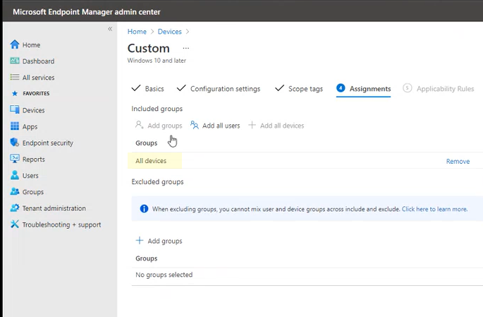

# <a name="enable-attack-surface-reduction-rules"></a><span data-ttu-id="a5e3a-104">Включить правила сокращения направлений атак</span><span class="sxs-lookup"><span data-stu-id="a5e3a-104">Enable attack surface reduction rules</span></span>

[!INCLUDE [Microsoft 365 Defender rebranding](../../includes/microsoft-defender.md)]

<span data-ttu-id="a5e3a-105">**Область применения:**</span><span class="sxs-lookup"><span data-stu-id="a5e3a-105">**Applies to:**</span></span>

- [<span data-ttu-id="a5e3a-106">Microsoft Defender для конечной точки</span><span class="sxs-lookup"><span data-stu-id="a5e3a-106">Microsoft Defender for Endpoint</span></span>](https://go.microsoft.com/fwlink/p/?linkid=2154037)
- [<span data-ttu-id="a5e3a-107">Microsoft 365 Defender</span><span class="sxs-lookup"><span data-stu-id="a5e3a-107">Microsoft 365 Defender</span></span>](https://go.microsoft.com/fwlink/?linkid=2118804)

> [!TIP]
> <span data-ttu-id="a5e3a-108">Хотите испытать Defender для конечной точки?</span><span class="sxs-lookup"><span data-stu-id="a5e3a-108">Want to experience Defender for Endpoint?</span></span> [<span data-ttu-id="a5e3a-109">Зарегистрився для бесплатной пробной.</span><span class="sxs-lookup"><span data-stu-id="a5e3a-109">Sign up for a free trial.</span></span>](https://www.microsoft.com/microsoft-365/windows/microsoft-defender-atp?ocid=docs-wdatp-assignaccess-abovefoldlink)

<span data-ttu-id="a5e3a-110">[Правила уменьшения поверхности](attack-surface-reduction.md) атаки (правила ASR) помогают предотвратить действия, которые вредоносные программы часто используют для компрометации устройств и сетей.</span><span class="sxs-lookup"><span data-stu-id="a5e3a-110">[Attack surface reduction rules](attack-surface-reduction.md) (ASR rules) help prevent actions that malware often abuses to compromise devices and networks.</span></span>

<span data-ttu-id="a5e3a-111">**Требования** Вы можете установить правила уменьшения поверхности атаки для устройств, которые работают с любыми из следующих выпусков и версий Windows:</span><span class="sxs-lookup"><span data-stu-id="a5e3a-111">**Requirements** You can set attack surface reduction rules for devices that are running any of the following editions and versions of Windows:</span></span>

- <span data-ttu-id="a5e3a-112">Windows 10 Pro версии [1709](/windows/whats-new/whats-new-windows-10-version-1709) или более поздней версии</span><span class="sxs-lookup"><span data-stu-id="a5e3a-112">Windows 10 Pro, [version 1709](/windows/whats-new/whats-new-windows-10-version-1709) or later</span></span>
- <span data-ttu-id="a5e3a-113">Windows 10 Корпоративная версии [1709](/windows/whats-new/whats-new-windows-10-version-1709) или более поздней версии</span><span class="sxs-lookup"><span data-stu-id="a5e3a-113">Windows 10 Enterprise, [version 1709](/windows/whats-new/whats-new-windows-10-version-1709) or later</span></span>
- <span data-ttu-id="a5e3a-114">Windows Сервер, [версия 1803 (полугодовой канал)](/windows-server/get-started/whats-new-in-windows-server-1803) или более поздний</span><span class="sxs-lookup"><span data-stu-id="a5e3a-114">Windows Server, [version 1803 (Semi-Annual Channel)](/windows-server/get-started/whats-new-in-windows-server-1803) or later</span></span>
- [<span data-ttu-id="a5e3a-115">Windows Server 2019</span><span class="sxs-lookup"><span data-stu-id="a5e3a-115">Windows Server 2019</span></span>](/windows-server/get-started-19/whats-new-19)

<span data-ttu-id="a5e3a-116">Хотя правила уменьшения поверхности атаки не требуют лицензии Windows E5, если у вас есть Windows [E5,](/windows/deployment/deploy-enterprise-licenses)вы получите расширенные возможности управления.</span><span class="sxs-lookup"><span data-stu-id="a5e3a-116">Although attack surface reduction rules don't require a [Windows E5 license](/windows/deployment/deploy-enterprise-licenses), if you have Windows E5, you get advanced management capabilities.</span></span> <span data-ttu-id="a5e3a-117">Эти возможности, доступные только в Windows E5, включают мониторинг, аналитику и рабочий процесс, доступные в [Defender для](/microsoft-365/security/defender-endpoint/microsoft-defender-endpoint?view=o365-worldwide&preserve-view=true)конечной точки, а также возможности отчетности и [конфигурации](/microsoft-365/security/defender/overview-security-center?view=o365-worldwide&preserve-view=true)в центре безопасности Microsoft 365 безопасности .</span><span class="sxs-lookup"><span data-stu-id="a5e3a-117">These capabilities available only in Windows E5 include monitoring, analytics, and workflows available in [Defender for Endpoint](/microsoft-365/security/defender-endpoint/microsoft-defender-endpoint?view=o365-worldwide&preserve-view=true), as well as reporting and configuration capabilities in the [Microsoft 365 security center](/microsoft-365/security/defender/overview-security-center?view=o365-worldwide&preserve-view=true).</span></span> <span data-ttu-id="a5e3a-118">Эти расширенные возможности недоступны с лицензией Windows Professional или Windows E3; Однако, если у вас есть эти лицензии, вы можете использовать журналы viewer и антивирусная программа в Microsoft Defender для просмотра событий правила уменьшения поверхности атаки.</span><span class="sxs-lookup"><span data-stu-id="a5e3a-118">These advanced capabilities aren't available with a Windows Professional or Windows E3 license; however, if you do have those licenses, you can use Event Viewer and Microsoft Defender Antivirus logs to review your attack surface reduction rule events.</span></span>

<span data-ttu-id="a5e3a-119">Каждое правило ASR содержит один из четырех параметров:</span><span class="sxs-lookup"><span data-stu-id="a5e3a-119">Each ASR rule contains one of four settings:</span></span>

- <span data-ttu-id="a5e3a-120">**Не настроен:** отключить правило ASR</span><span class="sxs-lookup"><span data-stu-id="a5e3a-120">**Not configured**: Disable the ASR rule</span></span>
- <span data-ttu-id="a5e3a-121">**Блок**: Включить правило ASR</span><span class="sxs-lookup"><span data-stu-id="a5e3a-121">**Block**: Enable the ASR rule</span></span>
- <span data-ttu-id="a5e3a-122">**Аудит.** Оцените, как правило ASR повлияет на организацию, если включено</span><span class="sxs-lookup"><span data-stu-id="a5e3a-122">**Audit**: Evaluate how the ASR rule would impact your organization if enabled</span></span>
- <span data-ttu-id="a5e3a-123">**Предупреждение.** Включить правило ASR, но разрешить конечному пользователю обойти блокировку</span><span class="sxs-lookup"><span data-stu-id="a5e3a-123">**Warn**: Enable the ASR rule but allow the end user to bypass the block</span></span>

> [!IMPORTANT]
> <span data-ttu-id="a5e3a-124">В настоящее время режим предупреждения не поддерживается для трех правил ASR при настройке правил ASR в Microsoft Endpoint Manager (MEM).</span><span class="sxs-lookup"><span data-stu-id="a5e3a-124">Currently, warn mode is not supported for three ASR rules when you configure ASR rules in Microsoft Endpoint Manager (MEM).</span></span> <span data-ttu-id="a5e3a-125">Дополнительные дополнительные информации см. [в том, как не](attack-surface-reduction.md#cases-where-warn-mode-is-not-supported)поддерживается режим предупреждения.</span><span class="sxs-lookup"><span data-stu-id="a5e3a-125">To learn more, see [Cases where warn mode is not supported](attack-surface-reduction.md#cases-where-warn-mode-is-not-supported).</span></span>

<span data-ttu-id="a5e3a-126">Настоятельно рекомендуется использовать правила ASR с лицензией Windows E5 (или аналогичный SKU лицензирования), чтобы воспользоваться расширенными возможностями мониторинга и отчетности, доступными в [Microsoft Defender for Endpoint](https://docs.microsoft.com/windows/security/threat-protection) (Defender for Endpoint).</span><span class="sxs-lookup"><span data-stu-id="a5e3a-126">It's highly recommended you use ASR rules with a Windows E5 license (or similar licensing SKU) to take advantage of the advanced monitoring and reporting capabilities available in [Microsoft Defender for Endpoint](https://docs.microsoft.com/windows/security/threat-protection) (Defender for Endpoint).</span></span> <span data-ttu-id="a5e3a-127">Однако для других лицензий, таких как Windows Professional или E3, которые не имеют доступа к расширенным возможностям мониторинга и отчетности, вы можете разработать собственные средства мониторинга и отчетности в верхней части событий, которые создаются в каждой конечной точке при запуске правил ASR (например, forwarding событий).</span><span class="sxs-lookup"><span data-stu-id="a5e3a-127">However, for other licenses like Windows Professional or E3 that don't have access to advanced monitoring and reporting capabilities, you can develop your own monitoring and reporting tools on top of the events that are generated at each endpoint when ASR rules are triggered (e.g., Event Forwarding).</span></span>

> [!TIP]
> <span data-ttu-id="a5e3a-128">Дополнительные дополнительные Windows см. Windows 10 [лицензирование](https://www.microsoft.com/licensing/product-licensing/windows10?activetab=windows10-pivot:primaryr5) и руководство по лицензированию томов [для Windows 10](https://download.microsoft.com/download/2/D/1/2D14FE17-66C2-4D4C-AF73-E122930B60F6/Windows-10-Volume-Licensing-Guide.pdf).</span><span class="sxs-lookup"><span data-stu-id="a5e3a-128">To learn more about Windows licensing, see [Windows 10 Licensing](https://www.microsoft.com/licensing/product-licensing/windows10?activetab=windows10-pivot:primaryr5) and get the [Volume Licensing guide for Windows 10](https://download.microsoft.com/download/2/D/1/2D14FE17-66C2-4D4C-AF73-E122930B60F6/Windows-10-Volume-Licensing-Guide.pdf).</span></span>

<span data-ttu-id="a5e3a-129">Вы можете включить правила уменьшения поверхности атаки с помощью любого из этих методов:</span><span class="sxs-lookup"><span data-stu-id="a5e3a-129">You can enable attack surface reduction rules by using any of these methods:</span></span>

- [<span data-ttu-id="a5e3a-130">Microsoft Intune</span><span class="sxs-lookup"><span data-stu-id="a5e3a-130">Microsoft Intune</span></span>](#intune)
- [<span data-ttu-id="a5e3a-131">Управление мобильными устройствами (MDM)</span><span class="sxs-lookup"><span data-stu-id="a5e3a-131">Mobile Device Management (MDM)</span></span>](#mdm)
- [<span data-ttu-id="a5e3a-132">Microsoft Endpoint Configuration Manager</span><span class="sxs-lookup"><span data-stu-id="a5e3a-132">Microsoft Endpoint Configuration Manager</span></span>](#microsoft-endpoint-configuration-manager)
- [<span data-ttu-id="a5e3a-133">Групповая политика</span><span class="sxs-lookup"><span data-stu-id="a5e3a-133">Group Policy</span></span>](#group-policy)
- [<span data-ttu-id="a5e3a-134">PowerShell</span><span class="sxs-lookup"><span data-stu-id="a5e3a-134">PowerShell</span></span>](#powershell)

<span data-ttu-id="a5e3a-135">Enterprise, например Intune или Microsoft Endpoint Manager, рекомендуется.</span><span class="sxs-lookup"><span data-stu-id="a5e3a-135">Enterprise-level management such as Intune or Microsoft Endpoint Manager is recommended.</span></span> <span data-ttu-id="a5e3a-136">Enterprise управления на уровне будет переписать любые противоречивые параметры групповой политики или PowerShell при запуске.</span><span class="sxs-lookup"><span data-stu-id="a5e3a-136">Enterprise-level management will overwrite any conflicting Group Policy or PowerShell settings on startup.</span></span>

## <a name="exclude-files-and-folders-from-asr-rules"></a><span data-ttu-id="a5e3a-137">Исключение файлов и папок из правил ASR</span><span class="sxs-lookup"><span data-stu-id="a5e3a-137">Exclude files and folders from ASR rules</span></span>

<span data-ttu-id="a5e3a-138">Вы можете исключить оценку файлов и папок большинством правил уменьшения поверхности атаки.</span><span class="sxs-lookup"><span data-stu-id="a5e3a-138">You can exclude files and folders from being evaluated by most attack surface reduction rules.</span></span> <span data-ttu-id="a5e3a-139">Это означает, что даже если правило ASR определяет файл или папку с вредоносным поведением, оно не будет блокировать работу файла.</span><span class="sxs-lookup"><span data-stu-id="a5e3a-139">This means that even if an ASR rule determines the file or folder contains malicious behavior, it will not block the file from running.</span></span> <span data-ttu-id="a5e3a-140">Это потенциально может позволить небезопасным файлам запускать и заражать устройства.</span><span class="sxs-lookup"><span data-stu-id="a5e3a-140">This could potentially allow unsafe files to run and infect your devices.</span></span>

<span data-ttu-id="a5e3a-141">Вы также можете исключить запуск правил ASR на основе хеш-файлов сертификатов и файлов, разрешив указанные индикаторы файла и сертификата Defender для конечной точки.</span><span class="sxs-lookup"><span data-stu-id="a5e3a-141">You can also exclude ASR rules from triggering based on certificate and file hashes by allowing specified Defender for Endpoint file and certificate indicators.</span></span> <span data-ttu-id="a5e3a-142">[(См. управление индикаторами.)](https://docs.microsoft.com/microsoft-365/security/defender-endpoint/manage-indicators)</span><span class="sxs-lookup"><span data-stu-id="a5e3a-142">(See [Manage indicators](https://docs.microsoft.com/microsoft-365/security/defender-endpoint/manage-indicators).)</span></span>

> [!IMPORTANT]
> <span data-ttu-id="a5e3a-143">Исключение файлов или папок может серьезно уменьшить защиту, предоставляемую правилами ASR.</span><span class="sxs-lookup"><span data-stu-id="a5e3a-143">Excluding files or folders can severely reduce the protection provided by ASR rules.</span></span> <span data-ttu-id="a5e3a-144">Исключенные файлы будут разрешены для запуска, и отчет или событие не будут записаны.</span><span class="sxs-lookup"><span data-stu-id="a5e3a-144">Excluded files will be allowed to run, and no report or event will be recorded.</span></span>
> <span data-ttu-id="a5e3a-145">Если правила ASR обнаруживают файлы, которые, как вы считаете, не следует обнаруживать, сначала следует использовать режим аудита для [проверки правила.](evaluate-attack-surface-reduction.md)</span><span class="sxs-lookup"><span data-stu-id="a5e3a-145">If ASR rules are detecting files that you believe shouldn't be detected, you should [use audit mode first to test the rule](evaluate-attack-surface-reduction.md).</span></span>

<span data-ttu-id="a5e3a-146">Вы можете указать отдельные файлы или папки (с помощью путей папок или полностью квалифицированных имен ресурсов), но вы не можете указать правила, к которым применяются исключения.</span><span class="sxs-lookup"><span data-stu-id="a5e3a-146">You can specify individual files or folders (using folder paths or fully qualified resource names), but you can't specify which rules the exclusions apply to.</span></span> <span data-ttu-id="a5e3a-147">Исключение применяется только при старте исключенного приложения или службы.</span><span class="sxs-lookup"><span data-stu-id="a5e3a-147">An exclusion is applied only when the excluded application or service starts.</span></span> <span data-ttu-id="a5e3a-148">Например, если добавлено исключение для уже запущенной службы обновления, служба обновления будет продолжать запускать события до тех пор, пока служба не будет остановлена и перезапущена.</span><span class="sxs-lookup"><span data-stu-id="a5e3a-148">For example, if you add an exclusion for an update service that is already running, the update service will continue to trigger events until the service is stopped and restarted.</span></span>

<span data-ttu-id="a5e3a-149">Правила ASR поддерживают переменные среды и подкарды.</span><span class="sxs-lookup"><span data-stu-id="a5e3a-149">ASR rules support environment variables and wildcards.</span></span> <span data-ttu-id="a5e3a-150">Сведения об использовании подмастерьев см. в материалах [Use wildcards in the file name and folder path or extension exclusion lists.](https://docs.microsoft.com/windows/security/threat-protection/microsoft-defender-antivirus/configure-extension-file-exclusions-microsoft-defender-antivirus#use-wildcards-in-the-file-name-and-folder-path-or-extension-exclusion-lists)</span><span class="sxs-lookup"><span data-stu-id="a5e3a-150">For information about using wildcards, see [Use wildcards in the file name and folder path or extension exclusion lists](https://docs.microsoft.com/windows/security/threat-protection/microsoft-defender-antivirus/configure-extension-file-exclusions-microsoft-defender-antivirus#use-wildcards-in-the-file-name-and-folder-path-or-extension-exclusion-lists).</span></span>

<span data-ttu-id="a5e3a-151">Следующие процедуры включения правил ASR включают инструкции по исключению файлов и папок.</span><span class="sxs-lookup"><span data-stu-id="a5e3a-151">The following procedures for enabling ASR rules include instructions for how to exclude files and folders.</span></span>

## <a name="intune"></a><span data-ttu-id="a5e3a-152">Intune</span><span class="sxs-lookup"><span data-stu-id="a5e3a-152">Intune</span></span>

1. <span data-ttu-id="a5e3a-153">Выберите **профили**  >  **конфигурации устройств.**</span><span class="sxs-lookup"><span data-stu-id="a5e3a-153">Select **Device configuration** > **Profiles**.</span></span> <span data-ttu-id="a5e3a-154">Выберите существующий профиль защиты конечной точки или создайте новый.</span><span class="sxs-lookup"><span data-stu-id="a5e3a-154">Choose an existing endpoint protection profile or create a new one.</span></span> <span data-ttu-id="a5e3a-155">Чтобы создать новый, выберите **Создать профиль** и ввести сведения для этого профиля.</span><span class="sxs-lookup"><span data-stu-id="a5e3a-155">To create a new one, select **Create profile** and enter information for this profile.</span></span> <span data-ttu-id="a5e3a-156">Для **типа профиля** выберите защиту **конечных точек.**</span><span class="sxs-lookup"><span data-stu-id="a5e3a-156">For **Profile type**, select **Endpoint protection**.</span></span> <span data-ttu-id="a5e3a-157">Если вы выбрали существующий профиль, выберите **свойства** и **выберите** Параметры.</span><span class="sxs-lookup"><span data-stu-id="a5e3a-157">If you've chosen an existing profile, select **Properties** and then select **Settings**.</span></span>

2. <span data-ttu-id="a5e3a-158">В области **защиты конечной** точки выберите Защитник Windows **Exploit Guard,** а затем выберите **сокращение поверхности атаки.**</span><span class="sxs-lookup"><span data-stu-id="a5e3a-158">In the **Endpoint protection** pane, select **Windows Defender Exploit Guard**, then select **Attack Surface Reduction**.</span></span> <span data-ttu-id="a5e3a-159">Выберите нужный параметр для каждого правила ASR.</span><span class="sxs-lookup"><span data-stu-id="a5e3a-159">Select the desired setting for each ASR rule.</span></span>

3. <span data-ttu-id="a5e3a-160">В **соответствии с исключениями для** уменьшения поверхности атаки введите отдельные файлы и папки.</span><span class="sxs-lookup"><span data-stu-id="a5e3a-160">Under **Attack Surface Reduction exceptions**, enter individual files and folders.</span></span> <span data-ttu-id="a5e3a-161">Вы также можете выбрать **Импорт для** импорта CSV-файла, который содержит файлы и папки, чтобы исключить из правил ASR.</span><span class="sxs-lookup"><span data-stu-id="a5e3a-161">You can also select **Import** to import a CSV file that contains files and folders to exclude from ASR rules.</span></span> <span data-ttu-id="a5e3a-162">Каждая строка в CSV-файле должна быть отформатирована следующим образом:</span><span class="sxs-lookup"><span data-stu-id="a5e3a-162">Each line in the CSV file should be formatted as follows:</span></span>

   <span data-ttu-id="a5e3a-163">`C:\folder`, `%ProgramFiles%\folder\file`, `C:\path`</span><span class="sxs-lookup"><span data-stu-id="a5e3a-163">`C:\folder`, `%ProgramFiles%\folder\file`, `C:\path`</span></span>

4. <span data-ttu-id="a5e3a-164">Выберите **ОК** на трех стемнах конфигурации.</span><span class="sxs-lookup"><span data-stu-id="a5e3a-164">Select **OK** on the three configuration panes.</span></span> <span data-ttu-id="a5e3a-165">Затем выберите **Создать,** если вы создаете новый файл защиты конечной точки или **сохраните,** если вы редактируете существующий.</span><span class="sxs-lookup"><span data-stu-id="a5e3a-165">Then select **Create** if you're creating a new endpoint protection file or **Save** if you're editing an existing one.</span></span>

## <a name="mdm"></a><span data-ttu-id="a5e3a-166">MDM</span><span class="sxs-lookup"><span data-stu-id="a5e3a-166">MDM</span></span>

<span data-ttu-id="a5e3a-167">Используйте [поставщика служб конфигурации ./Vendor/MSFT/Policy/Config/Defender/AttackSurfaceReductionRules](https://docs.microsoft.com/windows/client-management/mdm/policy-csp-defender#defender-attacksurfacereductionrules) для индивидуального включить и задать режим для каждого правила.</span><span class="sxs-lookup"><span data-stu-id="a5e3a-167">Use the [./Vendor/MSFT/Policy/Config/Defender/AttackSurfaceReductionRules](https://docs.microsoft.com/windows/client-management/mdm/policy-csp-defender#defender-attacksurfacereductionrules) configuration service provider (CSP) to individually enable and set the mode for each rule.</span></span>

<span data-ttu-id="a5e3a-168">Ниже приводится пример для справки с использованием [значений GUID для правил ASR.](attack-surface-reduction.md#attack-surface-reduction-rules)</span><span class="sxs-lookup"><span data-stu-id="a5e3a-168">The following is a sample for reference, using [GUID values for ASR rules](attack-surface-reduction.md#attack-surface-reduction-rules).</span></span>

`OMA-URI path: ./Vendor/MSFT/Policy/Config/Defender/AttackSurfaceReductionRules`

`Value: 75668C1F-73B5-4CF0-BB93-3ECF5CB7CC84=2|3B576869-A4EC-4529-8536-B80A7769E899=1|D4F940AB-401B-4EfC-AADC-AD5F3C50688A=2|D3E037E1-3EB8-44C8-A917-57927947596D=1|5BEB7EFE-FD9A-4556-801D-275E5FFC04CC=0|BE9BA2D9-53EA-4CDC-84E5-9B1EEEE46550=1`

<span data-ttu-id="a5e3a-169">Значения, которые необходимо включить (Block), отключить, предупредить или включить в режиме аудита:</span><span class="sxs-lookup"><span data-stu-id="a5e3a-169">The values to enable (Block), disable, warn, or enable in audit mode are:</span></span>

- <span data-ttu-id="a5e3a-170">0. Отключение (отключение правила ASR)</span><span class="sxs-lookup"><span data-stu-id="a5e3a-170">0 : Disable (Disable the ASR rule)</span></span>
- <span data-ttu-id="a5e3a-171">1. Блок (Включить правило ASR)</span><span class="sxs-lookup"><span data-stu-id="a5e3a-171">1 : Block (Enable the ASR rule)</span></span>
- <span data-ttu-id="a5e3a-172">2. Аудит (Оцените, как правило ASR повлияет на организацию, если включено)</span><span class="sxs-lookup"><span data-stu-id="a5e3a-172">2 : Audit (Evaluate how the ASR rule would impact your organization if enabled)</span></span>
- <span data-ttu-id="a5e3a-173">6. Предупреждение (Включить правило ASR, но разрешить конечному пользователю обойти блок).</span><span class="sxs-lookup"><span data-stu-id="a5e3a-173">6 : Warn  (Enable the ASR rule but allow the end-user to bypass the block).</span></span> <span data-ttu-id="a5e3a-174">Режим Warn теперь доступен для большинства правил ASR.</span><span class="sxs-lookup"><span data-stu-id="a5e3a-174">Warn mode is now available for most of the ASR rules.</span></span>

<span data-ttu-id="a5e3a-175">Для добавления исключений используйте поставщика служб конфигурации [./Vendor/MSFT/Policy/Config/Defender/AttackSurfaceReductionOnlyExclusions.](https://docs.microsoft.com/windows/client-management/mdm/policy-csp-defender#defender-attacksurfacereductiononlyexclusions)</span><span class="sxs-lookup"><span data-stu-id="a5e3a-175">Use the [./Vendor/MSFT/Policy/Config/Defender/AttackSurfaceReductionOnlyExclusions](https://docs.microsoft.com/windows/client-management/mdm/policy-csp-defender#defender-attacksurfacereductiononlyexclusions) configuration service provider (CSP) to add exclusions.</span></span>

<span data-ttu-id="a5e3a-176">Пример:</span><span class="sxs-lookup"><span data-stu-id="a5e3a-176">Example:</span></span>

`OMA-URI path: ./Vendor/MSFT/Policy/Config/Defender/AttackSurfaceReductionOnlyExclusions`

`Value: c:\path|e:\path|c:\Exclusions.exe`

> [!NOTE]
> <span data-ttu-id="a5e3a-177">Обязательно введите значения OMA-URI без пробелов.</span><span class="sxs-lookup"><span data-stu-id="a5e3a-177">Be sure to enter OMA-URI values without spaces.</span></span>

## <a name="microsoft-endpoint-configuration-manager"></a><span data-ttu-id="a5e3a-178">Microsoft Endpoint Configuration Manager</span><span class="sxs-lookup"><span data-stu-id="a5e3a-178">Microsoft Endpoint Configuration Manager</span></span>

1. <span data-ttu-id="a5e3a-179">В Microsoft Endpoint Configuration Manager перейдите в **службу Assets and Compliance**  >  **Endpoint Protection** Защитник Windows  >  **Exploit Guard**.</span><span class="sxs-lookup"><span data-stu-id="a5e3a-179">In Microsoft Endpoint Configuration Manager, go to **Assets and Compliance** > **Endpoint Protection** > **Windows Defender Exploit Guard**.</span></span>

2. <span data-ttu-id="a5e3a-180">Выберите   >  **домашнее создание политики защиты от эксплойтов**.</span><span class="sxs-lookup"><span data-stu-id="a5e3a-180">Select **Home** > **Create Exploit Guard Policy**.</span></span>

3. <span data-ttu-id="a5e3a-181">Введите имя и описание, выберите **сокращение поверхности атаки** и выберите **Далее.**</span><span class="sxs-lookup"><span data-stu-id="a5e3a-181">Enter a name and a description, select **Attack Surface Reduction**, and select **Next**.</span></span>

4. <span data-ttu-id="a5e3a-182">Выберите правила, которые будут блокировать действия или аудит, и выберите **Далее**.</span><span class="sxs-lookup"><span data-stu-id="a5e3a-182">Choose which rules will block or audit actions and select **Next**.</span></span>

5. <span data-ttu-id="a5e3a-183">Просмотрите параметры и выберите **Далее,** чтобы создать политику.</span><span class="sxs-lookup"><span data-stu-id="a5e3a-183">Review the settings and select **Next** to create the policy.</span></span>

6. <span data-ttu-id="a5e3a-184">После создания политики **закрой**.</span><span class="sxs-lookup"><span data-stu-id="a5e3a-184">After the policy is created, **Close**.</span></span>

## <a name="group-policy"></a><span data-ttu-id="a5e3a-185">Групповая политика</span><span class="sxs-lookup"><span data-stu-id="a5e3a-185">Group Policy</span></span>

> [!WARNING]
> <span data-ttu-id="a5e3a-186">Если управлять компьютерами и устройствами с помощью Intune, Configuration Manager или другой платформы управления на корпоративном уровне, программное обеспечение управления перезаписает все противоречивые параметры групповой политики при запуске.</span><span class="sxs-lookup"><span data-stu-id="a5e3a-186">If you manage your computers and devices with Intune, Configuration Manager, or other enterprise-level management platform, the management software will overwrite any conflicting Group Policy settings on startup.</span></span>

1. <span data-ttu-id="a5e3a-187">Для этого на компьютере, управляющем групповыми политиками, откройте [Консоль управления групповой политикой](https://technet.microsoft.com/library/cc731212.aspx), щелкните правой кнопкой мыши нужный объект групповой политики и выберите **Изменить**.</span><span class="sxs-lookup"><span data-stu-id="a5e3a-187">On your Group Policy management computer, open the [Group Policy Management Console](https://technet.microsoft.com/library/cc731212.aspx), right-click the Group Policy Object you want to configure and select **Edit**.</span></span>

2. <span data-ttu-id="a5e3a-188">В **редакторе управления групповыми политиками** перейдите к **конфигурации компьютера** и выберите **Административные шаблоны**.</span><span class="sxs-lookup"><span data-stu-id="a5e3a-188">In the **Group Policy Management Editor**, go to **Computer configuration** and select **Administrative templates**.</span></span>

3. <span data-ttu-id="a5e3a-189">Расширь **дерево, Windows компоненты антивирусная программа в Microsoft Defender**  >    >  **Exploit Guard в Microsoft Defender**  >  **атаки.**</span><span class="sxs-lookup"><span data-stu-id="a5e3a-189">Expand the tree to **Windows components** > **Microsoft Defender Antivirus** > **Microsoft Defender Exploit Guard** > **Attack surface reduction**.</span></span>

4. <span data-ttu-id="a5e3a-190">Выберите **Настройка правил уменьшения поверхности атаки и** выберите **Включено.**</span><span class="sxs-lookup"><span data-stu-id="a5e3a-190">Select **Configure Attack surface reduction rules** and select **Enabled**.</span></span> <span data-ttu-id="a5e3a-191">Затем можно установить отдельное состояние для каждого правила в разделе параметры.</span><span class="sxs-lookup"><span data-stu-id="a5e3a-191">You can then set the individual state for each rule in the options section.</span></span>

   <span data-ttu-id="a5e3a-192">Выберите **Показать...** и введите ID правила в столбце **Имя** значения и выбранное состояние в столбце **Значение** следующим образом:</span><span class="sxs-lookup"><span data-stu-id="a5e3a-192">Select **Show...** and enter the rule ID in the **Value name** column and your chosen state in the **Value** column as follows:</span></span>

   - <span data-ttu-id="a5e3a-193">0. Отключение (отключение правила ASR)</span><span class="sxs-lookup"><span data-stu-id="a5e3a-193">0 : Disable (Disable the ASR rule)</span></span>
   - <span data-ttu-id="a5e3a-194">1. Блок (Включить правило ASR)</span><span class="sxs-lookup"><span data-stu-id="a5e3a-194">1 : Block (Enable the ASR rule)</span></span>
   - <span data-ttu-id="a5e3a-195">2. Аудит (Оцените, как правило ASR повлияет на организацию, если включено)</span><span class="sxs-lookup"><span data-stu-id="a5e3a-195">2 : Audit (Evaluate how the ASR rule would impact your organization if enabled)</span></span>
   - <span data-ttu-id="a5e3a-196">6. Предупреждение (Включить правило ASR, но разрешить конечному пользователю обойти блок)</span><span class="sxs-lookup"><span data-stu-id="a5e3a-196">6 : Warn  (Enable the ASR rule but allow the end-user to bypass the block)</span></span>

   :::image type="content" source="images/asr-rules-gp.png" alt-text="Правила ASR в групповой политике":::

5. <span data-ttu-id="a5e3a-198">Чтобы исключить файлы и папки из правил ASR, выберите исключить файлы и пути из настройки правил уменьшения поверхности **Атаки** и установите параметр **Включено**.</span><span class="sxs-lookup"><span data-stu-id="a5e3a-198">To exclude files and folders from ASR rules, select the **Exclude files and paths from Attack surface reduction rules** setting and set the option to **Enabled**.</span></span> <span data-ttu-id="a5e3a-199">Выберите **Показать и** ввести каждый файл или папку в столбце Имя **значения.**</span><span class="sxs-lookup"><span data-stu-id="a5e3a-199">Select **Show** and enter each file or folder in the **Value name** column.</span></span> <span data-ttu-id="a5e3a-200">Введите **0** в **столбце Значение** для каждого элемента.</span><span class="sxs-lookup"><span data-stu-id="a5e3a-200">Enter **0** in the **Value** column for each item.</span></span>

   > [!WARNING]
   > <span data-ttu-id="a5e3a-201">Не используйте кавычка, так как они не поддерживаются ни для столбца **value name,** ни для **столбца Value.**</span><span class="sxs-lookup"><span data-stu-id="a5e3a-201">Do not use quotes as they are not supported for either the **Value name** column or the **Value** column.</span></span>

## <a name="microsoft-endpoint-manager-custom-procedure"></a><span data-ttu-id="a5e3a-202">Microsoft Endpoint Manager настраиваемой процедуры</span><span class="sxs-lookup"><span data-stu-id="a5e3a-202">Microsoft Endpoint Manager custom procedure</span></span>

<span data-ttu-id="a5e3a-203">Вы можете использовать центр администрирования Microsoft Endpoint Manager (MEM) для настройки настраиваемых правил ASR.</span><span class="sxs-lookup"><span data-stu-id="a5e3a-203">You can use a Microsoft Endpoint Manager (MEM) admin center to configure custom ASR rules.</span></span>

1. <span data-ttu-id="a5e3a-204">Откройте центр администрирования Microsoft Endpoint Manager (MEM).</span><span class="sxs-lookup"><span data-stu-id="a5e3a-204">Open the Microsoft Endpoint Manager (MEM) admin center.</span></span> <span data-ttu-id="a5e3a-205">В **домашнем меню** нажмите  **кнопку Устройства,** выберите **профиль конфигурации** и нажмите **кнопку Создать профиль**.</span><span class="sxs-lookup"><span data-stu-id="a5e3a-205">In the **Home** menu, click  **Devices**, select **Configuration profile**, and then click **Create profile**.</span></span>

   

2. <span data-ttu-id="a5e3a-207">В **"Создание профиля"** в следующих двух списках выпадаемой части выберите следующее:</span><span class="sxs-lookup"><span data-stu-id="a5e3a-207">In **Create a profile**, in the following two drop-down lists, select the following:</span></span>

   - <span data-ttu-id="a5e3a-208">В **Платформе** выберите Windows 10 **и более поздней**</span><span class="sxs-lookup"><span data-stu-id="a5e3a-208">In **Platform**, select **Windows 10 and later**</span></span>
   - <span data-ttu-id="a5e3a-209">В **типе profile** выберите **Шаблоны**</span><span class="sxs-lookup"><span data-stu-id="a5e3a-209">In **Profile type**, select **Templates**</span></span>

   <span data-ttu-id="a5e3a-210">Выберите **настраиваемый,** а затем нажмите **кнопку Создать**.</span><span class="sxs-lookup"><span data-stu-id="a5e3a-210">Select **Custom**, and then click **Create**.</span></span>

   

3. <span data-ttu-id="a5e3a-212">Настраиваемый инструмент шаблона открывается для шага **1 Basics**.</span><span class="sxs-lookup"><span data-stu-id="a5e3a-212">The Custom template tool opens to step **1 Basics**.</span></span> <span data-ttu-id="a5e3a-213">В **1 Basics,** in **Name** введите имя шаблона, а в **Описании** можно ввести описание (необязательно).</span><span class="sxs-lookup"><span data-stu-id="a5e3a-213">In **1 Basics**, in **Name**, type a name for your template, and in **Description** you can type a description (optional ).</span></span>

   

4. <span data-ttu-id="a5e3a-215">Нажмите **Далее**.</span><span class="sxs-lookup"><span data-stu-id="a5e3a-215">Click **Next**.</span></span> <span data-ttu-id="a5e3a-216">Параметры **конфигурации шага 2 открываются.**</span><span class="sxs-lookup"><span data-stu-id="a5e3a-216">Step **2 Configuration settings** opens.</span></span> <span data-ttu-id="a5e3a-217">Для OMA-URI Параметры нажмите **кнопку Добавить**.</span><span class="sxs-lookup"><span data-stu-id="a5e3a-217">For OMA-URI Settings, click **Add**.</span></span> <span data-ttu-id="a5e3a-218">Теперь отображаются два варианта: **Добавить и** **экспортировать**.</span><span class="sxs-lookup"><span data-stu-id="a5e3a-218">Two options now appear: **Add** and **Export**.</span></span>

   

5. <span data-ttu-id="a5e3a-220">Щелкните **Добавить** еще раз.</span><span class="sxs-lookup"><span data-stu-id="a5e3a-220">Click **Add** again.</span></span> <span data-ttu-id="a5e3a-221">Откроется **добавление строки OMA-URI Параметры.**</span><span class="sxs-lookup"><span data-stu-id="a5e3a-221">The **Add Row OMA-URI Settings** opens.</span></span> <span data-ttu-id="a5e3a-222">В **строке Добавить** строку сделайте следующее:</span><span class="sxs-lookup"><span data-stu-id="a5e3a-222">In **Add Row**, do the following:</span></span>

   - <span data-ttu-id="a5e3a-223">В **Name** введите имя правила.</span><span class="sxs-lookup"><span data-stu-id="a5e3a-223">In **Name**, type a name for the rule.</span></span>
   - <span data-ttu-id="a5e3a-224">В **описании** введите краткое описание.</span><span class="sxs-lookup"><span data-stu-id="a5e3a-224">In **Description**, type a brief description.</span></span>
   - <span data-ttu-id="a5e3a-225">В **OMA-URI** введите или введите определенную ссылку OMA-URI для правила, которое вы добавляете.</span><span class="sxs-lookup"><span data-stu-id="a5e3a-225">In **OMA-URI**, type or paste the specific OMA-URI link for the rule that you are adding.</span></span>
   - <span data-ttu-id="a5e3a-226">В **типе Data** выберите **строку**.</span><span class="sxs-lookup"><span data-stu-id="a5e3a-226">In **Data type**, select **String**.</span></span>
   - <span data-ttu-id="a5e3a-227">В **Значение**, введите или введите значение GUID, знак и значение состояния без пробелов \= _(GUID=StateValue)._</span><span class="sxs-lookup"><span data-stu-id="a5e3a-227">In **Value**, type or paste the GUID value, the \= sign and the State value with no spaces (_GUID=StateValue_).</span></span> <span data-ttu-id="a5e3a-228">Где: {0: Отключение (Отключите правило ASR)}, {1: Блок (Включить правило ASR)}, {2: Аудит (Оценка влияния правила ASR на организацию при включении)}, {6 : Предупреждение (Включить правило ASR, но разрешить конечному пользователю обойти блокировку)}</span><span class="sxs-lookup"><span data-stu-id="a5e3a-228">Where: {0 : Disable (Disable the ASR rule)}, {1 : Block (Enable the ASR rule)}, {2 : Audit (Evaluate how the ASR rule would impact your organization if enabled)}, {6 : Warn (Enable the ASR rule but allow the end-user to bypass the block)}</span></span>

   

6. <span data-ttu-id="a5e3a-230">Нажмите кнопку **Сохранить**.</span><span class="sxs-lookup"><span data-stu-id="a5e3a-230">Click **Save**.</span></span> <span data-ttu-id="a5e3a-231">**Добавление строки** закрывается.</span><span class="sxs-lookup"><span data-stu-id="a5e3a-231">**Add Row** closes.</span></span> <span data-ttu-id="a5e3a-232">В **настраиваемом**, нажмите **кнопку Далее**.</span><span class="sxs-lookup"><span data-stu-id="a5e3a-232">In **Custom**, click **Next**.</span></span> <span data-ttu-id="a5e3a-233">В **тегах 3 Scope** теги области необязательны.</span><span class="sxs-lookup"><span data-stu-id="a5e3a-233">In step **3 Scope tags**, scope tags are optional.</span></span> <span data-ttu-id="a5e3a-234">Выполните одно из следующих действий.</span><span class="sxs-lookup"><span data-stu-id="a5e3a-234">Do one of the following:</span></span>

   - <span data-ttu-id="a5e3a-235">Нажмите **кнопку Выберите теги Область,** выберите тег области (необязательный), а затем нажмите **кнопку Далее**.</span><span class="sxs-lookup"><span data-stu-id="a5e3a-235">Click **Select Scope tags**, select the scope tag (optional) and then click **Next**.</span></span>
   - <span data-ttu-id="a5e3a-236">Или нажмите **кнопку Далее**</span><span class="sxs-lookup"><span data-stu-id="a5e3a-236">Or click **Next**</span></span>

7. <span data-ttu-id="a5e3a-237">В **шаге 4 Назначения** в включенных группах **для** групп, которые необходимо применить это правило, выберите из следующих параметров:</span><span class="sxs-lookup"><span data-stu-id="a5e3a-237">In step **4 Assignments**, in **Included Groups** - for the groups that you want this rule to apply - select from the following options:</span></span>

   - <span data-ttu-id="a5e3a-238">**Добавление групп**</span><span class="sxs-lookup"><span data-stu-id="a5e3a-238">**Add groups**</span></span>
   - <span data-ttu-id="a5e3a-239">**Добавление всех пользователей**</span><span class="sxs-lookup"><span data-stu-id="a5e3a-239">**Add all users**</span></span>
   - <span data-ttu-id="a5e3a-240">**Добавление всех устройств**</span><span class="sxs-lookup"><span data-stu-id="a5e3a-240">**Add all devices**</span></span>

   

8. <span data-ttu-id="a5e3a-242">В **исключенных группах** выберите все группы, которые необходимо исключить из этого правила, а затем нажмите **кнопку Далее**.</span><span class="sxs-lookup"><span data-stu-id="a5e3a-242">In **Excluded groups**, select any groups that you want to exclude from this rule, and then click **Next**.</span></span>

9. <span data-ttu-id="a5e3a-243">В **шаге 5 Правила применимости** для следующих параметров сделайте следующее:</span><span class="sxs-lookup"><span data-stu-id="a5e3a-243">In step **5 Applicability Rules** for the following settings, do the following:</span></span>

   - <span data-ttu-id="a5e3a-244">В **правиле** выберите либо **Назначение профиля, если**, или не **назначать профиль, если**</span><span class="sxs-lookup"><span data-stu-id="a5e3a-244">In **Rule**, select either **Assign profile if**, or **Don’t assign profile if**</span></span>
   - <span data-ttu-id="a5e3a-245">В **Свойстве** выберите свойство, к которому необходимо применить это правило</span><span class="sxs-lookup"><span data-stu-id="a5e3a-245">In **Property**, select the property to which you want this rule to apply</span></span>
   - <span data-ttu-id="a5e3a-246">В **Value** введите применимое значение или диапазон значений</span><span class="sxs-lookup"><span data-stu-id="a5e3a-246">In **Value**, enter the applicable value or value range</span></span>

   

10. <span data-ttu-id="a5e3a-248">Нажмите **Далее**.</span><span class="sxs-lookup"><span data-stu-id="a5e3a-248">Click **Next**.</span></span> <span data-ttu-id="a5e3a-249">В **шаге 6 Обзор + создание**, просмотрите параметры и сведения, которые вы выбрали и ввели, а затем нажмите **кнопку Создать**.</span><span class="sxs-lookup"><span data-stu-id="a5e3a-249">In step **6 Review + create**, review the settings and information you have selected and entered, and then click **Create**.</span></span>

   

>[!NOTE]
> <span data-ttu-id="a5e3a-251">Правила активны и действуют в течение нескольких минут.</span><span class="sxs-lookup"><span data-stu-id="a5e3a-251">Rules are active and live within minutes.</span></span>

>[!NOTE]
> <span data-ttu-id="a5e3a-252">Обработка конфликтов. Если назначить устройству две разные политики ASR, способ обработки конфликта — это правила, назначающие различные состояния, не существует управления конфликтами, и в результате происходит ошибка.</span><span class="sxs-lookup"><span data-stu-id="a5e3a-252">Conflict handling: If you assign a device two different ASR policies, the way conflict is handled is rules that are assigned different states, there is no conflict management in place, and the result is an error.</span></span>
> <span data-ttu-id="a5e3a-253">Неконфликтные правила не привнося ошибку, и правило будет применяться правильно.</span><span class="sxs-lookup"><span data-stu-id="a5e3a-253">Non-conflicting rules will not result in an error, and the rule will be applied correctly.</span></span> <span data-ttu-id="a5e3a-254">В результате применяется первое правило и последующие правила, не конфликтующие, объединяются в политику.</span><span class="sxs-lookup"><span data-stu-id="a5e3a-254">The result is that the first rule is applied, and subsequent non-conflicting rules are merged into the policy.</span></span>

## <a name="powershell"></a><span data-ttu-id="a5e3a-255">PowerShell</span><span class="sxs-lookup"><span data-stu-id="a5e3a-255">PowerShell</span></span>

> [!WARNING]
> <span data-ttu-id="a5e3a-256">Если управлять компьютерами и устройствами с помощью Intune, Configuration Manager или другой платформы управления на корпоративном уровне, программное обеспечение управления перезаписает все противоречивые параметры PowerShell при запуске.</span><span class="sxs-lookup"><span data-stu-id="a5e3a-256">If you manage your computers and devices with Intune, Configuration Manager, or another enterprise-level management platform, the management software will overwrite any conflicting PowerShell settings on startup.</span></span> <span data-ttu-id="a5e3a-257">Чтобы разрешить пользователям определять значение с помощью PowerShell, используйте параметр "User Defined" для правила в платформе управления.</span><span class="sxs-lookup"><span data-stu-id="a5e3a-257">To allow users to define the value using PowerShell, use the "User Defined" option for the rule in the management platform.</span></span>

1. <span data-ttu-id="a5e3a-258">Введите **powershell** в меню Пуск, щелкните правой кнопкой мыши **Windows PowerShell** выберите **Выполнить в качестве администратора**.</span><span class="sxs-lookup"><span data-stu-id="a5e3a-258">Type **powershell** in the Start menu, right-click **Windows PowerShell** and select **Run as administrator**.</span></span>

2. <span data-ttu-id="a5e3a-259">Введите следующий cmdlet:</span><span class="sxs-lookup"><span data-stu-id="a5e3a-259">Type the following cmdlet:</span></span>

    ```PowerShell
    Set-MpPreference -AttackSurfaceReductionRules_Ids <rule ID> -AttackSurfaceReductionRules_Actions Enabled
    ```

    <span data-ttu-id="a5e3a-260">Чтобы включить правила ASR в режиме аудита, используйте следующий cmdlet:</span><span class="sxs-lookup"><span data-stu-id="a5e3a-260">To enable ASR rules in audit mode, use the following cmdlet:</span></span>

    ```PowerShell
    Add-MpPreference -AttackSurfaceReductionRules_Ids <rule ID> -AttackSurfaceReductionRules_Actions AuditMode
    ```

    <span data-ttu-id="a5e3a-261">Чтобы включить правила ASR в режиме предупреждения, используйте следующий cmdlet:</span><span class="sxs-lookup"><span data-stu-id="a5e3a-261">To enable ASR rules in warn mode, use the following cmdlet:</span></span>

    ```PowerShell
    Add-MpPreference -AttackSurfaceReductionRules_Ids <rule ID> -AttackSurfaceReductionRules_Actions Warn
    ```

    <span data-ttu-id="a5e3a-262">Чтобы включить злоупотребление asR Block для эксплуатируемого уязвимого подписанного драйвера, используйте следующий cmdlet:</span><span class="sxs-lookup"><span data-stu-id="a5e3a-262">To enable ASR Block abuse of exploited vulnerable signed drivers, use the following cmdlet:</span></span>

   ```PowerShell
   "& {&'Add-MpPreference' -AttackSurfaceReductionRules_Ids 56a863a9-875e-4185-98a7-b882c64b5ce5 -AttackSurfaceReductionRules_Actions Enabled"}
   ```

    <span data-ttu-id="a5e3a-263">Чтобы отключить правила ASR, используйте следующий cmdlet:</span><span class="sxs-lookup"><span data-stu-id="a5e3a-263">To turn off ASR rules, use the following cmdlet:</span></span>

    ```PowerShell
    Add-MpPreference -AttackSurfaceReductionRules_Ids <rule ID> -AttackSurfaceReductionRules_Actions Disabled
    ```

    > [!IMPORTANT]
    > <span data-ttu-id="a5e3a-264">Необходимо указать состояние отдельно для каждого правила, но можно объединить правила и состояния в отдельном списке запятой.</span><span class="sxs-lookup"><span data-stu-id="a5e3a-264">You must specify the state individually for each rule, but you can combine rules and states in a comma-separated list.</span></span>
    >
    > <span data-ttu-id="a5e3a-265">В следующем примере будут включены первые два правила, третье правило будет отключено, а четвертое правило будет включено в режиме аудита:</span><span class="sxs-lookup"><span data-stu-id="a5e3a-265">In the following example, the first two rules will be enabled, the third rule will be disabled, and the fourth rule will be enabled in audit mode:</span></span>
    >
    > ```PowerShell
    > Set-MpPreference -AttackSurfaceReductionRules_Ids <rule ID 1>,<rule ID 2>,<rule ID 3>,<rule ID 4> -AttackSurfaceReductionRules_Actions Enabled, Enabled, Disabled, AuditMode
    > ```

    <span data-ttu-id="a5e3a-266">Для добавления новых правил в существующий список можно также использовать глагол `Add-MpPreference` PowerShell.</span><span class="sxs-lookup"><span data-stu-id="a5e3a-266">You can also use the `Add-MpPreference` PowerShell verb to add new rules to the existing list.</span></span>

    > [!WARNING]
    > <span data-ttu-id="a5e3a-267">`Set-MpPreference` всегда переопишет существующий набор правил.</span><span class="sxs-lookup"><span data-stu-id="a5e3a-267">`Set-MpPreference` will always overwrite the existing set of rules.</span></span> <span data-ttu-id="a5e3a-268">Если вы хотите добавить к существующему набору, используйте `Add-MpPreference` вместо этого.</span><span class="sxs-lookup"><span data-stu-id="a5e3a-268">If you want to add to the existing set, use `Add-MpPreference` instead.</span></span>
    > <span data-ttu-id="a5e3a-269">Вы можете получить список правил и их текущего состояния с помощью `Get-MpPreference` .</span><span class="sxs-lookup"><span data-stu-id="a5e3a-269">You can obtain a list of rules and their current state by using `Get-MpPreference`.</span></span>

3. <span data-ttu-id="a5e3a-270">Чтобы исключить файлы и папки из правил ASR, используйте следующий cmdlet:</span><span class="sxs-lookup"><span data-stu-id="a5e3a-270">To exclude files and folders from ASR rules, use the following cmdlet:</span></span>

    ```PowerShell
    Add-MpPreference -AttackSurfaceReductionOnlyExclusions "<fully qualified path or resource>"
    ```

    <span data-ttu-id="a5e3a-271">Продолжайте использовать для добавления в список дополнительных файлов `Add-MpPreference -AttackSurfaceReductionOnlyExclusions` и папок.</span><span class="sxs-lookup"><span data-stu-id="a5e3a-271">Continue to use `Add-MpPreference -AttackSurfaceReductionOnlyExclusions` to add more files and folders to the list.</span></span>

    > [!IMPORTANT]
    > <span data-ttu-id="a5e3a-272">Используйте `Add-MpPreference` для добавления или добавления приложений в список.</span><span class="sxs-lookup"><span data-stu-id="a5e3a-272">Use `Add-MpPreference` to append or add apps to the list.</span></span> <span data-ttu-id="a5e3a-273">С помощью `Set-MpPreference` этого комлета будет переописывать существующий список.</span><span class="sxs-lookup"><span data-stu-id="a5e3a-273">Using the `Set-MpPreference` cmdlet will overwrite the existing list.</span></span>

## <a name="related-articles"></a><span data-ttu-id="a5e3a-274">Связанные статьи</span><span class="sxs-lookup"><span data-stu-id="a5e3a-274">Related articles</span></span>

- [<span data-ttu-id="a5e3a-275">Уменьшение поверхностей атаки с помощью правил уменьшения поверхности атаки</span><span class="sxs-lookup"><span data-stu-id="a5e3a-275">Reduce attack surfaces with attack surface reduction rules</span></span>](attack-surface-reduction.md)

- [<span data-ttu-id="a5e3a-276">Оценка уменьшения поверхности атаки</span><span class="sxs-lookup"><span data-stu-id="a5e3a-276">Evaluate attack surface reduction</span></span>](evaluate-attack-surface-reduction.md)

- [<span data-ttu-id="a5e3a-277">Сокращение направлений атак: вопросы и ответы</span><span class="sxs-lookup"><span data-stu-id="a5e3a-277">Attack surface reduction FAQ</span></span>](attack-surface-reduction.md)
