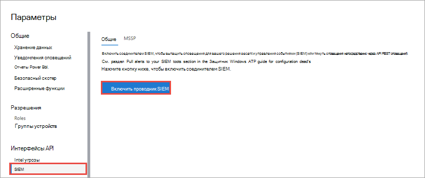
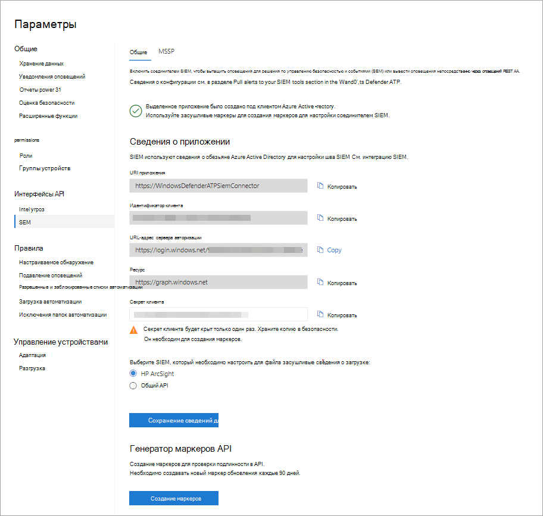

# Включение интеграции SIEM в Microsoft Defender для конечной точки

[!INCLUDE [Microsoft 365 Defender rebranding](../../includes/microsoft-defender.md)]

**Область применения:**
- [Microsoft Defender для конечной точки](https://go.microsoft.com/fwlink/?linkid=2154037)

>Хотите испытать Microsoft Defender для конечной точки? [Зарегистрився для бесплатной пробной.](https://www.microsoft.com/microsoft-365/windows/microsoft-defender-atp?ocid=docs-wdatp-enablesiem-abovefoldlink) 

Включение интеграции сведений о безопасности и управления событиями (SIEM), чтобы вы могли извлекть обнаружения из Центр безопасности в Microsoft Defender. Вытяните обнаружения с помощью решения SIEM или непосредственно подключившись к API REST обнаружения.

>[!NOTE]
>- [Microsoft Defender for Endpoint Alert](alerts.md) состоит из одного или нескольких обнаружений.
>- [Microsoft Defender for Endpoint Detection](api-portal-mapping.md) состоит из подозрительного события, произошедшего на устройстве, и связанных с ним сведений оповещения.
>- API оповещений Microsoft Defender для конечных точек — это последний API для потребления оповещений и содержит подробный список связанных данных для каждого оповещения. Дополнительные сведения см. в [дополнительных сведениях о](alerts.md) методах и свойствах alert и [list alerts.](get-alerts.md)

## Предварительные условия

- У пользователя, который активирует параметр, должны быть разрешения на создание приложения в Azure Active Directory (AAD). Это кто-то со следующими ролями: 

  - Администратор безопасности и глобальный администратор
  - Администратор облачного приложения
  - Администратор приложения
  - Владелец основного владельца службы

- Во время начальной активации отображается всплывающее экран для входа учетных данных. Убедитесь, что вы разрешаете всплывающие окантовки для этого сайта.

## Включение интеграции SIEM 
1. В области навигации выберите **Параметры**  >  **SIEM**.

    

    >[!TIP]
    >Если вы столкнулись с ошибкой при попытке включить соединителем SIEM-приложение, проверьте параметры блокатора всплывающее окна в браузере. Это может быть блокировка открываемого окна при вскрывии возможности. 

2. Выберите **Включить интеграцию SIEM.** Это активирует раздел сведений о доступе к соединителем **SIEM** с предварительно заселяемыми значениями, и приложение создается под вашим клиентом Azure Active Directory Azure AD.

    > [!WARNING]
    >Секрет клиента отображается только один раз. Убедитесь, что вы храните его копию в безопасном месте. 
     

    

3. Выберите тип SIEM, который используется в организации.

   > [!NOTE]
   > Если вы выберете HP ArcSight, вам потребуется сохранить эти два файла конфигурации: 
   > - WDATP-connector.jsonparser.properties
   > - WDATP-connector.properties  

   Если вы хотите напрямую подключиться к API REST обнаружения с помощью программного доступа, выберите **общий API.**

4. Скопируйте отдельные значения или выберите **сохранить сведения,** чтобы загрузить файл, содержащий все значения.

5. Выберите **маркеры Generate,** чтобы получить доступ и обновить маркер.
  
   > [!NOTE]
   > Необходимо создавать новый маркер обновления каждые 90 дней. 

6. Следуйте инструкциям по созданию регистрации приложений Azure AD для [Microsoft Defender для конечной](/microsoft-365/security/defender-endpoint/exposed-apis-create-app-webapp) точки и назначьте ему правильные разрешения на чтение оповещений.

Теперь можно приступить к настройке решения SIEM или подключению к API REST обнаружения с помощью программного доступа. Вы должны использовать маркеры при настройке решения SIEM, чтобы разрешить ему получать обнаружения из Центр безопасности в Microsoft Defender.

## Интеграция Microsoft Defender для конечной точки с IBM QRadar 
Вы можете настроить IBM QRadar для сбора обнаружения в Microsoft Defender для конечной точки. Дополнительные сведения см. в [центре знаний IBM.](https://www.ibm.com/support/knowledgecenter/SS42VS_DSM/c_dsm_guide_MS_Win_Defender_ATP_overview.html?cp=SS42VS_7.3.1)

## См. также
- [Настройте HP ArcSight, чтобы вытащить Microsoft Defender для обнаружения конечных точек](configure-arcsight.md)
- [Microsoft Defender для полей обнаружения конечных точек](api-portal-mapping.md)
- [Pull Microsoft Defender для обнаружения конечных точек с помощью API REST](pull-alerts-using-rest-api.md)
- [Устранение неполадок с интеграцией средства SIEM](troubleshoot-siem.md)
