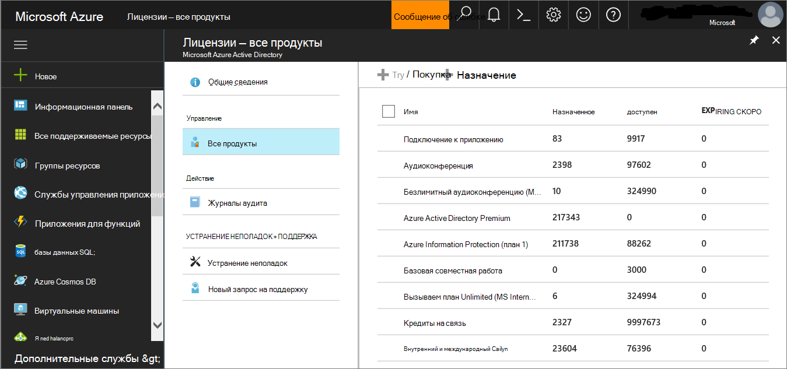

# Пилотная оценка MDE

>[!NOTE]
>Для того, чтобы направлять вас через типичное развертывание, этот сценарий будет охватывать только использование Microsoft Endpoint Configuration Manager. Defender for Endpoint поддерживает использование других средств бортового использования, но не покрывает эти сценарии в руководстве по развертыванию. Дополнительные сведения см. в таблице [Onboard devices to Microsoft Defender for Endpoint.](onboard-configure.md)

## Этап 1. Проверка состояния лицензии

Проверка состояния лицензии и правильного ее состояния можно сделать через центр администрирования или на **портале Microsoft Azure.**

1. Чтобы просмотреть лицензии, перейдите на портал **Microsoft Azure и** перейдите в раздел лицензии Microsoft Azure [портала](https://portal.azure.com/#blade/Microsoft_AAD_IAM/LicensesMenuBlade/Products).

   

1. Поочередно в центре администрирования перейдите к **подпискам на**  >  **биллинг.**

    На экране вы увидите все предварительные лицензии и их текущее **состояние.**

    

## Этап 2. Конечные точки на борту с использованием любого из поддерживаемых средств управления

В [разделе Развертывание](deployment-strategy.md) Plan описаны общие действия, которые необходимо предпринять для развертывания Defender для конечной точки.  

Просмотрите это видео, чтобы получить краткий обзор процесса работы с бортовой частью и узнать о доступных средствах и методах.

> [!VIDEO https://www.microsoft.com/videoplayer/embed/RE4bGqr]

После определения архитектуры необходимо решить, какой метод развертывания использовать. Инструмент развертывания, который вы выбираете, влияет на то, как вы работаете с конечными точками на борту службы.

### Параметры onboarding tool

В следующей таблице перечислены доступные средства, основанные на конечной точке, которую необходимо использовать на борту.

| Конечная точка     | Параметры инструмента                       |
|--------------|------------------------------------------|
| **Windows**  |  [Локальный скрипт (до 10 устройств)](../defender-endpoint/configure-endpoints-script.md)   [Групповая политика](../defender-endpoint/configure-endpoints-gp.md)   [Microsoft Endpoint Manager/ Диспетчер мобильных устройств](../defender-endpoint/configure-endpoints-mdm.md)   [Microsoft Endpoint Configuration Manager](../defender-endpoint/configure-endpoints-sccm.md)   [Скрипты VDI](../defender-endpoint/configure-endpoints-vdi.md)   [Интеграция с Защитником Azure](../defender-endpoint/configure-server-endpoints.md#integration-with-azure-defender) |
| **macOS**    | [Местные сценарии](../defender-endpoint/mac-install-manually.md)   [Microsoft Endpoint Manager](../defender-endpoint/mac-install-with-intune.md)   [JAMF Pro](../defender-endpoint/mac-install-with-jamf.md)   [Управление мобильными устройствами](../defender-endpoint/mac-install-with-other-mdm.md) |
| **Linux Server** | [Локальный скрипт](../defender-endpoint/linux-install-manually.md)   [Puppet](../defender-endpoint/linux-install-with-puppet.md)   [Ansible](../defender-endpoint/linux-install-with-ansible.md)|
| **iOS**      | [На основе приложения](../defender-endpoint/ios-install.md)                                |
| **Android**  | [Microsoft Endpoint Manager](../defender-endpoint/android-intune.md)               |
