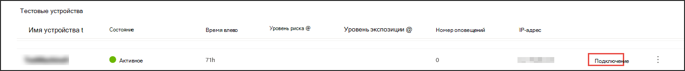
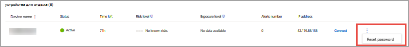
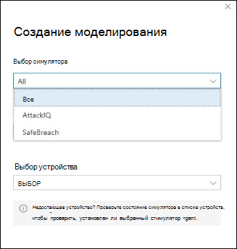

# Опыт Microsoft Defender для конечной точки (MDE) с помощью имитации атакExperience Microsoft Defender for Endpoint (MDE) through simulated attacks

>[!TIP]
>
>- Узнайте о последних улучшениях в Microsoft Defender для конечной точки: что нового в [Defender для конечной точки?.](https://cloudblogs.microsoft.com/microsoftsecure/2018/11/15/whats-new-in-windows-defender-atp/)Learn about the latest enhancements in Microsoft Defender for Endpoint: [What's new in Defender for Endpoint?](https://cloudblogs.microsoft.com/microsoftsecure/2018/11/15/whats-new-in-windows-defender-atp/).
>- Defender for Endpoint в недавней оценке MITRE продемонстрировал ведущие в отрасли возможности оптики и обнаружения.Defender for Endpoint demonstrated industry-leading optics and detection capabilities in the recent MITRE evaluation. Read: Аналитика из оценки [ATT MITRE&на](https://cloudblogs.microsoft.com/microsoftsecure/2018/12/03/insights-from-the-mitre-attack-based-evaluation-of-windows-defender-atp/)основе CK .Read: [Insights from the MITRE ATT&CK-based evaluation](https://cloudblogs.microsoft.com/microsoftsecure/2018/12/03/insights-from-the-mitre-attack-based-evaluation-of-windows-defender-atp/).

Может потребоваться испытать Defender для конечной точки, прежде чем вы на борту более нескольких устройств в службу.You might want to experience Defender for Endpoint before you onboard more than a few devices to the service. Для этого можно выполнить управляемые имитации атак на нескольких тестовых устройствах.To do this, you can run controlled attack simulations on a few test devices. После запуска смоделированных атак вы можете просмотреть, как Defender для конечной точки просматривает вредоносную активность и изучите, как она позволяет эффективно отвечать.After running the simulated attacks, you can review how Defender for Endpoint surfaces malicious activity and explore how it enables an efficient response.

## ПодготовкаBefore you begin

Для запуска любого из предоставленных симуляций необходимо по крайней мере [одно бортовом устройстве.](onboard-configure.md)To run any of the provided simulations, you need at least [one onboarded device](onboard-configure.md).

Ознакомьтесь с документом по погона, который содержит каждый сценарий атаки.Read the walkthrough document provided with each attack scenario. Каждый документ содержит требования к ОС и приложениям, а также подробные инструкции, которые относятся к сценарию атаки.Each document includes OS and application requirements as well as detailed instructions that are specific to an attack scenario.

## Запуск моделированияRun a simulation

1. В   >  **справке & руководства**, выберите, какой из доступных сценариев атак вы хотите имитировать:In **Help** > **Simulations & tutorials**, select which of the available attack scenarios you would like to simulate:

   - **Сценарий 1. Отбрасыватель** документа — имитирует доставку социально разработанного документа-приманки.**Scenario 1: Document drops backdoor** - simulates delivery of a socially engineered lure document. В документе запускается специально созданный backdoor, который дает злоумышленникам контроль.The document launches a specially crafted backdoor that gives attackers control.

   - **Сценарий 2. Сценарий PowerShell** в без файловой атаке — имитирует без файловую атаку, которая опирается на PowerShell, демонстрацию уменьшения поверхности атаки и обнаружение вредоносных действий памяти на устройстве.**Scenario 2: PowerShell script in fileless attack** - simulates a fileless attack that relies on PowerShell, showcasing attack surface reduction and device learning detection of malicious memory activity.

   - **Сценарий 3.** Автоматизированная реакция на инциденты — запускает автоматическое расследование, которое автоматически охотится за артефактами нарушений и устраняет их для масштабирования емкости реагирования на инциденты.**Scenario 3: Automated incident response** - triggers automated investigation, which automatically hunts for and remediates breach artifacts to scale your incident response capacity.

2. Скачайте и прочитайте соответствующий документ по погонам, предоставленный в выбранном сценарии.Download and read the corresponding walkthrough document provided with your selected scenario.

3. Скачайте файл моделирования или скопируйте сценарий моделирования, перенавигав для **справки**&  >  **руководства.**Download the simulation file or copy the simulation script by navigating to **Help** > **Simulations & tutorials**. Вы можете скачать файл или скрипт на тестовом устройстве, но это не является обязательным.You can choose to download the file or script on the test device but it's not mandatory.

4. Запустите файл или сценарий моделирования на тестовом устройстве, как поручено в документе по поручению.Run the simulation file or script on the test device as instructed in the walkthrough document.

> [!NOTE]
> Файлы или сценарии моделирования имитируют действия атаки, но на самом деле являются доброкачественными и не наносят вреда тестовом устройству.Simulation files or scripts mimic attack activity but are actually benign and will not harm or compromise the test device.
>

## АЛЬТЕРНАТИВНЫЙ ТЕКСТ ТЕМЫALTERNATE TOPIC TEXT

## Имитация сценариев атакSimulate attack scenarios

Используйте тестовые устройства для запуска собственных имитаций атак, подключившись к ним.Use the test devices to run your own attack simulations by connecting to them.

Вы можете имитировать сценарии атак с помощью:You can simulate attack scenarios using:

- Сценарии [атаки "Do It Yourself"](https://securitycenter.windows.com/tutorials)The ["Do It Yourself" attack scenarios](https://securitycenter.windows.com/tutorials)
- Симуляторы угрозThreat simulators

Вы также можете использовать [расширенный](advanced-hunting-overview.md)  поиск для запроса данных и аналитики угроз для просмотра отчетов о возникающих угрозах.You can also use [Advanced hunting](advanced-hunting-overview.md) to query data and [Threat analytics](threat-analytics.md) to view reports about emerging threats.

### Сценарии атак do-it-yourselfDo-it-yourself attack scenarios

Если вы ищете предварительное моделирование, вы можете использовать сценарии атак ["Do It Yourself".](https://securitycenter.windows.com/tutorials)If you are looking for a pre-made simulation, you can use our ["Do It Yourself" attack scenarios](https://securitycenter.windows.com/tutorials). Эти скрипты безопасны, документированы и просты в использовании.These scripts are safe, documented, and easy to use. Эти сценарии будут отражать возможности Defender для конечных точек и ходить по опыту исследования.These scenarios will reflect Defender for Endpoint capabilities and walk you through investigation experience.

>[!NOTE]
>Подключение к тест-устройствам делается с помощью RDP.The connection to the test devices is done using RDP. Убедитесь, что параметры брандмауэра позволяют подключения RDP.Make sure that your firewall settings allow RDP connections.

1. Подключение на устройство и запустите имитацию атаки, выбрав **Подключение**.Connect to your device and run an attack simulation by selecting **Connect**.

    

2. Сохраните файл RDP и запустите его, выбрав **Подключение**.Save the RDP file and launch it by selecting **Connect**.

    

    >[!NOTE]
    >Если у вас нет копии пароля, сохраненного во время начальной установки, вы можете сбросить пароль, выбрав пароль **Reset** из меню: Изображение пароля If you don't have a copy of the password saved during the initial setup, you can reset the password by selecting **Reset password** from the menu: 
    >
    > Устройство изменит его состояние на "Выполнение сброса пароля", после чего через несколько минут вам будет представлен новый пароль.The device will change it’s state to “Executing password reset", then you’ll be presented with your new password in a few minutes.

3. Введите пароль, отображаемый во время шага создания устройства.Enter the password that was displayed during the device creation step.

   

4. Запустите имитацию атак do-it-yourself на устройстве.Run Do-it-yourself attack simulations on the device.

### Сценарии имитатора угрозThreat simulator scenarios

Если вы решили установить любой из поддерживаемых имитаторов угроз во время установки лаборатории, вы можете запустить встроенные имитации на устройствах лаборатории оценки.If you chose to install any of the supported threat simulators during the lab setup, you can run the built-in simulations on the evaluation lab devices.

Запуск имитации угроз с использованием сторонних платформ — это хороший способ оценить возможности Microsoft Defender для конечных точек в пределах лабораторной среды.Running threat simulations using third-party platforms is a good way to evaluate Microsoft Defender for Endpoint capabilities within the confines of a lab environment.

>[!NOTE]
>
>Прежде чем запускать моделирование, убедитесь, что следующие требования будут выполнены:Before you can run simulations, ensure the following requirements are met:

>- Устройства должны быть добавлены в лабораторию оценкиDevices must be added to the evaluation lab
>- Симуляторы угроз должны быть установлены в лаборатории оценкиThreat simulators must be installed in the evaluation lab

1. На портале выберите **Создание моделирования.**From the portal select **Create simulation**.

2. Выберите симулятор угрозы.Select a threat simulator.

    

3. Выберите имитацию или просмотрите галерею моделирования, чтобы просмотреть доступные модели.Choose a simulation or look through the simulation gallery to browse through the available simulations.

    Вы можете попасть в галерею моделирования из:You can get to the simulation gallery from:
    - Основная панель мониторинга оценки в плитке **обзоров simulations** илиThe main evaluation dashboard in the **Simulations overview** tile or
    - Путем навигации из области навигации **Оценка** и учебники Моделирование & учебники, а затем  >  выберите **каталог моделирования**.By navigating from the navigation pane **Evaluation and tutorials** > **Simulation & tutorials**, then select **Simulations catalog**.

4. Выберите устройства, на которых необходимо выполнить моделирование.Select the devices where you'd like to run the simulation on.

5. Выберите **Создание моделирования**.Select **Create simulation**.

6. Просмотреть ход моделирования, выбрав вкладку **Simulations.** Просмотр состояния моделирования, активных оповещений и других сведений.View the progress of a simulation by selecting the **Simulations** tab. View the simulation state, active alerts, and other details.

    

 

После выполнения имитации мы рекомендуем вам пройти через планку прогресса лаборатории и изучить Microsoft Defender для конечной точки инициировать автоматическое расследование и **исправление.**After running your simulations, we encourage you to walk through the lab progress bar and explore **Microsoft Defender for Endpoint triggered an automated investigation and remediation**. Ознакомьтесь с доказательствами, собранными и проанализироваными этой функцией.Check out the evidence collected and analyzed by the feature.

Поиск доказательств атаки с помощью продвинутой охоты с помощью богатого языка запросов и сырой телеметрии и проверить некоторые угрозы во всем мире, задокументированные в аналитике угроз.Hunt for attack evidence through advanced hunting by using the rich query language and raw telemetry and check out some world-wide threats documented in Threat analytics.
