# Лаборатория оценки Microsoft Defender для конечной точки

[!INCLUDE [Microsoft 365 Defender rebranding](../../includes/microsoft-defender.md)]

**Область применения:**
- [Microsoft Defender для конечной точки](https://go.microsoft.com/fwlink/?linkid=2154037)
- [Microsoft 365 Defender](https://go.microsoft.com/fwlink/?linkid=2118804)

>Хотите испытать Microsoft Defender для конечной точки? [Зарегистрився для бесплатной пробной.](https://www.microsoft.com/microsoft-365/windows/microsoft-defender-atp?ocid=docs-wdatp-enablesiem-abovefoldlink)

Проведение комплексной оценки продукта безопасности может быть сложным процессом, требующим громоздких условий и конфигурации устройств, прежде чем может быть фактически сделано комплексное моделирование атаки. Сложность заключается в отслеживании того, где во время оценки отражаются действия моделирования, оповещения и результаты.

Лаборатория оценки Microsoft Defender для конечной точки предназначена для устранения сложностей конфигурации устройства и среды, чтобы вы могли сосредоточиться на оценке возможностей платформы, запуске имитаций и обнаружении функций предотвращения, обнаружения и восстановления в действии.

> [!VIDEO https://www.microsoft.com/en-us/videoplayer/embed/RE4qLUM]

С помощью упрощенной системы можно сосредоточиться на выполнении собственных тестовых сценариев и заранее сделанных имитаций, чтобы узнать, как работает Defender для endpoint. 

У вас будет полный доступ к мощным возможностям платформы, таким как автоматизированные расследования, расширенные поиски и аналитика угроз, что позволит протестировать комплексный стек защиты, который предлагает Defender для Endpoint. 

Можно добавить Windows 10 или Windows Server 2019, которые предварительно настроены для установки последних версий ОС и нужных компонентов безопасности, а также Office стандарта 2019 г.

Вы также можете установить симуляторы угроз. Defender for Endpoint имеет партнерские отношения с ведущими отраслевыми платформами моделирования угроз, чтобы помочь вам проверить возможности Defender для конечной точки, не покидая портал.

 Установите предпочтительный симулятор, запустите сценарии в лаборатории оценки и сразу же посмотрите, как выполняется платформа — все удобно доступно без дополнительных затрат для вас. Вы также будете иметь удобный доступ к широкому спектру имитаций, к которым можно получить доступ и запустить из каталога моделирования.
    

## Прежде чем начать
Чтобы получить доступ к  лаборатории оценки, необходимо выполнить требования лицензирования или получить пробный доступ к Microsoft Defender для конечной точки.

Необходимо иметь разрешения на управление **настройками** безопасности, чтобы:
- Создание лаборатории
- Создание устройств
- Сброс пароля
- Создание имитаций 
 
Если вы включили управление доступом на основе ролей (RBAC) и создали по крайней мере одну группу машин, пользователи должны иметь доступ ко всем группам машин.

Дополнительные сведения см. в [дополнительных сведениях о создании и управлении ролями.](user-roles.md)

Хотите испытать Microsoft Defender для конечной точки? [Зарегистрився для бесплатной пробной.](https://www.microsoft.com/microsoft-365/windows/microsoft-defender-atp?ocid=docs-wdatp-main-abovefoldlink)

## Начало работы с лабораторией
Вы можете получить доступ к лаборатории из меню. В меню навигации выберите оценку и **учебники > оценки.**

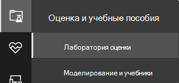

>[!NOTE]
>- В зависимости от выбранной структуры среды устройства будут доступны в течение указанного количества часов со дня активации.
>- Каждая среда содержит ограниченный набор тестовых устройств. Если вы использовали устройства с предварительной провизией и удалили их, можно запросить дополнительные устройства. 
>- Вы можете запрашивать ресурсы лаборатории раз в месяц. 

Уже есть лаборатория? Убедитесь в том, чтобы включить новые симуляторы угроз и иметь активные устройства.

## Настройка лаборатории оценки

1. В области навигации выберите **лабораторию оценки** и оценки учебных пособий,  >  а затем выберите **лабораторию установки.**

    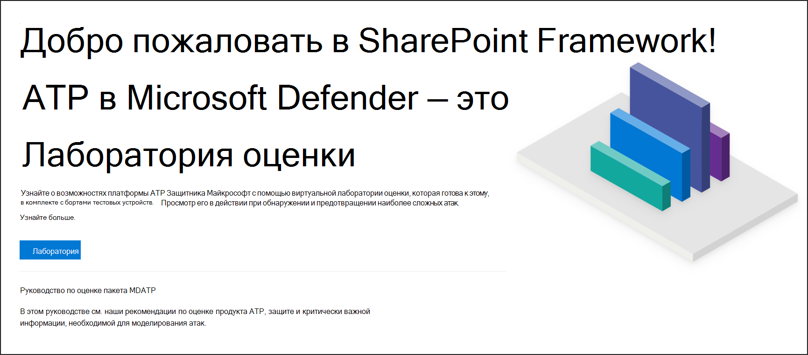

2. В зависимости от потребностей в оценке можно настроить среду с большим или большим количеством устройств на более короткий период. Выберите предпочитаемую конфигурацию лаборатории, а затем выберите **Далее**.

    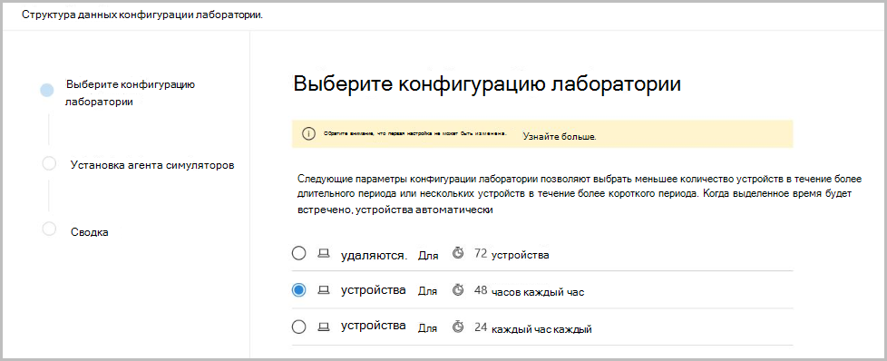 

3. (Необязательный) Вы можете установить симуляторы угроз в лаборатории. 

    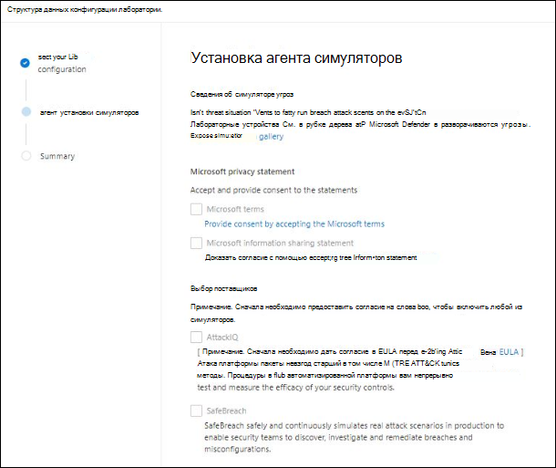

    >[!IMPORTANT]
    >Сначала необходимо принять и предоставить согласие на условия и заявления о совместном использовании информации. 

4. Выберите агент моделирования угроз, который вы хотите использовать, и введите сведения. Вы также можете выбрать установку симуляторов угроз в более позднее время. Если вы решите установить агенты моделирования угроз во время установки лаборатории, вы сможете удобно установить их на добавленных устройствах.  
    
    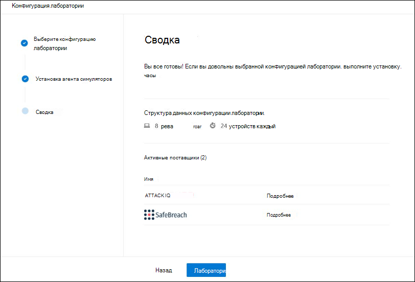

5.  Просмотрите сводку и выберите **лабораторию установки.**  

После завершения процесса установки лаборатории можно добавить устройства и запустить моделирование. 

## Добавление устройств
При добавлении устройства в среду Defender for Endpoint настраивает хорошо настроенное устройство с сведениями о подключении. Можно добавить устройства Windows 10 или Windows Server 2019.

Устройство будет настроено с самой новой версией оси и стандарта Office 2019 г., а также с другими приложениями, такими как Java, Python и SysIntenals. 

Если вы решили добавить симулятор угроз во время установки лаборатории, на всех устройствах будет установлен агент симулятора угроз, установленный на добавленных устройствах.

Устройство автоматически будет включено для клиента с рекомендуемой Windows включена и в режиме аудита без каких-либо усилий на вашей стороне. 

На тестовых устройствах предварительно настроены следующие компоненты безопасности:

- [Сокращение направлений атак](https://docs.microsoft.com/windows/security/threat-protection/windows-defender-exploit-guard/attack-surface-reduction-exploit-guard)
- [Блок с первого взгляда](https://docs.microsoft.com/windows/security/threat-protection/microsoft-defender-antivirus/configure-block-at-first-sight-microsoft-defender-antivirus)
- [Контролируемый доступ к папкам](https://docs.microsoft.com/windows/security/threat-protection/windows-defender-exploit-guard/controlled-folders-exploit-guard)
- [Защита от эксплойтов](https://docs.microsoft.com/windows/security/threat-protection/windows-defender-exploit-guard/enable-exploit-protection)
- [Защита сети](https://docs.microsoft.com/windows/security/threat-protection/windows-defender-exploit-guard/network-protection-exploit-guard)
- [Обнаружение потенциально нежелательных приложений](https://docs.microsoft.com/windows/security/threat-protection/microsoft-defender-antivirus/detect-block-potentially-unwanted-apps-microsoft-defender-antivirus)
- [Защита с облачным доставкой](https://docs.microsoft.com/windows/security/threat-protection/microsoft-defender-antivirus/utilize-microsoft-cloud-protection-microsoft-defender-antivirus)
- [фильтр SmartScreen в Microsoft Defender](https://docs.microsoft.com/windows/security/threat-protection/windows-defender-smartscreen/windows-defender-smartscreen-overview)

>[!NOTE]
> антивирусная программа в Microsoft Defender будет (не в режиме аудита). Если антивирусная программа в Microsoft Defender не позволяет запускать моделирование, вы можете отключить защиту в режиме реального времени на устройстве Безопасность Windows. Дополнительные сведения см. [в перенастройке всегда на защиту.](https://docs.microsoft.com/windows/security/threat-protection/microsoft-defender-antivirus/configure-real-time-protection-microsoft-defender-antivirus)

Параметры автоматического расследования будут зависеть от параметров клиента. Он будет настроен на полуавтоматизированный по умолчанию. Дополнительные сведения см. [в обзоре автоматизированных расследований.](automated-investigations.md)

>[!NOTE]
>Подключение к тест-устройствам делается с помощью RDP. Убедитесь, что параметры брандмауэра позволяют подключения RDP.

1. На панели мониторинга выберите **устройство Добавить**. 

2. Выберите тип устройства для добавления. Вы можете добавить Windows 10 или Windows Server 2019.

    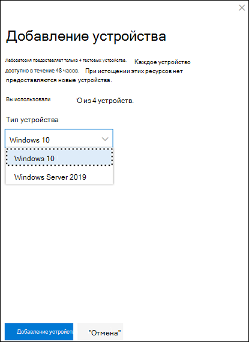

    >[!NOTE]
    >Если что-то не справится с процессом создания устройства, вы будете уведомлены и вам потребуется отправить новый запрос. Если создание устройства не удается, он не будет засчитываться по общей разрешенной квоте. 

3. Отображаются сведения о подключении. Выберите **Копию,** чтобы сохранить пароль для устройства.

    >[!NOTE]
    >Пароль отображается только один раз. Обязательно сохраните его для более позднего использования.

    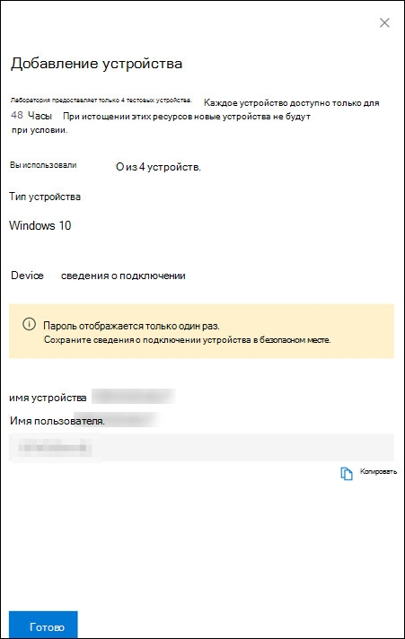

4. Начинается настройка устройства. Это может занять около 30 минут. 

5. Узнайте о состоянии тестовых устройств, уровнях риска и экспозиции, а также о состоянии установок симулятора, выбрав вкладку **Devices.** 

    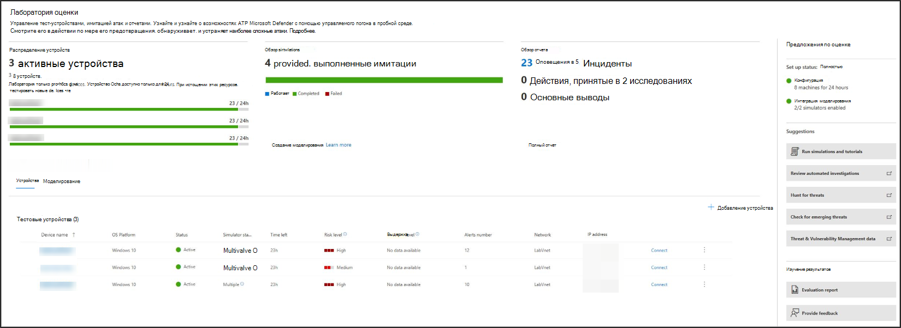
    

    > [!TIP]
    > В **столбце Состояние Симулятор** можно нависать над значком информации, чтобы узнать состояние установки агента.

## Запрос на дополнительные устройства
Если все существующие устройства используются и удаляются, можно запросить дополнительные устройства. Вы можете запрашивать ресурсы лаборатории раз в месяц. 

1. На панели мониторинга лаборатории оценки выберите **Запрос для дополнительных устройств.**

   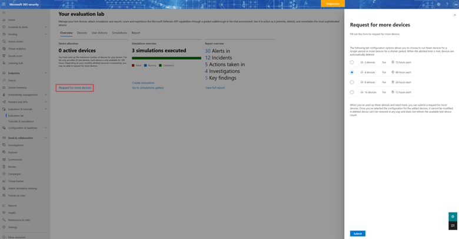

2. Выберите конфигурацию. 
3. Отправка запроса. 

После успешного отправки запроса вы увидите зеленый баннер подтверждения и дату последней отправки.
 
Состояние запроса можно найти на вкладке **Действия** пользователя, которая будет утверждена в течение нескольких часов.

После утверждения запрашиваемые устройства будут добавлены в вашу лабораторию, и вы сможете создавать больше устройств. 

> [!TIP]
> Чтобы получить больше из лаборатории, не забудьте проверить нашу библиотеку моделирования.

## Имитация сценариев атак
Используйте тестовые устройства для запуска собственных имитаций атак, подключившись к ним. 

Вы можете имитировать сценарии атак с помощью:
- Сценарии [атаки "Do It Yourself"](https://securitycenter.windows.com/tutorials)
- Симуляторы угроз

Вы также можете использовать [расширенный](advanced-hunting-query-language.md)  поиск для запроса данных и аналитики угроз для просмотра отчетов о возникающих угрозах.

### Сценарии атак do-it-yourself
Если вы ищете предварительное моделирование, вы можете использовать сценарии атак ["Do It Yourself".](https://securitycenter.windows.com/tutorials) Эти скрипты безопасны, документированы и просты в использовании. Эти сценарии будут отражать возможности Defender для конечных точек и ходить по опыту исследования.

>[!NOTE]
>Подключение к тест-устройствам делается с помощью RDP. Убедитесь, что параметры брандмауэра позволяют подключения RDP.

1. Подключение на устройство и запустите имитацию атаки, выбрав **Подключение**. 

    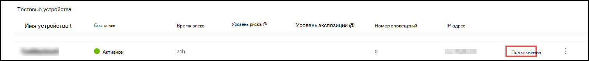

2. Сохраните файл RDP и запустите его, выбрав **Подключение**.

    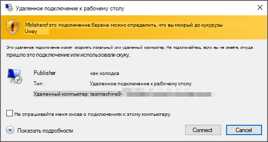

    >[!NOTE]
    >Если у вас нет копии пароля, сохраненного во время начальной установки, вы можете сбросить пароль, выбрав пароль **Reset** из меню: Изображение пароля 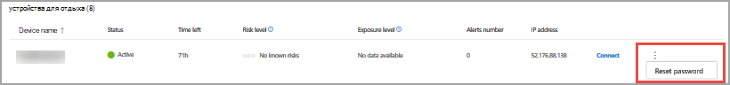 
    > Устройство изменит его состояние на "Выполнение сброса пароля", после чего через несколько минут вам будет представлен новый пароль.

3. Введите пароль, отображаемый во время шага создания устройства. 

   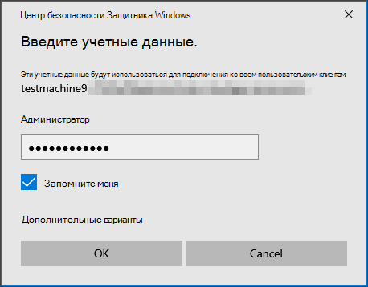

4. Запустите имитацию атак do-it-yourself на устройстве. 

### Сценарии симулятора угроз
Если вы решили установить любой из поддерживаемых имитаторов угроз во время установки лаборатории, вы можете запустить встроенные имитации на устройствах лаборатории оценки. 

Запуск имитации угроз с использованием сторонних платформ — это хороший способ оценить возможности Microsoft Defender для конечных точек в пределах лабораторной среды.

>[!NOTE]
>Прежде чем запускать моделирование, убедитесь, что следующие требования будут выполнены:
>- Устройства должны быть добавлены в лабораторию оценки
>- Симуляторы угроз должны быть установлены в лаборатории оценки

1. На портале выберите **Создание моделирования.**

2. Выберите симулятор угрозы.

    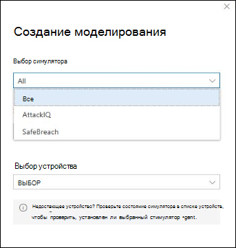

3. Выберите имитацию или просмотрите галерею моделирования, чтобы просмотреть доступные модели. 

    Вы можете попасть в галерею моделирования из:
    - Основная панель мониторинга оценки в плитке **обзоров simulations** или
    - Путем навигации из области навигации **Оценка** и учебники Моделирование & учебники, а затем  >  выберите **каталог моделирования**.

4. Выберите устройства, на которых необходимо выполнить моделирование.

5. Выберите **Создание моделирования**.

6. Просмотреть ход моделирования, выбрав вкладку **Simulations.** Просмотр состояния моделирования, активных оповещений и других сведений. 

    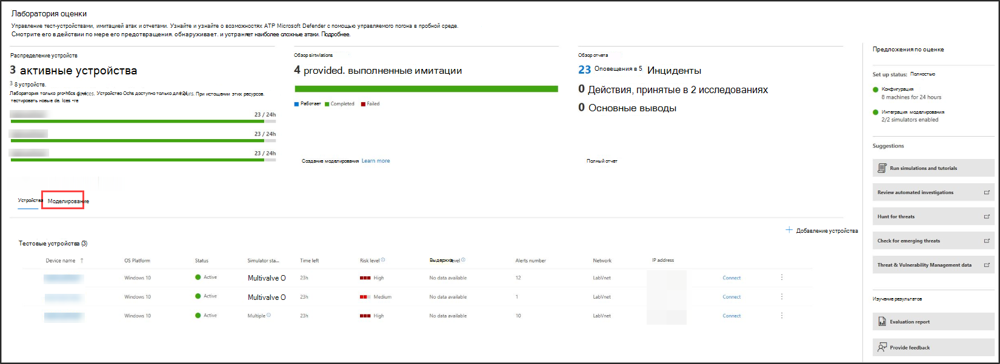
    
После выполнения имитации мы рекомендуем вам пройти через планку прогресса лаборатории и изучить Microsoft Defender для конечной точки инициировать автоматическое расследование и **исправление.** Ознакомьтесь с доказательствами, собранными и проанализироваными этой функцией.

Поиск доказательств атаки с помощью продвинутой охоты с помощью богатого языка запросов и сырой телеметрии и проверить некоторые угрозы во всем мире, задокументированные в аналитике угроз.

## Галерея моделирования
Microsoft Defender для конечной точки имеет партнерские отношения с различными платформами моделирования угроз, чтобы предоставить вам удобный доступ для проверки возможностей платформы прямо из портала. 

Просмотр всех доступных имитаций, переехав в каталог **моделирования** и учебных пособий из  >   меню. 

В каталоге перечислены поддерживаемые сторонние агенты моделирования угроз, а в каталоге перечислены определенные типы имитаций, а также подробные описания. 

Вы можете удобно выполнить любое доступное моделирование прямо из каталога.  

Каждое моделирование поставляется с подробным описанием сценария атаки и ссылками, такими как методы атаки MITRE, используемые и примеры расширенных запросов охоты, которые вы запустите.

**Примеры:** 
 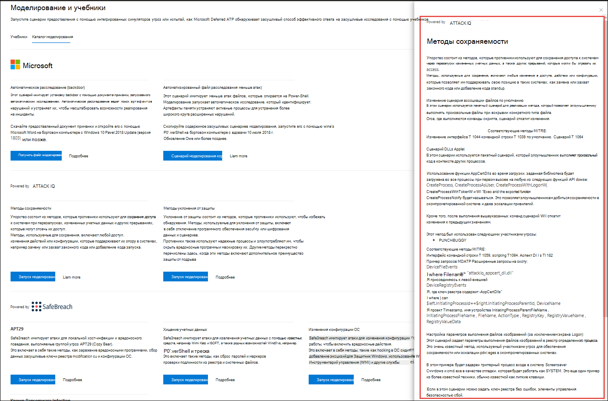

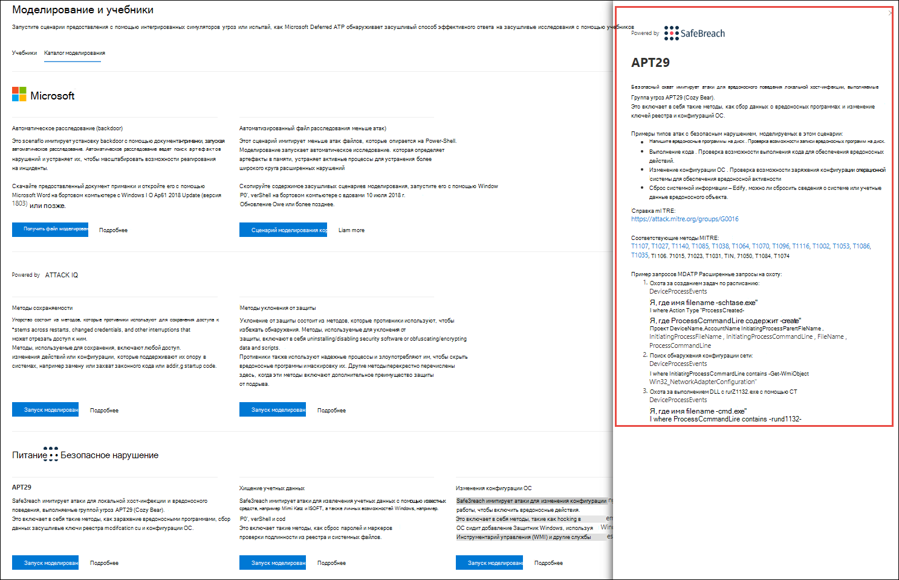

## Отчет об оценке
В лабораторных отчетах подводятся итоги моделирования, проведенного на устройствах.

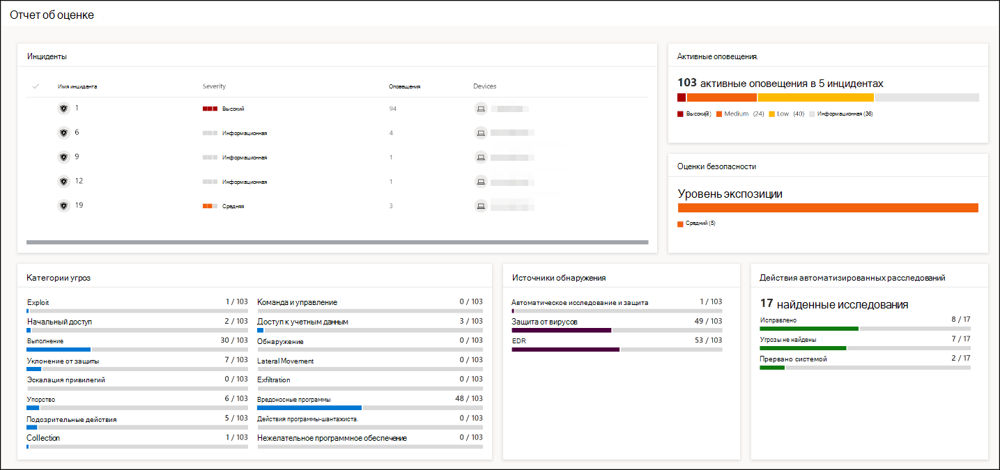

С первого взгляда вы быстро сможете увидеть:
- Инциденты, которые были вызваны
- Сгенерированная оповещений
- Оценки уровня экспозиции 
- Наблюдаемые категории угроз
- Источники обнаружения
- Автоматические исследования

## Предоставление отзывов
Ваши отзывы помогают нам лучше защищать вашу среду от расширенных атак. Поделитесь своим опытом и впечатлениями от возможностей продукта и результатов оценки.

Дайте нам знать, что вы думаете, выбрав **Обеспечить обратную связь**.

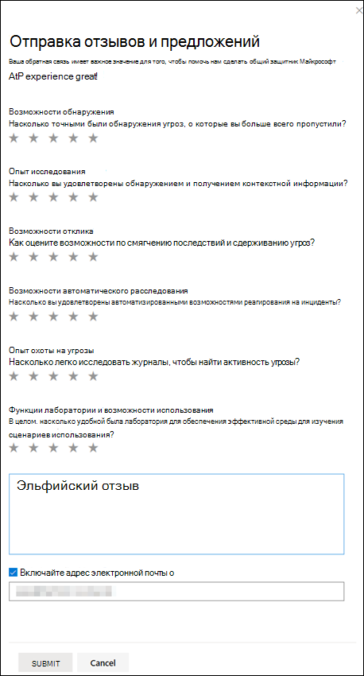
