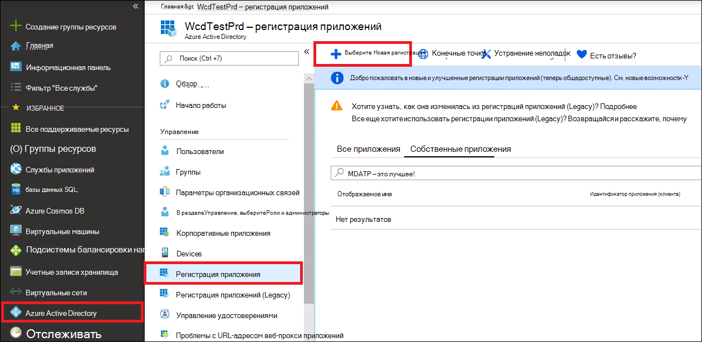
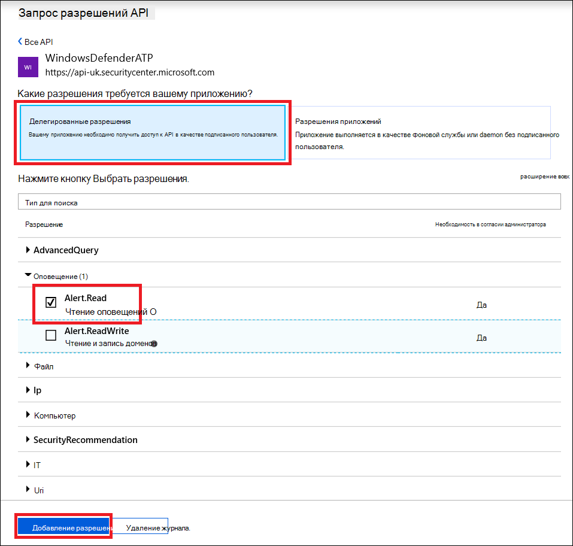

# <a name="use-microsoft-defender-for-endpoint-apis"></a>Использование Microsoft Defender для API конечных точек

[!INCLUDE [Microsoft 365 Defender rebranding](../../includes/microsoft-defender.md)]


**Область применения:**
- [Microsoft Defender для конечной точки](https://go.microsoft.com/fwlink/?linkid=2154037)

> Хотите испытать Microsoft Defender для конечной точки? [Зарегистрився для бесплатной пробной.](https://www.microsoft.com/microsoft-365/windows/microsoft-defender-atp?ocid=docs-wdatp-exposedapis-abovefoldlink)

[!include[Microsoft Defender for Endpoint API URIs for US Government](../../includes/microsoft-defender-api-usgov.md)]

[!include[Improve request performance](../../includes/improve-request-performance.md)]

На этой странице описывается создание приложения для получения программного доступа к Защитнику для конечной точки от имени пользователя.

Если вам нужен программный доступ Microsoft Defender для конечной точки без пользователя, обратитесь к Access Microsoft Defender для конечной точки [с контекстом приложений.](exposed-apis-create-app-webapp.md)

Если вы не уверены, какой доступ вам нужен, прочитайте страницу [Введение](apis-intro.md).

Microsoft Defender для конечной точки предоставляет большую часть своих данных и действий с помощью набора программных API. Эти API позволят автоматизировать потоки работы и вносимые новации на основе возможностей Microsoft Defender для конечных точек. Доступ к API требует проверки подлинности OAuth2.0. Дополнительные сведения см. [в тексте OAuth 2.0 Authorization Code Flow.](/azure/active-directory/develop/active-directory-v2-protocols-oauth-code)

В общем, для использования API необходимо предпринять следующие действия:
- Создание приложения AAD
- Получение маркера доступа с помощью этого приложения
- Использование маркера для доступа к API Defender для endpoint

На этой странице рассказывается, как создать приложение AAD, получить маркер доступа в Microsoft Defender для конечной точки и проверить маркер.

>[!NOTE]
> При доступе к API Microsoft Defender для конечной точки от имени пользователя вам потребуется правильное разрешение приложения и разрешение пользователя.
> Если вы не знакомы с разрешениями пользователей в Microsoft Defender для конечной точки, см. в рублях Управление доступом к порталу с помощью управления доступом на основе [ролей.](rbac.md)

>[!TIP]
> Если у вас есть разрешение на выполнение действия на портале, у вас есть разрешение на выполнение действия в API.

## <a name="create-an-app"></a>Создать приложение

1. Войдите в [Azure](https://portal.azure.com) с учетной записью пользователя, которая имеет роль **глобального администратора.**

2. Перейдите **к Azure Active Directory**  >  **регистрации Приложений** Новая  >  **регистрация**. 

   

3. После появления страницы **Регистрация приложения** введите сведения о регистрации приложения:

   - **Имя** — введите информативное имя приложения, которое будет отображаться пользователям приложения.
   - **Поддерживаемые типы учетных записей** — выберите учетные записи, которые должно поддерживать приложение.

       | Поддерживаемые типы учетных записей | Описание |
       |-------------------------|-------------|
       | **Учетные записи только в этом каталоге организации** | Этот вариант подходит для создания бизнес-приложений. Он будет недоступен, если приложение не регистрируется в каталоге.<br><br>Этот параметр сопоставляется с Azure AD только одного клиента.<br><br>Этот параметр используется по умолчанию, если только приложение не регистрируется за пределами каталога. Если приложение зарегистрировано за пределами каталога, по умолчанию используются личные учетные записи Майкрософт и учетные записи с несколькими клиентами Azure AD. |
       | **Учетные записи в любом каталоге организации** | Выберите этот параметр, если вы хотите выбрать в качестве целевой аудитории предприятия и учебные заведения.<br><br>Этот параметр сопоставляется с Azure AD только для нескольких клиентов.<br><br>Если вы зарегистрировали приложение как приложение AAD с одним клиентом, можно обновить его до AAD с несколькими клиентами, а затем вернуться к отдельному клиенту с помощью колонки **Проверка подлинности**. |
       | **Учетные записи в любом каталоге организации и личные учетные записи Майкрософт** | Выберите этот параметр для широкого круга пользователей.<br><br>Этот параметр сопоставляется с Azure AD с несколькими клиентами и личными учетными записями Майкрософт.<br><br>Если вы зарегистрировали приложение как личные учетные записи Майкрософт и Azure AD с несколькими клиентами, это нельзя изменить в пользовательском интерфейсе. Вместо этого необходимо использовать редактор манифеста приложения для изменения типов поддерживаемых учетных записей. |

   - **URI перенаправления (необязательно)** — выберите тип приложения, которое вы создаете — **Веб** или **Общедоступный клиент (мобильный и классический)**, а затем введите универсальный код ресурса (URI) перенаправления (или URL-адрес ответа) приложения.
       - Для веб-приложений укажите основной URL-адрес приложения. Например, `http://localhost:31544` может быть URL-адресом веб-приложения, выполняемого на локальном компьютере. Пользователи будут использовать этот URL-адрес для входа в приложение веб-клиента.
       - Для общедоступных клиентских приложений укажите универсальный код ресурса (URI), который использует AAD для возвращения ответов маркера. Укажите значение, специфичное для вашего приложения, например `myapp://auth`.

     Конкретные примеры для веб-приложений или собственных приложений см. в наших [кратких руководствах](/azure/active-directory/develop/#quickstarts).

     По завершении щелкните **Зарегистрировать**.

4. Разрешить приложению доступ к Microsoft Defender для конечной точки и назначить ему разрешение на чтение оповещений:

    - На странице приложения выберите **API Permissions** Add  >  **permissionS** my  >  **organization uses** > **WindowsDefenderATP** и выберите в **WindowsDefenderATP**.

    - **Примечание.** *WindowsDefenderATP* не появляется в исходном списке. Начните писать свое имя в текстовом окне, чтобы увидеть его.

      

    - Выберите **делегирование разрешений**  >  **Alert.Read** > добавление **разрешений**

      

    - **Важное примечание.** Выберите соответствующие разрешения. Чтение оповещений — это только пример.

      Например,

      - Чтобы [запускать расширенные запросы,](run-advanced-query-api.md)выберите разрешение "Запуск расширенных запросов"
      - Чтобы [изолировать устройство,](isolate-machine.md)выберите разрешение "Изолировать машину"
      - Чтобы определить, какое разрешение вам нужно, просмотреть раздел **Разрешения** в API, который вы хотите вызвать.

    - Выберите **согласие гранта**

      **Примечание.** Каждый раз, когда вы добавляете разрешение, необходимо выбрать по согласию **гранта,** чтобы новое разрешение вступает в силу.

      

6. Запишите свой ИД приложения и его клиента:

   - На странице приложения перейдите в **Обзор и** скопируйте следующую информацию:

   


## <a name="get-an-access-token"></a>Получение токена доступа

Дополнительные сведения о маркерах AAD см. в [учебнике Azure AD](/azure/active-directory/develop/active-directory-v2-protocols-oauth-client-creds)

### <a name="using-c"></a>Использование C #

- Copy/Paste the below class in your application.
- Чтобы приобрести маркер, используйте метод **AcquireUserTokenAsync** с кодом приложения, ИД клиента, именем пользователя и паролем.

    ```csharp
    namespace WindowsDefenderATP
    {
        using System.Net.Http;
        using System.Text;
        using System.Threading.Tasks;
        using Newtonsoft.Json.Linq;

        public static class WindowsDefenderATPUtils
        {
            private const string Authority = "https://login.microsoftonline.com";

            private const string WdatpResourceId = "https://api.securitycenter.microsoft.com";

            public static async Task<string> AcquireUserTokenAsync(string username, string password, string appId, string tenantId)
            {
                using (var httpClient = new HttpClient())
                {
                    var urlEncodedBody = $"resource={WdatpResourceId}&client_id={appId}&grant_type=password&username={username}&password={password}";

                    var stringContent = new StringContent(urlEncodedBody, Encoding.UTF8, "application/x-www-form-urlencoded");

                    using (var response = await httpClient.PostAsync($"{Authority}/{tenantId}/oauth2/token", stringContent).ConfigureAwait(false))
                    {
                        response.EnsureSuccessStatusCode();

                        var json = await response.Content.ReadAsStringAsync().ConfigureAwait(false);

                        var jObject = JObject.Parse(json);

                        return jObject["access_token"].Value<string>();
                    }
                }
            }
        }
    }
    ```

## <a name="validate-the-token"></a>Проверка маркера

Убедитесь, что вы получили правильный маркер:
- Копирование/вклейка [в JWT](https://jwt.ms) маркера, который вы получили на предыдущем шаге, чтобы расшифровать его
- Проверка получения утверждения "scp" с нужными разрешениями приложения
- На приведенной ниже скриншоте вы можете увидеть расшифровав маркер, приобретенный из приложения в учебнике:


## <a name="use-the-token-to-access-microsoft-defender-for-endpoint-api"></a>С помощью маркера можно получить доступ к API Endpoint Defender для Microsoft Defender

- Выберите API, который вы хотите использовать . [Поддерживаемый Microsoft Defender для API конечных точек](exposed-apis-list.md)
- Установите заглавную запись авторизации в http-запросе, который вы отправляете в "Bearer {token}" (Bearer — это схема авторизации)
- Срок действия маркера составляет 1 час (вы можете отправить несколько запросов с одним и тем же маркером)

- Пример отправки запроса для получения списка оповещений **с помощью C#** 

    ```csharp
    var httpClient = new HttpClient();

    var request = new HttpRequestMessage(HttpMethod.Get, "https://api.securitycenter.microsoft.com/api/alerts");

    request.Headers.Authorization = new AuthenticationHeaderValue("Bearer", token);

    var response = httpClient.SendAsync(request).GetAwaiter().GetResult();

    // Do something useful with the response
    ```

## <a name="see-also"></a>См. также
- [Microsoft Defender для API конечных точек](exposed-apis-list.md)
- [Доступ к Microsoft Defender для конечной точки с контекстом приложений](exposed-apis-create-app-webapp.md)
