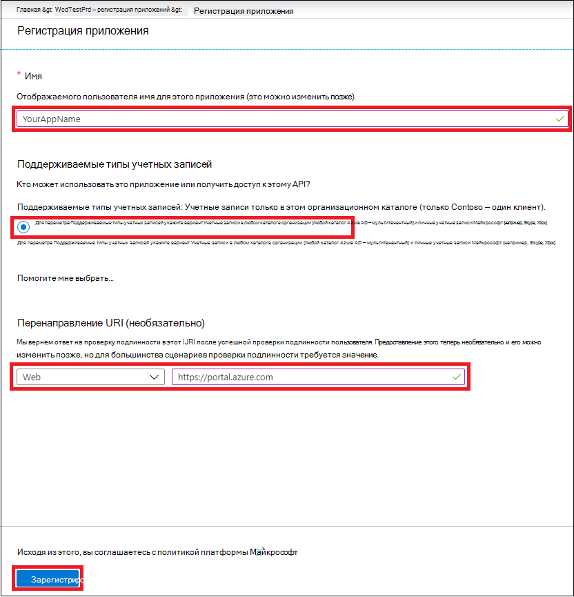
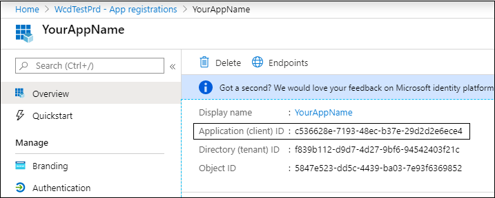
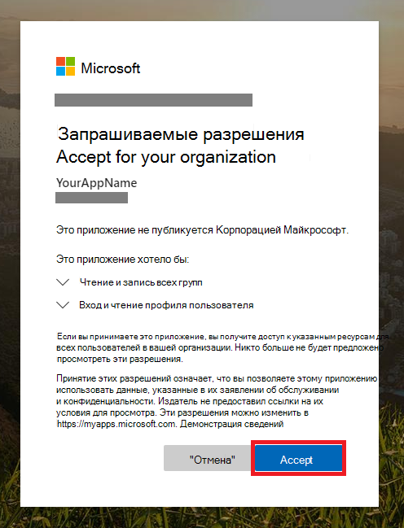

# <a name="partner-access-through-microsoft-defender-for-endpoint-apis"></a><span data-ttu-id="41c2c-104">Доступ партнера через API Endpoint Defender для Microsoft Defender</span><span class="sxs-lookup"><span data-stu-id="41c2c-104">Partner access through Microsoft Defender for Endpoint APIs</span></span>

[!INCLUDE [Microsoft 365 Defender rebranding](../../includes/microsoft-defender.md)]


<span data-ttu-id="41c2c-105">**Применяется к:** [Microsoft Defender для конечной точки](https://go.microsoft.com/fwlink/?linkid=2154037)</span><span class="sxs-lookup"><span data-stu-id="41c2c-105">**Applies to:** [Microsoft Defender for Endpoint](https://go.microsoft.com/fwlink/?linkid=2154037)</span></span>

> <span data-ttu-id="41c2c-106">Хотите испытать Microsoft Defender для конечной точки?</span><span class="sxs-lookup"><span data-stu-id="41c2c-106">Want to experience Microsoft Defender for Endpoint?</span></span> [<span data-ttu-id="41c2c-107">Зарегистрився для бесплатной пробной.</span><span class="sxs-lookup"><span data-stu-id="41c2c-107">Sign up for a free trial.</span></span>](https://www.microsoft.com/microsoft-365/windows/microsoft-defender-atp?ocid=docs-wdatp-exposedapis-abovefoldlink)

[!include[Microsoft Defender for Endpoint API URIs for US Government](../../includes/microsoft-defender-api-usgov.md)]

[!include[Improve request performance](../../includes/improve-request-performance.md)]

<span data-ttu-id="41c2c-108">На этой странице описывается создание приложения Azure Active Directory Azure AD для получения программного доступа к Microsoft Defender для конечной точки от имени клиентов.</span><span class="sxs-lookup"><span data-stu-id="41c2c-108">This page describes how to create an Azure Active Directory (Azure AD) application to get programmatic access to Microsoft Defender for Endpoint on behalf of your customers.</span></span>


<span data-ttu-id="41c2c-109">Microsoft Defender для конечной точки предоставляет большую часть своих данных и действий с помощью набора программных API.</span><span class="sxs-lookup"><span data-stu-id="41c2c-109">Microsoft Defender for Endpoint exposes much of its data and actions through a set of programmatic APIs.</span></span> <span data-ttu-id="41c2c-110">Эти API помогут автоматизировать потоки работы и вносимые новые решения на основе возможностей Microsoft Defender для конечных точек.</span><span class="sxs-lookup"><span data-stu-id="41c2c-110">Those APIs will help you automate work flows and innovate based on Microsoft Defender for Endpoint capabilities.</span></span> <span data-ttu-id="41c2c-111">Доступ к API требует проверки подлинности OAuth2.0.</span><span class="sxs-lookup"><span data-stu-id="41c2c-111">The API access requires OAuth2.0 authentication.</span></span> <span data-ttu-id="41c2c-112">Дополнительные сведения см. [в тексте OAuth 2.0 Authorization Code Flow.](https://docs.microsoft.com/azure/active-directory/develop/active-directory-v2-protocols-oauth-code)</span><span class="sxs-lookup"><span data-stu-id="41c2c-112">For more information, see [OAuth 2.0 Authorization Code Flow](https://docs.microsoft.com/azure/active-directory/develop/active-directory-v2-protocols-oauth-code).</span></span>

<span data-ttu-id="41c2c-113">В общем, для использования API необходимо предпринять следующие действия:</span><span class="sxs-lookup"><span data-stu-id="41c2c-113">In general, you’ll need to take the following steps to use the APIs:</span></span>
- <span data-ttu-id="41c2c-114">Создание приложения Azure AD с **несколькими** клиентами.</span><span class="sxs-lookup"><span data-stu-id="41c2c-114">Create a **multi-tenant** Azure AD application.</span></span>
- <span data-ttu-id="41c2c-115">Получите авторизованный (согласие) администратор клиента для приложения для доступа к ресурсам Defender для конечных точек, которые ему необходимы.</span><span class="sxs-lookup"><span data-stu-id="41c2c-115">Get authorized(consent) by your customer administrator for your application to access Defender for Endpoint resources it needs.</span></span>
- <span data-ttu-id="41c2c-116">Получение маркера доступа с помощью этого приложения.</span><span class="sxs-lookup"><span data-stu-id="41c2c-116">Get an access token using this application.</span></span>
- <span data-ttu-id="41c2c-117">С помощью маркера можно получить доступ к API Microsoft Defender для конечной точки.</span><span class="sxs-lookup"><span data-stu-id="41c2c-117">Use the token to access Microsoft Defender for Endpoint API.</span></span>

<span data-ttu-id="41c2c-118">В следующих действиях вы сможете узнать, как создать приложение Azure AD, получить маркер доступа в Microsoft Defender для конечной точки и проверить маркер.</span><span class="sxs-lookup"><span data-stu-id="41c2c-118">The following steps will guide you how to create an Azure AD application, get an access token to Microsoft Defender for Endpoint and validate the token.</span></span>

## <a name="create-the-multi-tenant-app"></a><span data-ttu-id="41c2c-119">Создание приложения с несколькими клиентами</span><span class="sxs-lookup"><span data-stu-id="41c2c-119">Create the multi-tenant app</span></span>

1. <span data-ttu-id="41c2c-120">Во входе в [клиент Azure с](https://portal.azure.com) пользователем, который имеет роль **глобального администратора.**</span><span class="sxs-lookup"><span data-stu-id="41c2c-120">Sign in to your [Azure tenant](https://portal.azure.com) with user that has **Global Administrator** role.</span></span>

2. <span data-ttu-id="41c2c-121">Перейдите **к Azure Active Directory**  >  **регистрации Приложений** Новая  >  **регистрация**.</span><span class="sxs-lookup"><span data-stu-id="41c2c-121">Navigate to **Azure Active Directory** > **App registrations** > **New registration**.</span></span> 

   

3. <span data-ttu-id="41c2c-123">В форме регистрации:</span><span class="sxs-lookup"><span data-stu-id="41c2c-123">In the registration form:</span></span>

    - <span data-ttu-id="41c2c-124">Выберите имя приложения.</span><span class="sxs-lookup"><span data-stu-id="41c2c-124">Choose a name for your application.</span></span>

    - <span data-ttu-id="41c2c-125">Поддерживаемые типы учетных записей — учетные записи в любом организационном каталоге.</span><span class="sxs-lookup"><span data-stu-id="41c2c-125">Supported account types - accounts in any organizational directory.</span></span>

    - <span data-ttu-id="41c2c-126">Перенаправление URI — тип: Web, URI: https://portal.azure.com</span><span class="sxs-lookup"><span data-stu-id="41c2c-126">Redirect URI - type: Web, URI: https://portal.azure.com</span></span>

    


4. <span data-ttu-id="41c2c-128">Разрешить приложению доступ к Microsoft Defender для конечной точки и назначить его с минимальным набором разрешений, необходимых для завершения интеграции.</span><span class="sxs-lookup"><span data-stu-id="41c2c-128">Allow your Application to access Microsoft Defender for Endpoint and assign it with the minimal set of permissions required to complete the integration.</span></span>

   - <span data-ttu-id="41c2c-129">На странице приложения выберите **API Permissions** Add  >  **permissionS** my  >  **organization uses** > **WindowsDefenderATP** и выберите в **WindowsDefenderATP**.</span><span class="sxs-lookup"><span data-stu-id="41c2c-129">On your application page, select **API Permissions** > **Add permission** > **APIs my organization uses** > type **WindowsDefenderATP** and select on **WindowsDefenderATP**.</span></span>

   - <span data-ttu-id="41c2c-130">**Примечание.** *WindowsDefenderATP* не появляется в исходном списке.</span><span class="sxs-lookup"><span data-stu-id="41c2c-130">**Note**: *WindowsDefenderATP* does not appear in the original list.</span></span> <span data-ttu-id="41c2c-131">Начните писать свое имя в текстовом окне, чтобы увидеть его.</span><span class="sxs-lookup"><span data-stu-id="41c2c-131">Start writing its name in the text box to see it appear.</span></span>

   
   
   ### <a name="request-api-permissions"></a><span data-ttu-id="41c2c-133">Запрос разрешений API</span><span class="sxs-lookup"><span data-stu-id="41c2c-133">Request API permissions</span></span>

   <span data-ttu-id="41c2c-134">Чтобы определить, какое разрешение вам нужно, просмотрите раздел **Разрешения** в API, который вы хотите вызвать.</span><span class="sxs-lookup"><span data-stu-id="41c2c-134">To determine which permission you need, review the **Permissions** section in the API you are interested to call.</span></span> <span data-ttu-id="41c2c-135">Например:</span><span class="sxs-lookup"><span data-stu-id="41c2c-135">For instance:</span></span>

   - <span data-ttu-id="41c2c-136">Чтобы [запускать расширенные запросы,](run-advanced-query-api.md)выберите разрешение "Запуск расширенных запросов"</span><span class="sxs-lookup"><span data-stu-id="41c2c-136">To [run advanced queries](run-advanced-query-api.md), select 'Run advanced queries' permission</span></span>
   
   - <span data-ttu-id="41c2c-137">Чтобы [изолировать устройство,](isolate-machine.md)выберите разрешение "Изолировать машину"</span><span class="sxs-lookup"><span data-stu-id="41c2c-137">To [isolate a device](isolate-machine.md), select 'Isolate machine' permission</span></span>

   <span data-ttu-id="41c2c-138">В следующем примере мы будем использовать **разрешение "Чтение всех оповещений":**</span><span class="sxs-lookup"><span data-stu-id="41c2c-138">In the following example we will use **'Read all alerts'** permission:</span></span>

   <span data-ttu-id="41c2c-139">Выбор **разрешений**  >  **приложения Alert.Read.All >** в **приложении Add permissions**</span><span class="sxs-lookup"><span data-stu-id="41c2c-139">Choose **Application permissions** > **Alert.Read.All** > select on **Add permissions**</span></span>

   


5. <span data-ttu-id="41c2c-141">Выберите **согласие гранта**</span><span class="sxs-lookup"><span data-stu-id="41c2c-141">Select **Grant consent**</span></span>

    - <span data-ttu-id="41c2c-142">**Примечание.** Каждый раз, когда вы добавляете разрешение, необходимо выбрать по согласию **гранта,** чтобы новое разрешение вступает в силу.</span><span class="sxs-lookup"><span data-stu-id="41c2c-142">**Note**: Every time you add permission you must select on **Grant consent** for the new permission to take effect.</span></span>

    

6. <span data-ttu-id="41c2c-144">Добавьте секрет в приложение.</span><span class="sxs-lookup"><span data-stu-id="41c2c-144">Add a secret to the application.</span></span>

    - <span data-ttu-id="41c2c-145">Выберите **сертификаты &,** добавьте описание в секрет и выберите **Добавить**.</span><span class="sxs-lookup"><span data-stu-id="41c2c-145">Select **Certificates & secrets**, add description to the secret and select **Add**.</span></span>

    <span data-ttu-id="41c2c-146">**Важно.** После щелчка Добавить **скопируйте сгенерированную секретную ценность.**</span><span class="sxs-lookup"><span data-stu-id="41c2c-146">**Important**: After click Add, **copy the generated secret value**.</span></span> <span data-ttu-id="41c2c-147">Вы не сможете получить после того, как уйдете!</span><span class="sxs-lookup"><span data-stu-id="41c2c-147">You won't be able to retrieve after you leave!</span></span>

    

7. <span data-ttu-id="41c2c-149">Запишите свой ID приложения:</span><span class="sxs-lookup"><span data-stu-id="41c2c-149">Write down your application ID:</span></span>

   - <span data-ttu-id="41c2c-150">На странице приложения перейдите в **Обзор и** скопируйте следующую информацию:</span><span class="sxs-lookup"><span data-stu-id="41c2c-150">On your application page, go to **Overview** and copy the following information:</span></span>

   

8. <span data-ttu-id="41c2c-152">Добавьте приложение клиенту.</span><span class="sxs-lookup"><span data-stu-id="41c2c-152">Add the application to your customer's tenant.</span></span>

    <span data-ttu-id="41c2c-153">Необходимо, чтобы ваше приложение было утверждено в каждом клиенте, где вы собираетесь его использовать.</span><span class="sxs-lookup"><span data-stu-id="41c2c-153">You need your application to be approved in each customer tenant where you intend to use it.</span></span> <span data-ttu-id="41c2c-154">Это происходит потому, что ваше приложение взаимодействует с приложением Microsoft Defender для конечной точки от имени клиента.</span><span class="sxs-lookup"><span data-stu-id="41c2c-154">This is because your application interacts with Microsoft Defender for Endpoint application on behalf of your customer.</span></span>

    <span data-ttu-id="41c2c-155">Пользователь с **глобальным администратором** из клиента клиента должен выбрать ссылку на согласие и утвердить ваше приложение.</span><span class="sxs-lookup"><span data-stu-id="41c2c-155">A user with **Global Administrator** from your customer's tenant need to select the consent link and approve your application.</span></span>

    <span data-ttu-id="41c2c-156">Ссылка согласие имеет форму:</span><span class="sxs-lookup"><span data-stu-id="41c2c-156">Consent link is of the form:</span></span>

    ```
    https://login.microsoftonline.com/common/oauth2/authorize?prompt=consent&client_id=00000000-0000-0000-0000-000000000000&response_type=code&sso_reload=true
    ```

    <span data-ttu-id="41c2c-157">Где 00000000-0000-0000-0000-00000000000 следует заменить вашим ИД приложения</span><span class="sxs-lookup"><span data-stu-id="41c2c-157">Where 00000000-0000-0000-0000-000000000000 should be replaced with your Application ID</span></span>

    <span data-ttu-id="41c2c-158">Нажав на ссылку согласие, войдите в глобальный администратор клиента клиента и согласиться с приложением.</span><span class="sxs-lookup"><span data-stu-id="41c2c-158">After clicking on the consent link, sign in with the Global Administrator of the customer's tenant and consent the application.</span></span>

    

    <span data-ttu-id="41c2c-160">Кроме того, при приобретении маркера необходимо спросить у клиента его ИД клиента и сохранить его для дальнейшего использования.</span><span class="sxs-lookup"><span data-stu-id="41c2c-160">In addition, you will need to ask your customer for their tenant ID and save it for future use when acquiring the token.</span></span>

- <span data-ttu-id="41c2c-161">**Договорились!**</span><span class="sxs-lookup"><span data-stu-id="41c2c-161">**Done!**</span></span> <span data-ttu-id="41c2c-162">Вы успешно зарегистрировали приложение!</span><span class="sxs-lookup"><span data-stu-id="41c2c-162">You have successfully registered an application!</span></span> 
- <span data-ttu-id="41c2c-163">Ниже приведены примеры приобретения и проверки маркеров.</span><span class="sxs-lookup"><span data-stu-id="41c2c-163">See examples below for token acquisition and validation.</span></span>

## <a name="get-an-access-token-example"></a><span data-ttu-id="41c2c-164">Пример маркера доступа:</span><span class="sxs-lookup"><span data-stu-id="41c2c-164">Get an access token example:</span></span>

<span data-ttu-id="41c2c-165">**Примечание:** Чтобы получить маркер доступа от имени клиента, используйте ID клиента в следующих приобретениях маркеров.</span><span class="sxs-lookup"><span data-stu-id="41c2c-165">**Note:** To get access token on behalf of your customer, use the customer's tenant ID on the following token acquisitions.</span></span>

<br><span data-ttu-id="41c2c-166">Дополнительные сведения о маркере AAD см. в [учебнике AAD](https://docs.microsoft.com/azure/active-directory/develop/active-directory-v2-protocols-oauth-client-creds)</span><span class="sxs-lookup"><span data-stu-id="41c2c-166">For more information on AAD token, see [AAD tutorial](https://docs.microsoft.com/azure/active-directory/develop/active-directory-v2-protocols-oauth-client-creds)</span></span>

### <a name="using-powershell"></a><span data-ttu-id="41c2c-167">С помощью PowerShell</span><span class="sxs-lookup"><span data-stu-id="41c2c-167">Using PowerShell</span></span>

```
# That code gets the App Context Token and save it to a file named "Latest-token.txt" under the current directory
# Paste below your Tenant ID, App ID and App Secret (App key).

$tenantId = '' ### Paste your tenant ID here
$appId = '' ### Paste your Application ID here
$appSecret = '' ### Paste your Application key here

$resourceAppIdUri = 'https://api.securitycenter.microsoft.com'
$oAuthUri = "https://login.microsoftonline.com/$TenantId/oauth2/token"
$authBody = [Ordered] @{
    resource = "$resourceAppIdUri"
    client_id = "$appId"
    client_secret = "$appSecret"
    grant_type = 'client_credentials'
}
$authResponse = Invoke-RestMethod -Method Post -Uri $oAuthUri -Body $authBody -ErrorAction Stop
$token = $authResponse.access_token
Out-File -FilePath "./Latest-token.txt" -InputObject $token
return $token
```

### <a name="using-c"></a><span data-ttu-id="41c2c-168">Использование C#:</span><span class="sxs-lookup"><span data-stu-id="41c2c-168">Using C#:</span></span>

><span data-ttu-id="41c2c-169">Ниже код был протестирован с помощью Nuget Microsoft.IdentityModel.Clients.ActiveDirectory</span><span class="sxs-lookup"><span data-stu-id="41c2c-169">The below code was tested with Nuget Microsoft.IdentityModel.Clients.ActiveDirectory</span></span>

- <span data-ttu-id="41c2c-170">Создание нового приложения консоли</span><span class="sxs-lookup"><span data-stu-id="41c2c-170">Create a new Console Application</span></span>
- <span data-ttu-id="41c2c-171">Установка NuGet [Microsoft.IdentityModel.Clients.ActiveDirectory](https://www.nuget.org/packages/Microsoft.IdentityModel.Clients.ActiveDirectory/)</span><span class="sxs-lookup"><span data-stu-id="41c2c-171">Install NuGet [Microsoft.IdentityModel.Clients.ActiveDirectory](https://www.nuget.org/packages/Microsoft.IdentityModel.Clients.ActiveDirectory/)</span></span>
- <span data-ttu-id="41c2c-172">Добавление приведенного ниже использования</span><span class="sxs-lookup"><span data-stu-id="41c2c-172">Add the below using</span></span>

    ```
    using Microsoft.IdentityModel.Clients.ActiveDirectory;
    ```

- <span data-ttu-id="41c2c-173">Copy/Paste the below code in your application (do not forget to update the three variables: ```tenantId, appId, appSecret``` )</span><span class="sxs-lookup"><span data-stu-id="41c2c-173">Copy/Paste the below code in your application (do not forget to update the three variables: ```tenantId, appId, appSecret```)</span></span>

    ```
    string tenantId = "00000000-0000-0000-0000-000000000000"; // Paste your own tenant ID here
    string appId = "11111111-1111-1111-1111-111111111111"; // Paste your own app ID here
    string appSecret = "22222222-2222-2222-2222-222222222222"; // Paste your own app secret here for a test, and then store it in a safe place! 

    const string authority = "https://login.microsoftonline.com";
    const string wdatpResourceId = "https://api.securitycenter.microsoft.com";

    AuthenticationContext auth = new AuthenticationContext($"{authority}/{tenantId}/");
    ClientCredential clientCredential = new ClientCredential(appId, appSecret);
    AuthenticationResult authenticationResult = auth.AcquireTokenAsync(wdatpResourceId, clientCredential).GetAwaiter().GetResult();
    string token = authenticationResult.AccessToken;
    ```


### <a name="using-python"></a><span data-ttu-id="41c2c-174">Использование Python</span><span class="sxs-lookup"><span data-stu-id="41c2c-174">Using Python</span></span>

<span data-ttu-id="41c2c-175">Обратитесь к [маркеру Get using Python](run-advanced-query-sample-python.md#get-token)</span><span class="sxs-lookup"><span data-stu-id="41c2c-175">Refer to [Get token using Python](run-advanced-query-sample-python.md#get-token)</span></span>

### <a name="using-curl"></a><span data-ttu-id="41c2c-176">Использование curl</span><span class="sxs-lookup"><span data-stu-id="41c2c-176">Using Curl</span></span>

> [!NOTE]
> <span data-ttu-id="41c2c-177">Приведенная ниже процедура, предполагаемая для Windows, уже установлена на компьютере</span><span class="sxs-lookup"><span data-stu-id="41c2c-177">The below procedure supposed Curl for Windows is already installed on your computer</span></span>

- <span data-ttu-id="41c2c-178">Откройте окно команды</span><span class="sxs-lookup"><span data-stu-id="41c2c-178">Open a command window</span></span>
- <span data-ttu-id="41c2c-179">Настройка CLIENT_ID для вашего ID приложения Azure</span><span class="sxs-lookup"><span data-stu-id="41c2c-179">Set CLIENT_ID to your Azure application ID</span></span>
- <span data-ttu-id="41c2c-180">Настройка CLIENT_SECRET для секрета приложения Azure</span><span class="sxs-lookup"><span data-stu-id="41c2c-180">Set CLIENT_SECRET to your Azure application secret</span></span>
- <span data-ttu-id="41c2c-181">Установите TENANT_ID клиента Azure, который хочет использовать приложение для доступа к приложению Microsoft Defender для конечных точек.</span><span class="sxs-lookup"><span data-stu-id="41c2c-181">Set TENANT_ID to the Azure tenant ID of the customer that wants to use your application to access Microsoft Defender for Endpoint application</span></span>
- <span data-ttu-id="41c2c-182">Запустите приведенную ниже команду:</span><span class="sxs-lookup"><span data-stu-id="41c2c-182">Run the below command:</span></span>

```
curl -i -X POST -H "Content-Type:application/x-www-form-urlencoded" -d "grant_type=client_credentials" -d "client_id=%CLIENT_ID%" -d "scope=https://securitycenter.onmicrosoft.com/windowsatpservice/.default" -d "client_secret=%CLIENT_SECRET%" "https://login.microsoftonline.com/%TENANT_ID%/oauth2/v2.0/token" -k
```

<span data-ttu-id="41c2c-183">Вы получите ответ формы:</span><span class="sxs-lookup"><span data-stu-id="41c2c-183">You will get an answer of the form:</span></span>

```
{"token_type":"Bearer","expires_in":3599,"ext_expires_in":0,"access_token":"eyJ0eXAiOiJKV1QiLCJhbGciOiJSUzI1NiIsIn <truncated> aWReH7P0s0tjTBX8wGWqJUdDA"}
```

## <a name="validate-the-token"></a><span data-ttu-id="41c2c-184">Проверка маркера</span><span class="sxs-lookup"><span data-stu-id="41c2c-184">Validate the token</span></span>

<span data-ttu-id="41c2c-185">Проверка вменяемости, чтобы убедиться, что вы получили правильный маркер:</span><span class="sxs-lookup"><span data-stu-id="41c2c-185">Sanity check to make sure you got a correct token:</span></span>
- <span data-ttu-id="41c2c-186">Скопируйте или вклеите [в JWT](https://jwt.ms) маркер, который вы получаете на предыдущем шаге, чтобы расшифровать его</span><span class="sxs-lookup"><span data-stu-id="41c2c-186">Copy/paste into [JWT](https://jwt.ms) the token you get in the previous step in order to decode it</span></span>
- <span data-ttu-id="41c2c-187">Проверка получения утверждения "роли" с нужными разрешениями</span><span class="sxs-lookup"><span data-stu-id="41c2c-187">Validate you get a 'roles' claim with the desired permissions</span></span>
- <span data-ttu-id="41c2c-188">На приведенной ниже скриншоте можно увидеть расшифровав маркер, приобретенный из приложения с несколькими разрешениями в Microsoft Defender для конечной точки:</span><span class="sxs-lookup"><span data-stu-id="41c2c-188">In the screenshot below, you can see a decoded token acquired from an Application with multiple permissions to  Microsoft Defender for Endpoint:</span></span>
- <span data-ttu-id="41c2c-189">Утверждение "tid" — это ИД клиента, к которой принадлежит маркер.</span><span class="sxs-lookup"><span data-stu-id="41c2c-189">The "tid" claim is the tenant ID the token belongs to.</span></span>


## <a name="use-the-token-to-access-microsoft-defender-for-endpoint-api"></a><span data-ttu-id="41c2c-191">С помощью маркера можно получить доступ к API Endpoint Defender для Microsoft Defender</span><span class="sxs-lookup"><span data-stu-id="41c2c-191">Use the token to access Microsoft Defender for Endpoint API</span></span>

- <span data-ttu-id="41c2c-192">Выберите API, который вы хотите использовать, дополнительные сведения см. в [веб-сайте Supported Microsoft Defender for Endpoint API](exposed-apis-list.md)</span><span class="sxs-lookup"><span data-stu-id="41c2c-192">Choose the API you want to use, for more information, see [Supported Microsoft Defender for Endpoint APIs](exposed-apis-list.md)</span></span>
- <span data-ttu-id="41c2c-193">Установите заглавную запись авторизации в http-запросе, который вы отправляете в "Bearer {token}" (Bearer — это схема авторизации)</span><span class="sxs-lookup"><span data-stu-id="41c2c-193">Set the Authorization header in the Http request you send to "Bearer {token}" (Bearer is the Authorization scheme)</span></span>
- <span data-ttu-id="41c2c-194">Срок действия маркера составляет 1 час (вы можете отправить несколько запросов с одним и тем же маркером)</span><span class="sxs-lookup"><span data-stu-id="41c2c-194">The Expiration time of the token is 1 hour (you can send more than one request with the same token)</span></span>

- <span data-ttu-id="41c2c-195">Пример отправки запроса для получения списка оповещений **с помощью C#**</span><span class="sxs-lookup"><span data-stu-id="41c2c-195">Example of sending a request to get a list of alerts **using C#**</span></span> 
    ```
    var httpClient = new HttpClient();

    var request = new HttpRequestMessage(HttpMethod.Get, "https://api.securitycenter.microsoft.com/api/alerts");

    request.Headers.Authorization = new AuthenticationHeaderValue("Bearer", token);

    var response = httpClient.SendAsync(request).GetAwaiter().GetResult();

    // Do something useful with the response
    ```

## <a name="see-also"></a><span data-ttu-id="41c2c-196">См. также</span><span class="sxs-lookup"><span data-stu-id="41c2c-196">See also</span></span>
- [<span data-ttu-id="41c2c-197">Поддерживаемые API Microsoft Defender для конечной точки</span><span class="sxs-lookup"><span data-stu-id="41c2c-197">Supported Microsoft Defender for Endpoint APIs</span></span>](exposed-apis-list.md)
- [<span data-ttu-id="41c2c-198">Доступ к Microsoft Defender для конечной точки от имени пользователя</span><span class="sxs-lookup"><span data-stu-id="41c2c-198">Access Microsoft Defender for Endpoint on behalf of a user</span></span>](exposed-apis-create-app-nativeapp.md)
