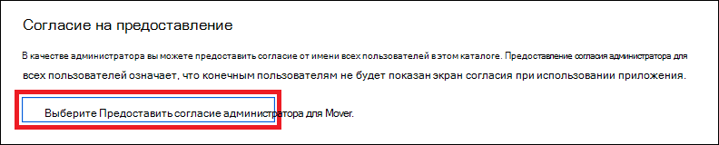

# <a name="create-an-app-to-access-microsoft-defender-for-endpoint-without-a-user"></a>Создание приложения для доступа к Microsoft Defender для конечной точки без пользователя

[!INCLUDE [Microsoft 365 Defender rebranding](../../includes/microsoft-defender.md)]


**Применяется к:** [Microsoft Defender для конечной точки](https://go.microsoft.com/fwlink/?linkid=2154037)

- Хотите испытать Microsoft Defender для конечной точки? [Зарегистрився для бесплатной пробной.](https://www.microsoft.com/microsoft-365/windows/microsoft-defender-atp?ocid=docs-wdatp-exposedapis-abovefoldlink)

[!include[Microsoft Defender for Endpoint API URIs for US Government](../../includes/microsoft-defender-api-usgov.md)]

[!include[Improve request performance](../../includes/improve-request-performance.md)]

На этой странице описывается создание приложения для получения программного доступа к Защитнику для конечной точки без пользователя. Если вам необходим программный доступ к Защитнику для конечной точки от имени пользователя, см. раздел Получить доступ [с пользовательским контекстом.](exposed-apis-create-app-nativeapp.md) Если вы не уверены, какой доступ вам нужен, см. [в этой ленте Начало](apis-intro.md)работы.

Microsoft Defender для конечной точки предоставляет большую часть своих данных и действий с помощью набора программных API. Эти API помогут автоматизировать потоки работы и вносимые новации на основе возможностей Defender для конечных точек. Доступ к API требует проверки подлинности OAuth2.0. Дополнительные сведения см. [в тексте OAuth 2.0 Authorization Code Flow.](/azure/active-directory/develop/active-directory-v2-protocols-oauth-code)

В общем, для использования API необходимо предпринять следующие действия:
- Создание приложения Azure Active Directory Azure AD.
- Получение маркера доступа с помощью этого приложения.
- Используйте маркер для доступа к API Defender для endpoint.

В этой статье рассказывается о создании приложения Azure AD, предоставлении маркера доступа в Microsoft Defender для конечной точки и проверке маркера.

## <a name="create-an-app"></a>Создать приложение

1. Войдите в [Azure](https://portal.azure.com) с пользователем, который имеет роль **глобального администратора.**

2. Перейдите **к Azure Active Directory**  >  **регистрации Приложений** Новая  >  **регистрация**. 

   

3. В форме регистрации выберите имя приложения, а затем выберите **Register**.

4. Чтобы включить приложение для доступа к Defender для конечной точки и назначить ему разрешение "Чтение всех оповещений", выберите **API** **Permissions** Add  >  **permissionS** my  >  **organization uses** >, введите **WindowsDefenderATP,** а затем выберите **WindowsDefenderATP**.

   > [!NOTE]
   > *WindowsDefenderATP* не появляется в исходном списке. Начните писать свое имя в текстовом окне, чтобы увидеть его.

   

   - Выберите **разрешения приложения**  >  **Alert.Read.All,** а затем добавьте **разрешения.**

   

     Необходимо выбрать соответствующие разрешения. "Чтение всех оповещений" — это только пример. Например:

     - Чтобы [запустить расширенные запросы,](run-advanced-query-api.md)выберите разрешение "Выполнить расширенные запросы".
     - Чтобы [изолировать устройство,](isolate-machine.md)выберите разрешение "Изолировать машину".
     - Чтобы определить, какое разрешение вам нужно, посмотрите раздел **Разрешения** в API, который вы хотите вызвать.

5. Выберите **согласие гранта.**

     > [!NOTE]
     > Каждый раз, когда вы добавляете разрешение, необходимо выбрать согласие **гранта,** чтобы новое разрешение вступает в силу.

    

6. Чтобы добавить секрет в приложение, выберите сертификаты **&,** добавьте описание в секрет, а затем выберите **Добавить**.

    > [!NOTE]
    > После выбора **Добавить** выберите **скопируйте сгенерированную секретную ценность.** Вы не сможете получить это значение после того, как уйдете.

    

7. Запишите свой ИД приложения и его клиента. На странице приложения перейдите к **обзору и** скопируйте следующее.

   

8. **Только для Microsoft Defender для партнеров конечных точек**. Задайте вашему приложению много клиента (доступное во всех клиентах после согласия). Это необходимо **для** сторонних приложений (например, если вы создаете приложение, предназначенное для работы в клиенте нескольких клиентов). Это не **требуется,** если вы создаете службу, которую нужно запустить только в клиенте (например, если вы создаете приложение для собственного использования, которое будет взаимодействовать только с собственными данными). Чтобы установить, что ваше приложение является многонанимателем:

    - Перейдите **к проверке подлинности** и добавьте `https://portal.azure.com` в качестве **URI перенаправления.**

    - В нижней части страницы в рамках поддерживаемых типов учетных записей выберите учетные записи в любом приложении-каталоге организации для вашего приложения с несколькими клиентами. 

    Необходимо, чтобы ваше приложение было утверждено в каждом клиенте, где вы собираетесь его использовать. Это происходит потому, что приложение взаимодействует с Defender для конечной точки от имени клиента.

    Вам (или вашему клиенту, если вы пишете сторонное приложение) необходимо выбрать ссылку на согласие и утвердить ваше приложение. Согласие должно быть сделано с пользователем, у которого есть административные привилегии в Active Directory.

    Ссылка согласия формируется следующим образом: 

    ```
    https://login.microsoftonline.com/common/oauth2/authorize?prompt=consent&client_id=00000000-0000-0000-0000-000000000000&response_type=code&sso_reload=true
    ```

    Где 00000000-0000-0000-0000-0000000000000 заменяется вашим ИД приложения.


**Договорились!** Вы успешно зарегистрировали приложение! Ниже приведены примеры приобретения и проверки маркеров.

## <a name="get-an-access-token"></a>Получение токена доступа

Дополнительные сведения о маркерах Azure AD см. в руководстве [Azure AD.](/azure/active-directory/develop/active-directory-v2-protocols-oauth-client-creds)

### <a name="use-powershell"></a>Воспользуйтесь PowerShell

```powershell
# This script acquires the App Context Token and stores it in the variable $token for later use in the script.
# Paste your Tenant ID, App ID, and App Secret (App key) into the indicated quotes below.

$tenantId = '' ### Paste your tenant ID here
$appId = '' ### Paste your Application ID here
$appSecret = '' ### Paste your Application key here

$resourceAppIdUri = 'https://api.securitycenter.microsoft.com'
$oAuthUri = "https://login.microsoftonline.com/$TenantId/oauth2/token"
$authBody = [Ordered] @{
    resource = "$resourceAppIdUri"
    client_id = "$appId"
    client_secret = "$appSecret"
    grant_type = 'client_credentials'
}
$authResponse = Invoke-RestMethod -Method Post -Uri $oAuthUri -Body $authBody -ErrorAction Stop
$token = $authResponse.access_token
```

### <a name="use-c"></a>Используйте C#:

Следующий код был протестирован с помощью NuGet Microsoft.IdentityModel.Clients.ActiveDirectory 3.19.8.

1. Создайте новое консольное приложение.
1. Установка NuGet [Microsoft.IdentityModel.Clients.ActiveDirectory](https://www.nuget.org/packages/Microsoft.IdentityModel.Clients.ActiveDirectory/).
1. Добавьте следующее:

    ```
    using Microsoft.IdentityModel.Clients.ActiveDirectory;
    ```

1. Скопируйте и вклейте следующий код в приложении (не забудьте обновить три переменные: ```tenantId, appId, appSecret``` ):

    ```
    string tenantId = "00000000-0000-0000-0000-000000000000"; // Paste your own tenant ID here
    string appId = "11111111-1111-1111-1111-111111111111"; // Paste your own app ID here
    string appSecret = "22222222-2222-2222-2222-222222222222"; // Paste your own app secret here for a test, and then store it in a safe place! 

    const string authority = "https://login.microsoftonline.com";
    const string wdatpResourceId = "https://api.securitycenter.microsoft.com";

    AuthenticationContext auth = new AuthenticationContext($"{authority}/{tenantId}/");
    ClientCredential clientCredential = new ClientCredential(appId, appSecret);
    AuthenticationResult authenticationResult = auth.AcquireTokenAsync(wdatpResourceId, clientCredential).GetAwaiter().GetResult();
    string token = authenticationResult.AccessToken;
    ```


### <a name="use-python"></a>Использование Python

См. [маркер Get using Python.](run-advanced-query-sample-python.md#get-token)

### <a name="use-curl"></a>Использование Curl

> [!NOTE]
> Следующая процедура предполагает, что Windows уже установлен на вашем компьютере.

1. Откройте командную подсказку и установите CLIENT_ID к вашему ID приложения Azure.
1. Установите CLIENT_SECRET для секрета приложения Azure.
1. Установите TENANT_ID для клиента Azure, который хочет использовать приложение для доступа к Защитнику для конечной точки.
1. Выполните следующую команду:

```
curl -i -X POST -H "Content-Type:application/x-www-form-urlencoded" -d "grant_type=client_credentials" -d "client_id=%CLIENT_ID%" -d "scope=https://securitycenter.onmicrosoft.com/windowsatpservice/.default" -d "client_secret=%CLIENT_SECRET%" "https://login.microsoftonline.com/%TENANT_ID%/oauth2/v2.0/token" -k
```

Вы получите ответ в следующей форме:

```
{"token_type":"Bearer","expires_in":3599,"ext_expires_in":0,"access_token":"eyJ0eXAiOiJKV1QiLCJhbGciOiJSUzI1NiIsIn <truncated> aWReH7P0s0tjTBX8wGWqJUdDA"}
```

## <a name="validate-the-token"></a>Проверка маркера

Убедитесь, что вы получили правильный маркер:

1. Скопируйте и вклейте маркер, который вы получили на предыдущем шаге в [JWT,](https://jwt.ms) чтобы расшифровать его.
1. Проверка получения утверждения "роли" с нужными разрешениями
1. На следующем изображении можно увидеть расшифровав маркер, приобретенный из приложения с разрешениями на все роли Microsoft Defender для конечной точки:


## <a name="use-the-token-to-access-microsoft-defender-for-endpoint-api"></a>С помощью маркера можно получить доступ к API Endpoint Defender для Microsoft Defender

1. Выберите API, который вы хотите использовать. Дополнительные сведения см. в [ссылке Supported Defender for Endpoint API.](exposed-apis-list.md)
1. Установите заглавную запись авторизации в http-запросе, который вы отправляете в "Bearer {token}" (Bearer — это схема авторизации).
1. Срок действия маркера — один час. Вы можете отправить несколько запросов с одним и тем же маркером.

Ниже приводится пример отправки запроса для получения списка оповещений **с помощью C#:** 
```
    var httpClient = new HttpClient();

    var request = new HttpRequestMessage(HttpMethod.Get, "https://api.securitycenter.microsoft.com/api/alerts");

    request.Headers.Authorization = new AuthenticationHeaderValue("Bearer", token);

    var response = httpClient.SendAsync(request).GetAwaiter().GetResult();

    // Do something useful with the response
```

## <a name="see-also"></a>См. также
- [Поддерживаемые API Microsoft Defender для конечной точки](exposed-apis-list.md)
- [Доступ к Microsoft Defender для конечной точки от имени пользователя](exposed-apis-create-app-nativeapp.md)
