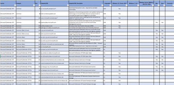

# Microsoft Defender для конечной точки для государственных служб СШАMicrosoft Defender for Endpoint for US Government customers

**Область применения:****Applies to:**
- [Microsoft Defender для конечной точкиMicrosoft Defender for Endpoint](https://go.microsoft.com/fwlink/p/?linkid=2154037)

Защитник Microsoft для конечных точек для государственных клиентов США, построенный в среде правительственных служб Azure США, использует те же технологии, что и Defender for Endpoint в Azure Commercial.Microsoft Defender for Endpoint for US Government customers, built in the Azure US Government environment, uses the same underlying technologies as Defender for Endpoint in Azure Commercial.

Это предложение доступно для GCC, GCC high и DoD и основано на той же профилактике, обнаружении, расследовании и исправлении, что и коммерческая версия.This offering is available to GCC, GCC High, and DoD customers and is based on the same prevention, detection, investigation, and remediation as the commercial version. Однако существуют некоторые различия в доступности возможностей для этого предложения.However, there are some differences in the availability of capabilities for this offering.

> [!NOTE]
> Если вы клиент GCC Defender для конечной точки в коммерческих целях, обратитесь к страницам общедоступных документов.If you are a GCC customer using Defender for Endpoint in Commercial, please refer to the public documentation pages.

## Требования к лицензированиюLicensing requirements
Microsoft Defender для конечных точек для государственных клиентов США требует одно из следующих предложений по лицензированию томов Корпорации Майкрософт:Microsoft Defender for Endpoint for US Government customers requires one of the following Microsoft volume licensing offers:

### Лицензирование настольных компьютеровDesktop licensing
GCCGCC | GCC HighGCC High | DoDDoD
:---|:---|:---
Windows 10 Корпоративная E5 GCCWindows 10 Enterprise E5 GCC | Windows 10 Корпоративная E5 для GCC HighWindows 10 Enterprise E5 for GCC High | Windows 10 Корпоративная E5 для DODWindows 10 Enterprise E5 for DOD
| | Microsoft 365 E5 для GCC HighMicrosoft 365 E5 for GCC High | Microsoft 365 G5 для DODMicrosoft 365 G5 for DOD
| | Microsoft 365 G5 Security for GCC HighMicrosoft 365 G5 Security for GCC High | Microsoft 365 G5 Security for DODMicrosoft 365 G5 Security for DOD
Защитник Microsoft для конечной точки — GCCMicrosoft Defender for Endpoint - GCC | Microsoft Defender для конечной точки для GCC HighMicrosoft Defender for Endpoint for GCC High | Microsoft Defender для конечной точки для DODMicrosoft Defender for Endpoint for DOD

### Лицензирование сервераServer licensing
GCCGCC | GCC HighGCC High | DoDDoD
:---|:---|:---
Microsoft Defender для конечных серверов GCCMicrosoft Defender for Endpoint Server GCC | Microsoft Defender для endpoint Server для GCC HighMicrosoft Defender for Endpoint Server for GCC High | Защитник Microsoft для конечного сервера для DODMicrosoft Defender for Endpoint Server for DOD
Защитник Azure для серверовAzure Defender for Servers | Защитник Azure для серверов — правительствоAzure Defender for Servers - Government | Защитник Azure для серверов — правительствоAzure Defender for Servers - Government

 

## URL-адреса порталаPortal URLs
Ниже приводится URL-адрес портала Microsoft Defender для конечных точек для государственных клиентов США:The following are the Microsoft Defender for Endpoint portal URLs for US Government customers:

Тип клиентаCustomer type | URL-адрес порталаPortal URL
:---|:---
GCCGCC | https://gcc.securitycenter.microsoft.us
GCC HighGCC High | https://securitycenter.microsoft.us
DoDDoD | https://securitycenter.microsoft.us

 

## Версии конечной точкиEndpoint versions

### Автономные версии ОСStandalone OS versions
Поддерживаются следующие версии ОС:The following OS versions are supported:

Версия ОСOS version | GCCGCC | GCC HighGCC High | DoDDoD
:---|:---|:---|:---
Windows 10 версии 20H2 (с [KB4586853)](https://support.microsoft.com/help/4586853)Windows 10, version 20H2 (with [KB4586853](https://support.microsoft.com/help/4586853)) |  |  | 
Windows 10 версии 2004 (с [KB4586853)](https://support.microsoft.com/help/4586853)Windows 10, version 2004 (with [KB4586853](https://support.microsoft.com/help/4586853)) |  |  | 
Windows 10 версии 1909 (с [KB4586819)](https://support.microsoft.com/help/4586819)Windows 10, version 1909 (with [KB4586819](https://support.microsoft.com/help/4586819)) |  |  | 
Windows 10 версии 1903 (с [KB4586819)](https://support.microsoft.com/help/4586819)Windows 10, version 1903 (with [KB4586819](https://support.microsoft.com/help/4586819)) |  |  | 
Windows 10 версии 1809 (с [KB4586839)](https://support.microsoft.com/help/4586839)Windows 10, version 1809 (with [KB4586839](https://support.microsoft.com/help/4586839)) |  |  | 
Windows 10 версии 1803 (с [KB4598245)](https://support.microsoft.com/help/4598245)Windows 10, version 1803 (with [KB4598245](https://support.microsoft.com/help/4598245)) |  |  | 
Windows 10 версии 1709Windows 10, version 1709 |  Примечание. Не будет поддерживатьсяNote: Won't be supported |  с [KB4499147](https://support.microsoft.com/help/4499147) With [KB4499147](https://support.microsoft.com/help/4499147) Примечание: [Deprecated](https://docs.microsoft.com/lifecycle/announcements/revised-end-of-service-windows-10-1709), пожалуйста, обновлениеNote: [Deprecated](https://docs.microsoft.com/lifecycle/announcements/revised-end-of-service-windows-10-1709), please upgrade |  Примечание. Не будет поддерживатьсяNote: Won't be supported
Windows 10 версии 1703 и более ранней версииWindows 10, version 1703 and earlier |  Примечание. Не будет поддерживатьсяNote: Won't be supported |  Примечание. Не будет поддерживатьсяNote: Won't be supported |  Примечание. Не будет поддерживатьсяNote: Won't be supported
Windows Server 2019 (с [KB4586839)](https://support.microsoft.com/help/4586839)Windows Server 2019 (with [KB4586839](https://support.microsoft.com/help/4586839)) |  |  | 
Windows Server 2016Windows Server 2016 |  |  | 
Windows Server 2012 R2Windows Server 2012 R2 |  |  | 
Windows Server 2008 R2 с пакетом обновления 1 (SP1)Windows Server 2008 R2 SP1 |  |  | 
Windows 8.1 КорпоративнаяWindows 8.1 Enterprise |  |  | 
Windows 8 профессиональнаяWindows 8 Pro |  |  | 
Windows 7 sp1 EnterpriseWindows 7 SP1 Enterprise |  |  | 
Windows 7 sp1 ProWindows 7 SP1 Pro |  |  | 
LinuxLinux |  В предварительной версииIn preview См. примечание нижеSee note below |  В предварительной версииIn preview См. примечание нижеSee note below |  В предварительной версииIn preview См. примечание нижеSee note below
macOSmacOS |  В предварительной версииIn preview См. примечание нижеSee note below |  В предварительной версииIn preview См. примечание нижеSee note below |  В предварительной версииIn preview См. примечание нижеSee note below
AndroidAndroid |  На неополненном техническом отставаниеOn engineering backlog |  На неополненном техническом отставаниеOn engineering backlog |  На неополненном техническом отставаниеOn engineering backlog
iOSiOS |  На неополненном техническом отставаниеOn engineering backlog |  На неополненном техническом отставаниеOn engineering backlog |  На неополненном техническом отставаниеOn engineering backlog

> [!NOTE]
> Если исправление задано, оно должно быть развернуто до встройки устройства, чтобы настроить Defender для конечной точки в правильную среду.Where a patch is specified, it must be deployed prior to device onboarding in order to configure Defender for Endpoint to the correct environment.

> [!NOTE]
> Попытка использовать Windows устройства старше Windows 10 или Windows Server 2019 [с Microsoft Monitoring Agent?](configure-server-endpoints.md#option-1-onboard-by-installing-and-configuring-microsoft-monitoring-agent-mma)Trying to onboard Windows devices older than Windows 10 or Windows Server 2019 using [Microsoft Monitoring Agent](configure-server-endpoints.md#option-1-onboard-by-installing-and-configuring-microsoft-monitoring-agent-mma)? Вам необходимо выбрать "Azure US Government" в "Azure Cloud", если с  помощью мастера настройки [или](https://docs.microsoft.com/azure/log-analytics/log-analytics-windows-agents#install-agent-using-setup-wizard)с помощью командной строки или скрипта [задан](https://docs.microsoft.com/azure/log-analytics/log-analytics-windows-agents#install-agent-using-dsc-in-azure-automation) параметр "OPINSIGHTS_WORKSPACE_AZURE_CLOUD_TYPE" до 1.You'll need to choose "Azure US Government" under "Azure Cloud" if using the [setup wizard](https://docs.microsoft.com/azure/log-analytics/log-analytics-windows-agents#install-agent-using-setup-wizard), or if using a [command line](https://docs.microsoft.com/azure/log-analytics/log-analytics-windows-agents#install-agent-using-command-line) or a [script](https://docs.microsoft.com/azure/log-analytics/log-analytics-windows-agents#install-agent-using-dsc-in-azure-automation) - set the "OPINSIGHTS_WORKSPACE_AZURE_CLOUD_TYPE" parameter to 1.

> [!NOTE]
> Для Linux потребуется версия 101.25.72 и выше, а для macOS версии 101.25.69 и выше.You'll need version 101.25.72 and above for Linux, and version 101.25.69 and above for macOS.

### Версии ОС при использовании Azure Defender для серверовOS versions when using Azure Defender for Servers
При использовании Azure Defender для серверов поддерживаются следующие версии [ОС:](https://docs.microsoft.com/azure/security-center/security-center-wdatp)The following OS versions are supported when using [Azure Defender for Servers](https://docs.microsoft.com/azure/security-center/security-center-wdatp):

Версия ОСOS version | GCCGCC | GCC HighGCC High | DoDDoD
:---|:---|:---|:---
Windows Server 2019Windows Server 2019 |  В разработкеIn development |  В разработкеIn development |  В разработкеIn development
Windows Server 2016Windows Server 2016 |  |  | 
Windows Server 2012 R2Windows Server 2012 R2 |  |  | 
Windows Server 2008 R2 с пакетом обновления 1 (SP1)Windows Server 2008 R2 SP1 |  |  | 

 

## Необходимые параметры подключенияRequired connectivity settings
Если прокси-сервер или брандмауэр блокирует весь трафик по умолчанию и пропускает только определенные домены, добавьте домены, перечисленные в загружаемой электронной таблице, в список разрешенных доменов.If a proxy or firewall is blocking all traffic by default and allowing only specific domains through, add the domains listed in the downloadable sheet to the allowed domains list.

В следующей загружаемой таблице перечислены службы и связанные с ними URL-адреса, к которые должна подключиться ваша сеть.The following downloadable spreadsheet lists the services and their associated URLs your network must be able to connect to. Убедитесь, что нет правил фильтрации брандмауэра или сети,  которые бы отказывали в доступе к этим URL-адресам, или создали правило разрешить специально для них.Verify there are no firewall or network filtering rules that would deny access to these URLs, or create an *allow* rule specifically for them.

Таблица списка доменовSpreadsheet of domains list | ОписаниеDescription
:-----|:-----
  | Таблица определенных DNS-записей для расположения служб, географических местоположений и ОС.Spreadsheet of specific DNS records for service locations, geographic locations, and OS.   [Скачайте таблицу здесь.Download the spreadsheet here.](https://download.microsoft.com/download/8/a/5/8a51eee5-cd02-431c-9d78-a58b7f77c070/mde-urls.xlsx) 

Дополнительные сведения см. в [перенастройке](configure-proxy-internet.md)параметров прокси-сервера устройства и подключения к Интернету.For more information, see [Configure device proxy and Internet connectivity settings](configure-proxy-internet.md).

> [!NOTE]
> Таблица также содержит коммерческие URL-адреса, чтобы проверить вкладки "Us Gov".The spreadsheet contains commercial URLs as well, make sure you check the "US Gov" tabs.
> 
> При фильтрации и посмотрите записи с меткой "US Gov" и ваше облако в столбце географии.When filtering, look for the records labeled as "US Gov" and your specific cloud under the geography column.

### Диапазоны IP-адресов backend службыService backend IP ranges

Если сетевые устройства не поддерживают правила на основе DNS, используйте ip-диапазоны.If your network devices don't support DNS-based rules, use IP ranges instead.

Defender for Endpoint для государственных клиентов США построен в среде правительственных служб Azure, развернутой в следующих регионах:Defender for Endpoint for US Government customers is built in the Azure US Government environment, deployed in the following regions:

- AzureCloud.usgovtexasAzureCloud.usgovtexas
- AzureCloud.usgovvirginiaAzureCloud.usgovvirginia

Диапазоны IP-адресов Azure можно найти в диапазонах IP-адресов Azure и тегах служб [— облаке правительства США.](https://www.microsoft.com/download/details.aspx?id=57063)You can find the Azure IP ranges in [Azure IP Ranges and Service Tags – US Government Cloud](https://www.microsoft.com/download/details.aspx?id=57063).

> [!NOTE]
> В качестве облачного решения диапазоны IP-адресов могут изменяться.As a cloud-based solution, the IP address ranges can change. Рекомендуется перейти к правилам, основанным на DNS.It's recommended you move to DNS-based rules.

 

## APIAPI
Вместо общедоступных URL-адресов, перечисленных в документации [API,](apis-intro.md)необходимо использовать следующие URL-адреса:Instead of the public URIs listed in our [API documentation](apis-intro.md), you'll need to use the following URIs:

Тип конечной точкиEndpoint type | GCCGCC | GCC High & DoDGCC High & DoD
:---|:---|:---
ВходLogin | `https://login.microsoftonline.com` | `https://login.microsoftonline.us`
Защитник для API конечной точкиDefender for Endpoint API | `https://api-gcc.securitycenter.microsoft.us` | `https://api-gov.securitycenter.microsoft.us`
SIEMSIEM | `https://wdatp-alertexporter-us.gcc.securitycenter.windows.us` | `https://wdatp-alertexporter-us.securitycenter.windows.us`

 

## Паритет функций с коммерческимиFeature parity with commercial
Defender for Endpoint для государственных клиентов США не имеет полного паритета с коммерческим предложением.Defender for Endpoint for US Government customers doesn't have complete parity with the commercial offering. Хотя наша цель заключается в том, чтобы предоставить все коммерческие функции и функции нашим государственным клиентам США, есть некоторые возможности, которые еще не доступны, которые мы хотим выделить.While our goal is to deliver all commercial features and functionality to our US Government customers, there are some capabilities not yet available we want to highlight.

Это известные пробелы по апрель 2021 г.:These are the known gaps as of April 2021:

ФункцияFeature name | GCCGCC | GCC HighGCC High | DoDDoD
:---|:---|:---|:---
Управление и API: потоковый APIManagement and APIs: Streaming API |  |  В разработкеIn development |  В разработкеIn development
Фильтрация веб-содержимогоWeb content filtering |  В разработкеIn development |  В разработкеIn development |  В разработкеIn development
Интеграция: Azure SentinelIntegrations: Azure Sentinel |  |  ОповещенияAlerts    Инциденты & необработанные данные: в разработкеIncidents & Raw data: In development |  ОповещенияAlerts    Инциденты & необработанные данные: в разработкеIncidents & Raw data: In development
Интеграция: Microsoft Cloud App SecurityIntegrations: Microsoft Cloud App Security |  В разработкеIn development |  В разработкеIn development |  В разработкеIn development
Интеграция: Microsoft Compliance ManagerIntegrations: Microsoft Compliance Manager |  В разработкеIn development |  В разработкеIn development |  В разработкеIn development
Интеграция: Защитник Microsoft для удостоверенийIntegrations: Microsoft Defender for Identity |  В разработкеIn development |  В разработкеIn development |  В разработкеIn development
Интеграция: DLP конечной точки МайкрософтIntegrations: Microsoft Endpoint DLP |  В разработкеIn development |  На неополненном техническом отставаниеOn engineering backlog |  На неополненном техническом отставаниеOn engineering backlog
Интеграция: Microsoft IntuneIntegrations: Microsoft Intune |  |  В разработкеIn development |  В разработкеIn development
Интеграция: Microsoft Power Automate & Azure Logic AppsIntegrations: Microsoft Power Automate & Azure Logic Apps |  |  В разработкеIn development |  В разработкеIn development
Эксперты Майкрософт по угрозамMicrosoft Threat Experts |  На неополненном техническом отставаниеOn engineering backlog |  На неополненном техническом отставаниеOn engineering backlog |  На неополненном техническом отставаниеOn engineering backlog
